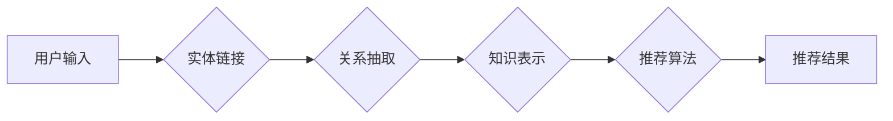

                 

## LLM在推荐系统中的知识增强应用

> 关键词：LLM, 推荐系统, 知识增强, 实体链接, 关系抽取, 个性化推荐

## 1. 背景介绍

推荐系统是信息时代的重要技术，旨在根据用户的历史行为、偏好和上下文信息，预测用户可能感兴趣的内容并提供个性化的推荐。传统的推荐系统主要依赖于协同过滤和内容过滤等方法，但这些方法存在一些局限性：

* **数据稀疏性问题:** 协同过滤依赖于用户-物品交互数据，而现实世界中用户对物品的交互数据往往稀疏，导致推荐结果不准确。
* **冷启动问题:** 新用户和新物品缺乏历史交互数据，难以进行有效的推荐。
* **缺乏语义理解:** 内容过滤方法主要基于物品的特征匹配，缺乏对用户需求的深层理解和语义关联分析。

近年来，大语言模型 (LLM) 的快速发展为推荐系统带来了新的机遇。LLM 拥有强大的文本理解和生成能力，能够从海量文本数据中学习知识，并将其应用于推荐系统，从而提升推荐的准确性和个性化程度。

## 2. 核心概念与联系

**2.1 知识增强推荐系统**

知识增强推荐系统 (Knowledge-Enhanced Recommendation System) 是将外部知识图谱 (Knowledge Graph, KG) 与传统的推荐算法相结合，以增强推荐系统的准确性和个性化程度。

**2.2 LLM在知识增强推荐中的应用**

LLM 可以通过以下方式增强推荐系统的知识能力：

* **实体链接:** 将用户输入的文本查询与 KG 中的实体进行链接，从而理解用户的真实意图。
* **关系抽取:** 从文本数据中抽取实体之间的关系，构建用户-物品-知识三元组，丰富推荐系统的知识表示。
* **知识推理:** 利用 LLMs 的推理能力，从 KG 中推导用户可能感兴趣的隐含知识，并将其应用于推荐决策。

**2.3 架构图**



## 3. 核心算法原理 & 具体操作步骤

**3.1 算法原理概述**

知识增强推荐系统通常采用以下步骤：

1. **知识图谱构建:** 从文本数据中抽取实体和关系，构建知识图谱。
2. **实体链接:** 将用户输入的文本查询与 KG 中的实体进行链接。
3. **关系抽取:** 从文本数据中抽取实体之间的关系，构建用户-物品-知识三元组。
4. **知识表示:** 将 KG 中的知识表示为向量，以便与推荐算法兼容。
5. **推荐算法:** 利用 KG 中的知识信息，结合传统的推荐算法，生成个性化的推荐结果。

**3.2 算法步骤详解**

1. **知识图谱构建:**

   * 使用自然语言处理 (NLP) 技术，从文本数据中识别实体和关系。
   * 将识别出的实体和关系存储在知识图谱中。
   * 可以使用开源的知识图谱构建工具，例如 OpenIE、Stanford CoreNLP 等。

2. **实体链接:**

   * 将用户输入的文本查询转换为实体候选集。
   * 使用实体链接算法，例如 Word Embedding、TransE 等，计算候选实体与查询之间的相似度。
   * 选择相似度最高的实体作为查询的链接结果。

3. **关系抽取:**

   * 使用关系抽取算法，例如 BERT、RoBERTa 等，从文本数据中识别实体之间的关系。
   * 将识别出的关系存储在知识图谱中。

4. **知识表示:**

   * 使用知识表示学习方法，例如 TransE、RotatE 等，将 KG 中的实体和关系表示为向量。
   * 这些向量可以用于推荐算法的输入。

5. **推荐算法:**

   * 可以将 KG 中的知识信息融入传统的推荐算法，例如协同过滤、内容过滤等。
   * 例如，可以利用 KG 中的实体关系，构建用户-物品-知识三元组，并将其作为推荐算法的特征输入。

**3.3 算法优缺点**

**优点:**

* 能够提升推荐系统的准确性和个性化程度。
* 可以解决数据稀疏性和冷启动问题。
* 能够提供更丰富的推荐解释。

**缺点:**

* 知识图谱构建和实体链接等任务需要大量的计算资源和时间。
* 知识表示学习方法仍然存在一些挑战。

**3.4 算法应用领域**

* 电子商务推荐
* 内容推荐
* 社交推荐
* 教育推荐

## 4. 数学模型和公式 & 详细讲解 & 举例说明

**4.1 数学模型构建**

知识增强推荐系统通常使用图神经网络 (Graph Neural Network, GNN) 来学习 KG 中的知识表示。GNN 可以将 KG 中的节点 (实体) 和边 (关系) 表示为向量，并通过图卷积操作学习节点之间的关系表示。

**4.2 公式推导过程**

假设 KG 中的节点集合为 V，边集合为 E。每个节点 v ∈ V 都有一个特征向量 x<sub>v</sub>，每个边 e ∈ E 都有一个关系向量 r<sub>e</sub>。GNN 的图卷积操作可以表示为：

```latex
h_v^{(l+1)} = \sigma(\sum_{u \in N(v)} \frac{e^{W_l \cdot (x_u + r_{u,v})}}{\sum_{w \in N(v)} e^{W_l \cdot (x_w + r_{w,v})}} h_u^{(l)})
```

其中：

* h<sub>v</sub><sup>(l)</sup> 表示节点 v 在第 l 层的隐藏状态向量。
* N(v) 表示节点 v 的邻居节点集合。
* W<sub>l</sub> 是第 l 层的图卷积权重矩阵。
* σ 是激活函数。

**4.3 案例分析与讲解**

例如，在电子商务推荐系统中，KG 中的节点可以是用户、商品、品牌等，边可以是用户购买商品、用户浏览商品、商品属于品牌等关系。GNN 可以学习用户-商品-品牌之间的关系表示，并将其用于推荐商品。

## 5. 项目实践：代码实例和详细解释说明

**5.1 开发环境搭建**

* Python 3.7+
* PyTorch 1.7+
* TensorFlow 2.0+
* 其他依赖库：transformers, networkx, tqdm 等

**5.2 源代码详细实现**

```python
import torch
import torch.nn as nn
from torch_geometric.nn import GCNConv

class GNNRecommender(nn.Module):
    def __init__(self, in_features, hidden_features, out_features):
        super(GNNRecommender, self).__init__()
        self.conv1 = GCNConv(in_features, hidden_features)
        self.conv2 = GCNConv(hidden_features, out_features)

    def forward(self, x, edge_index):
        x = self.conv1(x, edge_index)
        x = torch.relu(x)
        x = self.conv2(x, edge_index)
        return x

# ... 其他代码 ...
```

**5.3 代码解读与分析**

* 该代码实现了一个简单的 GNN 推荐模型。
* 模型输入为节点特征向量 x 和图结构 edge_index。
* 模型使用两层 GCNConv 进行图卷积操作，学习节点之间的关系表示。
* 最后输出节点的隐藏状态向量，可以用于推荐决策。

**5.4 运行结果展示**

* 可以使用测试数据集评估模型的性能，例如准确率、召回率、NDCG 等。
* 可以将模型部署到线上环境，为用户提供个性化的推荐服务。

## 6. 实际应用场景

**6.1 电子商务推荐**

* 基于用户购买历史、浏览记录、商品属性等信息，推荐用户可能感兴趣的商品。
* 利用 KG 中的商品分类、品牌、属性等知识，提供更精准的商品推荐。

**6.2 内容推荐**

* 基于用户阅读历史、点赞记录、评论等信息，推荐用户可能感兴趣的文章、视频、音乐等内容。
* 利用 KG 中的内容主题、作者、类别等知识，提供更个性化的内容推荐。

**6.3 社交推荐**

* 基于用户好友关系、兴趣爱好、社交行为等信息，推荐用户可能感兴趣的朋友、群组等。
* 利用 KG 中的用户关系、兴趣标签、社交活动等知识，提供更精准的社交推荐。

**6.4 未来应用展望**

* 随着 LLM 和 KG 技术的不断发展，知识增强推荐系统将更加智能化、个性化和精准化。
* 未来，知识增强推荐系统将能够更好地理解用户的需求，并提供更符合用户期望的推荐结果。

## 7. 工具和资源推荐

**7.1 学习资源推荐**

* **书籍:**
    * 《图神经网络》
    * 《深度学习》
    * 《自然语言处理》
* **在线课程:**
    * Coursera: 深度学习
    * edX: 自然语言处理
    * fast.ai: 图神经网络

**7.2 开发工具推荐**

* **Python:** 
    * PyTorch
    * TensorFlow
    * scikit-learn
* **图数据库:**
    * Neo4j
    * JanusGraph
    * TigerGraph

**7.3 相关论文推荐**

* **Knowledge Enhanced Recommendation:**
    * "Knowledge Enhanced Recommendation with Graph Neural Networks"
    * "A Survey on Knowledge-Enhanced Recommendation"
* **LLM in Recommender Systems:**
    * "LLaMA for Recommender Systems: A Survey"
    * "Prompt Engineering for Recommender Systems with Large Language Models"

## 8. 总结：未来发展趋势与挑战

**8.1 研究成果总结**

知识增强推荐系统结合了 LLM 和 KG 的优势，能够有效提升推荐系统的准确性和个性化程度。

**8.2 未来发展趋势**

* **更强大的 LLM:** 随着 LLM 的不断发展，其文本理解和生成能力将进一步提升，为知识增强推荐系统提供更强大的支持。
* **更丰富的 KG:** KG 将包含更多类型的知识，例如用户行为、商品属性、社会关系等，为推荐系统提供更全面的知识支持。
* **更有效的推荐算法:** 研究人员将开发更有效的推荐算法，能够更好地利用 KG 中的知识信息，并结合 LLM 的能力，提供更精准的推荐结果。

**8.3 面临的挑战**

* **知识图谱构建和维护:** KG 的构建和维护需要大量的计算资源和人力成本。
* **知识表示学习:** 如何将 KG 中的知识有效地表示为向量，以便与推荐算法兼容，仍然是一个挑战。
* **数据隐私和安全:** 知识增强推荐系统需要处理大量的用户数据，因此数据隐私和安全问题需要得到充分重视。

**8.4 研究展望**

未来，知识增强推荐系统将朝着更智能化、个性化和精准化的方向发展，为用户提供更丰富的推荐体验。


## 9. 附录：常见问题与解答

**9.1 Q: 知识增强推荐系统与传统的推荐系统相比有什么优势？**

**A:** 知识增强推荐系统能够利用 KG 中的知识信息，提升推荐系统的准确性和个性化程度。它可以解决数据稀疏性和冷启动问题，并提供更丰富的推荐解释。

**9.2 Q: 如何构建知识图谱？**

**A:** 可以使用自然语言处理 (NLP) 技术，从文本数据中识别实体和关系，并将其存储在知识图谱中。可以使用开源的知识图谱构建工具，例如 OpenIE、Stanford CoreNLP 等。

**9.3 Q: 如何评估知识增强推荐系统的性能？**

**A:** 可以使用测试数据集评估模型的性能，例如准确率、召回率、NDCG 等。

**9.4 Q: 知识增强推荐系统有哪些应用场景？**

**A:** 知识增强推荐系统可以应用于电子商务推荐、内容推荐、社交推荐等多个领域。

**9.5 Q: 知识增强推荐系统面临哪些挑战？**

**A:** 知识增强推荐系统面临的挑战包括知识图谱构建和维护、知识表示学习、数据隐私和安全等问题。


作者：禅与计算机程序设计艺术 / Zen and the Art of Computer Programming 
<end_of_turn>

