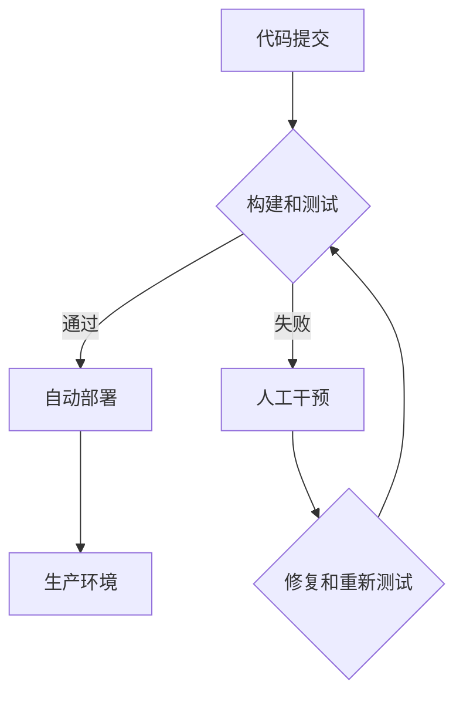

                 

## 持续部署策略探讨：自动化和手动部署的权衡

> 关键词：持续部署、自动化部署、手动部署、DevOps、软件发布、部署策略、风险管理、效率提升

### 1. 背景介绍

在当今软件开发领域，速度和效率至关重要。持续交付 (Continuous Delivery) 和持续部署 (Continuous Deployment) 成为主流开发模式，旨在快速、可靠地将软件更新交付给用户。持续部署策略的核心是自动化部署流程，将代码变更自动构建、测试和发布到生产环境。然而，完全自动化部署并非适用于所有场景，手动部署仍然在某些情况下发挥着重要作用。本文将探讨持续部署策略的优缺点，分析自动化和手动部署的权衡，帮助开发者选择最适合自身项目的部署策略。

### 2. 核心概念与联系

#### 2.1 持续交付 (Continuous Delivery)

持续交付是一种开发实践，旨在将软件更新随时准备发布到生产环境。它强调自动化构建、测试和集成流程，确保每次代码变更都能经过严格的测试，并准备好部署。

#### 2.2 持续部署 (Continuous Deployment)

持续部署是持续交付的进一步演进，它将代码变更自动部署到生产环境，无需人工干预。这意味着每次经过测试的代码变更都会自动发布，极大地提高了软件更新的速度和频率。

#### 2.3 自动化部署

自动化部署是指使用工具和脚本自动执行部署流程，包括构建、测试、打包、发布等步骤。自动化部署可以显著提高部署效率，减少人为错误，并确保部署的稳定性和一致性。

#### 2.4 手动部署

手动部署是指由人工手动执行部署流程，需要开发者手动执行每个步骤，例如构建软件包、配置环境、上传代码等。手动部署虽然需要更多的人工干预，但可以提供更精细的控制和灵活性。

**Mermaid 流程图：持续部署策略**

### 3. 核心算法原理 & 具体操作步骤

#### 3.1 算法原理概述

持续部署策略的核心算法原理是自动化和反馈机制。自动化部署通过脚本和工具自动执行部署流程，减少人为错误和延迟。反馈机制通过监控和日志记录，及时发现部署问题并触发相应的修复措施。

#### 3.2 算法步骤详解

1. **代码提交:** 开发者将代码变更提交到版本控制系统。
2. **构建和测试:** 构建系统自动构建代码，并执行自动化测试，包括单元测试、集成测试和系统测试。
3. **部署:** 如果测试通过，代码变更将自动部署到测试环境或生产环境。
4. **监控和反馈:** 持续监控部署后的系统性能和稳定性，收集日志和错误信息。
5. **修复和重新测试:** 如果发现问题，触发修复流程，并重新执行测试，直到问题解决。

#### 3.3 算法优缺点

**优点:**

* **提高效率:** 自动化部署显著提高了软件更新的速度和频率。
* **降低风险:** 自动化测试和部署可以减少人为错误，提高软件质量。
* **提高可靠性:** 持续监控和反馈机制可以及时发现和解决部署问题，提高软件稳定性。

**缺点:**

* **初始成本高:** 建立自动化部署流程需要投入时间和资源。
* **维护成本高:** 需要持续维护自动化工具和脚本。
* **缺乏灵活性:** 自动化部署流程可能无法满足所有场景的需求。

#### 3.4 算法应用领域

持续部署策略广泛应用于各种软件开发领域，例如：

* **Web 应用:** 快速迭代和发布新功能。
* **移动应用:** 频繁更新和修复bug。
* **云计算:** 自动化部署和管理云资源。
* **数据分析:** 自动化数据处理和模型更新。

### 4. 数学模型和公式 & 详细讲解 & 举例说明

#### 4.1 数学模型构建

持续部署策略可以抽象为一个反馈控制系统，其中代码变更作为输入，部署结果作为输出。系统通过自动化测试和监控机制，实现对部署过程的反馈控制。

#### 4.2 公式推导过程

假设部署成功概率为 P，部署失败概率为 1-P。每次部署后，系统会收集反馈信息，并根据反馈信息调整部署策略，例如调整测试用例、部署环境等。

#### 4.3 案例分析与讲解

假设一个软件项目，其部署成功概率为 95%，部署失败概率为 5%。如果每次部署都手动进行，则部署失败的风险较高。采用持续部署策略，通过自动化测试和监控，可以将部署失败概率降低到 1%，从而提高软件发布的可靠性。

### 5. 项目实践：代码实例和详细解释说明

#### 5.1 开发环境搭建

持续部署策略的实践需要搭建相应的开发环境，包括版本控制系统、构建工具、测试工具、部署工具等。

#### 5.2 源代码详细实现

持续部署策略的代码实现通常涉及以下步骤：

1. **代码提交:** 使用 Git 或其他版本控制系统提交代码变更。
2. **构建:** 使用 Maven 或 Gradle 等构建工具构建软件项目。
3. **测试:** 使用 JUnit 或 pytest 等测试工具执行自动化测试。
4. **部署:** 使用 Jenkins 或 CircleCI 等部署工具自动部署软件到测试或生产环境。

#### 5.3 代码解读与分析

代码实现需要根据具体的项目需求和技术栈进行调整。例如，需要根据不同的部署环境配置部署脚本，并使用相应的部署工具进行操作。

#### 5.4 运行结果展示

持续部署策略的运行结果可以展示在部署工具的界面上，包括构建状态、测试结果、部署日志等信息。

### 6. 实际应用场景

#### 6.1 电商平台

电商平台需要快速迭代和发布新功能，持续部署策略可以帮助他们快速响应用户需求，提高用户体验。

#### 6.2 金融系统

金融系统对稳定性和安全性要求极高，持续部署策略可以帮助他们降低部署风险，提高系统可靠性。

#### 6.3 游戏开发

游戏开发需要频繁更新内容和修复bug，持续部署策略可以帮助他们快速发布更新，提高玩家满意度。

#### 6.4 未来应用展望

随着云计算、容器化和微服务架构的普及，持续部署策略将更加广泛地应用于各种软件开发场景。

### 7. 工具和资源推荐

#### 7.1 学习资源推荐

* **书籍:**
    * The Phoenix Project: A Novel About IT, DevOps, and Helping Your Business Win
    * Continuous Delivery: Reliable Software Releases through Build, Test, and Deployment Automation
* **网站:**
    * DevOps.com
    * Atlassian DevOps

#### 7.2 开发工具推荐

* **版本控制:** Git
* **构建工具:** Maven, Gradle
* **测试工具:** JUnit, pytest
* **部署工具:** Jenkins, CircleCI

#### 7.3 相关论文推荐

* **Continuous Delivery: A Practical Guide**
* **The DevOps Handbook: How to Create World-Class Agility, Reliability, and Security in Technology Organizations**

### 8. 总结：未来发展趋势与挑战

#### 8.1 研究成果总结

持续部署策略已经成为软件开发领域的重要趋势，它可以显著提高软件开发效率和可靠性。

#### 8.2 未来发展趋势

* **更智能的自动化:** 利用人工智能和机器学习技术，实现更智能的自动化部署。
* **更细粒度的部署:** 将部署粒度细化到单个服务或组件，提高部署的灵活性。
* **更安全的部署:** 加强部署过程的安全防护，防止安全漏洞和数据泄露。

#### 8.3 面临的挑战

* **技术复杂性:** 建立和维护持续部署系统需要一定的技术复杂度。
* **组织文化:** 持续部署需要改变传统的软件开发模式，需要组织文化和流程的调整。
* **安全风险:** 自动化部署可能会增加安全风险，需要加强安全防护措施。

#### 8.4 研究展望

未来研究方向包括：

* **更智能的自动化部署算法**
* **更安全和可靠的持续部署系统**
* **更有效的持续部署流程优化**

### 9. 附录：常见问题与解答

#### 9.1 什么是持续部署？

持续部署是指将代码变更自动部署到生产环境，无需人工干预。

#### 9.2 持续部署的优点是什么？

持续部署可以提高软件更新的速度和频率，降低部署风险，提高软件质量和稳定性。

#### 9.3 持续部署的缺点是什么？

持续部署需要投入时间和资源建立自动化部署流程，并需要持续维护自动化工具和脚本。

#### 9.4 持续部署适合哪些场景？

持续部署适合于需要快速迭代和发布新功能的软件项目，例如电商平台、游戏开发等。

#### 9.5 如何实现持续部署？

实现持续部署需要搭建相应的开发环境，包括版本控制系统、构建工具、测试工具、部署工具等，并编写相应的自动化脚本。

作者：禅与计算机程序设计艺术 / Zen and the Art of Computer Programming 
<end_of_turn>

