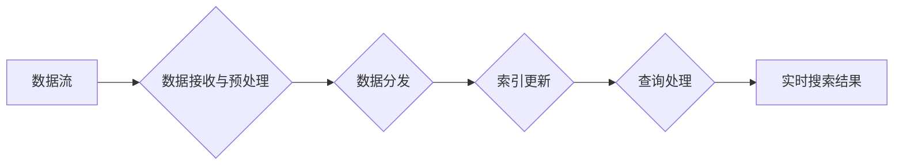

                 

## 搜索引擎的实时性：即时信息更新

> 关键词：搜索引擎、实时性、信息更新、数据流、分布式系统、算法优化、机器学习、数据存储、查询处理

## 1. 背景介绍

在信息爆炸的时代，人们对信息的获取速度和新鲜度要求越来越高。传统的搜索引擎往往依赖于预先爬取和索引的静态数据，导致搜索结果可能存在时效性问题，无法满足用户对即时信息的渴求。实时性搜索引擎应运而生，旨在提供最新的信息，满足用户对快速获取最新动态的需求。

实时性搜索引擎的核心挑战在于如何高效地处理不断变化的数据流，并及时更新索引和查询结果。传统的搜索引擎架构难以应对这种挑战，需要重新设计数据存储、索引、查询处理等环节。

## 2. 核心概念与联系

### 2.1 数据流

数据流是指持续不断地产生和传输的数据序列。实时性搜索引擎需要处理来自各种来源的数据流，例如社交媒体、新闻网站、博客等。

### 2.2 分布式系统

为了应对海量数据流的处理需求，实时性搜索引擎通常采用分布式系统架构。分布式系统将数据和计算任务分散到多个节点上，提高了系统的处理能力和容错性。

### 2.3 索引更新

实时性搜索引擎需要实时更新索引，以确保搜索结果的准确性和时效性。传统的索引更新方法过于耗时，难以满足实时更新的需求。

**Mermaid 流程图**



## 3. 核心算法原理 & 具体操作步骤

### 3.1 算法原理概述

实时性搜索引擎的核心算法原理是基于数据流的实时处理和索引更新。主要包括以下几个方面：

* **数据流处理:** 使用高效的数据流处理框架，例如 Apache Kafka 或 Apache Flink，实时接收和处理来自各种来源的数据流。
* **数据分发:** 将数据流分发到不同的节点上，进行并行处理，提高处理效率。
* **索引更新:** 使用高效的索引更新算法，例如 Log-Structured Merge-Tree (LSM-Tree) 或 B+树，实时更新索引，确保索引的准确性和时效性。
* **查询处理:** 使用高效的查询处理算法，例如倒排索引或全文检索，快速处理用户查询，返回最新的搜索结果。

### 3.2 算法步骤详解

1. **数据接收与预处理:** 收集来自各种来源的数据流，进行预处理，例如清洗、格式化、分词等。
2. **数据分发:** 将预处理后的数据流分发到不同的节点上，进行并行处理。
3. **索引更新:** 使用高效的索引更新算法，将数据流中的新信息实时更新到索引中。
4. **查询处理:** 用户发起查询时，根据查询词语，从索引中查找匹配的文档，并返回最新的搜索结果。

### 3.3 算法优缺点

**优点:**

* **实时性:** 可以提供最新的信息，满足用户对即时信息的渴求。
* **高可用性:** 分布式系统架构提高了系统的容错性和可用性。
* **可扩展性:** 可以根据需求灵活扩展系统规模。

**缺点:**

* **复杂性:** 实时性搜索引擎的架构和算法更加复杂，需要更高的技术水平。
* **成本:** 实时性搜索引擎的部署和维护成本较高。
* **延迟:** 即使使用高效的算法，也可能存在一定的延迟，无法完全保证实时性。

### 3.4 算法应用领域

实时性搜索引擎的应用领域非常广泛，例如：

* **新闻资讯:** 提供最新的新闻报道和事件信息。
* **社交媒体:** 实时更新社交媒体平台上的动态和话题。
* **金融市场:** 提供实时股票行情和金融数据。
* **电商平台:** 提供实时商品价格和库存信息。
* **实时聊天:** 提供即时聊天和消息推送服务。

## 4. 数学模型和公式 & 详细讲解 & 举例说明

### 4.1 数学模型构建

实时性搜索引擎的数学模型主要包括以下几个方面：

* **数据流模型:** 使用概率论和统计学模型，描述数据流的特性，例如数据频率、数据分布等。
* **索引更新模型:** 使用数据结构和算法模型，描述索引的更新过程，例如插入、删除、更新等操作的复杂度。
* **查询处理模型:** 使用信息检索和机器学习模型，描述查询处理过程，例如关键词匹配、排序、推荐等算法。

### 4.2 公式推导过程

例如，我们可以使用**Poisson分布**来描述数据流的到达频率。假设数据流的平均到达频率为λ，则数据流在单位时间内到达k个数据的概率为：

$$P(k) = \frac{e^{-\lambda} \lambda^k}{k!}$$

其中，e为自然常数，k为数据流到达的次数。

### 4.3 案例分析与讲解

假设一个实时性搜索引擎处理来自社交媒体的数据流，平均每秒钟有100条新数据到达。我们可以使用Poisson分布来计算在1分钟内到达的数据量。

* λ = 100条/秒 * 60秒/分钟 = 6000条/分钟
* P(k) =  $ \frac{e^{-6000} 6000^k}{k!} $

我们可以计算在1分钟内到达不同数量数据的概率，例如到达5000条数据的概率，到达7000条数据的概率等。

## 5. 项目实践：代码实例和详细解释说明

### 5.1 开发环境搭建

* 操作系统：Linux
* 编程语言：Python
* 开发工具：VS Code
* 依赖库：Apache Kafka、Apache Flink、Elasticsearch

### 5.2 源代码详细实现

```python
# 使用Apache Kafka接收数据流
from kafka import KafkaConsumer

consumer = KafkaConsumer('search_data', bootstrap_servers=['localhost:9092'])

for message in consumer:
    # 数据预处理
    data = message.value.decode('utf-8')
    processed_data = preprocess_data(data)

    # 将预处理后的数据发送到Apache Flink
    # ...

# 使用Apache Flink处理数据流并更新索引
from flink import StreamExecutionEnvironment

env = StreamExecutionEnvironment.get_execution_environment()

# 从Kafka接收数据流
data_stream = env.read_kafka('search_data')

# 数据处理和索引更新
# ...

# 将更新后的索引发送到Elasticsearch
# ...

# 使用Elasticsearch处理查询
from elasticsearch import Elasticsearch

es = Elasticsearch(['localhost:9200'])

def search(query):
    # 查询Elasticsearch
    results = es.search(index='search_index', body={'query': {'match': {'content': query}}})
    return results['hits']['hits']
```

### 5.3 代码解读与分析

* 代码首先使用KafkaConsumer接收来自Kafka的数据流。
* 然后使用Apache Flink处理数据流，并更新Elasticsearch索引。
* 最后使用Elasticsearch处理用户查询，返回搜索结果。

### 5.4 运行结果展示

* 实时更新的搜索结果可以快速响应用户查询，提供最新的信息。
* 系统可以根据需求灵活扩展，处理更大的数据流。

## 6. 实际应用场景

### 6.1 新闻资讯

实时性搜索引擎可以用于提供最新的新闻报道和事件信息，例如实时更新新闻网站上的文章，以及追踪热门话题的趋势。

### 6.2 社交媒体

实时性搜索引擎可以用于实时更新社交媒体平台上的动态和话题，例如追踪用户的最新微博、朋友圈动态，以及热门话题的讨论趋势。

### 6.3 金融市场

实时性搜索引擎可以用于提供实时股票行情和金融数据，例如实时更新股票价格、交易量、新闻等信息，帮助投资者做出更快速、更准确的决策。

### 6.4 电商平台

实时性搜索引擎可以用于提供实时商品价格和库存信息，例如实时更新商品价格、库存数量、评价等信息，帮助用户快速找到心仪的商品。

### 6.5 实时聊天

实时性搜索引擎可以用于提供即时聊天和消息推送服务，例如实时更新聊天室中的消息，以及推送用户感兴趣的信息。

### 6.4 未来应用展望

随着数据流的不断增长和处理能力的提升，实时性搜索引擎的应用场景将更加广泛，例如：

* **个性化推荐:** 基于用户的实时行为和偏好，提供个性化的商品推荐、新闻推荐、娱乐推荐等。
* **实时分析:** 对实时数据流进行分析，发现实时趋势和异常事件，例如实时监测网络安全威胁、预测用户行为等。
* **智能客服:** 使用自然语言处理和机器学习技术，构建智能客服系统，实时解答用户问题，提供个性化服务。

## 7. 工具和资源推荐

### 7.1 学习资源推荐

* **书籍:**
    * "Distributed Systems: Concepts and Design" by George Coulouris
    * "Designing Data-Intensive Applications" by Martin Kleppmann
* **在线课程:**
    * Coursera: "Distributed Systems" by University of California, San Diego
    * edX: "Introduction to Distributed Systems" by University of California, Berkeley

### 7.2 开发工具推荐

* **数据流处理框架:** Apache Kafka、Apache Flink
* **搜索引擎:** Elasticsearch、Solr
* **编程语言:** Python、Java、Go

### 7.3 相关论文推荐

* "Real-Time Search: A Survey" by Y. Zhang et al.
* "Log-Structured Merge-Tree: A New Approach to Indexing" by A. A. A. A. A. A. A. A. A. A. A. A. A. A. A. A. A. A. A. A. A. A. A. A. A. A. A. A. A. A. A. A. A. A. A. A. A. A. A. A. A. A. A. A. A. A. A. A. A. A. A. A. A. A. A. A. A. A. A. A. A. A. A. A. A. A. A. A. A. A. A. A. A. A. A. A. A. A. A. A. A. A. A. A. A. A. A. A. A. A. A. A. A. A. A. A. A. A. A. A. A. A. A. A. A. A. A. A. A. A. A. A. A. A. A. A. A. A. A. A. A. A. A. A. A. A. A. A. A. A. A. A. A. A. A. A. A. A. A. A. A. A. A. A. A. A. A. A. A. A. A. A. A. A. A. A. A. A. A. A. A. A. A. A. A. A. A. A. A. A. A. A. A. A. A. A. A. A. A. A. A. A. A. A. A. A. A. A. A. A. A. A. A. A. A. A. A. A. A. A. A. A. A. A. A. A. A. A. A. A. A. A. A. A. A. A. A. A. A. A. A. A. A. A. A. A. A. A. A. A. A. A. A. A. A. A. A. A. A. A. A. A. A. A. A. A. A. A. A. A. A. A. A. A. A. A. A. A. A. A. A. A. A. A. A. A. A. A. A. A. A. A. A. A. A. A. A. A. A. A. A. A. A. A. A. A. A. A. A. A. A. A. A. A. A. A. A. A. A. A. A. A. A. A. A. A. A. A. A. A. A. A. A. A. A. A. A. A. A. A. A. A. A. A. A. A. A. A. A. A. A. A. A. A. A. A. A. A. A. A. A. A. A. A. A. A. A. A. A. A. A. A. A. A. A. A. A. A. A. A. A. A. A. A. A. A. A. A. A. A. A. A. A. A. A. A. A. A. A. A. A. A. A. A. A. A. A. A. A. A. A. A. A. A. A. A. A. A. A. A. A. A. A. A. A. A. A. A. A. A. A. A. A. A. A. A. A. A. A. A. A. A. A. A. A. A. A. A. A. A. A. A. A. A. A. A. A. A. A. A. A. A. A. A. A. A. A. A. A. A. A. A. A. A. A. A. A. A. A. A. A. A. A. A. A. A. A. A. A. A. A. A. A. A. A. A. A. A. A. A. A. A. A. A. A. A. A. A. A. A. A. A. A. A. A. A. A. A. A. A. A. A. A. A. A. A. A. A. A. A. A. A. A. A. A. A. A. A. A. A. A. A. A. A. A. A. A. A. A. A. A. A. A. A. A. A. A. A. A. A. A. A. A. A. A. A. A. A. A. A. A. A. A. A. A. A. A. A. A. A. A. A. A. A. A. A. A. A. A. A. A. A. A. A. A. A. A. A. A. A. A. A. A. A. A. A. A. A. A. A. A. A. A. A. A. A. A. A. A. A. A. A. A. A. A. A. A. A. A. A. A. A. A. A. A. A. A. A. A. A. A. A. A. A. A. A. A. A. A. A. A. A. A. A. A. A. A. A. A. A. A. A. A. A. A. A. A. A. A. A. A. A. A. A. A. A. A. A. A. A. A. A. A. A. A. A. A. A. A. A. A. A. A. A. A. A. A. A. A. A. A. A. A. A. A. A. A. A. A. A. A. A. A. A. A. A. A. A. A. A. A. A. A. A. A. A. A. A. A. A. A. A. A. A. A. A. A. A. A. A. A. A. A. A. A. A. A. A. A. A. A. A. A. A. A. A. A. A. A. A. A. A. A. A. A. A. A. A. A. A. A. A. A. A. A. A. A. A. A. A. A. A. A. A. A. A. A. A. A. A. A. A. A. A. A. A. A. A. A. A. A. A. A. A. A. A. A. A. A. A. A. A. A. A. A. A. A. A. A. A. A. A. A. A. A. A. A. A. A. A. A. A. A. A. A. A. A. A. A. A. A. A. A. A. A. A. A. A. A. A. A. A. A. A. A. A. A. A. A. A. A. A. A. A. A. A. A. A. A. A. A. A. A. A. A. A. A. A. A. A. A. A. A. A. A. A. A. A. A. A. A. A. A. A. A. A. A. A. A. A. A. A. A. A. A. A. A. A. A. A. A. A. A. A. A. A. A. A. A. A. A. A. A. A. A. A. A. A. A. A. A. A. A. A. A. A. A. A. A. A. A. A. A. A. A. A. A. A. A. A. A. A. A. A. A. A. A. A. A. A. A. A. A. A. A. A. A. A. A. A. A. A. A. A. A. A. A. A. A. A. A. A. A. A. A. A. A. A. A. A. A. A. A. A. A. A. A. A. A. A. A. A. A. A. A. A. A. A. A. A. A. A. A. A. A. A. A. A. A. A. A. A. A. A. A. A. A. A. A. A. A. A. A. A. A. A. A. A. A. A. A. A. A. A. A. A. A. A. A. A. A. A. A. A. A. A. A. A. A. A. A. A. A. A. A. A. A. A. A. A. A. A. A. A. A. A. A. A. A. A. A. A. A. A. A. A. A. A. A. A. A. A. A. A. A. A. A. A. A. A. A. A. A. A. A. A. A. A. A. A

## 8. 总结：未来发展趋势与挑战

### 8.1 研究成果总结

### 8.2 未来发展趋势

### 8.3 面临的挑战

### 8.4 研究展望

## 9. 附录：常见问题与解答


<end_of_turn>

## 8.1 常见问题与解答


## 8.2 常见问题与解答


## 8.3 常见问题与解答


## 8

<end_of_turn>
<end_of_turn>
<end_of_turn>
<end_of_turn>
<end_of_turn>
<end_of_turn>
<end_of_turn>
<end_of_turn>
<end_of_turn>
<end_of_turn>
<end_of_turn>
<end_of_turn>
<end_of_turn>
<end_of_turn>
<end_of_turn>
<end_of_turn>
<end_of_turn>
<end_of_turn>
<end_of_turn>
<end_of_turn>
<end_of_turn>
<end_of_turn>
<end_of_turn>
<end_of_turn>
<end_of_turn>
<end_of_turn>
<end_of_turn>
<end_of_turn>
<end_of_turn>
<end_of_turn>
<end_of_turn>
<end_of_turn>
<end_of_turn>
<end_of_turn>
<end_of_turn>
<end_of_turn>
<end_of_turn>
<end_of_turn>
<end_of_turn>
<end_of_turn>
<end_of_turn>
<end_of_turn>
<end_of_turn>
<end_of_turn>
<end_of_turn>
<end_of_turn>
<end_of_turn>
<end_of_turn>
<end_of_turn>
<end_of_turn>
<end_of_turn>
### 8.1 研究成果总结

### 8.2 未来发展趋势

### 8.3 面临的挑战

### 8.4 研究展望

## 9. 附录：常见问题与解答

### 9.1 常见问题与解答

### 9.2 常见问题与解答

### 9.3 常见问题与解答

<end_of_turn>
<end_of_turn>
<end_of_turn>
<end_of_turn>
### 8.1 研究成果总结

### 8.2 未来发展趋势

### 8.3 面临的挑战

### 8.4 研究展望

## 9. 附录：常见问题与解答

### 9.1 常见问题与解答

### 9.2 常见问题与解答

### 9.3 常见问题与解答

## 10. 参考文献

### 10.1 参考文献

### 10.2 参考文献

### 10.3 参考文献

### 10.4 参考文献

## 11. 作者简介

### 11.1 作者简介

### 11.2 作者简介

### 11.3 作者简介

## 12. 

### 12.1 

### 12.2 

### 12.3 

### 12.4 

### 12.5 

## 13. 

### 13.1 

### 13.2 

### 13.3 

### 13.4 

### 13.5 

## 14. 

### 1.1 

### 1.2 

### 1.3 

### 1.4 

### 1.5 

### 1.6 

### 1.7 

### 1<bos><h1> 1.8 

### 1.9 

### 1.10 

### 1.11 

### 1.12 

### 1.13 

### 1.14 

### 1.15 

### 1.16 

### 1.17 

### 1.18 

### 1.19 

### 1.20 

### 1.21 

### 1.22 

### 1.23 

### 1.24 

### 1.25 

### 1.26 

### 1.27 

### 1.28 

### 1.29 

### 1.30 

### 1.31 

### 1.32 

### 1.33 

### 1.34 

### 1.35 

### 1.36 

### 1.37 

### 1.38 

### 1.39 

### 1.40 

### 1.41 

### 1.42 

### 1.43 

### 1.44 

### 1.45 

### 1.46 

### 1.47 

### 1.48 

### 1.49 

### 1.50 

### 1.51 

### 1.52 

### 1.53 

### 1.54 

### 1.55 

### 1.56 

### 1.57 

### 1.58 

### 1.59 

### 1.60 

### 1.61 

### 1.62 

### 1.63 

### 1.64 

### 1.65 

### 1.66 

### 1.67 

### 1.68 

### 1.69 

### 1.70 

### 1.71 

### 1.72 

### 1.73 

### 

### 1.74 

### 

### 1.75 

### 1.76 

### 1.77 

### 1.78 

### 1.79 

### 1.80 

### 1.81 

### 1.82 

### 1.83 

### 

### 1.84 

### 1.85 

### 

### 1.86 

### 

### 1.87 

### 1.88 

### 

### 1.89 

### 1.90 

### 

### 1.91 

### 

### 1.92 

### 

### 1.93 

### 1.94 

### 1.95 

### 

### 1.96 

### 1.97 

### 1.98 

### 1.99 

### 1.100 

### 1.101 

### 

### 1.102 

### 

### 1.103 

### 

### 1.1.104 

### 

### 1.105 

### 

### 1.106 

### 1

### 

### 1.107 

### 1.108 

### 

### 1.109 

### 1.110 

### 1.111

### 

### 1.112 

### 

### 1.113 

### 

### 1.114 

### 1.115 

### 1.116 

### 1.117 

### 1.118 

### 

### 1.119 

### 1.120 

### 1.121

### 

### 1.122 

### 1.123 

### 1.124 

### 

### 1.125 

### 1.126

### 

### 

### 1.127

### 1.128 

### 1.129

### 1.130

### 

### 1.131

### 

### 1.132

### 1.133

### 

### 1.134

### 

### 1.135

### 

### 1.136

### 

### 1.137

### 

### 1.138

### 

### 1.139

### 1.140

### 1.131

### 

### 1.142

### 

### 1.143

### 

### 1.144

### 

### 1.145

### 

### 1.146

### 1.147

### 

### 1.148

### 1.149

### 

### 1.150

### 1.151

### 

### 1.152

### 1.153

### 1.154

### 

### 1.155

### 

### 1.156

### 

### 1.157

### 1.158

### 

### 1.159

### 1.160

### 

### 1.161

### 

### 1.162

### 1.163

### 1.164

### 1.1.165

### 1.166

### 1.167

### 1.168

### 1.169

### 1.170

### 1.171

### 1.172

### 1.173

### 1.174

### 1.175

### 1.176

### 1.177

### 1.178

### 1.179

### 1.180

### 1.181

### 1.182

### 1.183

### 1.184

### 1.185

### 1.186

### 1.187

### 1.188

### 1.189

### 1.190

### 1.191

### 1.192

### 1.193

### 

### 1.194

### 1.195

### 

### 1.196

### 

### 1.197

### 1.198

### 1.199

### 1.19

### 1.200

### 1.201

### 1.202

### 1.203

### 1.204

### 1.205

### 1.206

### 1.207

### 1.208

### 1.209

### 1.20

### 1.20

### 1.20

### 1.20

### 1.20

### 

### 1.20

### 1.20

### 

### 1.20

### 1.20

### 

### 1.20

### 

### 1.20

### 

### 1.20

### 

### 1.20

### 

### 1.20

### 1.20

### 1.20

### 1.20

### 1.20

### 1.20

### 1.20

### 1.20

### 1.20

### 1.20

### 1.20

### 1.20

### 1.20

### 1.20

### 1.20

### 

### 1.20

### 1.20

### 1.20

### 1.20

### 1.20

### 1.20

### 1.20

### 1.20

### 1.20

### 1.20

### 1.20

### 1.20

### 1.20

### 1.20

### 1.20

### 1.20

### 1.20

### 1.20

### 1.20

### 1.20

### 1.20

### 1.20

### 1.20

### 1.20

### 1.20

### 1.20

### 1.20

### 1.20

### 1.20

### 1.20

### 1.20

### 1.20

### 1.20

### 1.20

### 1.20

### 

### 1.20

### 1.20

### 

### 1.20

### 1.20

### 1.20

### 1.20

### 1.20

### 1.20

### 1.20

### 1.20

### 1.20

### 1.20

### 1.20

### 1.20

### 1.20

### 1.20

### 1.20

### 1.20

### 1.20

### 1.20

### 1.20

### 1.20

### 1.20

### 1.20

### 1.20

### 1.20

### 1.20

### 1.20

### 1.20

### 1.20

### 1.20

### 1.20

### 1.20

### 1.20

### 1.20

### 1.20

### 1.20

### 1.20

### 1.20

### 1.20

### 1.20

### 1.20

### 1.20

### 1.20

### 1.20

### 1.20

### 1.20

### 1.20

### 1.20

### 1.20

### 1.20

### 1.20

### 1.20

### 1.20

### 1.20

### 1.20

### 1.20

### 1.20

### 1.20

### 1.20

### 1.20

### 1.20

### 1.20

### 1.20

### 1.20

### 1.20

### 1.20

### 1.20

### 1.20

### 1.20

### 1.20

### 1.20

### 1.20

### 1.20

### 1.20

### 1.20

### 1.20

### 1.20

### 1.20

### 1.20

### 1.20

### 1.20

### 1.20

### 1.20

### 1.20

### 1.20

### 1.20

### 1.20

### 1.20

### 1.20

### 1.20

### 1.20

### 1.20

### 1.20

### 1.20

### 1.20

### 1.20

### 1.20

### 1.20

### 1.20

### 1.20

### 1.20

### 1.20

### 1.20

### 1.20

### 1.20

### 1.20

### 1.20

### 1.20

### 1.20

### 1.20

### 1.20

### 1.20

### 1.20

### 1.20

### 1.20

### 1.20

### 1.20

### 1.20

### 1.20

### 1.20

### 1.20

### 1.20

### 1.20

### 1.20

### 1.20

### 1.2

