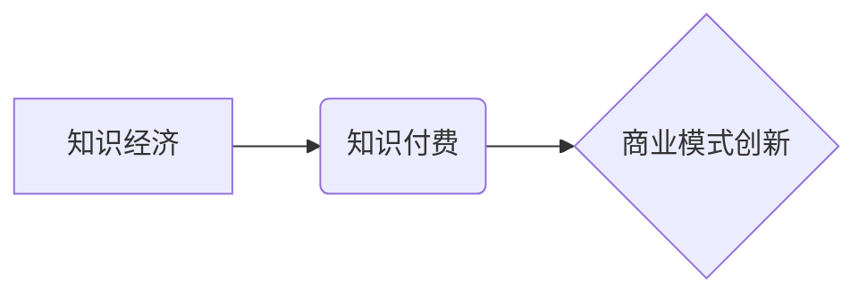

                 

## 知识经济时代下的知识付费创新商业模式测试

> 关键词：知识付费、商业模式创新、在线教育、人工智能、数据分析、用户体验、知识产权

## 1. 背景介绍

随着互联网技术的飞速发展和数字经济的蓬勃兴起，知识已成为重要的生产要素，知识经济时代正式到来。在这个时代，知识的获取、传播和应用变得更加便捷和高效。知识付费作为一种新型的商业模式，应运而生，它以知识为核心，通过付费的方式提供知识产品和服务，满足人们对知识的需求。

知识付费模式的兴起，不仅改变了传统教育和培训的方式，也为创作者提供了新的盈利途径。然而，知识付费市场竞争激烈，如何创新商业模式，提升用户体验，打造可持续发展的知识付费生态系统，成为摆在行业面前的重要课题。

## 2. 核心概念与联系

### 2.1 知识付费

知识付费是指以知识为核心，通过付费的方式提供知识产品和服务，包括但不限于在线课程、电子书、付费咨询、会员服务等。

### 2.2 商业模式创新

商业模式创新是指企业在现有商业模式的基础上，通过改变产品、服务、价值主张、客户群体、渠道、资源配置等方面，创造新的商业价值和竞争优势。

### 2.3 知识经济

知识经济是指以知识、技术、信息为主要生产要素，以创新为动力，以知识创造、传播和应用为核心特征的经济形态。

**核心概念关系图**



## 3. 核心算法原理 & 具体操作步骤

### 3.1 算法原理概述

知识付费商业模式的创新需要结合数据分析和人工智能技术，通过分析用户行为、学习习惯和知识需求，精准推荐知识产品，个性化定制学习路径，提升用户体验和学习效率。

### 3.2 算法步骤详解

1. **数据收集:** 收集用户注册信息、学习记录、评价反馈、支付行为等数据。
2. **数据清洗:** 对收集到的数据进行清洗、处理，去除无效数据和噪声数据。
3. **特征提取:** 从用户数据中提取特征，例如学习时长、学习进度、知识点掌握情况、学习偏好等。
4. **模型训练:** 利用机器学习算法，训练用户画像模型，预测用户对不同知识产品的兴趣和学习效果。
5. **知识推荐:** 根据用户画像和知识库信息，推荐个性化的知识产品和学习路径。
6. **用户反馈:** 收集用户对推荐结果的反馈，不断优化模型和推荐算法。

### 3.3 算法优缺点

**优点:**

* **精准推荐:** 基于数据分析和人工智能，精准推荐用户感兴趣和需要的知识产品。
* **个性化学习:** 根据用户学习习惯和知识需求，定制个性化的学习路径，提升学习效率。
* **提升用户体验:** 提供更便捷、更智能的学习体验，增强用户粘性。

**缺点:**

* **数据依赖:** 算法效果依赖于数据质量和数量，数据不足或数据质量低会影响算法精度。
* **算法黑盒:** 一些机器学习算法的决策过程难以解释，缺乏透明度。
* **隐私安全:** 数据收集和分析需要注重用户隐私安全，避免数据泄露和滥用。

### 3.4 算法应用领域

* **在线教育:** 个性化推荐课程、学习路径、学习资源。
* **知识平台:** 推荐相关知识文章、视频、音频等内容。
* **内容创作:** 分析用户兴趣，创作更符合用户需求的内容。
* **营销推广:** 精准推送广告和营销信息，提高转化率。

## 4. 数学模型和公式 & 详细讲解 & 举例说明

### 4.1 数学模型构建

知识推荐系统可以采用协同过滤算法，构建用户-物品交互矩阵，通过矩阵分解的方式，预测用户对物品的评分或偏好。

**用户-物品交互矩阵:**

```
用户 | 物品1 | 物品2 | 物品3
------- | -------- | -------- | --------
用户1 | 5 | 3 | 4
用户2 | 4 | 5 | 2
用户3 | 3 | 2 | 5
```

**矩阵分解模型:**

```
R = U * V^T
```

其中:

* R: 用户-物品交互矩阵
* U: 用户特征矩阵
* V: 物品特征矩阵
* ^T: 转置

### 4.2 公式推导过程

通过最小化预测误差和实际评分之间的差值，可以得到 U 和 V 的最优解。

**损失函数:**

```
L = ∑_(u,i) (R_ui - U_u * V_i^T)^2
```

其中:

* L: 损失函数
* R_ui: 用户 u 对物品 i 的实际评分
* U_u: 用户 u 的特征向量
* V_i: 物品 i 的特征向量

### 4.3 案例分析与讲解

假设用户1对物品1的评分为5，而模型预测的评分为4.8，则损失函数会增加一个值，模型会根据这个损失值调整 U 和 V 的值，使得预测评分更接近实际评分。

## 5. 项目实践：代码实例和详细解释说明

### 5.1 开发环境搭建

* Python 3.x
* TensorFlow 或 PyTorch
* Jupyter Notebook

### 5.2 源代码详细实现

```python
import tensorflow as tf

# 定义模型
model = tf.keras.Sequential([
    tf.keras.layers.Dense(64, activation='relu', input_shape=(n_users,)),
    tf.keras.layers.Dense(n_items,)
])

# 编译模型
model.compile(optimizer='adam', loss='mse')

# 训练模型
model.fit(user_features, item_features, epochs=10)

# 预测评分
predictions = model.predict(user_features)
```

### 5.3 代码解读与分析

* 使用 TensorFlow 或 PyTorch 库构建深度学习模型。
* 定义模型结构，包括输入层、隐藏层和输出层。
* 编译模型，选择优化器、损失函数和评估指标。
* 训练模型，使用训练数据进行模型训练。
* 预测评分，使用训练好的模型预测用户对物品的评分。

### 5.4 运行结果展示

* 通过可视化工具，展示模型的训练过程和预测结果。
* 使用评估指标，例如均方误差 (MSE) 或均方根误差 (RMSE)，评估模型的性能。

## 6. 实际应用场景

### 6.1 在线教育平台

* 个性化推荐课程和学习路径，提升用户学习效率。
* 根据用户学习进度和掌握情况，提供个性化的学习建议和辅导。
* 分析用户学习行为，优化课程内容和教学方法。

### 6.2 知识付费平台

* 推荐用户感兴趣的知识产品，例如电子书、视频课程、付费咨询等。
* 根据用户购买历史和浏览记录，提供个性化的产品推荐。
* 分析用户付费行为，优化产品定价和营销策略。

### 6.3 内容创作平台

* 分析用户兴趣和阅读习惯，创作更符合用户需求的内容。
* 推荐用户相关的文章、视频、音频等内容，提升用户粘性。
* 根据用户反馈，优化内容质量和创作方向。

### 6.4 未来应用展望

* **更精准的推荐:** 利用更先进的机器学习算法和数据分析技术，实现更精准的知识推荐。
* **更个性化的学习体验:** 提供更丰富的学习资源和互动功能，打造更个性化的学习体验。
* **更智能的学习助手:** 开发更智能的学习助手，帮助用户规划学习目标、跟踪学习进度、提供个性化学习建议。

## 7. 工具和资源推荐

### 7.1 学习资源推荐

* **在线课程:** Coursera, edX, Udemy
* **书籍:** 《推荐系统实践》、《深度学习》
* **博客:** Towards Data Science, Machine Learning Mastery

### 7.2 开发工具推荐

* **Python:** TensorFlow, PyTorch, Scikit-learn
* **数据分析工具:** Pandas, NumPy
* **可视化工具:** Matplotlib, Seaborn

### 7.3 相关论文推荐

* **协同过滤算法:** "Collaborative Filtering for Implicit Feedback Datasets"
* **矩阵分解模型:** "Matrix Factorization Techniques for Recommender Systems"
* **深度学习推荐系统:** "Deep Learning for Recommender Systems"

## 8. 总结：未来发展趋势与挑战

### 8.1 研究成果总结

知识付费商业模式的创新，为知识传播和价值创造提供了新的途径，推动了知识经济的发展。数据分析和人工智能技术在知识推荐、个性化学习和用户体验提升方面发挥着重要作用。

### 8.2 未来发展趋势

* **更精准的推荐:** 利用更先进的机器学习算法和数据分析技术，实现更精准的知识推荐。
* **更个性化的学习体验:** 提供更丰富的学习资源和互动功能，打造更个性化的学习体验。
* **更智能的学习助手:** 开发更智能的学习助手，帮助用户规划学习目标、跟踪学习进度、提供个性化学习建议。
* **知识产权保护:** 加强知识产权保护，构建公平合理的知识付费生态系统。

### 8.3 面临的挑战

* **数据质量和隐私安全:** 确保数据质量和用户隐私安全，避免数据泄露和滥用。
* **算法透明度和可解释性:** 提高算法透明度和可解释性，增强用户对推荐结果的信任。
* **商业模式可持续性:** 探索新的商业模式，实现知识付费的长期可持续发展。

### 8.4 研究展望

未来，知识付费商业模式将继续发展和创新，人工智能技术将发挥越来越重要的作用。研究者需要关注数据质量、算法透明度、商业模式可持续性等问题，推动知识付费行业健康发展。

## 9. 附录：常见问题与解答

* **Q1: 如何提高知识付费产品的质量？**

* **A1:** 

    * 邀请行业专家和学者参与内容创作。
    * 采用多媒体形式，丰富知识产品的呈现方式。
    * 提供互动学习功能，增强用户参与度。
    * 收集用户反馈，不断优化产品内容和服务。

* **Q2: 如何提升用户体验？**

* **A2:** 

    * 提供便捷的学习平台和支付方式。
    * 个性化推荐知识产品和学习路径。
    * 提供优质的客户服务和技术支持。
    * 营造良好的学习氛围和社区氛围。

* **Q3: 如何保障知识产权？**

* **A3:** 

    * 采用数字版权保护技术，防止知识盗版。
    * 建立完善的知识产权管理制度。
    * 加强与法律部门的合作，打击知识产权侵权行为。


作者：禅与计算机程序设计艺术 / Zen and the Art of Computer Programming 
<end_of_turn>

