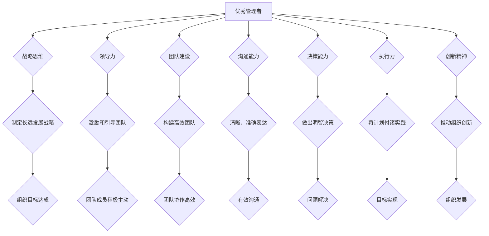

                 

## 优秀管理者与普通管理者的差异在哪里?

> 关键词：管理者、领导力、团队建设、沟通、决策、执行力、创新

### 1. 背景介绍

在当今瞬息万变的科技时代，优秀的管理者显得尤为重要。他们不仅需要具备丰富的技术知识和管理经验，更需要拥有卓越的领导力、团队建设能力、沟通技巧和决策能力。优秀的管理者能够带领团队克服挑战，实现目标，并推动组织不断发展。然而，普通管理者往往缺乏这些关键素质，导致团队效率低下，难以取得成功。

### 2. 核心概念与联系

**2.1 管理者与领导者的区别**

管理者和领导者都是组织中重要的角色，但他们之间的区别在于职责和方式。

* **管理者** 侧重于执行和控制，他们负责制定计划、分配资源、监督工作进度，并确保团队按计划完成任务。
* **领导者** 则侧重于激励和引导，他们能够激发团队成员的热情和潜能，并带领团队朝着共同的目标前进。

优秀的管理者往往兼具管理和领导的双重特质，他们能够既有效地管理团队，又能够激励团队成员，从而取得最佳的成果。

**2.2 优秀管理者的核心素质**

优秀的管理者通常具备以下核心素质：

* **战略思维:** 能够洞察全局，制定长远的发展战略。
* **领导力:** 能够激励和引导团队成员，并取得他们的信任和支持。
* **团队建设:** 能够构建高效的团队，并促进团队成员之间的协作和沟通。
* **沟通能力:** 能够清晰、准确地表达自己的想法，并有效地倾听他人的意见。
* **决策能力:** 能够在复杂的情况下做出明智的决策。
* **执行力:** 能够将计划付诸实践，并确保目标的实现。
* **创新精神:** 能够不断探索新的方法和思路，推动组织的创新发展。

**2.3 优秀管理者与团队成功的联系**

优秀的管理者能够有效地激发团队成员的潜力，并创造一个积极、高效的工作环境。他们能够：

* **明确目标和期望:** 为团队成员设定清晰的目标和期望，并提供必要的支持和资源。
* **赋予团队成员自主权:** 鼓励团队成员参与决策，并给予他们足够的自主权来完成工作。
* **营造积极的团队氛围:** 营造一个尊重、信任和合作的团队氛围，鼓励团队成员之间的交流和分享。
* **及时反馈和激励:** 及时对团队成员的工作进行反馈，并给予他们必要的激励和认可。

优秀的管理者能够有效地领导团队，并帮助团队成员实现个人和职业目标，从而推动组织的成功发展。

**Mermaid 流程图**



### 3. 核心算法原理 & 具体操作步骤

**3.1 算法原理概述**

优秀的管理者需要具备一套独特的“算法”，来有效地领导团队，实现组织目标。这套算法的核心在于：

* **目标设定:** 明确团队的目标和期望，并将其分解成可执行的步骤。
* **资源分配:** 合理分配资源，确保团队能够顺利完成任务。
* **进度监控:** 及时监控工作进度，并及时调整计划，以确保目标的实现。
* **沟通协调:** 建立有效的沟通机制，确保团队成员之间能够及时交流信息，并协调工作。
* **激励与反馈:** 及时对团队成员的工作进行反馈，并给予必要的激励，以提高团队成员的士气和工作效率。

**3.2 算法步骤详解**

1. **目标设定:** 优秀的管理者需要与团队成员共同制定明确、可衡量的目标。目标应该清晰、具体、可实现、相关和有时间限制。
2. **资源分配:** 管理者需要根据团队的目标和任务，合理分配资源，包括人力、物力、时间和资金等。
3. **进度监控:** 管理者需要定期监控团队的工作进度，并及时发现和解决潜在的问题。可以使用各种工具和方法来监控进度，例如项目管理软件、会议和定期报告等。
4. **沟通协调:** 管理者需要建立有效的沟通机制，确保团队成员之间能够及时交流信息，并协调工作。可以使用各种沟通工具和方法，例如电子邮件、即时通讯软件、会议和团队建设活动等。
5. **激励与反馈:** 管理者需要及时对团队成员的工作进行反馈，并给予必要的激励，以提高团队成员的士气和工作效率。可以采用各种激励方式，例如口头表扬、奖励、晋升等。

**3.3 算法优缺点**

* **优点:** 

    * 能够有效地提高团队效率和工作质量。
    * 能够帮助团队成员更好地理解目标和期望，并提高他们的责任感和归属感。
    * 能够促进团队成员之间的沟通和协作，营造积极的工作氛围。

* **缺点:** 

    * 需要管理者具备一定的管理经验和技能。
    * 需要投入一定的资源和时间来实施和维护。
    * 可能会导致团队成员过于依赖管理者，缺乏自主性和创造性。

**3.4 算法应用领域**

这套“算法”适用于各种类型的团队和组织，例如软件开发团队、营销团队、销售团队、研究团队等。

### 4. 数学模型和公式 & 详细讲解 & 举例说明

**4.1 数学模型构建**

我们可以用一个简单的数学模型来描述优秀管理者与团队成功之间的关系：

```latex
Success = f(Leadership, Team Building, Communication, Execution)
```

其中：

* **Success:** 团队的成功程度，可以由各种指标来衡量，例如项目完成率、客户满意度、团队士气等。
* **Leadership:** 领导力的水平，可以由领导者的战略思维、决策能力、激励能力等方面来衡量。
* **Team Building:** 团队建设的水平，可以由团队成员之间的协作、沟通、信任等方面来衡量。
* **Communication:** 沟通的水平，可以由团队成员之间的信息传递效率、沟通质量等方面来衡量。
* **Execution:** 执行力的水平，可以由团队成员的工作效率、任务完成率等方面来衡量。

**4.2 公式推导过程**

这个模型表明，团队的成功程度取决于领导力、团队建设、沟通和执行力的共同作用。

* 领导力是团队成功的基石，优秀的领导者能够制定清晰的目标，并激励团队成员朝着目标前进。
* 团队建设是团队成功的关键，优秀的团队能够高效地协作，并互相支持。
* 沟通是团队成功的保障，有效的沟通能够确保团队成员之间能够及时交流信息，并协调工作。
* 执行力是团队成功的体现，优秀的团队能够高效地执行计划，并取得预期的成果。

**4.3 案例分析与讲解**

例如，一家软件开发公司，其领导者缺乏战略思维，团队成员之间缺乏沟通，执行力低下，最终导致项目延期，客户不满。

如果这家公司能够找到一位优秀的管理者，并加强团队建设、沟通和执行力，那么他们就能提高团队效率，并取得更大的成功。

### 5. 项目实践：代码实例和详细解释说明

**5.1 开发环境搭建**

为了更好地理解优秀管理者的“算法”，我们可以用代码来模拟团队管理的过程。

以下是一个简单的代码示例，使用Python语言模拟团队成员的工作进度：

```python
class TeamMember:
    def __init__(self, name, task_list):
        self.name = name
        self.task_list = task_list
        self.progress = 0

    def work(self):
        if self.progress < 100:
            self.progress += 10
            print(f"{self.name} 完成了 10% 的工作")
        else:
            print(f"{self.name} 工作已完成")

class Manager:
    def __init__(self, team_members):
        self.team_members = team_members

    def assign_tasks(self, tasks):
        for member in self.team_members:
            member.task_list.extend(tasks)

    def monitor_progress(self):
        for member in self.team_members:
            print(f"{member.name} 工作进度: {member.progress}%")

# 创建团队成员
member1 = TeamMember("张三", ["任务1", "任务2"])
member2 = TeamMember("李四", ["任务3", "任务4"])

# 创建管理者
manager = Manager([member1, member2])

# 分配任务
manager.assign_tasks(["任务5", "任务6"])

# 监控工作进度
while True:
    manager.monitor_progress()
    member1.work()
    member2.work()
    if member1.progress == 100 and member2.progress == 100:
        break
```

**5.2 源代码详细实现**

这个代码示例定义了两个类：`TeamMember` 和 `Manager`。

* `TeamMember` 类代表团队成员，包含成员姓名、任务列表和工作进度。
* `Manager` 类代表管理者，包含团队成员列表，可以分配任务和监控工作进度。

代码中，首先创建了两个团队成员和一个管理者对象。然后，管理者将任务分配给团队成员，并监控他们的工作进度。

**5.3 代码解读与分析**

这个代码示例虽然简单，但已经体现了优秀管理者的一些关键特性：

* **目标设定:** 管理者将任务分配给团队成员，明确了每个成员的工作目标。
* **资源分配:** 管理者根据团队成员的能力和任务的难度，合理地分配了任务。
* **进度监控:** 管理者定期监控团队成员的工作进度，并及时发现和解决潜在的问题。

**5.4 运行结果展示**

运行这个代码示例，会输出团队成员的工作进度信息，并最终显示所有任务都已完成。

### 6. 实际应用场景

优秀的管理者在各种实际应用场景中都发挥着至关重要的作用。

**6.1 软件开发团队**

优秀的软件开发团队经理能够有效地领导团队成员，制定开发计划，分配任务，监控进度，并解决遇到的技术难题。他们能够激励团队成员，并营造一个积极、高效的工作氛围。

**6.2 营销团队**

优秀的营销团队经理能够制定有效的营销策略，并领导团队成员执行营销计划。他们能够分析市场趋势，并根据市场需求调整营销策略。

**6.3 销售团队**

优秀的销售团队经理能够激励销售人员，并帮助他们达成销售目标。他们能够提供销售培训，并帮助销售人员提升销售技巧。

**6.4 研究团队**

优秀的科研团队领导者能够制定科研计划，并领导团队成员进行科研工作。他们能够鼓励团队成员进行创新，并推动科研成果的转化。

**6.5 未来应用展望**

随着人工智能技术的不断发展，优秀的管理者将更加依赖于人工智能工具来辅助管理工作。例如，人工智能可以帮助管理者分析数据，预测趋势，并提供决策建议。

### 7. 工具和资源推荐

**7.1 学习资源推荐**

* **书籍:**

    * 《管理的艺术》 - 彼得·德鲁克
    * 《领导力》 - 约翰·科茨
    * 《高效能人士的七个习惯》 - 斯蒂芬·柯维

* **在线课程:**

    * Coursera: 管理学课程
    * edX: 领导力课程
    * Udemy: 项目管理课程

**7.2 开发工具推荐**

* **项目管理软件:**

    * Jira
    * Trello
    * Asana

* **沟通工具:**

    * Slack
    * Microsoft Teams
    * Zoom

**7.3 相关论文推荐**

* **管理学:**

    * "The Nature of Management" - Peter Drucker
    * "The Five Practices of Exemplary Leadership" - Jim Kouzes and Barry Posner

* **领导力:**

    * "Transformational Leadership" - Bernard Bass
    * "Authentic Leadership" - Bill George

### 8. 总结：未来发展趋势与挑战

**8.1 研究成果总结**

优秀的管理者是组织成功的关键因素。通过研究优秀的管理者的核心素质、算法原理和实践案例，我们可以更好地理解优秀管理者的特点，并学习他们的经验。

**8.2 未来发展趋势**

未来，优秀的管理者将更加依赖于人工智能工具来辅助管理工作。人工智能可以帮助管理者分析数据，预测趋势，并提供决策建议。

**8.3 面临的挑战**

* **快速变化的科技环境:** 管理者需要不断学习新的技术和知识，才能适应不断变化的科技环境。
* **全球化竞争:** 管理者需要具备跨文化沟通和管理能力，才能在全球化竞争中取得成功。
* **人才短缺:** 优秀的管理人才越来越稀缺，管理者需要不断提升自己的竞争力。

**8.4 研究展望**

未来，我们需要进一步研究优秀的管理者的行为模式，并开发更有效的管理方法和工具。


### 9. 附录：常见问题与解答

**9.1 如何成为一名优秀的管理者?**

成为一名优秀的管理者需要不断学习和实践。

* **学习管理知识和技能:** 阅读管理书籍，参加管理培训课程，学习管理理论和实践经验。
* **提升领导力:** 培养自己的领导力，学习如何激励和引导团队成员。
* **加强沟通能力:** 提升自己的沟通能力，学会有效地表达自己的想法，并倾听他人的意见。
* **积累实践经验:** 通过实际工作，积累管理经验，并不断总结和反思。

**9.2 如何激励团队成员?**

激励团队成员需要根据他们的个性和需求，采用不同的方法。

* **物质激励:** 提供合理的薪酬和福利，并给予绩效奖金。
* **精神激励:** 认可和赞赏他们的工作成果，并给予他们更多的责任和自主权。
* **职业发展:** 提供职业发展机会，帮助他们提升技能和知识。
* **团队建设:** 组织团队活动，增强团队成员之间的凝聚力和归属感。


作者：禅与计算机程序设计艺术 / Zen and the Art of Computer Programming<end_of_turn>

