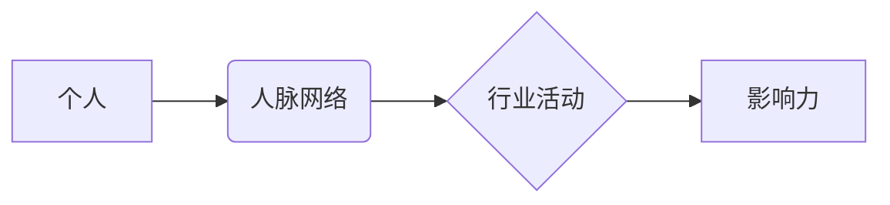

                 

## 参与行业活动：扩大人脉网络和影响力

> 关键词：行业活动、人脉网络、影响力、技术交流、职业发展、学习机会、品牌推广

### 1. 背景介绍

在当今瞬息万变的科技领域，持续学习和拓展人脉网络至关重要。作为一名技术人员，仅仅依靠个人努力和学习是不够的。积极参与行业活动可以帮助我们了解最新的技术趋势、结识同行和潜在客户，并提升个人影响力。

### 2. 核心概念与联系

**2.1 人脉网络**

人脉网络是指个人在工作、学习和生活中建立的社交关系网络。它包括同事、朋友、导师、客户、合作伙伴等各种关系。

**2.2 影响力**

影响力是指个人在特定领域或群体中能够左右他人观点、行为和决策的能力。

**2.3 行业活动**

行业活动是指与特定行业相关的会议、研讨会、展览、论坛等活动。

**2.4 关系图**



### 3. 核心算法原理 & 具体操作步骤

**3.1 算法原理概述**

参与行业活动并建立人脉网络是一个迭代的过程，需要不断地投入时间和精力。

**3.2 算法步骤详解**

1. **目标设定:** 明确参与行业活动的目的是什么，例如学习新技术、拓展人脉、寻找合作机会等。
2. **活动选择:** 选择与自身兴趣和职业目标相关的行业活动。
3. **前期准备:** 提前了解活动内容、嘉宾信息和参会流程，准备相关问题和话题。
4. **积极参与:** 在活动中积极提问、交流、分享，并主动与他人建立联系。
5. **后续跟进:** 活动结束后，及时与认识的人保持联系，并持续关注他们的动态。

**3.3 算法优缺点**

* **优点:** 
    * 拓宽视野，了解行业最新动态。
    * 结识同行和潜在客户，建立人脉关系。
    * 提升个人影响力，获得更多机会。
* **缺点:** 
    * 需要投入时间和精力。
    * 活动质量参差不齐，需要谨慎选择。
    * 建立人脉关系需要持续的维护。

**3.4 算法应用领域**

* 技术人员
* 创业者
* 企业管理者
* 学术研究人员

### 4. 数学模型和公式 & 详细讲解 & 举例说明

**4.1 数学模型构建**

人脉网络的规模和影响力可以用数学模型来表示。例如，我们可以用一个图论模型来表示人脉网络，其中每个节点代表一个人，边代表两个人之间的关系。

**4.2 公式推导过程**

我们可以使用度数、聚类系数等指标来衡量人脉网络的规模和密度。

* **度数:** 指的是一个节点连接的边的数量，代表一个人的社交关系数量。
* **聚类系数:** 指的是一个节点与其邻居节点之间连接的程度，代表一个人的社交关系的紧密程度。

**4.3 案例分析与讲解**

假设有两个技术人员，A和B。A的度数为10，聚类系数为0.8，B的度数为5，聚类系数为0.5。这表明A的人脉网络规模更大，社交关系也更紧密。

### 5. 项目实践：代码实例和详细解释说明

**5.1 开发环境搭建**

* 操作系统: Linux/macOS/Windows
* 编程语言: Python
* 工具: Git, Jupyter Notebook

**5.2 源代码详细实现**

```python
# 人脉网络分析代码示例

import networkx as nx

# 创建人脉网络图
graph = nx.Graph()

# 添加节点
graph.add_nodes_from(["A", "B", "C", "D", "E"])

# 添加边
graph.add_edges_from([("A", "B"), ("A", "C"), ("B", "D"), ("C", "E")])

# 计算度数
degree_centrality = nx.degree_centrality(graph)
print("度数中心性:", degree_centrality)

# 计算聚类系数
clustering_coefficient = nx.average_clustering(graph)
print("聚类系数:", clustering_coefficient)
```

**5.3 代码解读与分析**

这段代码使用Python的networkx库来构建一个简单的社交网络图，并计算节点的度数中心性和聚类系数。

**5.4 运行结果展示**

运行代码后，会输出每个节点的度数中心性和聚类系数，可以用来分析人脉网络的规模和密度。

### 6. 实际应用场景

**6.1 技术交流平台**

* GitHub, Stack Overflow, Reddit

**6.2 行业会议和研讨会**

* SIGGRAPH, NeurIPS, CES

**6.3 线上社区和论坛**

* Discord, Slack, Meetup

**6.4 职业发展平台**

* LinkedIn, AngelList

**6.5 未来应用展望**

随着人工智能和虚拟现实技术的不断发展，未来行业活动将更加多元化和沉浸式。

### 7. 工具和资源推荐

**7.1 学习资源推荐**

* 书籍: "The Lean Startup" by Eric Ries, "Influence: The Psychology of Persuasion" by Robert Cialdini
* 在线课程: Coursera, Udemy, edX

**7.2 开发工具推荐**

* 项目管理工具: Trello, Asana, Jira
* 沟通协作工具: Slack, Microsoft Teams, Zoom

**7.3 相关论文推荐**

* "The Strength of Weak Ties" by Mark Granovetter
* "Social Capital" by Robert Putnam

### 8. 总结：未来发展趋势与挑战

**8.1 研究成果总结**

参与行业活动可以帮助技术人员拓展人脉网络、提升个人影响力，并获得更多职业发展机会。

**8.2 未来发展趋势**

未来行业活动将更加注重互动性和沉浸式体验，并利用人工智能技术提供个性化服务。

**8.3 面临的挑战**

* 活动质量参差不齐
* 人脉关系的维护需要持续的投入
* 虚拟化和数字化带来的挑战

**8.4 研究展望**

未来研究可以探索如何利用人工智能技术优化行业活动，并提高人脉网络建设的效率。

### 9. 附录：常见问题与解答

**9.1 如何在行业活动中建立人脉关系？**

* 积极主动地与他人交流
* 寻找共同话题
* 分享自己的经验和见解
* 关注他人的动态

**9.2 如何维护人脉关系？**

* 定期联系
* 参加共同感兴趣的活动
* 提供帮助和支持

**9.3 如何评估行业活动的价值？**

* 了解活动内容和嘉宾信息
* 收集反馈和评价
* 评估活动对个人职业发展的影响


作者：禅与计算机程序设计艺术 / Zen and the Art of Computer Programming 
<end_of_turn>

