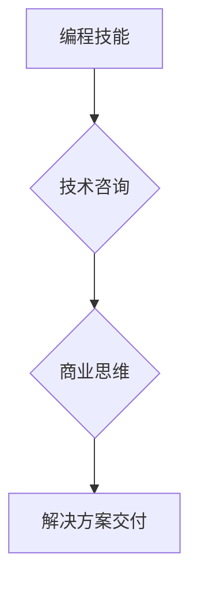

                 

## 如何将编程技能转化为咨询业务

> 关键词：编程技能、咨询业务、技术咨询、软件架构、项目管理、沟通技巧、商业思维

### 1. 背景介绍

在当今科技日新月异的时代，编程技能已成为一项宝贵的资产。然而，仅仅掌握编程技术并不能保证职业生涯的成功。越来越多的程序员开始探索将自身的技术优势转化为更具价值的咨询业务。

技术咨询行业蓬勃发展，企业对技术解决方案的需求日益增长。拥有扎实编程基础的咨询师能够更深入地理解客户需求，提供更精准的技术建议，并协助客户实施解决方案。

### 2. 核心概念与联系

**技术咨询**的核心在于将专业的技术知识与商业需求相结合，为客户提供定制化的解决方案。

**编程技能**是技术咨询的基础，它赋予咨询师理解技术架构、分析问题、设计方案的能力。

**商业思维**则是技术咨询的关键，它帮助咨询师洞察客户需求、评估解决方案价值、制定商业策略。

**Mermaid 流程图**



### 3. 核心算法原理 & 具体操作步骤

**3.1 算法原理概述**

技术咨询的核心算法是**问题解决算法**。它包括以下步骤：

1. **需求分析**: 理解客户的业务痛点、目标和期望。
2. **方案设计**: 根据客户需求，设计可行的技术解决方案。
3. **方案评估**: 评估方案的可行性、成本效益和风险。
4. **方案实施**: 协助客户实施解决方案，并提供技术支持。
5. **方案优化**: 定期评估解决方案的效果，并进行优化调整。

**3.2 算法步骤详解**

1. **需求分析**: 咨询师需要与客户进行深入沟通，了解其业务背景、技术现状、目标和期望。可以使用问卷调查、访谈、现场观察等方法收集信息。
2. **方案设计**: 咨询师需要根据客户需求，结合自身的技术经验，设计可行的技术解决方案。方案设计需要考虑技术可行性、成本效益、风险控制等因素。
3. **方案评估**: 咨询师需要对方案进行评估，包括技术可行性、成本效益、风险控制等方面。可以使用成本效益分析、风险评估等方法进行评估。
4. **方案实施**: 咨询师需要协助客户实施解决方案，并提供技术支持。方案实施需要制定详细的实施计划，并进行阶段性验收。
5. **方案优化**: 咨询师需要定期评估解决方案的效果，并进行优化调整。方案优化可以根据客户反馈、市场变化等因素进行调整。

**3.3 算法优缺点**

**优点**:

* 能够提供定制化的解决方案，满足客户的个性化需求。
* 能够帮助客户解决技术难题，提高效率和效益。
* 能够帮助客户提升技术水平，增强竞争力。

**缺点**:

* 需要咨询师具备丰富的技术经验和商业思维。
* 需要咨询师具备良好的沟通和协作能力。
* 需要咨询师能够快速学习新技术。

**3.4 算法应用领域**

技术咨询的应用领域非常广泛，包括：

* 软件开发咨询
* 系统架构咨询
* 数据分析咨询
* 云计算咨询
* 互联网安全咨询

### 4. 数学模型和公式 & 详细讲解 & 举例说明

**4.1 数学模型构建**

技术咨询的价值可以抽象为一个数学模型：

**价值 = 效益 - 成本**

其中：

* **效益**: 客户通过解决方案获得的收益，例如提高效率、降低成本、增加收入等。
* **成本**: 客户为获得解决方案支付的费用，包括咨询费用、实施费用、维护费用等。

**4.2 公式推导过程**

效益和成本可以分别用以下公式表示：

* **效益 = 提高效率 * 效率提升率 * 工作量**
* **成本 = 咨询费用 + 实施费用 + 维护费用**

**4.3 案例分析与讲解**

假设一家公司希望提高其网站的访问速度，从而提升用户体验和转化率。

* 咨询师评估后发现，网站的访问速度可以通过优化数据库结构和服务器配置来提高。
* 咨询师建议公司采用新的数据库系统和服务器硬件，并提供相应的实施和维护服务。
* 公司根据咨询师的建议，实施了新的解决方案，网站的访问速度提高了 50%。
* 公司通过提高网站访问速度，获得了更多的用户访问和转化，从而增加了收入。

在这个案例中，公司的效益大于成本，因此公司获得了技术咨询的价值。

### 5. 项目实践：代码实例和详细解释说明

**5.1 开发环境搭建**

技术咨询项目通常需要使用多种开发工具和技术，例如：

* 代码编辑器：VS Code、Sublime Text等
* 版本控制系统：Git、SVN等
* 数据库管理工具：MySQL Workbench、PostgreSQL Admin等
* 云平台：AWS、Azure、GCP等

**5.2 源代码详细实现**

具体代码实现取决于项目的具体需求，以下是一个简单的代码示例，用于演示如何使用 Python 编写一个简单的技术咨询工具：

```python
def analyze_requirements(requirements):
  """
  分析客户需求
  """
  # ...

def design_solution(requirements):
  """
  设计解决方案
  """
  # ...

def evaluate_solution(solution):
  """
  评估解决方案
  """
  # ...

def implement_solution(solution):
  """
  实施解决方案
  """
  # ...

# 获取客户需求
requirements = input("请输入客户需求：")

# 分析需求
analyzed_requirements = analyze_requirements(requirements)

# 设计解决方案
solution = design_solution(analyzed_requirements)

# 评估解决方案
evaluated_solution = evaluate_solution(solution)

# 实施解决方案
implement_solution(evaluated_solution)
```

**5.3 代码解读与分析**

这段代码定义了四个函数：

* `analyze_requirements`: 分析客户需求
* `design_solution`: 设计解决方案
* `evaluate_solution`: 评估解决方案
* `implement_solution`: 实施解决方案

每个函数都执行特定的任务，并根据输入和输出进行数据处理。

**5.4 运行结果展示**

运行这段代码后，程序会提示用户输入客户需求，然后根据用户输入，程序会分析需求、设计解决方案、评估解决方案和实施解决方案。

### 6. 实际应用场景

技术咨询的应用场景非常广泛，以下是一些具体的例子：

* **软件开发咨询**: 帮助企业选择合适的软件开发技术栈、设计软件架构、开发软件产品。
* **系统架构咨询**: 帮助企业设计和优化其 IT 系统架构，提高系统性能、安全性、可靠性。
* **数据分析咨询**: 帮助企业收集、分析和利用数据，洞察业务趋势、优化运营策略。
* **云计算咨询**: 帮助企业迁移到云计算平台，优化云资源利用率、降低 IT 成本。
* **互联网安全咨询**: 帮助企业评估其网络安全风险，制定安全策略，提高网络安全防护能力。

**6.4 未来应用展望**

随着科技的不断发展，技术咨询的应用场景将会更加广泛。例如：

* **人工智能咨询**: 帮助企业利用人工智能技术，提高效率、优化决策、创造新的商业价值。
* **区块链咨询**: 帮助企业探索区块链技术的应用，构建去中心化、透明的业务模式。
* **物联网咨询**: 帮助企业构建物联网平台，实现数据采集、分析和应用，提升运营效率。

### 7. 工具和资源推荐

**7.1 学习资源推荐**

* **书籍**: 《咨询师的艺术》、《商业模式创新》、《零基础学习Python》
* **在线课程**: Coursera、Udemy、edX
* **技术博客**: Hacker News、Medium、Stack Overflow

**7.2 开发工具推荐**

* **代码编辑器**: VS Code、Sublime Text、Atom
* **版本控制系统**: Git、SVN
* **数据库管理工具**: MySQL Workbench、PostgreSQL Admin
* **云平台**: AWS、Azure、GCP

**7.3 相关论文推荐**

* **咨询理论**: 《咨询心理学》
* **技术咨询**: 《技术咨询的实践与理论》

### 8. 总结：未来发展趋势与挑战

**8.1 研究成果总结**

将编程技能转化为咨询业务是一个具有巨大潜力的发展方向。它能够帮助程序员发挥其技术优势，为企业提供更具价值的服务。

**8.2 未来发展趋势**

未来，技术咨询行业将会更加专业化、细分化和智能化。

* **专业化**: 咨询师将更加专注于特定领域的技术咨询，例如人工智能、区块链、物联网等。
* **细分化**: 咨询服务将更加细化，例如需求分析、方案设计、实施支持、培训服务等。
* **智能化**: 咨询工具和平台将更加智能化，例如自动生成解决方案、提供个性化建议等。

**8.3 面临的挑战**

技术咨询行业也面临着一些挑战，例如：

* **竞争激烈**: 技术咨询市场竞争激烈，需要咨询师不断提升自身的技术水平和商业能力。
* **客户需求变化快**: 科技发展迅速，客户需求变化快，咨询师需要具备快速学习新技术的能力。
* **跨部门沟通**: 技术咨询需要与不同部门的客户进行沟通，需要咨询师具备良好的沟通和协作能力。

**8.4 研究展望**

未来，研究者可以继续探索以下方向：

* **开发更智能的咨询工具和平台**: 例如，利用人工智能技术，自动生成解决方案、提供个性化建议等。
* **建立更完善的技术咨询人才培养体系**: 例如，开发更专业的技术咨询课程、建立技术咨询师认证体系等。
* **研究技术咨询行业的发展趋势**: 例如，研究技术咨询市场规模、竞争格局、发展模式等。

### 9. 附录：常见问题与解答

**常见问题**:

* 如何将编程技能转化为咨询业务？
* 技术咨询行业有哪些发展趋势？
* 技术咨询行业有哪些挑战？

**解答**:

* 将编程技能转化为咨询业务需要具备扎实的技术基础、良好的沟通能力和商业思维。可以从以下方面入手：
    * 积累技术经验，成为某个领域的专家。
    * 学习商业知识，了解客户需求和市场趋势。
    * 提升沟通能力，能够清晰地表达技术方案。
* 技术咨询行业的发展趋势是专业化、细分化和智能化。
* 技术咨询行业面临的挑战包括竞争激烈、客户需求变化快、跨部门沟通等。


作者：禅与计算机程序设计艺术 / Zen and the Art of Computer Programming 
<end_of_turn>

