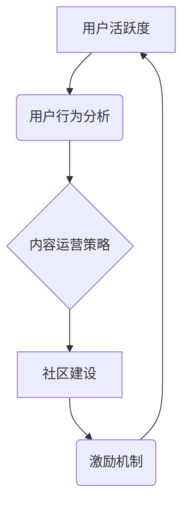

                 

## 如何提高知识付费产品的用户活跃度

> 关键词：知识付费、用户活跃度、产品设计、用户行为、数据分析、内容运营、社区建设、激励机制

## 1. 背景介绍

知识付费行业近年来蓬勃发展，涌现出大量优质的知识产品。然而，如何提高知识付费产品的用户活跃度，一直是行业内面临的共同挑战。用户付费后，往往会出现“买断式”消费模式，即只在购买初期进行学习，后续缺乏持续的参与和互动。这不仅影响了产品的商业可持续性，也阻碍了用户知识体系的构建和成长。

## 2. 核心概念与联系

**2.1 用户活跃度**

用户活跃度是指用户在特定时间段内与产品进行交互的频率和深度。对于知识付费产品而言，活跃度可以衡量用户对产品的持续学习意愿和参与度。

**2.2 用户行为分析**

用户行为分析是指通过收集和分析用户在产品中的行为数据，以了解用户的学习习惯、偏好和需求。

**2.3 内容运营策略**

内容运营策略是指围绕用户需求，制定内容生产、更新、推广和互动等方面的计划和方案。

**2.4 社区建设**

社区建设是指围绕产品构建一个用户互动交流的平台，促进用户之间的学习和分享。

**2.5 激励机制**

激励机制是指通过奖励和鼓励，引导用户持续参与产品和社区活动。

**2.6 核心概念关系图**



## 3. 核心算法原理 & 具体操作步骤

**3.1 算法原理概述**

用户活跃度算法通常基于用户行为数据，通过统计用户访问频率、学习时长、互动次数等指标，计算出用户的活跃度得分。常见的算法包括：

* **DAU/MAU:**  每日活跃用户数 (DAU) / 月均活跃用户数 (MAU)
* **UV/PV:**  独立访客数 (UV) / 页面浏览次数 (PV)
* **留存率:**  特定时间段内用户持续活跃的比例

**3.2 算法步骤详解**

1. **数据收集:** 收集用户行为数据，包括访问时间、学习时长、课程进度、评论点赞等。
2. **数据清洗:** 去除无效数据，例如重复数据、异常数据等。
3. **特征提取:** 从原始数据中提取用户活跃度相关的特征，例如访问频率、学习时长、互动次数等。
4. **模型训练:** 使用机器学习算法，训练用户活跃度预测模型。
5. **活跃度计算:** 将用户行为数据输入模型，计算出用户的活跃度得分。

**3.3 算法优缺点**

* **优点:** 能够量化用户活跃度，为产品运营提供数据支持。
* **缺点:** 算法本身无法解释用户行为背后的原因，需要结合其他分析方法进行深入解读。

**3.4 算法应用领域**

用户活跃度算法广泛应用于互联网产品，例如社交媒体、电商平台、在线教育等。

## 4. 数学模型和公式 & 详细讲解 & 举例说明

**4.1 数学模型构建**

用户活跃度模型可以构建为一个线性回归模型，其中用户活跃度得分作为因变量，用户行为特征作为自变量。

**4.2 公式推导过程**

```latex
活跃度得分 = β_0 + β_1 * 访问频率 + β_2 * 学习时长 + β_3 * 互动次数 + ...
```

其中：

*  活跃度得分：用户活跃度得分
*  β_0：截距项
*  β_1, β_2, β_3...：各特征的权重系数

**4.3 案例分析与讲解**

假设我们有一个在线教育平台，收集了用户的访问频率、学习时长、互动次数等数据。通过训练线性回归模型，得到以下模型参数：

*  β_0 = 10
*  β_1 = 0.5
*  β_2 = 2
*  β_3 = 0.1

这意味着，对于该平台的用户，访问频率每增加1次，活跃度得分会增加0.5分；学习时长每增加1小时，活跃度得分会增加2分；互动次数每增加1次，活跃度得分会增加0.1分。

## 5. 项目实践：代码实例和详细解释说明

**5.1 开发环境搭建**

*  操作系统：Windows/macOS/Linux
*  编程语言：Python
*  数据分析库：Pandas, NumPy
*  机器学习库：Scikit-learn

**5.2 源代码详细实现**

```python
import pandas as pd
from sklearn.linear_model import LinearRegression

# 数据加载
data = pd.read_csv('user_behavior.csv')

# 特征选择
features = ['访问频率', '学习时长', '互动次数']
target = '活跃度得分'

# 数据分割
X = data[features]
y = data[target]

# 模型训练
model = LinearRegression()
model.fit(X, y)

# 模型评估
# ...

# 预测活跃度得分
new_user_data = pd.DataFrame({
    '访问频率': [10],
    '学习时长': [5],
    '互动次数': [2]
})
predicted_score = model.predict(new_user_data)

print(f'预测活跃度得分: {predicted_score[0]}')
```

**5.3 代码解读与分析**

*  代码首先加载用户行为数据，并选择相关的特征和目标变量。
*  然后，使用Scikit-learn库中的线性回归模型进行训练。
*  训练完成后，可以使用模型预测新用户的活跃度得分。

**5.4 运行结果展示**

运行代码后，会输出预测活跃度得分的结果。

## 6. 实际应用场景

**6.1 用户画像分析**

通过分析不同用户群体的活跃度特征，可以构建用户画像，了解不同用户群体的学习习惯和需求。

**6.2 内容推荐**

根据用户的活跃度和学习偏好，推荐相关内容，提高用户学习兴趣和参与度。

**6.3 个性化学习路径**

根据用户的活跃度和学习进度，定制个性化学习路径，帮助用户更高效地学习。

**6.4 社区运营**

根据用户的活跃度，识别活跃用户，并给予奖励和鼓励，促进社区活跃度和用户粘性。

**6.5 产品迭代优化**

通过分析用户活跃度数据，发现产品中的痛点和改进方向，不断优化产品功能和体验。

**6.6 未来应用展望**

随着人工智能技术的不断发展，用户活跃度算法将更加智能化和个性化，能够更精准地预测用户行为，为知识付费产品提供更有效的运营策略。

## 7. 工具和资源推荐

**7.1 学习资源推荐**

*  **书籍:**
    *  《Python数据科学手册》
    *  《机器学习实战》
*  **在线课程:**
    *  Coursera: 数据科学与机器学习
    *  Udacity: 机器学习工程师

**7.2 开发工具推荐**

*  **数据分析工具:**
    *  Pandas
    *  NumPy
*  **机器学习库:**
    *  Scikit-learn
    *  TensorFlow

**7.3 相关论文推荐**

*  《基于用户行为特征的用户活跃度预测模型》
*  《深度学习在用户活跃度预测中的应用》

## 8. 总结：未来发展趋势与挑战

**8.1 研究成果总结**

本文介绍了知识付费产品用户活跃度提升的理论基础和实践方法，包括用户行为分析、内容运营策略、社区建设、激励机制等方面。通过算法模型和数据分析，可以更精准地了解用户行为，制定有效的运营策略，提高用户活跃度和产品商业价值。

**8.2 未来发展趋势**

*  **人工智能技术的应用:**  人工智能技术将更加深入地应用于用户活跃度预测和运营策略制定，实现更精准的个性化推荐和用户体验。
*  **数据分析的深度挖掘:**  通过更深入的数据分析，挖掘用户行为背后的更深层次的动机和需求，为产品设计和运营提供更有效的指导。
*  **跨平台用户行为分析:**  随着用户行为跨平台化的趋势，需要构建更全面的用户行为分析体系，整合不同平台的数据，更全面地了解用户行为。

**8.3 面临的挑战**

*  **数据隐私保护:**  用户行为数据涉及到个人隐私，需要采取有效的措施保障数据安全和隐私。
*  **算法模型的解释性:**  目前许多机器学习算法的决策过程难以解释，需要研究更可解释的算法模型，提高算法的透明度和可信度。
*  **用户行为的多样性:**  用户行为具有高度的多样性，需要不断探索新的算法和方法，应对不断变化的用户行为模式。

**8.4 研究展望**

未来，知识付费产品用户活跃度提升的研究将更加注重人工智能技术的应用、数据分析的深度挖掘、跨平台用户行为分析等方面，为用户提供更个性化、更优质的学习体验，推动知识付费行业的可持续发展。


## 9. 附录：常见问题与解答

**9.1 如何提高用户学习的积极性？**

*  提供高质量、有价值的学习内容
*  设计互动性强的学习模式
*  建立学习社区，促进用户之间的交流和分享
*  设置学习目标和奖励机制，激励用户持续学习

**9.2 如何降低用户付费门槛？**

*  提供免费试用课程
*  推出分期付款或订阅制
*  与合作机构联合推出优惠活动

**9.3 如何提高用户对产品的粘性？**

*  提供个性化学习推荐
*  定期举办线上线下活动
*  建立用户反馈机制，不断改进产品


作者：禅与计算机程序设计艺术 / Zen and the Art of Computer Programming 
<end_of_turn>

