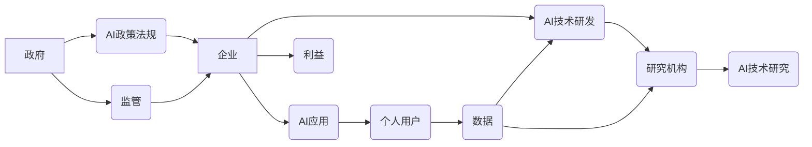

                 

## 平衡AI发展中的利益相关者权力

> 关键词：人工智能、利益相关者、权力平衡、伦理、可持续发展、监管、透明度、公平性

## 1. 背景介绍

人工智能（AI）正以惊人的速度发展，其应用领域不断扩展，深刻地改变着我们的生活和工作方式。从医疗诊断到金融交易，从自动驾驶到个性化教育，AI技术的渗透正在触及生活的方方面面。然而，AI发展也引发了广泛的社会关注和伦理争议。

其中一个关键问题是AI发展中的利益相关者权力分配。AI技术的研发、应用和监管涉及到政府、企业、研究机构、个人用户等多方利益相关者。如何平衡这些利益相关者的权力，确保AI技术发展既能造福人类，又能避免潜在的风险和负面影响，是摆在我们面前的重大挑战。

## 2. 核心概念与联系

**2.1 利益相关者**

在AI发展中，利益相关者是指任何对AI技术及其发展和应用产生影响或受到影响的个体或群体。 

* **政府:** 负责制定AI相关政策法规，监管AI技术应用，维护社会公共利益。
* **企业:** 作为AI技术的研发和应用主体，企业追求利润最大化，推动AI技术创新和商业化。
* **研究机构:** 承担AI技术基础研究和应用探索的任务，为AI技术发展提供理论支撑和技术突破。
* **个人用户:**  作为AI技术的最终使用者，个人用户享有使用AI技术的权利，但也可能受到AI技术带来的潜在风险和负面影响。

**2.2 权力**

在AI发展中，权力是指影响AI技术发展方向、应用场景和最终结果的能力。 

* **决策权:**  制定AI技术发展战略、应用政策和监管规则的权力。
* **资源控制权:**  掌握AI技术研发、应用和推广所需的资金、人才、数据等资源的权力。
* **技术掌控权:**  掌握AI技术核心算法、模型和平台的研发和控制权。
* **信息获取权:**  获取AI技术相关信息、数据和研究成果的权力。

**2.3 权力平衡**

在AI发展中，权力平衡是指不同利益相关者之间权力关系的协调和平衡，确保AI技术发展符合社会公共利益，避免任何一方过度集中权力，导致不公平、不透明和不可控的局面。

**2.4  利益相关者权力关系图**



## 3. 核心算法原理 & 具体操作步骤

**3.1 算法原理概述**

为了实现AI发展中的利益相关者权力平衡，需要采用一系列算法和机制，例如：

* **透明度算法:**  使AI算法决策过程更加透明可解释，方便公众和利益相关者理解和监督。
* **公平性算法:**  确保AI算法在数据处理和决策过程中不产生歧视和偏见，公平对待所有用户。
* **可控性算法:**  赋予人类对AI算法的控制权，避免AI算法自主决策导致的不可控风险。

**3.2 算法步骤详解**

具体操作步骤可以参考以下流程：

1. **数据收集和预处理:**  收集来自不同利益相关者的数据，并进行清洗、标准化和格式转换，确保数据质量和一致性。
2. **算法模型构建:**  根据不同的权力平衡目标，选择合适的算法模型，例如透明度算法、公平性算法、可控性算法等。
3. **模型训练和评估:**  利用收集到的数据对算法模型进行训练，并评估模型的性能和效果，确保模型能够有效地实现权力平衡目标。
4. **部署和监控:**  将训练好的算法模型部署到实际应用场景中，并持续监控模型的运行情况，及时进行调整和优化。

**3.3 算法优缺点**

* **透明度算法:**  优点是能够提高公众对AI决策的信任，缺点是可能泄露敏感信息，降低算法的安全性。
* **公平性算法:**  优点是能够避免AI算法产生歧视和偏见，缺点是可能过于强调公平性，导致算法效率降低。
* **可控性算法:**  优点是能够赋予人类对AI算法的控制权，缺点是可能降低算法的自主性和灵活性。

**3.4 算法应用领域**

* **AI监管:**  用于评估和监管AI技术的风险和潜在影响，确保AI技术应用符合社会规范和伦理标准。
* **AI决策支持:**  用于辅助政府和企业在制定AI相关政策和决策时，考虑不同利益相关者的需求和利益。
* **AI伦理审查:**  用于审查AI技术的研发和应用，确保其符合伦理原则和社会价值观。

## 4. 数学模型和公式 & 详细讲解 & 举例说明

**4.1 数学模型构建**

为了量化AI发展中的利益相关者权力，可以构建一个多变量数学模型，其中每个变量代表一个利益相关者的权力维度，例如决策权、资源控制权、技术掌控权等。

**4.2 公式推导过程**

可以利用多元线性回归模型或其他机器学习算法，根据历史数据和专家评估，推导出一个反映不同利益相关者权力关系的数学公式。

**4.3 案例分析与讲解**

例如，可以分析某个特定领域的AI技术发展，例如自动驾驶，并根据政府、企业、研究机构和个人用户的权力分布情况，构建一个数学模型，预测该领域AI技术的未来发展趋势。

## 5. 项目实践：代码实例和详细解释说明

**5.1 开发环境搭建**

可以使用Python语言和相关的机器学习库，例如Scikit-learn，搭建AI发展权力平衡分析的开发环境。

**5.2 源代码详细实现**

```python
# 导入必要的库
import pandas as pd
from sklearn.linear_model import LinearRegression

# 加载数据
data = pd.read_csv("ai_power_data.csv")

# 选择特征变量和目标变量
features = ["决策权", "资源控制权", "技术掌控权"]
target = "AI发展趋势"

# 训练线性回归模型
model = LinearRegression()
model.fit(data[features], data[target])

# 预测AI发展趋势
new_data = pd.DataFrame({"决策权": [0.8], "资源控制权": [0.6], "技术掌控权": [0.4]})
prediction = model.predict(new_data)

# 打印预测结果
print(prediction)
```

**5.3 代码解读与分析**

这段代码首先加载了AI发展权力数据，然后选择特征变量和目标变量，训练了一个线性回归模型。最后，利用训练好的模型预测了某个特定场景下AI发展趋势。

**5.4 运行结果展示**

运行结果将显示预测的AI发展趋势数值，可以根据数值判断不同利益相关者权力分配情况对AI发展的影响。

## 6. 实际应用场景

**6.1 政府监管**

政府可以使用AI发展权力平衡分析工具，评估不同AI技术的风险和潜在影响，制定相应的监管政策和措施。

**6.2 企业决策**

企业可以利用AI发展权力平衡分析，了解不同利益相关者的需求和利益，制定更合理的AI技术应用策略。

**6.3 研究机构探索**

研究机构可以利用AI发展权力平衡分析，探索不同权力分配模式下AI技术的潜在应用场景和社会影响。

**6.4 未来应用展望**

随着AI技术的不断发展，AI发展权力平衡分析工具将发挥越来越重要的作用，帮助我们更好地理解和应对AI带来的挑战和机遇。

## 7. 工具和资源推荐

**7.1 学习资源推荐**

* **书籍:**《人工智能伦理》
* **在线课程:** Coursera上的“AI伦理”课程

**7.2 开发工具推荐**

* **Python:**  Python语言和相关的机器学习库，例如Scikit-learn。
* **数据可视化工具:**  Tableau、Power BI等。

**7.3 相关论文推荐**

* **论文:**  "AI伦理与社会责任"

## 8. 总结：未来发展趋势与挑战

**8.1 研究成果总结**

AI发展权力平衡分析是一个新兴的研究领域，已经取得了一些初步成果，例如构建了AI发展权力平衡数学模型，开发了相应的分析工具。

**8.2 未来发展趋势**

未来，AI发展权力平衡分析将朝着以下方向发展：

* **更加精准的权力评估:**  利用更先进的算法和数据分析技术，更加精准地评估不同利益相关者的权力分布情况。
* **更全面的权力维度:**  扩展权力维度，包括社会影响、环境影响等，更加全面地考虑AI技术的社会影响。
* **更有效的权力平衡机制:**  探索更有效的权力平衡机制，例如利益共享机制、透明度机制、可控性机制等。

**8.3 面临的挑战**

AI发展权力平衡分析也面临一些挑战：

* **数据获取和质量:**  获取高质量的AI发展权力数据是一个难题。
* **算法复杂度:**  构建能够准确评估权力关系的算法具有挑战性。
* **伦理规范:**  制定AI发展权力平衡的伦理规范是一个复杂的问题。

**8.4 研究展望**

未来，需要加强跨学科合作，整合人工智能、社会学、伦理学等领域的知识，推动AI发展权力平衡分析的研究和应用，为构建更加公平、可持续的AI发展环境做出贡献。

## 9. 附录：常见问题与解答

**9.1 如何衡量AI技术的权力？**

AI技术的权力可以从多个维度衡量，例如决策权、资源控制权、技术掌控权等。

**9.2 如何平衡不同利益相关者的权力？**

可以通过制定相应的政策法规、建立利益共享机制、提高透明度和可控性等方式，平衡不同利益相关者的权力。

**9.3 AI发展权力平衡对社会有什么影响？**

AI发展权力平衡能够促进AI技术的发展，避免其带来的潜在风险和负面影响，最终造福人类社会。


作者：禅与计算机程序设计艺术 / Zen and the Art of Computer Programming 
<end_of_turn>

