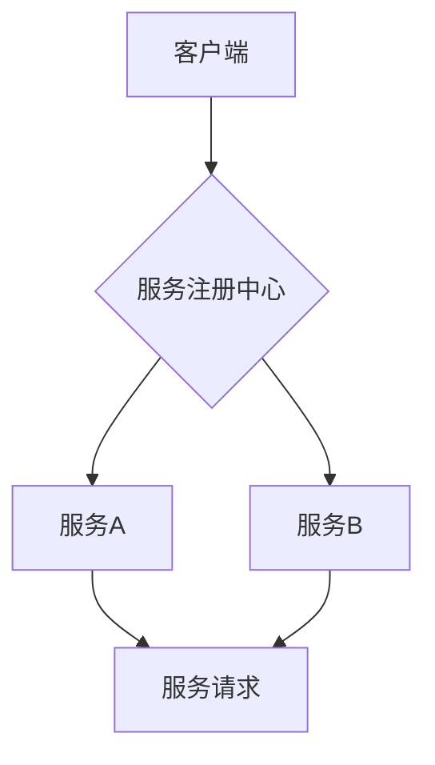

                 

## 微服务设计模式：服务发现和通信

> 关键词：微服务、服务发现、服务注册、服务通信、API网关、负载均衡、一致性哈希、Consul、Eureka、Kubernetes

## 1. 背景介绍

随着软件系统规模的不断扩大，传统的单体架构已难以满足现代应用的需求。微服务架构应运而生，它将大型应用程序拆分成一系列小型、独立的服务，每个服务专注于特定的业务功能。这种解耦的设计模式提高了系统的可维护性、可扩展性和容错性。然而，微服务架构也带来了新的挑战，其中服务发现和通信是至关重要的环节。

在微服务架构中，每个服务需要能够动态地发现其他服务，并建立可靠的通信通道。传统的单体架构中，服务之间通过直接的网络连接进行通信，而微服务架构中，服务通常部署在不同的物理机或容器上，因此需要一种机制来帮助服务发现彼此的位置和接口。

## 2. 核心概念与联系

### 2.1 服务发现

服务发现是指微服务架构中，一个服务能够动态地发现其他服务的位置和接口的过程。它是一个关键的组件，使微服务能够相互通信和协作。

### 2.2 服务注册

服务注册是指微服务将自身的信息（例如服务名称、地址、端口等）注册到一个中央的服务注册中心。服务注册中心维护着所有注册服务的最新信息，并提供查询服务位置和接口的机制。

### 2.3 服务通信

服务通信是指微服务之间通过网络进行数据交换的过程。微服务架构中常用的通信方式包括 RESTful API 和 gRPC。

**服务发现和通信的架构图**



## 3. 核心算法原理 & 具体操作步骤

### 3.1 算法原理概述

服务发现算法通常基于分布式哈希算法，例如一致性哈希算法。一致性哈希算法将服务名称映射到一个虚拟环上，每个服务在环上占据一个位置。当客户端需要查找某个服务时，它会根据服务名称计算出对应的哈希值，然后在虚拟环上找到该哈希值对应的服务。

### 3.2 算法步骤详解

1. **服务注册:** 当一个服务启动时，它会将自身的信息（例如服务名称、地址、端口等）注册到服务注册中心。
2. **服务发现:** 当客户端需要查找某个服务时，它会向服务注册中心发送查询请求，请求服务注册中心返回该服务的地址和端口。
3. **服务通信:** 客户端根据服务注册中心返回的信息，连接到目标服务并发送请求。

### 3.3 算法优缺点

**优点:**

* **动态发现:** 服务发现算法可以动态地发现服务的位置和接口，即使服务在运行时发生变化。
* **高可用性:** 服务发现算法可以提供高可用性，即使部分服务不可用，其他服务仍然可以正常运行。
* **扩展性:** 服务发现算法可以轻松扩展到支持大量服务。

**缺点:**

* **复杂性:** 服务发现算法的实现相对复杂，需要考虑网络故障、服务注册中心故障等多种情况。
* **性能:** 服务发现算法可能会带来一定的性能开销，因为客户端需要向服务注册中心发送查询请求。

### 3.4 算法应用领域

服务发现算法广泛应用于微服务架构、云计算、分布式系统等领域。

## 4. 数学模型和公式 & 详细讲解 & 举例说明

### 4.1 数学模型构建

一致性哈希算法的核心是将服务名称映射到一个虚拟环上，每个服务在环上占据一个位置。可以使用哈希函数将服务名称映射到一个整数范围内，然后将这些整数映射到虚拟环上。

### 4.2 公式推导过程

假设我们使用一个哈希函数 `h(key)` 将服务名称 `key` 映射到一个整数范围内 `[0, n)`，其中 `n` 是虚拟环的大小。我们可以将虚拟环表示为一个环形列表，每个元素代表一个服务。

当客户端需要查找某个服务时，它会计算出目标服务名称 `key` 的哈希值 `h(key)`。然后，它会找到虚拟环上 `h(key)` 对应的服务。

### 4.3 案例分析与讲解

假设我们有三个服务 A、B、C，它们的哈希值分别为 1、3、5。虚拟环的大小为 10。

我们可以将虚拟环表示为以下列表：

```
[0, 1, 2, 3, 4, 5, 6, 7, 8, 9]
```

服务 A、B、C 在虚拟环上的位置分别为：

* A: 1
* B: 3
* C: 5

当客户端需要查找服务 B 时，它会计算出服务 B 的哈希值 3，然后找到虚拟环上 3 对应的服务，即服务 B。

## 5. 项目实践：代码实例和详细解释说明

### 5.1 开发环境搭建

本示例使用 Java 语言和 Spring Boot 框架开发。

### 5.2 源代码详细实现

```java
// 服务注册中心
@Service
public class ServiceRegistry {

    private Map<String, ServiceInfo> services = new HashMap<>();

    public void registerService(ServiceInfo serviceInfo) {
        services.put(serviceInfo.getName(), serviceInfo);
    }

    public ServiceInfo getService(String serviceName) {
        return services.get(serviceName);
    }
}

// 服务信息
public class ServiceInfo {
    private String name;
    private String address;
    private int port;

    // 构造函数、getter 和 setter 方法
}

// 客户端
@Component
public class Client {

    @Autowired
    private ServiceRegistry serviceRegistry;

    public void callService(String serviceName) {
        ServiceInfo serviceInfo = serviceRegistry.getService(serviceName);
        if (serviceInfo != null) {
            // 调用服务
        } else {
            // 服务未注册
        }
    }
}
```

### 5.3 代码解读与分析

* `ServiceRegistry` 类负责管理服务注册信息。
* `ServiceInfo` 类定义了服务的信息结构。
* `Client` 类负责调用服务。

### 5.4 运行结果展示

当服务注册到服务注册中心后，客户端可以调用 `callService()` 方法查找并调用目标服务。

## 6. 实际应用场景

### 6.1 电子商务平台

在电子商务平台中，微服务架构可以将平台的功能拆分成多个独立的服务，例如商品服务、订单服务、支付服务等。服务发现和通信机制可以帮助这些服务之间进行高效的协作，实现平台的快速响应和高可用性。

### 6.2 社交媒体平台

社交媒体平台通常需要处理大量用户数据和实时消息。微服务架构可以将平台的功能拆分成多个独立的服务，例如用户服务、消息服务、内容服务等。服务发现和通信机制可以帮助这些服务之间进行高效的协作，实现平台的快速响应和高可用性。

### 6.3 金融服务平台

金融服务平台需要处理敏感的财务数据，并满足高可用性和安全性要求。微服务架构可以将平台的功能拆分成多个独立的服务，例如账户服务、交易服务、风险控制服务等。服务发现和通信机制可以帮助这些服务之间进行安全可靠的协作，实现平台的稳定运行和数据安全。

### 6.4 未来应用展望

随着微服务架构的不断发展，服务发现和通信机制将变得更加智能化和自动化。未来，我们可能会看到以下趋势：

* 基于机器学习的智能服务发现
* 基于容器编排的自动服务注册和发现
* 基于区块链技术的安全可靠的服务通信

## 7. 工具和资源推荐

### 7.1 学习资源推荐

* 微服务架构：https://microservices.io/
* Spring Cloud 服务发现和注册：https://spring.io/projects/spring-cloud

### 7.2 开发工具推荐

* Consul：https://www.consul.io/
* Eureka：https://github.com/Netflix/eureka
* Kubernetes：https://kubernetes.io/

### 7.3 相关论文推荐

* The Twelve-Factor App: https://www.12factor.net/
* Microservices Patterns: https://microservices.io/patterns/

## 8. 总结：未来发展趋势与挑战

### 8.1 研究成果总结

服务发现和通信是微服务架构的关键技术，它使得微服务能够动态地发现彼此的位置和接口，并进行高效的协作。一致性哈希算法是常用的服务发现算法，它可以提供高可用性和扩展性。

### 8.2 未来发展趋势

未来，服务发现和通信机制将变得更加智能化和自动化，例如基于机器学习的智能服务发现、基于容器编排的自动服务注册和发现、基于区块链技术的安全可靠的服务通信。

### 8.3 面临的挑战

* 服务发现和通信机制的复杂性
* 服务发现和通信机制的性能优化
* 服务发现和通信机制的安全性和可靠性

### 8.4 研究展望

未来研究方向包括：

* 开发更加高效、智能、安全的服务发现和通信机制
* 研究服务发现和通信机制在不同场景下的应用
* 探索服务发现和通信机制与其他微服务技术（例如容器编排、服务网格）的结合

## 9. 附录：常见问题与解答

### 9.1 如何选择合适的服务发现机制？

选择合适的服务发现机制取决于具体的应用场景和需求。例如，对于高可用性和扩展性要求较高的应用，可以使用一致性哈希算法。

### 9.2 如何解决服务发现机制的性能问题？

可以使用缓存、负载均衡等技术来优化服务发现机制的性能。

### 9.3 如何保证服务发现机制的安全性和可靠性？

可以使用身份验证、授权、加密等技术来保证服务发现机制的安全性和可靠性。


作者：禅与计算机程序设计艺术 / Zen and the Art of Computer Programming 
<end_of_turn>

