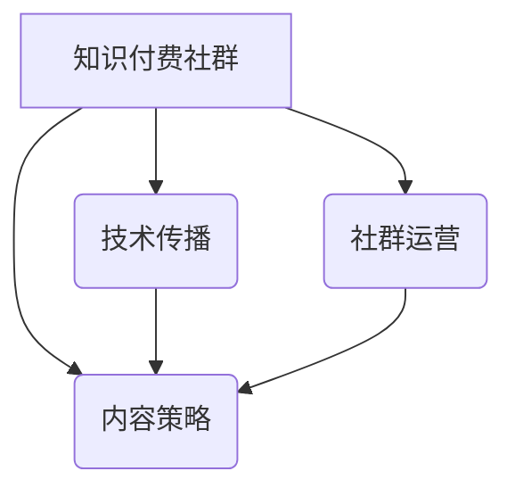

                 

## 打造技术型知识付费社群的内容策略

> 关键词：知识付费、技术社群、内容策略、技术传播、社区运营、在线教育

### 1. 背景介绍

近年来，随着互联网技术的发展和普及，知识付费模式逐渐成为一种新的商业模式，并在教育、培训、咨询等领域取得了显著的成功。技术型知识付费社群作为其中一个重要分支，以其专业性、实用性和互动性，吸引了越来越多的技术爱好者、开发者和企业用户。

技术型知识付费社群的兴起，是技术知识更新迭代迅速、信息爆炸的时代背景下，人们对专业技能提升和知识获取的需求不断增长的必然结果。同时，随着在线教育平台和社交媒体的蓬勃发展，技术型知识付费社群也找到了更便捷、更有效的传播和交流平台。

### 2. 核心概念与联系

**2.1 知识付费社群**

知识付费社群是指以提供专业技术知识和技能培训为核心，通过线上平台构建一个付费会员制社区，用户通过付费的方式获得知识、资源和服务，并与其他会员进行互动交流的组织形式。

**2.2 技术传播**

技术传播是指将技术知识、技能和经验从掌握者传递到需要者，使其能够理解、应用和创新。技术传播的方式多种多样，包括书籍、课程、博客、论坛、社群等。

**2.3 社群运营**

社群运营是指通过一系列的策略和活动，维护和发展社群的活跃度、粘性、规模和价值。社群运营的核心目标是构建一个充满活力、互助互动的社区，让用户获得价值，并愿意长期参与其中。

**2.4 内容策略**

内容策略是指围绕目标用户和社群目标，制定和执行内容创作、发布、推广和管理的整体计划。内容策略的核心是提供有价值、有吸引力、有针对性的内容，满足用户需求，并帮助社群实现目标。

**2.5  核心概念关系图**



### 3. 核心算法原理 & 具体操作步骤

**3.1 算法原理概述**

技术型知识付费社群的内容策略的核心算法，可以概括为“价值驱动、互动促进、持续迭代”的原则。

* **价值驱动:**  内容的价值是社群发展的基石。需要根据目标用户的需求和痛点，提供有价值、有实用性的技术知识和技能培训。
* **互动促进:** 社群的活跃度和粘性是用户参与度和付费意愿的关键。需要通过互动式课程、讨论区、直播等方式，促进用户之间的交流和互动。
* **持续迭代:**  技术领域发展迅速，知识更新迭代也很快。需要不断收集用户反馈，优化内容，并根据市场需求，开发新的课程和服务。

**3.2 算法步骤详解**

1. **目标用户分析:**  明确目标用户的技术水平、职业背景、学习需求和付费意愿。
2. **内容规划:**  根据目标用户分析结果，制定内容规划，确定课程主题、内容框架、学习路径等。
3. **内容创作:**  创作高质量、有价值的技术内容，包括视频课程、文章、代码示例、案例分析等。
4. **平台搭建:**  选择合适的线上平台，搭建社群网站或APP，提供用户注册、付费、学习、交流等功能。
5. **社群运营:**  通过活动策划、互动引导、用户管理等方式，维护和发展社群的活跃度和粘性。
6. **数据分析:**  收集用户行为数据，分析用户学习情况、反馈意见和付费意愿，不断优化内容和运营策略。

**3.3 算法优缺点**

* **优点:**  能够有效地满足技术用户对知识和技能提升的需求，并通过社群互动，促进用户之间的交流和学习。
* **缺点:**  需要投入大量的时间和精力进行内容创作和社群运营，同时还需要不断更新内容，才能保持用户兴趣和参与度。

**3.4 算法应用领域**

技术型知识付费社群的应用领域非常广泛，包括软件开发、数据科学、人工智能、网络安全、云计算等。

### 4. 数学模型和公式 & 详细讲解 & 举例说明

**4.1 数学模型构建**

我们可以用一个简单的数学模型来描述技术型知识付费社群的价值传递过程：

* **V = f(C, I, O)**

其中：

* **V** 代表社群的价值
* **C** 代表内容的质量和价值
* **I** 代表互动程度
* **O** 代表运营效率

**4.2 公式推导过程**

* **C** 的影响因素包括内容的专业性、实用性、趣味性和更新频率等。
* **I** 的影响因素包括用户参与度、互动频率、交流质量等。
* **O** 的影响因素包括平台的稳定性、功能的完善性、运营团队的专业性和服务质量等。

**4.3 案例分析与讲解**

例如，一个技术型知识付费社群提供高质量的编程课程 (C 高)，并通过在线论坛和直播等方式，促进用户之间的互动交流 (I 高)，同时运营团队提供专业的技术支持和服务 (O 高)，那么这个社群的价值 (V) 将会更高。

### 5. 项目实践：代码实例和详细解释说明

**5.1 开发环境搭建**

* 语言选择：Python
* 框架选择：Django
* 数据库选择：PostgreSQL
* 云平台选择：AWS

**5.2 源代码详细实现**

```python
# models.py
from django.db import models

class User(models.Model):
    username = models.CharField(max_length=255)
    email = models.EmailField()
    password = models.CharField(max_length=255)

class Course(models.Model):
    title = models.CharField(max_length=255)
    description = models.TextField()
    price = models.DecimalField(max_digits=10, decimal_places=2)

# views.py
from django.shortcuts import render
from .models import Course

def course_list(request):
    courses = Course.objects.all()
    return render(request, 'course_list.html', {'courses': courses})

# urls.py
from django.urls import path
from . import views

urlpatterns = [
    path('courses/', views.course_list, name='course_list'),
]
```

**5.3 代码解读与分析**

* models.py 文件定义了用户和课程的模型，用于存储用户和课程的信息。
* views.py 文件定义了课程列表页面的视图函数，用于渲染课程列表页面。
* urls.py 文件定义了 URL 路由，将 URL 请求映射到相应的视图函数。

**5.4 运行结果展示**

运行上述代码，可以创建一个简单的技术型知识付费社群网站，用户可以浏览课程列表，并进行付费购买。

### 6. 实际应用场景

技术型知识付费社群的实际应用场景非常广泛，例如：

* **在线编程课程:**  提供编程语言学习、软件开发技能培训等课程。
* **数据科学培训:**  提供数据分析、机器学习、深度学习等课程。
* **人工智能技术分享:**  分享人工智能技术、应用案例和研究成果。
* **网络安全知识普及:**  提供网络安全知识、技能培训和实战演练。
* **云计算技术培训:**  提供云计算平台、服务和应用开发培训。

**6.4 未来应用展望**

未来，技术型知识付费社群将更加注重个性化、互动性和沉浸式体验。例如：

* **个性化学习路径:**  根据用户的技术水平和学习目标，定制个性化的学习路径。
* **虚拟现实技术:**  利用虚拟现实技术，打造沉浸式的学习环境，提升用户学习体验。
* **人工智能辅助学习:**  利用人工智能技术，提供个性化的学习建议、知识问答和学习进度跟踪。

### 7. 工具和资源推荐

**7.1 学习资源推荐**

* **在线学习平台:**  Coursera, Udemy, edX, Udacity
* **技术博客:**  Hacker News, Medium, Dev.to
* **开源社区:**  GitHub, Stack Overflow

**7.2 开发工具推荐**

* **代码编辑器:**  VS Code, Sublime Text, Atom
* **版本控制系统:**  Git
* **云平台:**  AWS, Azure, Google Cloud

**7.3 相关论文推荐**

* **The Impact of Online Learning on Student Achievement**
* **The Future of Online Education**
* **Building a Successful Online Community**

### 8. 总结：未来发展趋势与挑战

**8.1 研究成果总结**

技术型知识付费社群的发展趋势是向个性化、互动性和沉浸式体验方向发展，同时需要不断关注用户需求，优化内容和运营策略。

**8.2 未来发展趋势**

* **人工智能技术应用:**  人工智能技术将被更加广泛地应用于技术型知识付费社群，例如个性化学习推荐、智能问答和虚拟导师等。
* **元宇宙技术融合:**  元宇宙技术将为技术型知识付费社群提供更加沉浸式的学习体验，例如虚拟实验室、虚拟会议和虚拟社交等。
* **跨界融合发展:**  技术型知识付费社群将与其他领域，例如游戏、娱乐、文化等领域融合发展，形成更加多元化的内容生态。

**8.3 面临的挑战**

* **内容质量保证:**  需要不断提升内容的质量和价值，才能满足用户对知识和技能提升的需求。
* **用户粘性提升:**  需要通过互动式课程、社区活动等方式，提升用户参与度和粘性。
* **商业模式创新:**  需要探索更加可持续的商业模式，例如会员制、订阅制、课程定制等。

**8.4 研究展望**

未来，技术型知识付费社群的研究方向将更加注重人工智能技术应用、元宇宙技术融合、跨界融合发展等方面，探索更加高效、便捷、个性化的技术知识传播模式。

### 9. 附录：常见问题与解答

**9.1 如何选择合适的技术型知识付费社群？**

* 考虑目标用户的技术水平和学习需求。
* 关注社群的内容质量、互动程度和运营效率。
* 阅读用户评价和反馈，了解社群的口碑和服务质量。

**9.2 如何提高技术型知识付费社群的参与度？**

* 定期举办线上线下活动，促进用户互动交流。
* 提供互动式课程和练习题，增强用户学习体验。
* 建立活跃的社区论坛，鼓励用户分享经验和提问。

**9.3 如何打造可持续的商业模式？**

* 探索会员制、订阅制、课程定制等多种商业模式。
* 提供优质的内容和服务，提升用户付费意愿。
* 建立良好的品牌形象和口碑，吸引更多用户加入。


作者：禅与计算机程序设计艺术 / Zen and the Art of Computer Programming 
<end_of_turn>

