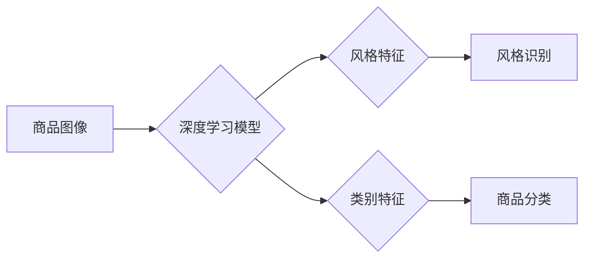

                 

## 深度学习驱动的商品图像风格识别与分类

> 关键词：深度学习、商品图像、风格识别、分类、卷积神经网络、迁移学习、图像特征提取

## 1. 背景介绍

随着电商平台的蓬勃发展，商品图像在电商交易中扮演着越来越重要的角色。高质量的商品图像能够有效地展示商品的特性，吸引消费者购买。然而，商品图像的风格多样，存在着多种不同的拍摄角度、光线条件和后期处理方式，这给商品图像的识别和分类带来了挑战。传统的图像识别方法难以有效地处理这种风格上的差异，因此，需要探索更先进的图像处理技术来解决这一问题。

深度学习作为一种强大的机器学习方法，在图像识别领域取得了显著的成果。其核心是利用多层神经网络来学习图像特征，能够有效地提取图像的语义信息，并对图像进行分类和识别。近年来，深度学习在商品图像风格识别与分类方面也取得了突破性进展，为电商平台提供了更精准、更智能的商品管理和推荐服务。

## 2. 核心概念与联系

### 2.1 商品图像风格识别

商品图像风格识别是指根据商品图像的视觉风格，将其归类到不同的风格类别。例如，可以将商品图像分为“简约风格”、“复古风格”、“时尚风格”等类别。风格识别能够帮助电商平台更好地理解商品的视觉特点，并根据用户的喜好进行商品推荐。

### 2.2 商品图像分类

商品图像分类是指根据商品图像的内容，将其归类到不同的商品类别。例如，可以将商品图像分为“服装”、“电子产品”、“家居用品”等类别。分类能够帮助电商平台更有效地组织和管理商品信息，并为用户提供更精准的搜索结果。

### 2.3 深度学习在风格识别与分类中的应用

深度学习能够有效地学习商品图像的风格和类别特征，并将其应用于风格识别和分类任务。其主要优势在于：

* **自动特征提取:** 深度学习模型能够自动从图像中提取特征，无需人工设计特征，提高了识别和分类的准确性。
* **鲁棒性强:** 深度学习模型对图像的噪声和变化具有较强的鲁棒性，能够更好地处理现实世界中的图像数据。
* **可扩展性强:** 深度学习模型可以轻松扩展到更大的数据集和更复杂的分类任务。

**核心概念与架构流程图:**



## 3. 核心算法原理 & 具体操作步骤

### 3.1 算法原理概述

深度学习在商品图像风格识别与分类中常用的算法主要包括卷积神经网络（CNN）和迁移学习。

* **卷积神经网络 (CNN):** CNN 是一种专门用于处理图像数据的深度学习模型。其结构由多个卷积层、池化层和全连接层组成。卷积层负责提取图像的局部特征，池化层负责降低特征图的维度，全连接层负责将提取的特征进行分类。

* **迁移学习:** 迁移学习是指将预训练好的模型参数应用于新的任务。由于预训练模型已经学习了大量的图像特征，因此迁移学习能够有效地提高新任务的识别和分类精度，并减少训练数据和训练时间。

### 3.2 算法步骤详解

**步骤 1: 数据准备**

收集并整理商品图像数据集，并将其分为训练集、验证集和测试集。

**步骤 2: 模型选择**

选择合适的深度学习模型，例如 ResNet、VGG、Inception 等。

**步骤 3: 模型预训练**

如果使用迁移学习，则需要将预训练好的模型参数加载到模型中。

**步骤 4: 模型训练**

使用训练集训练模型，并根据验证集的性能进行模型调优。

**步骤 5: 模型评估**

使用测试集评估模型的性能，并计算准确率、召回率、F1-score 等指标。

**步骤 6: 模型部署**

将训练好的模型部署到实际应用场景中，例如电商平台的商品推荐系统。

### 3.3 算法优缺点

**优点:**

* 高识别和分类精度
* 自动特征提取
* 鲁棒性强
* 可扩展性强

**缺点:**

* 需要大量的训练数据
* 训练时间较长
* 模型参数复杂

### 3.4 算法应用领域

* **电商平台:** 商品推荐、商品分类、风格识别
* **图像搜索引擎:** 图像检索、图像分类
* **视觉识别系统:** 物体识别、场景识别
* **艺术品鉴赏:** 风格识别、艺术品分类

## 4. 数学模型和公式 & 详细讲解 & 举例说明

### 4.1 数学模型构建

深度学习模型的数学模型主要基于神经网络的结构和激活函数。

* **神经网络结构:** 神经网络由多个层组成，每层包含多个神经元。神经元之间通过权重连接，并使用激活函数进行非线性变换。

* **激活函数:** 激活函数用于引入非线性，使神经网络能够学习更复杂的特征。常用的激活函数包括 sigmoid 函数、ReLU 函数、tanh 函数等。

### 4.2 公式推导过程

深度学习模型的训练过程基于梯度下降算法。梯度下降算法的目标是找到模型参数，使得模型的损失函数最小化。

* **损失函数:** 损失函数用于衡量模型预测结果与真实结果之间的差异。常用的损失函数包括均方误差 (MSE)、交叉熵损失 (Cross-Entropy Loss) 等。

* **梯度下降:** 梯度下降算法通过计算损失函数的梯度，更新模型参数，逐步逼近损失函数的最小值。

### 4.3 案例分析与讲解

**举例说明:**

假设我们使用 CNN 模型进行商品图像分类，目标是将商品图像分为“服装”、“电子产品”和“家居用品”三类。

* **输入:** 商品图像

* **输出:** 三类商品的概率分布

* **损失函数:** 交叉熵损失

* **梯度下降:** 使用 Adam 优化器进行梯度下降

通过训练，模型会学习到商品图像的特征，并能够将图像分类到相应的类别。

## 5. 项目实践：代码实例和详细解释说明

### 5.1 开发环境搭建

* **操作系统:** Ubuntu 18.04

* **深度学习框架:** TensorFlow 2.0

* **编程语言:** Python 3.7

* **硬件环境:** GPU (NVIDIA GeForce GTX 1080 Ti)

### 5.2 源代码详细实现

```python
import tensorflow as tf

# 定义 CNN 模型
model = tf.keras.models.Sequential([
    tf.keras.layers.Conv2D(32, (3, 3), activation='relu', input_shape=(224, 224, 3)),
    tf.keras.layers.MaxPooling2D((2, 2)),
    tf.keras.layers.Conv2D(64, (3, 3), activation='relu'),
    tf.keras.layers.MaxPooling2D((2, 2)),
    tf.keras.layers.Flatten(),
    tf.keras.layers.Dense(128, activation='relu'),
    tf.keras.layers.Dense(3, activation='softmax')
])

# 编译模型
model.compile(optimizer='adam',
              loss='sparse_categorical_crossentropy',
              metrics=['accuracy'])

# 训练模型
model.fit(x_train, y_train, epochs=10, batch_size=32)

# 评估模型
loss, accuracy = model.evaluate(x_test, y_test)
print('Test Loss:', loss)
print('Test Accuracy:', accuracy)
```

### 5.3 代码解读与分析

* **模型定义:** 代码定义了一个简单的 CNN 模型，包含卷积层、池化层、全连接层和 softmax 层。

* **模型编译:** 使用 Adam 优化器、交叉熵损失函数和准确率作为评估指标编译模型。

* **模型训练:** 使用训练数据训练模型，设置训练轮数和批处理大小。

* **模型评估:** 使用测试数据评估模型的性能，并打印测试损失和准确率。

### 5.4 运行结果展示

训练完成后，可以将模型应用于新的商品图像进行分类。

## 6. 实际应用场景

### 6.1 商品推荐

根据商品图像的风格和类别特征，推荐与用户喜好相符的商品。

### 6.2 商品分类

自动将商品图像分类到相应的类别，方便用户搜索和浏览。

### 6.3 风格化商品展示

根据用户的喜好，对商品图像进行风格化处理，提升商品的视觉吸引力。

### 6.4 未来应用展望

* **个性化商品推荐:** 基于用户的画像和偏好，提供更精准的商品推荐。
* **虚拟试衣间:** 利用深度学习技术，实现虚拟试衣间功能，帮助用户在线试穿衣服。
* **商品风格迁移:** 将商品图像迁移到不同的风格，满足用户的个性化需求。

## 7. 工具和资源推荐

### 7.1 学习资源推荐

* **书籍:**

    * 深度学习 (Deep Learning) - Ian Goodfellow, Yoshua Bengio, Aaron Courville
    * 深度学习实战 (Deep Learning with Python) - Francois Chollet

* **在线课程:**

    * Coursera: Deep Learning Specialization
    * Udacity: Deep Learning Nanodegree

### 7.2 开发工具推荐

* **深度学习框架:** TensorFlow, PyTorch, Keras
* **图像处理库:** OpenCV, Pillow
* **数据可视化工具:** Matplotlib, Seaborn

### 7.3 相关论文推荐

* **AlexNet: ImageNet Classification with Deep Convolutional Neural Networks** - Alex Krizhevsky, Ilya Sutskever, Geoffrey E. Hinton
* **VGGNet: Very Deep Convolutional Networks for Large-Scale Image Recognition** - Karen Simonyan, Andrew Zisserman
* **ResNet: Deep Residual Learning for Image Recognition** - Kaiming He, Xiangyu Zhang, Shaoqing Ren, Jian Sun

## 8. 总结：未来发展趋势与挑战

### 8.1 研究成果总结

深度学习在商品图像风格识别与分类方面取得了显著的成果，能够有效地提取图像特征，并实现高精度识别和分类。

### 8.2 未来发展趋势

* **更深更广的网络结构:** 研究更深层次、更复杂的网络结构，提高模型的识别和分类能力。
* **自监督学习:** 利用无标签数据进行自监督学习，降低对标注数据的依赖。
* **跨模态学习:** 将图像与其他模态数据（如文本、音频）进行融合，提高模型的理解能力。

### 8.3 面临的挑战

* **数据标注:** 商品图像数据标注成本高，难以获取高质量的标注数据。
* **模型解释性:** 深度学习模型的决策过程难以解释，缺乏透明度。
* **模型鲁棒性:** 深度学习模型对噪声和变化敏感，需要提高模型的鲁棒性。

### 8.4 研究展望

未来，将继续探索更先进的深度学习算法和技术，提高商品图像风格识别与分类的精度和效率，为电商平台提供更智能化的商品管理和推荐服务。

## 9. 附录：常见问题与解答

**问题 1: 如何选择合适的深度学习模型？**

**解答:** 选择合适的深度学习模型需要根据具体任务和数据集的特点进行选择。例如，对于图像分类任务，ResNet、VGG、Inception 等模型效果较好。

**问题 2: 如何处理数据标注问题？**

**解答:** 可以采用数据增强技术，例如旋转、翻转、裁剪等，增加训练数据的数量和多样性。也可以利用迁移学习，将预训练好的模型参数应用于新的任务，降低对标注数据的依赖。

**问题 3: 如何提高模型的鲁棒性？**

**解答:** 可以采用数据预处理、正则化、对抗训练等技术，提高模型对噪声和变化的鲁棒性。


作者：禅与计算机程序设计艺术 / Zen and the Art of Computer Programming 
<end_of_turn>

