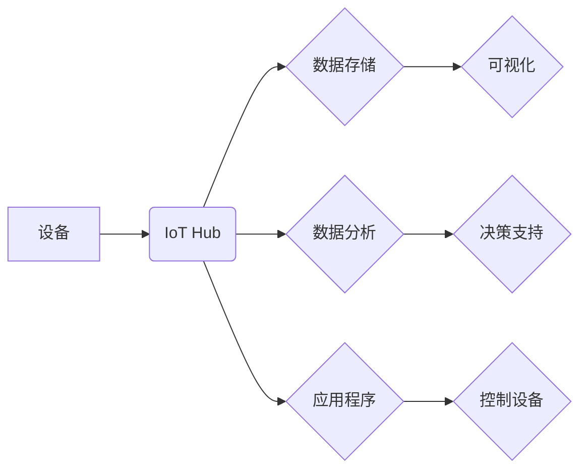

                 

## 物联网平台：AWS IoT 和 Azure IoT Hub

> 关键词：物联网平台，AWS IoT，Azure IoT Hub，云计算，数据分析，设备管理，安全

## 1. 背景介绍

物联网（IoT）正以惊人的速度发展，连接着越来越多的设备，从智能家居到工业自动化，再到城市基础设施。这些设备产生的海量数据为我们提供了宝贵的洞察力和机遇，但也带来了新的挑战，例如数据安全、设备管理和平台架构。为了有效地管理和利用物联网数据，需要强大的物联网平台来提供基础设施、服务和工具。

AWS IoT 和 Azure IoT Hub 是两家云计算巨头提供的领先物联网平台，它们为开发人员和企业提供了构建、部署和管理物联网解决方案的强大工具。本文将深入探讨这两个平台的核心概念、架构、算法原理、数学模型、项目实践以及实际应用场景，帮助读者更好地理解物联网平台的运作机制和应用价值。

## 2. 核心概念与联系

### 2.1 物联网平台概述

物联网平台是一个用于管理和控制物联网设备的软件系统，它通常包含以下核心功能：

* **设备注册和管理:**  允许用户注册和管理物联网设备，包括设备身份验证、权限控制和设备状态监控。
* **消息传递和数据传输:** 提供可靠、安全的设备间通信和数据传输机制，支持多种协议和数据格式。
* **数据存储和分析:**  收集、存储和分析物联网设备产生的数据，为用户提供数据可视化、洞察和决策支持。
* **应用程序开发和集成:** 提供开发工具和API，方便用户构建物联网应用程序并与其他系统集成。
* **安全和隐私保护:**  提供安全机制，保护物联网设备和数据免受攻击和泄露，并确保用户隐私。

### 2.2 AWS IoT 和 Azure IoT Hub 的架构比较

**AWS IoT** 和 **Azure IoT Hub** 都是基于云计算的物联网平台，它们都提供类似的核心功能，但架构和具体实现略有不同。

**AWS IoT** 的架构主要包括以下组件：

* **AWS IoT Core:**  核心服务，负责设备注册、身份验证、消息传递和数据路由。
* **AWS IoT Rules Engine:**  用于定义规则，根据设备数据触发事件或执行操作。
* **AWS IoT Analytics:**  用于收集、存储和分析物联网数据。
* **AWS Lambda:**  用于运行无服务器代码，处理物联网事件和数据。

**Azure IoT Hub** 的架构主要包括以下组件：

* **IoT Hub:**  核心服务，负责设备注册、身份验证、消息传递和数据路由。
* **Azure IoT Edge:**  用于将云端智能部署到边缘设备，处理数据并执行本地逻辑。
* **Azure Stream Analytics:**  用于实时分析物联网数据流。
* **Azure Functions:**  用于运行无服务器代码，处理物联网事件和数据。

**Mermaid 流程图:**



## 3. 核心算法原理 & 具体操作步骤

### 3.1 算法原理概述

物联网平台的核心算法主要涉及设备身份验证、消息传递、数据路由和安全机制。

* **设备身份验证:**  通常使用公钥加密技术，例如 X.509 证书或 MQTT TLS，确保设备身份的唯一性和安全性。
* **消息传递:**  使用可靠的消息传递协议，例如 MQTT 或 AMQP，确保消息的传递性和安全性。
* **数据路由:**  根据设备类型、数据主题或其他规则，将数据路由到相应的存储、分析或应用程序。
* **安全机制:**  使用加密、身份验证和访问控制等机制，保护物联网设备和数据免受攻击和泄露。

### 3.2 算法步骤详解

**设备身份验证:**

1. 设备生成一对公钥和私钥。
2. 设备使用公钥申请证书或进行身份验证。
3. 平台验证设备证书或身份信息，并分配唯一的设备标识符。

**消息传递:**

1. 设备发布消息到物联网平台。
2. 平台接收消息并进行身份验证和路由。
3. 平台将消息转发到相应的订阅者或应用程序。

**数据路由:**

1. 平台根据设备类型、数据主题或其他规则，将数据路由到相应的存储、分析或应用程序。
2. 平台可以使用规则引擎或其他机制，动态调整数据路由策略。

**安全机制:**

1. 平台使用加密技术，保护设备和数据传输的安全性。
2. 平台使用身份验证和访问控制机制，确保只有授权的用户或设备可以访问数据。

### 3.3 算法优缺点

**优点:**

* **安全性:**  使用公钥加密和身份验证机制，确保设备和数据的安全性。
* **可靠性:**  使用可靠的消息传递协议，确保消息的传递性和安全性。
* **可扩展性:**  基于云计算架构，可以轻松扩展以支持大量设备和数据。
* **灵活性:**  提供丰富的API和工具，方便用户构建定制的物联网解决方案。

**缺点:**

* **复杂性:**  物联网平台的架构和算法相对复杂，需要专业的技术人员进行开发和维护。
* **成本:**  使用云计算平台需要支付一定的费用，成本可能会随着设备数量和数据量增加而增加。
* **网络依赖:**  物联网平台依赖于网络连接，网络中断可能会影响设备的正常运行。

### 3.4 算法应用领域

物联网平台的算法应用领域非常广泛，包括：

* **智能家居:**  控制家电、照明、安全系统等设备。
* **工业自动化:**  监控和控制生产设备，提高生产效率和安全性。
* **城市管理:**  监控交通、环境、公共安全等方面的数据，提高城市管理效率。
* **医疗保健:**  远程医疗、患者监测、药物管理等。
* **农业:**  智能农业、作物监测、灌溉管理等。

## 4. 数学模型和公式 & 详细讲解 & 举例说明

### 4.1 数学模型构建

物联网平台的算法设计和优化通常涉及到数学模型的构建。例如，设备身份验证可以使用概率论和密码学中的数学模型，消息传递可以使用网络流算法和概率论模型，数据路由可以使用图论和算法模型。

### 4.2 公式推导过程

以下是一个简单的例子，展示了如何使用数学模型来优化物联网平台的消息传递效率。

假设一个物联网平台有 N 个设备，每个设备每秒钟发送 M 条消息。平台需要将这些消息路由到相应的应用程序。

我们可以使用以下公式来计算平台的平均消息处理时间：

```latex
T = \frac{N \times M}{R}
```

其中：

* T 是平台的平均消息处理时间
* N 是设备数量
* M 是每个设备每秒钟发送的消息数量
* R 是平台的消息处理速率

为了优化消息处理效率，我们可以通过以下方式降低 T 的值：

* 增加平台的消息处理速率 R
* 减少每个设备每秒钟发送的消息数量 M
* 减少设备数量 N

### 4.3 案例分析与讲解

例如，如果一个物联网平台有 1000 个设备，每个设备每秒钟发送 10 条消息，平台的消息处理速率为 10000 条/秒，那么平均消息处理时间为：

```latex
T = \frac{1000 \times 10}{10000} = 1 秒
```

如果我们增加平台的消息处理速率到 20000 条/秒，那么平均消息处理时间将减半，为 0.5 秒。

## 5. 项目实践：代码实例和详细解释说明

### 5.1 开发环境搭建

为了演示 AWS IoT 和 Azure IoT Hub 的使用，我们可以使用以下开发环境：

* **AWS:**  AWS Free Tier 账户，包含基本的 AWS IoT Core 服务。
* **Azure:**  Azure Free Trial 账户，包含基本的 Azure IoT Hub 服务。

### 5.2 源代码详细实现

以下是一个使用 Python 的简单代码示例，演示如何连接到 AWS IoT Core 并发布消息：

```python
import boto3

# 创建 AWS IoT Core 客户端
client = boto3.client('iot')

# 设备名称
device_name = 'my-device'

# 主题
topic = 'my-topic'

# 消息内容
message = 'Hello from my device!'

# 发布消息
response = client.publish(
    topic=topic,
    payload=message
)

# 打印响应信息
print(response)
```

### 5.3 代码解读与分析

这段代码首先创建了一个 AWS IoT Core 客户端，然后使用设备名称、主题和消息内容发布消息到指定的主题。

* `boto3` 是 AWS 的 Python SDK，用于与 AWS 服务进行交互。
* `client = boto3.client('iot')` 创建了一个 AWS IoT Core 客户端对象。
* `device_name` 是设备的名称，需要在 AWS IoT Core 中注册设备并获取设备名称。
* `topic` 是消息的主题，用于区分不同类型的消息。
* `message` 是要发布的消息内容。
* `client.publish()` 方法用于发布消息到指定的主题。

### 5.4 运行结果展示

运行这段代码后，消息将被发送到 AWS IoT Core 的主题，并可以被订阅者接收。

## 6. 实际应用场景

### 6.1 智能家居

物联网平台可以用于构建智能家居系统，控制家电、照明、安全系统等设备。例如，用户可以通过手机应用程序远程控制家中的空调、电视、灯光等设备，还可以设置定时开关机、场景模式等功能。

### 6.2 工业自动化

物联网平台可以用于构建工业自动化系统，监控和控制生产设备，提高生产效率和安全性。例如，工厂可以利用物联网平台监控设备运行状态、温度、压力等参数，并根据这些数据进行预警和故障诊断。

### 6.3 城市管理

物联网平台可以用于构建城市管理系统，监控交通、环境、公共安全等方面的数据，提高城市管理效率。例如，城市可以利用物联网平台监控交通流量、空气质量、噪音污染等数据，并根据这些数据进行优化和决策。

### 6.4 未来应用展望

物联网平台的应用场景还在不断扩展，未来将会有更多创新应用出现。例如，物联网平台可以用于医疗保健、农业、教育等领域，为人们的生活带来更多便利和价值。

## 7. 工具和资源推荐

### 7.1 学习资源推荐

* **AWS IoT 官方文档:** https://docs.aws.amazon.com/iot/latest/developerguide/
* **Azure IoT Hub 官方文档:** https://docs.microsoft.com/en-us/azure/iot-hub/
* **物联网平台开源项目:**  https://github.com/topics/iot-platform

### 7.2 开发工具推荐

* **AWS IoT Core SDK:** https://aws.amazon.com/iot/developer-tools/
* **Azure IoT SDK:** https://azure.microsoft.com/en-us/services/iot-hub/develop/
* **Eclipse Paho MQTT Client:** https://eclipse.org/paho/

### 7.3 相关论文推荐

* **The Internet of Things: A Survey**
* **Security and Privacy in the Internet of Things**
* **Cloud Computing for the Internet of Things**

## 8. 总结：未来发展趋势与挑战

### 8.1 研究成果总结

物联网平台的发展取得了显著的成果，为物联网应用提供了强大的基础设施和工具。

### 8.2 未来发展趋势

未来物联网平台的发展趋势包括：

* **边缘计算:** 将计算和数据存储能力部署到边缘设备，降低网络延迟和带宽需求。
* **人工智能:** 将人工智能技术应用于物联网平台，实现智能数据分析、预测和决策。
* **区块链:** 利用区块链技术提高物联网平台的安全性、透明度和可信度。
* **5G 和物联网:** 5G 网络的部署将为物联网应用提供更高的带宽、更低的延迟和更强的连接能力。

### 8.3 面临的挑战

物联网平台的发展也面临着一些挑战，例如：

* **数据安全:** 物联网设备产生的数据量巨大，如何确保数据的安全性和隐私保护是一个重要的挑战。
* **设备互操作性:** 不同厂商的设备之间缺乏标准化，导致设备互操作性差。
* **平台可扩展性:** 物联网平台需要能够支持海量设备和数据，提高平台的可扩展性和可靠性。

### 8.4 研究展望

未来，物联网平台的研究将继续深入，探索新的技术和应用场景，为构建更加智能、安全和高效的物联网生态系统做出贡献。

## 9. 附录：常见问题与解答

**常见问题:**

* **如何选择合适的物联网平台？**

选择合适的物联网平台需要根据具体的应用场景、设备数量、数据量、安全需求等因素进行综合考虑。

* **如何确保物联网设备的安全？**

可以使用公钥加密、身份验证、访问控制等机制，确保物联网设备的安全。

* **如何处理物联网设备产生的海量数据？**

可以使用云计算平台、数据存储和分析工具，处理物联网设备产生的海量数据。

**解答:**

* 选择合适的物联网平台需要根据具体的应用场景、设备数量、数据量、安全需求等因素进行综合考虑。例如，对于小型企业，可以使用开源的物联网平台；对于大型企业，可以使用专业的云计算平台。
* 使用公钥加密、身份验证、访问控制等机制，确保物联网设备的安全。例如，可以使用 X.509 证书进行设备身份验证，使用 TLS 加密进行数据传输。
* 使用云计算平台、数据存储和分析工具，处理物联网设备产生的海量数据。例如，可以使用 AWS IoT Analytics、Azure Stream Analytics 等工具进行数据分析。


作者：禅与计算机程序设计艺术 / Zen and the Art of Computer Programming<end_of_turn>

