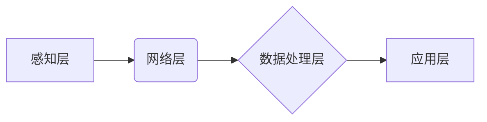

                 

## 物联网（IoT）入门：连接设备

> 关键词：物联网、IoT、传感器、网络协议、数据分析、云计算、安全、应用场景

### 1. 背景介绍

物联网（Internet of Things，IoT）正以惊人的速度改变着我们的世界。它指的是各种物理设备、车辆、家庭电器和其他物品嵌入传感器、软件、网络连接，从而能够收集和交换数据。这种互联互通的能力赋予了这些“智能”设备全新的功能，使其能够感知环境、相互协作，并与人类进行交互。

物联网的应用场景无处不在，从智能家居和可穿戴设备到工业自动化和城市管理，它正在推动着各行各业的数字化转型。随着物联网技术的不断发展，连接的设备数量将呈指数级增长，产生的数据量也将达到前所未有的规模。

### 2. 核心概念与联系

#### 2.1 物联网架构

物联网的架构通常由以下几个关键层组成：

* **感知层:** 包含各种传感器、执行器和采集设备，负责收集物理世界的各种数据，例如温度、湿度、位置、声音等。
* **网络层:** 连接感知层和应用层的网络基础设施，负责数据传输和通信。常见的网络协议包括 Wi-Fi、蓝牙、ZigBee、LoRa 等。
* **数据处理层:** 对感知层收集到的原始数据进行处理、分析和存储，提取有价值的信息。
* **应用层:** 提供各种基于物联网数据的应用服务，例如智能家居控制、远程监控、数据分析和决策支持等。

#### 2.2 物联网关键技术

物联网的实现依赖于多种关键技术，包括：

* **传感器技术:** 用于感知物理世界的各种数据。
* **网络通信技术:** 确保设备之间能够可靠地进行数据传输。
* **数据处理技术:** 对海量数据进行分析和挖掘。
* **云计算技术:** 提供数据存储、计算和应用服务。
* **人工智能技术:** 用于智能决策和行为预测。

#### 2.3 物联网流程图



### 3. 核心算法原理 & 具体操作步骤

#### 3.1 算法原理概述

物联网中常用的算法主要包括：

* **数据压缩算法:** 用于减少数据传输量，提高网络效率。
* **数据加密算法:** 用于保护数据安全，防止未授权访问。
* **路由算法:** 用于确定数据在网络中的传输路径。
* **机器学习算法:** 用于数据分析、模式识别和预测。

#### 3.2 算法步骤详解

以数据压缩算法为例，其基本步骤包括：

1. **数据分析:** 对待压缩的数据进行分析，识别重复模式和冗余信息。
2. **编码方案选择:** 根据数据特点选择合适的编码方案，例如 Huffman 编码、Lempel-Ziv 编码等。
3. **数据编码:** 使用选择的编码方案将数据转换为压缩格式。
4. **数据解压缩:** 在接收端使用相同的编码方案将压缩数据解压缩回原始格式。

#### 3.3 算法优缺点

不同的算法具有不同的优缺点，需要根据实际应用场景进行选择。例如，Huffman 编码适用于文本数据压缩，而 Lempel-Ziv 编码更适合图像和音频数据压缩。

#### 3.4 算法应用领域

数据压缩算法广泛应用于物联网数据传输、存储和处理中，例如：

* **传感器数据压缩:** 减少传感器数据传输量，降低网络带宽需求。
* **视频流压缩:** 提高视频流传输效率，降低存储空间需求。
* **图像数据压缩:** 减少图像文件大小，方便传输和存储。

### 4. 数学模型和公式 & 详细讲解 & 举例说明

#### 4.1 数学模型构建

数据压缩算法的数学模型通常基于信息论原理，例如熵的概念。熵可以用来度量数据的随机性，压缩算法的目标是降低数据的熵，从而减少数据量。

#### 4.2 公式推导过程

例如，Huffman 编码算法的构建过程涉及到构建哈夫曼树，并根据哈夫曼树的结构分配编码长度。哈夫曼树的构建过程可以利用概率分布函数进行推导，最终得到每个符号的编码长度。

#### 4.3 案例分析与讲解

假设我们有一个文本数据序列 "ABABABAB"，其每个字符出现的概率如下：

* A: 0.5
* B: 0.5

我们可以使用 Huffman 编码算法构建哈夫曼树，并得到以下编码结果：

* A: 0
* B: 1

因此，"ABABABAB" 的 Huffman 编码为 "01010101"，长度为 8 位，比原始数据长度 10 位减少了 2 位。

### 5. 项目实践：代码实例和详细解释说明

#### 5.1 开发环境搭建

为了实现物联网应用，需要搭建相应的开发环境，包括：

* **硬件平台:** 选择合适的传感器、微控制器或嵌入式设备。
* **软件平台:** 选择合适的编程语言、开发工具和操作系统。
* **网络环境:** 设置网络连接和通信协议。

#### 5.2 源代码详细实现

以 Python 语言为例，实现一个简单的温度传感器数据采集和传输的代码实例：

```python
import time
import Adafruit_DHT

# DHT11 温度传感器引脚
sensor = Adafruit_DHT.DHT11
pin = 4

while True:
    # 读取温度数据
    humidity, temperature = Adafruit_DHT.read_retry(sensor, pin)

    # 检查数据是否有效
    if humidity is not None and temperature is not None:
        print("温度: {:.1f}°C, 湿度: {:.1f}%".format(temperature, humidity))
    else:
        print("无法读取传感器数据")

    # 等待一段时间
    time.sleep(5)
```

#### 5.3 代码解读与分析

这段代码首先导入必要的库，然后指定温度传感器的类型和引脚。

然后，它进入一个无限循环，不断读取温度和湿度数据。

如果数据读取成功，则打印出温度和湿度值；否则，打印出错误信息。

最后，代码使用 `time.sleep()` 函数暂停 5 秒，然后重复读取数据。

#### 5.4 运行结果展示

运行这段代码后，程序会不断读取温度和湿度数据，并将其打印到控制台。

### 6. 实际应用场景

物联网技术在各个领域都有着广泛的应用场景，例如：

#### 6.1 智能家居

* 智能照明：根据时间、光线和用户需求自动控制灯光。
* 智能空调：根据室内温度和湿度自动调节空调温度。
* 智能安防：使用摄像头、传感器和报警系统实现家居安全监控。

#### 6.2 可穿戴设备

* 智能手表：监测心率、睡眠、运动等数据，并提供健康管理建议。
* 智能眼镜：提供增强现实功能，例如导航、翻译和信息展示。
* 智能手环：监测运动数据，并提供运动指导和激励。

#### 6.3 工业自动化

* 工厂监控：使用传感器监测设备运行状态，并进行故障诊断和预防维护。
* 生产线优化：使用数据分析技术优化生产流程，提高效率和降低成本。
* 物流管理：使用 RFID 技术跟踪货物位置，提高物流效率和透明度。

#### 6.4 城市管理

* 交通管理：使用传感器监测交通流量，优化交通信号灯控制，缓解交通拥堵。
* 环境监测：使用传感器监测空气质量、水质和噪音等环境指标，提高城市环境质量。
* 公共安全：使用摄像头和传感器监控公共场所安全，预防犯罪和事故发生。

#### 6.5 未来应用展望

物联网技术的未来发展潜力巨大，预计将在以下领域得到更广泛的应用：

* **医疗保健:** 使用传感器监测患者健康状况，提供远程医疗服务，提高医疗效率和质量。
* **农业:** 使用传感器监测土壤湿度、温度和作物生长状况，实现精准农业，提高农业产量和效益。
* **教育:** 使用物联网技术打造智慧教室，提供个性化学习体验，提高教育效率。
* **娱乐:** 使用物联网技术打造沉浸式娱乐体验，例如虚拟现实和增强现实游戏。

### 7. 工具和资源推荐

#### 7.1 学习资源推荐

* **书籍:**
    * 《物联网基础》
    * 《物联网应用开发》
    * 《物联网安全》
* **在线课程:**
    * Coursera 物联网课程
    * edX 物联网课程
    * Udemy 物联网课程

#### 7.2 开发工具推荐

* **Arduino IDE:** 用于开发基于 Arduino 平台的物联网应用。
* **Raspberry Pi:** 用于开发基于 Raspberry Pi 平台的物联网应用。
* **Node-RED:** 用于构建物联网应用的图形化编程工具。

#### 7.3 相关论文推荐

* **物联网安全研究论文:**
    * 《物联网安全挑战与应对策略》
    * 《物联网数据隐私保护技术研究》
* **物联网应用研究论文:**
    * 《物联网在智慧城市中的应用研究》
    * 《物联网在工业自动化中的应用研究》

### 8. 总结：未来发展趋势与挑战

#### 8.1 研究成果总结

物联网技术已经取得了显著的进展，在各个领域都有着广泛的应用。

#### 8.2 未来发展趋势

物联网技术未来将朝着以下几个方向发展：

* **边缘计算:** 将计算能力和数据存储能力部署到物联网设备的边缘，降低数据传输延迟和网络带宽需求。
* **人工智能:** 将人工智能技术应用于物联网，实现智能决策、行为预测和自动化控制。
* **区块链:** 使用区块链技术保障物联网数据的安全性和可追溯性。

#### 8.3 面临的挑战

物联网技术的发展也面临着一些挑战，例如：

* **数据安全:** 物联网设备产生的海量数据需要得到有效保护，防止数据泄露和恶意攻击。
* **隐私保护:** 物联网设备的收集和使用个人数据需要得到用户的明确同意，并采取相应的隐私保护措施。
* **标准化:** 物联网领域缺乏统一的标准，导致设备互联互通性差，应用开发难度大。

#### 8.4 研究展望

未来，物联网技术将继续发展和完善，为人类社会带来更多便利和福祉。

### 9. 附录：常见问题与解答

#### 9.1 什么是物联网？

物联网是指各种物理设备、车辆、家庭电器和其它物品嵌入传感器、软件、网络连接，从而能够收集和交换数据。

#### 9.2 物联网的应用场景有哪些？

物联网的应用场景非常广泛，例如智能家居、可穿戴设备、工业自动化、城市管理等。

#### 9.3 物联网技术有哪些？

物联网技术包括传感器技术、网络通信技术、数据处理技术、云计算技术、人工智能技术等。


作者：禅与计算机程序设计艺术 / Zen and the Art of Computer Programming 
<end_of_turn>

