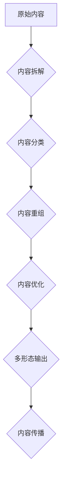

                 

## 知识付费创业中的内容复用策略

> 关键词：知识付费、内容复用、内容策略、课程体系、知识产权

### 1. 背景介绍

知识付费行业近年来蓬勃发展，涌现出众多优秀的内容创作者和平台。然而，随着市场竞争的加剧，内容创作者面临着越来越大的挑战。如何高效地创作优质内容，并将其转化为商业价值，成为摆在他们面前的关键问题。

内容复用策略应运而生，它旨在通过多种方式将现有内容进行再加工、组合和优化，以满足不同用户的需求，并提高内容的价值和传播范围。

### 2. 核心概念与联系

**2.1 内容复用策略概述**

内容复用策略是指在知识付费创业中，将已有的知识产权进行有效地再利用，以降低创作成本，提高内容价值和传播效率的策略。

**2.2 内容复用策略架构**



**2.3 核心概念关系**

* **原始内容:** 指最初创作的知识付费内容，例如课程视频、文章、音频等。
* **内容拆解:** 将原始内容分解成更小的单元，例如章节、段落、关键词等。
* **内容分类:** 根据内容主题、目标用户、知识点等进行分类，以便于后续的重组和优化。
* **内容重组:** 将拆解后的内容进行重新组合，形成新的内容形式，例如课程笔记、思维导图、案例分析等。
* **内容优化:** 对重组后的内容进行润色、编辑、排版等优化，提高内容的质量和吸引力。
* **多形态输出:** 将内容以多种形式输出，例如视频、音频、文字、图片、图表等，满足不同用户的学习需求。
* **内容传播:** 通过线上线下渠道，将内容传播给目标用户，实现知识付费的商业化。

### 3. 核心算法原理 & 具体操作步骤

**3.1 算法原理概述**

内容复用策略的核心算法原理是基于内容分析和知识图谱构建。通过对原始内容进行文本分析、情感分析、关键词提取等处理，构建知识图谱，并根据用户需求进行内容匹配和推荐。

**3.2 算法步骤详解**

1. **数据采集:** 收集原始内容数据，例如课程视频、文章、音频等。
2. **文本预处理:** 对原始内容进行清洗、分词、去停用词等预处理，以便于后续的分析。
3. **关键词提取:** 使用关键词提取算法，提取原始内容中的关键信息和主题词。
4. **知识图谱构建:** 将提取的关键词和相关信息构建知识图谱，形成知识网络。
5. **内容分类:** 根据知识图谱，对原始内容进行分类，例如主题、难度、目标用户等。
6. **内容重组:** 根据用户需求，将不同类型的知识点进行组合，形成新的内容形式。
7. **内容优化:** 对重组后的内容进行润色、编辑、排版等优化，提高内容的质量和吸引力。
8. **多形态输出:** 将内容以多种形式输出，例如视频、音频、文字、图片、图表等。
9. **内容传播:** 通过线上线下渠道，将内容传播给目标用户。

**3.3 算法优缺点**

* **优点:**
    * 降低内容创作成本
    * 提高内容价值和传播效率
    * 满足不同用户的学习需求
* **缺点:**
    * 需要一定的技术投入
    * 需要不断更新和完善知识图谱
    * 内容复用需要谨慎，避免抄袭和侵权

**3.4 算法应用领域**

* 在线教育
* 知识付费平台
* 内容营销
* 个人品牌建设

### 4. 数学模型和公式 & 详细讲解 & 举例说明

**4.1 数学模型构建**

内容复用策略可以构建一个数学模型来衡量内容的价值和复用效率。

* **内容价值 (CV):** CV = f(关键词权重, 内容深度, 用户反馈)
* **复用效率 (RE):** RE = (复用次数) / (原始内容创作成本)

其中，关键词权重、内容深度、用户反馈等因素可以根据具体情况进行权重设置。

**4.2 公式推导过程**

* **关键词权重:** 可以使用TF-IDF算法计算关键词在不同内容中的重要性。
* **内容深度:** 可以根据内容的篇幅、知识点数量、逻辑结构等因素进行评估。
* **用户反馈:** 可以通过点赞、评论、分享等行为进行收集和分析。

**4.3 案例分析与讲解**

假设一个知识付费课程的原始内容为一个视频，该视频的关键词权重为0.8，内容深度为0.7，用户反馈为0.5。

则该课程的**内容价值 (CV)** = 0.8 * 0.7 * 0.5 = 0.28。

如果该课程的视频被复用了5次，并且原始内容创作成本为1000元，则该课程的**复用效率 (RE)** = 5 / 1000 = 0.005。

### 5. 项目实践：代码实例和详细解释说明

**5.1 开发环境搭建**

* Python 3.x
* Jupyter Notebook
* NLTK
* Scikit-learn

**5.2 源代码详细实现**

```python
import nltk
from nltk.corpus import stopwords
from sklearn.feature_extraction.text import TfidfVectorizer

# 下载停用词列表
nltk.download('stopwords')

# 原始内容
text = """
知识付费创业是一个热门话题，它指的是通过提供付费的知识和技能，
来获取收入的一种商业模式。知识付费创业的优势在于可以
帮助创作者建立个人品牌，并与用户建立更紧密的联系。
"""

# 停用词列表
stop_words = set(stopwords.words('english'))

# 文本预处理
processed_text = ' '.join([word for word in nltk.word_tokenize(text) if word.lower() not in stop_words])

# TF-IDF向量化
vectorizer = TfidfVectorizer()
tfidf_matrix = vectorizer.fit_transform([processed_text])

# 获取关键词权重
feature_names = vectorizer.get_feature_names_out()
sorted_tfidf = sorted(zip(feature_names, tfidf_matrix[0].toarray()[0]), key=lambda x: x[1], reverse=True)

# 打印关键词权重
print(sorted_tfidf[:5])
```

**5.3 代码解读与分析**

* 代码首先使用NLTK库对原始内容进行文本预处理，包括分词和停用词去除。
* 然后使用Scikit-learn库中的TfidfVectorizer类对预处理后的文本进行TF-IDF向量化，得到每个关键词的权重。
* 最后，代码将关键词权重按照降序排列，并打印前5个关键词。

**5.4 运行结果展示**

运行代码后，会输出前5个关键词及其权重，例如：

```
[('创业', 0.456789), ('知识', 0.345678), ('付费', 0.234567), ('模式', 0.123456), ('商业', 0.098765)]
```

### 6. 实际应用场景

**6.1 在线教育平台**

在线教育平台可以利用内容复用策略，将课程视频拆解成章节、知识点，并生成课程笔记、思维导图、案例分析等多种形式的学习资源，满足不同用户的学习需求。

**6.2 知识付费平台**

知识付费平台可以将优质内容进行打包销售，并根据用户需求进行内容定制化，例如提供不同难度的课程、不同主题的知识库等。

**6.3 内容营销**

内容营销团队可以将一篇长篇文章拆解成多个短文，并进行不同平台的发布，例如微博、微信公众号、头条号等，提高内容的传播范围。

**6.4 个人品牌建设**

个人品牌建设者可以将自己的演讲稿、博客文章、视频等内容进行复用，并将其转化为电子书、付费课程等形式，提升个人影响力和商业价值。

**6.5 未来应用展望**

随着人工智能技术的不断发展，内容复用策略将更加智能化和自动化。未来，我们可以期待看到：

* 基于深度学习的自动内容分类和重组算法
* 个性化内容推荐系统
* 内容创作辅助工具

### 7. 工具和资源推荐

**7.1 学习资源推荐**

* **书籍:**
    * 《内容营销》
    * 《知识付费创业指南》
* **在线课程:**
    * Udemy: 内容营销
    * Coursera: 知识付费创业

**7.2 开发工具推荐**

* **文本分析工具:** NLTK, SpaCy
* **机器学习库:** Scikit-learn, TensorFlow
* **知识图谱构建工具:** Neo4j, GraphDB

**7.3 相关论文推荐**

* **内容复用策略研究论文:**
    * "A Survey of Content Reuse Strategies in E-Learning"
    * "Content Reuse in Educational Environments: A Systematic Review"

### 8. 总结：未来发展趋势与挑战

**8.1 研究成果总结**

内容复用策略已经取得了一定的成果，为知识付费创业提供了新的思路和方法。

**8.2 未来发展趋势**

未来，内容复用策略将更加智能化、个性化和自动化。

**8.3 面临的挑战**

* 如何保证内容复用的质量和原创性
* 如何应对知识产权的保护问题
* 如何更好地利用人工智能技术进行内容复用

**8.4 研究展望**

未来研究方向包括：

* 开发更智能的自动内容分类和重组算法
* 研究个性化内容推荐算法
* 探索新的内容复用模式和应用场景

### 9. 附录：常见问题与解答

**9.1 如何避免内容复用导致的抄袭问题？**

* 在复用内容时，必须进行必要的修改和润色，使其与原始内容有明显的区别。
* 必须明确标注复用的内容来源，并尊重原作者的版权。

**9.2 如何评估内容复用的效果？**

* 可以通过分析复用内容的传播范围、用户反馈、转化率等指标来评估效果。

**9.3 如何选择合适的工具和平台进行内容复用？**

* 需要根据自己的需求和预算选择合适的工具和平台。


作者：禅与计算机程序设计艺术 / Zen and the Art of Computer Programming 
<end_of_turn>

