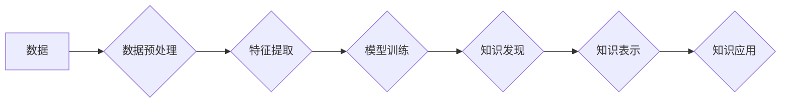

                 

## 知识发现引擎：赋能人类知识进化的加速器

> 关键词：知识发现、人工智能、机器学习、数据挖掘、知识图谱、深度学习、自然语言处理

### 1. 背景介绍

人类文明的进步离不开知识的积累和传播。从古至今，人类一直在探索如何更有效地发现、组织和利用知识。随着信息时代的到来，海量数据涌现，传统的知识发现方法显得力不从心。如何从海量数据中挖掘出有价值的知识，并将其转化为可利用的洞察力，成为当今科技领域的一项重要挑战。

知识发现引擎 (Knowledge Discovery Engine，KDE) 正是在这个背景下应运而生。KDE 是一种利用人工智能 (AI) 技术，从海量数据中自动发现、提取和解释有价值知识的系统。它可以帮助我们揭示数据背后的隐藏模式、趋势和关系，从而为决策提供更科学、更精准的依据。

### 2. 核心概念与联系

#### 2.1 知识发现

知识发现是指从数据中挖掘出有价值的、可解释的、可应用的知识的过程。它是一个跨学科的领域，涉及数据挖掘、机器学习、人工智能、数据库、统计学等多个领域。

#### 2.2 数据挖掘

数据挖掘是指从大型数据库中发现模式、趋势和关系的过程。它利用统计学、机器学习和数据库技术，从海量数据中提取有价值的信息。

#### 2.3 机器学习

机器学习是人工智能的一个分支，它使计算机能够从数据中学习，并根据学习到的知识进行预测或决策。机器学习算法可以分为监督学习、无监督学习和强化学习三大类。

#### 2.4 知识图谱

知识图谱是一种结构化的知识表示形式，它将实体和关系以图的形式表示。知识图谱可以帮助我们更好地理解和组织知识，并进行知识推理和查询。

**Mermaid 流程图**



### 3. 核心算法原理 & 具体操作步骤

#### 3.1 算法原理概述

知识发现引擎的核心算法通常基于机器学习和数据挖掘技术。常见的算法包括：

* **关联规则挖掘算法:** 用于发现数据中频繁出现的项集和关联关系，例如 Apriori 算法和 FP-Growth 算法。
* **分类算法:** 用于将数据分类到不同的类别，例如决策树算法、支持向量机算法和神经网络算法。
* **聚类算法:** 用于将数据划分为不同的群组，例如 k-means 算法和层次聚类算法。
* **异常检测算法:** 用于识别数据中的异常值，例如基于统计的异常检测算法和基于机器学习的异常检测算法。

#### 3.2 算法步骤详解

1. **数据收集和预处理:** 收集相关数据，并进行清洗、转换和格式化等预处理操作，以确保数据质量和算法的有效性。
2. **特征提取:** 从原始数据中提取有价值的特征，这些特征可以是数值型、类别型或文本型。特征提取可以利用领域知识、数据分析和机器学习算法等方法。
3. **模型训练:** 选择合适的机器学习算法，并利用训练数据对模型进行训练，使其能够学习数据中的模式和规律。
4. **知识发现:** 利用训练好的模型对新的数据进行预测或分类，并从中发现有价值的知识。
5. **知识表示:** 将发现的知识以可理解和可应用的形式表示，例如知识图谱、规则库或文本描述。
6. **知识应用:** 将表示的知识应用于实际场景，例如决策支持、问题解决、预测分析等。

#### 3.3 算法优缺点

不同的知识发现算法具有不同的优缺点，需要根据具体应用场景选择合适的算法。

* **关联规则挖掘算法:** 优点是能够发现数据中隐含的关联关系，缺点是容易产生冗余规则，并且对数据量要求较高。
* **分类算法:** 优点是能够将数据分类到不同的类别，缺点是需要大量的标注数据进行训练，并且对数据分布变化敏感。
* **聚类算法:** 优点是能够将数据划分为不同的群组，缺点是难以解释聚类结果，并且对初始参数的选择敏感。
* **异常检测算法:** 优点是能够识别数据中的异常值，缺点是难以确定异常值的阈值，并且对数据类型限制较多。

#### 3.4 算法应用领域

知识发现引擎的应用领域非常广泛，包括：

* **商业智能:** 分析客户行为、市场趋势和竞争对手信息，帮助企业做出更明智的决策。
* **医疗保健:** 发现疾病的潜在风险因素、预测患者的病情发展趋势，帮助医生制定更有效的治疗方案。
* **金融服务:** 识别欺诈交易、评估投资风险、预测市场波动，帮助金融机构提高风险管理和盈利能力。
* **科学研究:** 分析实验数据、发现新的科学规律、加速科研成果的转化。

### 4. 数学模型和公式 & 详细讲解 & 举例说明

#### 4.1 数学模型构建

知识发现引擎的数学模型通常基于概率论、统计学和机器学习算法。常见的数学模型包括：

* **贝叶斯网络:** 用于表示随机变量之间的概率关系，可以用于预测和推理。
* **决策树:** 用于将数据分类到不同的类别，可以解释决策过程。
* **支持向量机:** 用于分类和回归问题，可以处理高维数据。
* **神经网络:** 用于模拟生物神经网络，可以学习复杂的数据模式。

#### 4.2 公式推导过程

具体的数学公式推导过程取决于所使用的算法和模型。例如，决策树算法的构建过程涉及信息增益、基尼不纯度等概念，并利用这些概念来选择最优的特征分割点。

#### 4.3 案例分析与讲解

假设我们想要使用决策树算法对客户的购买行为进行分类，目标是预测客户是否会购买某个产品。我们可以收集客户的年龄、收入、购买历史等特征数据，并利用决策树算法构建一个预测模型。

决策树算法会根据特征数据的信息增益或基尼不纯度，选择最优的特征分割点，并将数据划分为不同的子集。重复这个过程，直到每个子集包含单一类别的数据。最终得到的决策树可以用来预测新的客户的购买行为。

### 5. 项目实践：代码实例和详细解释说明

#### 5.1 开发环境搭建

开发知识发现引擎需要准备以下开发环境：

* **操作系统:** Linux、Windows 或 macOS
* **编程语言:** Python、R 或 Java
* **机器学习库:** scikit-learn、TensorFlow 或 PyTorch
* **数据库:** MySQL、PostgreSQL 或 MongoDB

#### 5.2 源代码详细实现

以下是一个使用 Python 和 scikit-learn 库实现关联规则挖掘的简单代码示例：

```python
from mlxtend.frequent_patterns import apriori, association_rules

# 数据加载
transactions = [
    ['牛奶', '面包', '鸡蛋'],
    ['牛奶', '鸡蛋', '橙汁'],
    ['面包', '鸡蛋', '牛奶'],
    ['面包', '橙汁', '牛奶'],
    ['牛奶', '橙汁'],
]

# 关联规则挖掘
frequent_itemsets = apriori(transactions, min_support=0.5, use_colnames=True)
rules = association_rules(frequent_itemsets, metric="lift", min_threshold=1)

# 结果展示
print(rules)
```

#### 5.3 代码解读与分析

这段代码首先加载了交易数据，然后使用 `apriori` 函数进行关联规则挖掘，设置了最小支持度为 0.5。最后使用 `association_rules` 函数生成关联规则，并设置了最小提升度为 1。

#### 5.4 运行结果展示

运行这段代码会输出一系列关联规则，例如：

```
   antecedents  consequents  support  confidence  lift  leverage  conviction
0  (牛奶, 鸡蛋)     橙汁        0.333333      0.666667      1.666667      0.166667      1.666667
1  (牛奶, 橙汁)     鸡蛋        0.333333      0.666667      1.666667      0.166667      1.666667
```

这些规则表明，购买牛奶和鸡蛋的顾客更有可能购买橙汁。

### 6. 实际应用场景

#### 6.1 商业智能

* **客户关系管理 (CRM):** 分析客户购买行为、偏好和反馈，为个性化营销和客户服务提供支持。
* **市场营销:** 识别潜在客户群体、预测市场趋势和产品需求，优化营销策略和广告投放。
* **供应链管理:** 预测产品需求、优化库存管理和物流配送，提高供应链效率和降低成本。

#### 6.2 医疗保健

* **疾病诊断:** 分析患者症状、病史和检查结果，辅助医生进行疾病诊断和治疗方案制定。
* **药物研发:** 分析药物临床试验数据，发现潜在的药物作用机制和副作用，加速药物研发进程。
* **健康管理:** 分析患者健康数据，预测疾病风险和健康状况变化，为个性化健康管理提供支持。

#### 6.3 金融服务

* **欺诈检测:** 分析交易数据，识别异常交易行为，防止金融欺诈。
* **风险管理:** 分析客户信用风险、市场风险和操作风险，帮助金融机构制定风险控制策略。
* **投资分析:** 分析市场数据和公司财务数据，预测股票价格走势和投资回报率，为投资决策提供支持。

#### 6.4 未来应用展望

随着人工智能技术的不断发展，知识发现引擎的应用场景将更加广泛，例如：

* **个性化教育:** 根据学生的学习情况和兴趣爱好，提供个性化的学习内容和教学方法。
* **智能制造:** 利用知识发现引擎分析生产数据，优化生产流程和提高生产效率。
* **自动驾驶:** 利用知识发现引擎分析道路环境和车辆数据，提高自动驾驶系统的安全性。

### 7. 工具和资源推荐

#### 7.1 学习资源推荐

* **书籍:**
    * 《数据挖掘：概念与技术》
    * 《机器学习》
    * 《知识发现与数据挖掘》
* **在线课程:**
    * Coursera: 数据挖掘和机器学习
    * edX: 数据科学
    * Udacity: 机器学习工程师

#### 7.2 开发工具推荐

* **Python:** 广泛应用于数据挖掘和机器学习领域，拥有丰富的库和工具。
* **R:** 专注于统计分析和数据可视化，适合进行数据探索和分析。
* **Spark:** 大数据处理框架，可以处理海量数据进行知识发现。

#### 7.3 相关论文推荐

* **Association Rule Mining: Methodological Advances and Applications**
* **Knowledge Discovery in Databases: Principles, Techniques, and Applications**
* **Deep Learning for Knowledge Discovery**

### 8. 总结：未来发展趋势与挑战

#### 8.1 研究成果总结

知识发现引擎已经取得了显著的成果，在商业智能、医疗保健、金融服务等领域得到了广泛应用。

#### 8.2 未来发展趋势

未来，知识发现引擎将朝着以下方向发展：

* **更智能的算法:** 开发更智能、更强大的机器学习算法，能够从更复杂的数据中发现更深层次的知识。
* **更丰富的知识表示:** 探索更丰富的知识表示形式，例如知识图谱、符号逻辑和语义网络，能够更好地组织和表达知识。
* **更广泛的应用场景:** 将知识发现引擎应用于更多领域，例如教育、智能制造、自动驾驶等。

#### 8.3 面临的挑战

知识发现引擎的发展也面临着一些挑战：

* **数据质量问题:** 海量数据中存在大量噪声、缺失值和错误数据，需要开发更有效的算法和方法来处理这些问题。
* **解释性问题:** 许多机器学习算法是黑箱模型，难以解释其决策过程，需要开发更可解释的算法。
* **伦理问题:** 知识发现引擎可能会被用于侵犯隐私、进行歧视或传播虚假信息，需要制定相应的伦理规范和法律法规。

#### 8.4 研究展望

未来，我们需要继续加强对知识发现引擎的研究，开发更智能、更安全、更可解释的知识发现引擎，并将其应用于更多领域，为人类社会带来更大的价值。

### 9. 附录：常见问题与解答

* **什么是知识发现引擎？**

知识发现引擎是一种利用人工智能技术，从海量数据中自动发现、提取和解释有价值知识的系统。

* **知识发现引擎有哪些应用场景？**

知识发现引擎的应用场景非常广泛，包括商业智能、医疗保健、金融服务、教育、智能制造等。

* **如何选择合适的知识发现引擎？**

选择合适的知识发现引擎需要根据具体的应用场景、数据类型、算法需求等因素进行综合考虑。

* **知识发现引擎有哪些挑战？**

知识发现引擎面临着数据质量问题、解释性问题和伦理问题等挑战。

* **未来知识发现引擎的发展趋势是什么？**

未来，知识发现引擎将朝着更智能、更丰富的知识表示、更广泛的应用场景的方向发展。


作者：禅与计算机程序设计艺术 / Zen and the Art of Computer Programming 
<end_of_turn>

