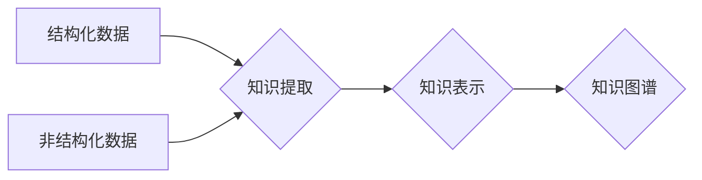

                 

## 知识的结构化与非结构化表示

> 关键词：知识图谱、结构化数据、非结构化数据、自然语言处理、机器学习、数据挖掘、知识表示、关系数据库、图数据库

## 1. 背景介绍

在当今数据爆炸的时代，信息以指数级增长，其中包括结构化数据、非结构化数据和半结构化数据。结构化数据，如关系数据库中的数据，具有明确的格式和结构，易于存储和查询。非结构化数据，如文本、图像、音频和视频，缺乏固定的格式，存储和处理难度更大。 

知识的有效获取、理解和利用是人工智能发展的重要课题。如何将海量非结构化数据转化为可理解和利用的知识，是当前研究的热点。结构化与非结构化知识表示是解决这一问题的关键。

## 2. 核心概念与联系

**2.1 结构化知识表示**

结构化知识表示将知识表示为明确的结构，通常采用关系数据库或图数据库来存储和管理。

* **关系数据库:**  使用表和关系来存储数据，每个表代表一个实体类型，关系定义实体之间的连接。
* **图数据库:** 使用节点和边来表示知识，节点代表实体，边代表实体之间的关系。

**2.2 非结构化知识表示**

非结构化知识表示将知识表示为文本、图像、音频等非结构化形式。

* **自然语言处理 (NLP):**  用于分析和理解文本数据，提取关键信息和知识。
* **计算机视觉:** 用于分析和理解图像数据，识别物体、场景和关系。
* **语音识别:** 用于将语音数据转换为文本数据，以便进行分析和理解。

**2.3 结构化与非结构化知识融合**

将结构化和非结构化知识融合，可以构建更完整、更丰富的知识图谱。

**Mermaid 流程图:**



## 3. 核心算法原理 & 具体操作步骤

**3.1 算法原理概述**

知识的结构化与非结构化表示涉及多种算法和技术，包括：

* **关系抽取:** 从文本中识别实体和关系。
* **知识图谱构建:** 将提取的知识表示为图结构。
* **知识推理:** 基于已有的知识进行推断和发现新知识。
* **知识融合:** 将来自不同来源的知识进行整合和统一。

**3.2 算法步骤详解**

**3.2.1 关系抽取**

1. **文本预处理:** 清洗文本数据，去除停用词、标点符号等，并进行分词。
2. **特征提取:** 从文本中提取实体和关系的特征，例如词性、依存关系、语义相似度等。
3. **模型训练:** 使用机器学习模型，例如深度神经网络，对训练数据进行训练，学习关系抽取规则。
4. **关系预测:** 将预处理后的文本输入到训练好的模型中，预测实体之间的关系。

**3.2.2 知识图谱构建**

1. **实体识别:** 从文本中识别出实体，例如人名、地名、机构名等。
2. **关系识别:** 使用关系抽取算法识别实体之间的关系。
3. **知识图谱构建:** 将识别出的实体和关系存储到图数据库中，构建知识图谱。

**3.3 算法优缺点**

**优点:**

* 可以有效地提取和表示知识。
* 可以进行知识推理和发现。
* 可以支持多种数据类型。

**缺点:**

* 算法复杂度高，需要大量的计算资源。
* 需要大量的训练数据。
* 知识图谱的构建和维护需要专业知识。

**3.4 算法应用领域**

* **搜索引擎:** 理解用户查询意图，提供更精准的搜索结果。
* **问答系统:** 回答用户的问题，提供相关信息。
* **推荐系统:** 根据用户的兴趣和偏好，推荐相关商品或服务。
* **医疗诊断:** 辅助医生进行诊断，提高诊断准确率。

## 4. 数学模型和公式 & 详细讲解 & 举例说明

**4.1 数学模型构建**

知识图谱可以表示为一个三元组 (实体, 关系, 实体)，其中实体可以是任何事物，关系描述实体之间的连接。

**4.2 公式推导过程**

假设我们有一个知识图谱 G = (E, R, T)，其中：

* E 是实体集合
* R 是关系集合
* T 是三元组集合

我们可以使用以下公式来表示知识图谱的结构：

```latex
G = (E, R, T)
```

其中，每个三元组 t ∈ T 可以表示为：

```latex
t = (h, r, t)
```

其中：

* h 是头实体
* r 是关系
* t 是尾实体

**4.3 案例分析与讲解**

例如，一个简单的知识图谱可以表示如下：

* 实体：张三、李四、北京
* 关系：居住在
* 三元组：

```latex
(张三, 居住在, 北京)
(李四, 居住在, 北京)
```

**4.4 数学模型的应用**

数学模型可以用于知识图谱的推理、查询和分析。例如，我们可以使用规则引擎或逻辑推理算法，根据知识图谱中的三元组进行推理，发现新的知识。

## 5. 项目实践：代码实例和详细解释说明

**5.1 开发环境搭建**

* Python 3.x
* Neo4j (图数据库)
* PyNeo4j (Neo4j Python 驱动)

**5.2 源代码详细实现**

```python
from py2neo import Graph

# 连接 Neo4j 数据库
graph = Graph("bolt://localhost:7687", auth=("neo4j", "password"))

# 创建节点
node1 = graph.create_node("Person", name="张三")
node2 = graph.create_node("Person", name="李四")
node3 = graph.create_node("City", name="北京")

# 创建关系
graph.create_relationship(node1, "居住在", node3)
graph.create_relationship(node2, "居住在", node3)

# 查询知识图谱
result = graph.run("MATCH (p:Person)-[:居住在]->(c:City) RETURN p.name, c.name")
for record in result:
    print(record["p.name"], "居住在", record["c.name"])
```

**5.3 代码解读与分析**

* 代码首先连接到 Neo4j 数据库。
* 然后创建节点和关系，构建知识图谱。
* 最后使用 Cypher 查询语句查询知识图谱，并打印结果。

**5.4 运行结果展示**

```
张三 居住在 北京
李四 居住在 北京
```

## 6. 实际应用场景

**6.1 搜索引擎**

知识图谱可以帮助搜索引擎理解用户查询意图，提供更精准的搜索结果。例如，如果用户搜索“苹果公司”，搜索引擎可以利用知识图谱中的信息，返回苹果公司的相关信息，例如公司简介、产品列表、创始人等。

**6.2 问答系统**

知识图谱可以用于构建问答系统，帮助用户回答问题。例如，如果用户问“北京的首都是什么？”，问答系统可以利用知识图谱中的信息，回答“北京是中国的首都”。

**6.3 推荐系统**

知识图谱可以用于构建推荐系统，根据用户的兴趣和偏好，推荐相关商品或服务。例如，如果用户购买了苹果手机，推荐系统可以利用知识图谱中的信息，推荐苹果公司的其他产品，例如苹果手表、苹果耳机等。

**6.4 未来应用展望**

随着人工智能技术的不断发展，知识图谱的应用场景将会更加广泛。例如，知识图谱可以用于医疗诊断、法律判决、教育教学等领域。

## 7. 工具和资源推荐

**7.1 学习资源推荐**

* **书籍:**
    * 《知识图谱》
    * 《图数据库》
* **在线课程:**
    * Coursera: Knowledge Graphs
    * edX: Introduction to Knowledge Graphs

**7.2 开发工具推荐**

* **Neo4j:** 图数据库
* **PyNeo4j:** Neo4j Python 驱动
* **RDFlib:** Python RDF 库

**7.3 相关论文推荐**

* **Knowledge Graph Embedding: A Survey**
* **A Survey on Knowledge Graph Construction**

## 8. 总结：未来发展趋势与挑战

**8.1 研究成果总结**

知识的结构化与非结构化表示取得了显著进展，为人工智能的发展提供了重要的基础。

**8.2 未来发展趋势**

* **更强大的知识表示模型:** 能够更好地表示复杂知识和关系。
* **更智能的知识推理和发现算法:** 能够自动发现新的知识和规律。
* **更广泛的应用场景:** 知识图谱将应用于更多领域，例如医疗、教育、法律等。

**8.3 面临的挑战**

* **数据质量问题:** 知识图谱的数据质量直接影响其应用效果。
* **知识更新问题:** 知识是动态变化的，需要不断更新知识图谱。
* **知识可解释性问题:** 知识图谱的推理过程往往难以解释，需要提高知识可解释性。

**8.4 研究展望**

未来研究将继续探索更强大的知识表示模型、更智能的知识推理算法和更广泛的应用场景，推动知识图谱技术的发展。

## 9. 附录：常见问题与解答

**9.1 如何构建知识图谱？**

构建知识图谱需要以下步骤：

1. 数据收集：收集相关数据，包括文本、图像、音频等。
2. 数据预处理：清洗数据，去除噪声和重复信息。
3. 实体识别：识别数据中的实体，例如人名、地名、机构名等。
4. 关系抽取：识别实体之间的关系。
5. 知识图谱构建：将识别出的实体和关系存储到图数据库中，构建知识图谱。

**9.2 如何查询知识图谱？**

可以使用图数据库的查询语言，例如 Cypher，查询知识图谱。

**9.3 如何评估知识图谱的质量？**

可以使用多种指标评估知识图谱的质量，例如准确率、完整性、一致性等。


作者：禅与计算机程序设计艺术 / Zen and the Art of Computer Programming 
<end_of_turn>

