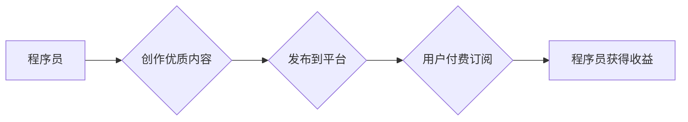

                 

## 程序员利用知识付费实现财富增值

> 关键词：知识付费、程序员、财富增值、在线教育、内容创作、技术分享、个人品牌

## 1. 背景介绍

随着互联网技术的飞速发展，知识经济时代已经到来。信息爆炸的时代，知识不再是稀缺资源，而是流动和共享的宝贵财富。在这个背景下，知识付费模式应运而生，成为一种新的商业模式，也为程序员提供了实现财富增值的新途径。

程序员作为技术人才，拥有丰富的技术经验和专业知识，是知识付费的天然拥有人。他们可以通过分享自己的技术技能、经验教训和项目案例，为其他程序员提供学习和提升的机会，从而获得经济回报。

## 2. 核心概念与联系

**2.1 知识付费模式**

知识付费是指通过付费的方式获取知识、技能和服务的商业模式。它打破了传统教育的时空限制，让学习变得更加便捷、高效和个性化。

**2.2 程序员知识付费**

程序员知识付费是指程序员将自己的技术知识和经验以付费的形式提供给其他程序员，包括但不限于：

* **在线课程:**  录制视频课程，讲解编程语言、框架、算法等技术内容。
* **付费博客:**  撰写技术文章、分享项目经验、提供技术解答，并对内容进行付费订阅。
* **技术咨询:**  为其他程序员提供一对一技术咨询服务，解决他们的技术难题。
* **开源项目维护:**  维护开源项目，并提供付费支持服务。

**2.3 知识付费平台**

知识付费平台是连接知识提供者和知识消费者之间的桥梁，提供技术支持、支付结算、用户管理等服务。常见的知识付费平台包括：

* **Udemy:** 全球最大的在线学习平台之一，提供各种类型的课程，包括编程课程。
* **Coursera:** 由斯坦福大学和皮特大学联合创办的在线学习平台，提供来自世界顶尖大学的课程。
* **Skillshare:**  专注于创意技能和职业技能的在线学习平台，提供编程课程和设计课程。
* **B站:** 中国最大的视频分享平台之一，也提供付费课程和直播服务。

**2.4  程序员知识付费流程图**



## 3. 核心算法原理 & 具体操作步骤

**3.1 算法原理概述**

知识付费模式的核心算法原理是基于价值交换的经济模型。程序员通过提供有价值的知识和服务，获得用户的付费订阅，从而实现财富增值。

**3.2 算法步骤详解**

1. **内容创作:** 程序员需要根据自身的技术专长和市场需求，创作高质量、有价值的技术内容。
2. **平台选择:** 选择合适的知识付费平台，根据平台的特点和用户群体，制定相应的推广策略。
3. **内容发布:** 将创作的内容发布到平台，设置合理的付费价格，并进行有效的宣传推广。
4. **用户互动:** 与用户进行互动，解答用户疑问，收集用户反馈，不断优化内容质量。
5. **收益获取:** 用户付费订阅后，程序员可以获得相应的收益分成。

**3.3 算法优缺点**

**优点:**

* **低门槛:** 程序员可以利用自身的技术优势，无需大量资金投入，即可开始知识付费。
* **高收益:** 优质内容可以获得高额收益，实现财富增值。
* **灵活自由:** 程序员可以自主选择创作内容、平台和推广方式，享受工作自由。

**缺点:**

* **竞争激烈:** 知识付费市场竞争激烈，需要不断提升内容质量和品牌影响力。
* **流量获取困难:** 需要投入时间和精力进行内容推广，才能吸引用户付费订阅。
* **知识产权保护:** 需要做好知识产权保护工作，防止内容被盗用和侵权。

**3.4 算法应用领域**

* **编程语言学习:** 教学编程语言基础知识、进阶技巧和实战应用。
* **框架和工具学习:** 分享框架和工具的使用方法、最佳实践和案例分析。
* **算法和数据结构:** 解释算法原理、数据结构特点和应用场景。
* **软件开发实践:** 分享软件开发流程、项目管理经验和代码优化技巧。
* **技术咨询服务:** 为其他程序员提供一对一技术咨询服务，解决他们的技术难题。

## 4. 数学模型和公式 & 详细讲解 & 举例说明

**4.1 数学模型构建**

知识付费模式可以抽象为一个供需模型，其中：

* **供给方:** 程序员，提供知识和服务。
* **需求方:** 其他程序员，需要学习和提升技术。
* **价格:** 付费订阅价格，由供给方和需求方共同决定。
* **数量:** 付费订阅数量，取决于价格、内容质量和市场需求。

**4.2 公式推导过程**

我们可以用以下公式来描述知识付费模式的收益：

```latex
收益 = 价格 * 付费订阅数量
```

**4.3 案例分析与讲解**

假设一位程序员创作了一门关于Python编程的在线课程，课程价格为199元，付费订阅数量为1000人，那么该程序员的收益为：

```latex
收益 = 199元 * 1000人 = 199,000元
```

## 5. 项目实践：代码实例和详细解释说明

**5.1 开发环境搭建**

* **操作系统:** Windows/macOS/Linux
* **编程语言:** Python
* **框架:** Flask/Django
* **数据库:** MySQL/PostgreSQL
* **知识付费平台:** Udemy/Coursera/Skillshare/B站

**5.2 源代码详细实现**

由于篇幅限制，这里只提供一个简单的Flask项目代码实例，用于展示知识付费平台的基本结构：

```python
from flask import Flask, render_template, request

app = Flask(__name__)

# 模拟课程数据
courses = [
    {
        "title": "Python基础教程",
        "price": 199,
        "description": "这是一门Python基础教程，适合初学者学习Python编程。"
    },
    {
        "title": "数据结构与算法",
        "price": 299,
        "description": "这是一门数据结构与算法课程，讲解常见的数据结构和算法。"
    }
]

@app.route("/")
def index():
    return render_template("index.html", courses=courses)

@app.route("/course/<int:course_id>")
def course_detail(course_id):
    course = courses[course_id]
    return render_template("course_detail.html", course=course)

@app.route("/purchase", methods=["POST"])
def purchase():
    course_id = request.form.get("course_id")
    # 处理支付逻辑
    return "购买成功！"

if __name__ == "__main__":
    app.run(debug=True)
```

**5.3 代码解读与分析**

* **Flask框架:** 使用Flask框架构建了一个简单的Web应用。
* **课程数据:** 模拟了课程数据，包括课程标题、价格和描述。
* **路由:** 定义了首页和课程详情页的路由。
* **模板:** 使用HTML模板渲染页面内容。
* **支付逻辑:** 模拟了支付逻辑，实际应用中需要集成第三方支付平台。

**5.4 运行结果展示**

运行代码后，可以访问localhost:5000，查看课程列表和课程详情页。

## 6. 实际应用场景

**6.1 在线课程平台**

程序员可以利用知识付费平台，录制和发布在线课程，教授编程语言、框架、算法等技术内容。

**6.2 付费博客**

程序员可以开设付费博客，分享技术文章、项目经验、代码示例等，并通过订阅模式获得收益。

**6.3 技术咨询服务**

程序员可以提供一对一技术咨询服务，帮助其他程序员解决技术难题，并收取咨询费用。

**6.4 开源项目维护**

程序员可以维护开源项目，并提供付费支持服务，例如代码定制、bug修复、技术文档撰写等。

**6.5 社区建设**

程序员可以建立技术社区，提供学习资源、技术交流平台，并通过会员订阅模式获得收益。

**6.6 未来应用展望**

随着人工智能、大数据等技术的快速发展，知识付费模式将更加多元化和智能化。程序员可以利用这些技术，开发更具互动性和个性化的知识付费产品，例如：

* **AI智能辅导:** 利用人工智能技术，为用户提供个性化的学习辅导和答疑服务。
* **虚拟现实培训:** 利用虚拟现实技术，打造沉浸式的技术培训体验。
* **区块链知识版权保护:** 利用区块链技术，保障知识产权，防止知识盗用。

## 7. 工具和资源推荐

**7.1 学习资源推荐**

* **Udemy:** https://www.udemy.com/
* **Coursera:** https://www.coursera.org/
* **Skillshare:** https://www.skillshare.com/
* **B站:** https://www.bilibili.com/

**7.2 开发工具推荐**

* **Flask:** https://flask.palletsprojects.com/en/2.2.x/
* **Django:** https://www.djangoproject.com/
* **MySQL:** https://www.mysql.com/
* **PostgreSQL:** https://www.postgresql.org/

**7.3 相关论文推荐**

* **The Economics of Online Education**
* **The Future of Learning: How Technology is Transforming Education**
* **The Impact of Knowledge Sharing on Innovation**

## 8. 总结：未来发展趋势与挑战

**8.1 研究成果总结**

知识付费模式为程序员提供了实现财富增值的新途径，同时也推动了技术知识的传播和共享。

**8.2 未来发展趋势**

* **内容多元化:** 知识付费内容将更加多元化，涵盖更广泛的技术领域和学习形式。
* **智能化:** 人工智能技术将被应用于知识付费平台，提供更个性化的学习体验和服务。
* **全球化:** 知识付费平台将更加国际化，连接全球的程序员和学习者。

**8.3 面临的挑战**

* **内容质量:** 知识付费市场竞争激烈，需要不断提升内容质量和原创性。
* **用户信任:** 建立用户信任是知识付费平台的关键，需要保证内容真实性和服务质量。
* **知识产权保护:** 需要加强知识产权保护，防止知识盗用和侵权。

**8.4 研究展望**

未来研究可以关注以下方向：

* **知识付费模式的优化:** 研究更有效的知识付费模式，提高用户体验和收益。
* **人工智能在知识付费中的应用:** 研究人工智能技术在知识付费平台中的应用，例如个性化推荐、智能辅导等。
* **知识付费的社会影响:** 研究知识付费模式对社会发展和人才培养的影响。

## 9. 附录：常见问题与解答

**9.1 如何选择合适的知识付费平台？**

选择知识付费平台需要考虑以下因素：

* **平台用户群体:** 平台的用户群体是否与你的目标用户一致？
* **平台收费模式:** 平台的收费模式是否合理？
* **平台技术支持:** 平台是否提供完善的技术支持？
* **平台推广能力:** 平台是否具备有效的推广能力？

**9.2 如何提升知识付费内容的质量？**

提升知识付费内容的质量需要以下几点：

* **深入研究:** 对所教授的知识领域进行深入研究，确保内容的准确性和深度。
* **实践经验:** 将理论知识与实践经验结合，提供更实用和有价值的内容。
* **互动交流:** 与用户进行互动交流，收集用户反馈，不断优化内容质量。
* **持续更新:** 关注行业发展趋势，及时更新内容，保持内容的时效性。


作者：禅与计算机程序设计艺术 / Zen and the Art of Computer Programming<end_of_turn>

