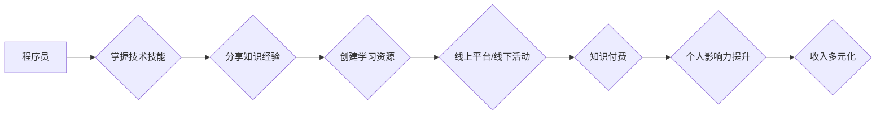

                 

## 程序员利用知识付费打造个人影响力

> 关键词：程序员、知识付费、个人影响力、技术博客、在线课程、社区建设、品牌建立、收入多元化

## 1. 背景介绍

在当今数字化时代，技术人才需求日益增长，程序员作为科技发展的重要力量，拥有着巨大的职业发展潜力。然而，随着编程技能的普及，程序员之间的竞争也日益激烈。如何脱颖而出，提升个人价值，成为行业领袖，成为众多程序员共同关注的问题。

知识付费作为一种新型的商业模式，近年来在互联网领域蓬勃发展，为程序员提供了打造个人影响力、实现收入多元化的全新途径。通过分享自身的技术经验、开发优质的学习资源，程序员可以建立个人品牌，积累粉丝基础，并获得可观的经济回报。

## 2. 核心概念与联系

### 2.1 知识付费

知识付费是指通过付费的方式获取知识、技能和服务的商业模式。它以知识为核心资产，通过线上平台或线下活动，将知识转化为有价值的产品或服务，并向用户提供付费订阅、课程购买、咨询服务等方式。

### 2.2 个人影响力

个人影响力是指个人在特定领域或群体中所拥有的认知度、信任度和号召力。拥有强大个人影响力的程序员，能够在行业内建立声誉，吸引更多关注和合作机会。

### 2.3 程序员知识付费

程序员知识付费是指程序员利用自身的技术经验和技能，通过线上平台或线下活动，向其他程序员提供付费的知识和服务。

**Mermaid 流程图**



## 3. 核心算法原理 & 具体操作步骤

### 3.1 算法原理概述

程序员知识付费的核心算法原理在于内容生产、用户运营和商业模式的结合。

* **内容生产:** 程序员需要根据自身的技术专长和市场需求，创作高质量的学习资源，例如技术博客文章、在线课程、代码库、技术文档等。
* **用户运营:** 程序员需要通过社交媒体、技术社区、线上论坛等平台，与目标用户进行互动，建立信任关系，并持续输出有价值的内容，吸引用户关注。
* **商业模式:** 程序员可以采用多种商业模式，例如付费订阅、课程销售、咨询服务、赞助合作等，将知识转化为经济价值。

### 3.2 算法步骤详解

1. **确定目标用户和知识领域:** 程序员需要明确自己的目标用户群体和技术领域，并根据市场需求和自身优势进行选择。
2. **创作高质量的学习资源:** 程序员需要创作原创、实用、易懂的学习资源，并进行反复修改和完善。
3. **选择合适的知识付费平台:** 程序员可以根据自身需求选择不同的知识付费平台，例如 Udemy、Coursera、知识星球、B站等。
4. **进行用户运营和推广:** 程序员需要通过社交媒体、技术社区、线上论坛等平台，进行用户运营和推广，吸引更多用户关注。
5. **提供优质的客户服务:** 程序员需要及时回复用户咨询，解决用户问题，并提供持续的学习支持。

### 3.3 算法优缺点

**优点:**

* **收入多元化:** 程序员可以利用知识付费，实现收入多元化，增加经济收入。
* **个人品牌建设:** 通过分享知识和经验，程序员可以建立个人品牌，提升行业影响力。
* **技术能力提升:** 为了创作高质量的学习资源，程序员需要不断学习和提升自己的技术能力。
* **社区建设:** 程序员可以通过知识付费平台，与其他程序员进行互动交流，建立技术社区。

**缺点:**

* **内容创作成本高:** 创作高质量的学习资源需要投入大量的时间和精力。
* **用户运营难度大:** 需要不断学习和掌握用户运营技巧，才能吸引和留住用户。
* **市场竞争激烈:** 知识付费市场竞争激烈，需要不断创新和提升自身竞争力。

### 3.4 算法应用领域

程序员知识付费的应用领域非常广泛，例如：

* **编程语言学习:** 教授 Python、Java、C++ 等编程语言的知识和技能。
* **软件开发技术:** 分享软件开发的最佳实践、设计模式、架构设计等技术。
* **数据科学与机器学习:** 提供数据分析、机器学习算法、深度学习等领域的知识和技能。
* **云计算与大数据:** 教授云计算平台、大数据处理技术、数据库管理等知识。
* **网络安全与渗透测试:** 分享网络安全知识、漏洞挖掘、渗透测试等技术。

## 4. 数学模型和公式 & 详细讲解 & 举例说明

### 4.1 数学模型构建

知识付费平台的收入模型可以抽象为一个数学模型：

**收入 = 用户数量 * 平均付费金额**

其中：

* **用户数量:** 指平台上的付费用户数量。
* **平均付费金额:** 指每个付费用户平均支付的金额。

### 4.2 公式推导过程

为了最大化收入，程序员需要考虑以下因素：

* **用户增长:** 通过内容营销、社区运营等方式，吸引更多用户注册并付费。
* **付费金额:** 根据课程内容、时长、价值等因素，设定合理的付费金额。
* **用户留存:** 提供优质的学习体验和服务，提高用户留存率，延长付费周期。

### 4.3 案例分析与讲解

假设一个程序员开发了一门 Python 编程课程，目标用户是初学者。

* **用户数量:** 平台上注册了 1000 名用户，其中 200 名用户付费学习。
* **平均付费金额:** 课程售价为 199 元。

根据上述数据，该课程的收入为：

**收入 = 200 * 199 = 39800 元**

如果程序员通过内容营销和社区运营，将用户数量增加到 500 名，则收入将达到：

**收入 = 500 * 199 = 99500 元**

可见，用户增长对知识付费收入的影响非常显著。

## 5. 项目实践：代码实例和详细解释说明

### 5.1 开发环境搭建

程序员可以利用以下工具搭建知识付费项目开发环境：

* **代码编辑器:** VS Code、Sublime Text、Atom 等。
* **版本控制系统:** Git、GitHub 等。
* **线上平台:** Udemy、Coursera、知识星球、B站 等。

### 5.2 源代码详细实现

以下是一个简单的 Python 课程代码示例，用于演示知识付费平台的基本功能：

```python
# 用户注册功能
def register_user(username, password):
    # ... (数据库操作)
    print(f"用户 {username} 注册成功!")

# 课程购买功能
def purchase_course(user_id, course_id):
    # ... (数据库操作)
    print(f"用户 {user_id} 购买了课程 {course_id}!")

# 课程学习功能
def learn_course(user_id, course_id):
    # ... (课程内容展示)
    print(f"用户 {user_id} 学习课程 {course_id}!")
```

### 5.3 代码解读与分析

以上代码示例展示了用户注册、课程购买和课程学习的基本功能。

* **register_user() 函数:** 用于处理用户注册操作，需要连接数据库，存储用户的信息。
* **purchase_course() 函数:** 用于处理课程购买操作，需要连接数据库，记录用户购买的课程信息。
* **learn_course() 函数:** 用于展示课程内容，需要根据用户选择的课程，加载相应的学习资源。

### 5.4 运行结果展示

当用户注册成功后，可以购买课程并进行学习。程序员可以通过数据库记录用户操作，并提供相应的学习进度和反馈。

## 6. 实际应用场景

### 6.1 在线课程平台

程序员可以利用知识付费平台，开发和销售在线课程，例如编程语言学习、软件开发技术、数据科学等领域的课程。

### 6.2 技术博客和社区

程序员可以利用技术博客和社区平台，分享技术经验和知识，并通过广告、赞助、会员订阅等方式获得收入。

### 6.3 咨询服务

程序员可以提供技术咨询服务，帮助企业解决技术难题，并获得相应的报酬。

### 6.4 未来应用展望

随着人工智能、大数据等技术的不断发展，程序员知识付费的应用场景将更加广泛，例如：

* **个性化学习:** 根据用户的学习进度和需求，提供个性化的学习方案和内容。
* **虚拟现实和增强现实:** 利用虚拟现实和增强现实技术，打造沉浸式的学习体验。
* **区块链技术:** 利用区块链技术，保障知识产权和交易安全。

## 7. 工具和资源推荐

### 7.1 学习资源推荐

* **书籍:** 《代码的艺术》、《设计模式：复用面向对象软件的建模》
* **在线课程:** Coursera、Udemy、edX
* **技术博客:** CSDN、博客园、SegmentFault

### 7.2 开发工具推荐

* **代码编辑器:** VS Code、Sublime Text、Atom
* **版本控制系统:** Git、GitHub
* **线上平台:** Udemy、Coursera、知识星球、B站

### 7.3 相关论文推荐

* **知识付费的商业模式创新**
* **程序员知识付费平台的构建与发展**
* **人工智能与知识付费的融合发展**

## 8. 总结：未来发展趋势与挑战

### 8.1 研究成果总结

程序员知识付费作为一种新型的商业模式，为程序员提供了实现个人价值、实现收入多元化的全新途径。通过内容生产、用户运营和商业模式的结合，程序员可以建立个人品牌，积累粉丝基础，并获得可观的经济回报。

### 8.2 未来发展趋势

未来，程序员知识付费将朝着以下趋势发展：

* **个性化学习:** 根据用户的学习进度和需求，提供个性化的学习方案和内容。
* **沉浸式学习体验:** 利用虚拟现实和增强现实技术，打造沉浸式的学习体验。
* **人工智能辅助:** 利用人工智能技术，自动生成学习内容、提供个性化学习建议。

### 8.3 面临的挑战

程序员知识付费也面临着一些挑战：

* **内容质量保证:** 需要不断提升内容质量，才能吸引和留住用户。
* **用户运营难度:** 需要不断学习和掌握用户运营技巧，才能吸引和留住用户。
* **市场竞争激烈:** 需要不断创新和提升自身竞争力，才能在激烈的市场竞争中脱颖而出。

### 8.4 研究展望

未来，需要进一步研究程序员知识付费的商业模式、用户运营策略、内容生产方法等方面，推动该领域的发展。

## 9. 附录：常见问题与解答

### 9.1 如何选择合适的知识付费平台？

程序员需要根据自身需求和目标用户群体，选择合适的知识付费平台。例如，Udemy 和 Coursera 比较适合面向大众的课程销售，而知识星球更适合建立专业技术社区。

### 9.2 如何提高知识付费课程的质量？

程序员需要创作原创、实用、易懂的课程内容，并进行反复修改和完善。此外，还需要提供优质的学习体验和服务，例如及时回复用户咨询、提供学习支持等。

### 9.3 如何进行知识付费平台的用户运营？

程序员需要通过内容营销、社交媒体推广、社区运营等方式，吸引和留住用户。此外，还需要根据用户反馈，不断优化课程内容和学习体验。


作者：禅与计算机程序设计艺术 / Zen and the Art of Computer Programming 
<end_of_turn>

