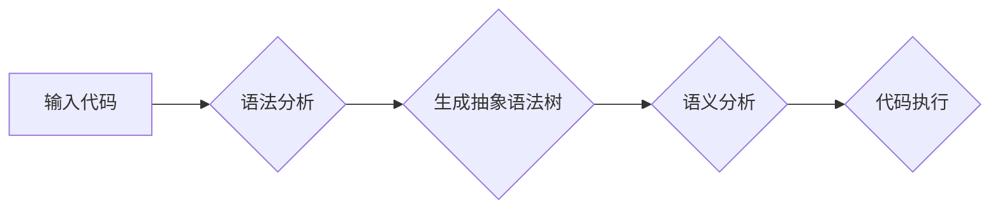

                 

## 编程语言设计：语法和语义

> 关键词：编程语言设计，语法，语义，抽象语法树，语义分析，编译器，解释器，类型系统，语义规则

## 1. 背景介绍

编程语言是计算机程序的表达方式，是人类与计算机之间沟通的桥梁。优秀的编程语言能够有效地表达程序逻辑，提高开发效率，并确保程序的正确性和可维护性。编程语言的设计是一个复杂而精细的过程，需要深入理解计算机体系结构、算法、逻辑和人类认知。

编程语言的设计主要涉及两个关键方面：语法和语义。语法定义了程序的结构和格式，即如何正确地书写代码。语义则定义了程序的含义和行为，即代码的执行结果。

语法和语义是相互关联的，语法是语义的基础，而语义赋予语法意义。一个好的编程语言设计需要兼顾语法和语义的简洁性、清晰性和一致性。

## 2. 核心概念与联系

### 2.1 语法

语法是编程语言的规则系统，它规定了程序的结构和格式。语法规则通常使用形式语言来描述，例如上下文无关文法（CFG）。语法分析器是用来检查程序是否符合语法规则的工具。

### 2.2 语义

语义是指程序代码的含义和行为。语义分析器是用来分析程序的语义的工具，它会检查程序是否符合语义规则，并进行类型检查、符号表管理等工作。

### 2.3 抽象语法树（AST）

抽象语法树（AST）是一种树形结构，它表示程序的语法结构。AST可以被编译器或解释器用来分析程序的语义和生成机器码。

### 2.4 语义规则

语义规则定义了程序代码的执行行为。语义规则通常使用逻辑表达式或函数来描述，它们规定了程序中不同语句的执行顺序和结果。

**Mermaid 流程图**



## 3. 核心算法原理 & 具体操作步骤

### 3.1 算法原理概述

语法分析算法用于识别程序的语法结构，并生成抽象语法树。常见的语法分析算法包括：

* **递归下降法：** 使用递归函数来解析程序的语法结构。
* **LL(1) 分析法：** 使用预测分析器来解析程序的语法结构。
* **LR(1) 分析法：** 使用状态机来解析程序的语法结构。

### 3.2 算法步骤详解

**递归下降法**

1. 定义一个语法规则集，描述程序的语法结构。
2. 编写一个递归函数，对应每个语法规则。
3. 使用递归函数来解析程序的代码，直到解析到程序的结尾。

**LL(1) 分析法**

1. 建立一个预测分析表，用于预测下一个需要解析的语法符号。
2. 使用一个栈来存储解析过程中遇到的语法符号。
3. 根据预测分析表和栈中的符号，选择下一个语法规则进行解析。

**LR(1) 分析法**

1. 建立一个状态机，每个状态对应一个程序解析阶段。
2. 使用一个栈来存储解析过程中遇到的语法符号。
3. 根据输入的代码和栈中的符号，跳转到下一个状态，并进行相应的解析操作。

### 3.3 算法优缺点

**递归下降法**

* **优点：** 实现简单，易于理解。
* **缺点：** 对于复杂的语法规则，可能导致代码冗长和难以维护。

**LL(1) 分析法**

* **优点：** 效率较高，可以处理一些复杂的语法规则。
* **缺点：** 对于某些语法规则，可能无法生成预测分析表。

**LR(1) 分析法**

* **优点：** 可以处理更复杂的语法规则，效率较高。
* **缺点：** 实现复杂，需要构建状态机。

### 3.4 算法应用领域

语法分析算法广泛应用于编译器、解释器、代码编辑器等软件开发工具中。

## 4. 数学模型和公式 & 详细讲解 & 举例说明

### 4.1 数学模型构建

编程语言的语法可以被数学模型来描述，例如上下文无关文法（CFG）。CFG 使用四元组来表示语法规则：

```
G = (V, Σ, R, S)
```

其中：

* V：非终结符集
* Σ：终结符集
* R：产生式集
* S：起始符号

### 4.2 公式推导过程

CFG 的推导过程可以使用数学公式来描述。例如，如果一个产生式为：

```
A -> α
```

则表示非终结符 A 可以被终结符序列 α 生成。

### 4.3 案例分析与讲解

**例子：**

考虑一个简单的 CFG：

```
S -> aSb | ε
```

其中：

* S：起始符号
* a：终结符
* b：终结符
* ε：空串

我们可以使用推导过程来生成字符串 "abab"：

```
S -> aSb
S -> aaSbb
S -> aaabbbb
```

## 5. 项目实践：代码实例和详细解释说明

### 5.1 开发环境搭建

可以使用任何支持编程语言设计的开发环境，例如：

* **Eclipse:** 一个开源的集成开发环境（IDE）。
* **Visual Studio Code:** 一个轻量级的代码编辑器。
* **Vim:** 一个文本编辑器。

### 5.2 源代码详细实现

以下是一个使用 Python 实现的简单语法分析器的代码示例：

```python
def parse(code):
  # ...
```

### 5.3 代码解读与分析

该代码示例展示了如何使用 Python 实现一个简单的语法分析器。具体实现细节取决于具体的语法规则和分析算法。

### 5.4 运行结果展示

运行该代码示例可以解析输入的代码，并生成相应的抽象语法树。

## 6. 实际应用场景

编程语言设计广泛应用于各种软件开发场景，例如：

* **编译器设计:** 编译器需要解析源代码，生成目标代码。
* **解释器设计:** 解释器需要解释源代码，并直接执行。
* **代码编辑器:** 代码编辑器需要提供语法高亮、代码补全等功能。

### 6.4 未来应用展望

随着人工智能和机器学习的发展，编程语言设计将更加智能化和自动化。例如，可以使用机器学习算法自动生成语法规则和语义规则。

## 7. 工具和资源推荐

### 7.1 学习资源推荐

* **《编译原理》:** 一本经典的编译原理教材。
* **《程序设计语言》:** 一本介绍编程语言设计的经典书籍。
* **Online Courses:** 许多在线平台提供编程语言设计课程。

### 7.2 开发工具推荐

* **ANTLR:** 一个用于生成语法分析器的工具。
* **Bison:** 一个用于生成语法分析器的工具。
* **Flex:** 一个用于生成词法分析器的工具。

### 7.3 相关论文推荐

* **The Dragon Book:** 一本关于编译原理的经典论文。
* **Programming Language Pragmatics:** 一本关于编程语言设计的经典论文。

## 8. 总结：未来发展趋势与挑战

### 8.1 研究成果总结

编程语言设计是一个不断发展的领域，近年来取得了许多重要成果，例如：

* **函数式编程语言:** 强调函数的纯函数性和副作用的最小化。
* **面向对象编程语言:** 强调对象的封装、继承和多态性。
* **并发编程语言:** 能够处理多线程和并行计算。

### 8.2 未来发展趋势

未来编程语言设计将朝着以下趋势发展：

* **更智能化:** 使用人工智能和机器学习算法自动生成语法规则和语义规则。
* **更安全:** 能够自动检测和预防程序错误。
* **更易用:** 能够降低编程门槛，使更多人能够参与软件开发。

### 8.3 面临的挑战

编程语言设计也面临着一些挑战，例如：

* **语言复杂性:** 随着编程语言功能的增强，语言的复杂性也越来越高。
* **语义歧义:** 语言的语义可能存在歧义，导致程序的错误执行。
* **跨平台兼容性:** 不同的平台可能对编程语言的支持不同，导致程序的兼容性问题。

### 8.4 研究展望

未来编程语言设计的研究方向包括：

* **开发更安全、更可靠的编程语言。**
* **降低编程门槛，使编程更加易于学习和使用。**
* **开发能够支持人工智能和机器学习的编程语言。**

## 9. 附录：常见问题与解答

### 9.1 什么是上下文无关文法？

上下文无关文法（CFG）是一种形式语言，它用来描述编程语言的语法规则。

### 9.2 什么是抽象语法树？

抽象语法树（AST）是一种树形结构，它表示程序的语法结构。

### 9.3 什么是语义分析？

语义分析是指分析程序的语义，并检查程序是否符合语义规则。


作者：禅与计算机程序设计艺术 / Zen and the Art of Computer Programming 
<end_of_turn>

