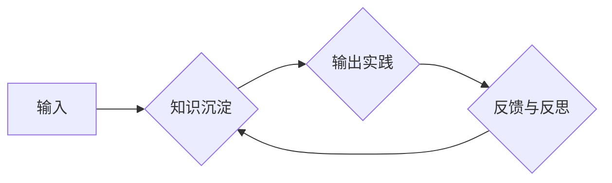

                 

## 输出倍增:管理者学习效率的终极法门

> 关键词：学习效率、输出倍增、时间管理、知识积累、深度学习、高效工作

### 1. 背景介绍

在当今瞬息万变的科技时代，信息爆炸和竞争加剧，高效学习和提升工作效率已成为管理者迫切需要解决的问题。传统的学习方法往往陷入“输入为主”的误区，大量吸收信息却难以转化为实际应用，导致学习效率低下。而“输出倍增”理念则强调通过输出驱动学习，将知识转化为实践，从而实现学习效率的质的飞跃。

### 2. 核心概念与联系

**2.1 核心概念**

* **输入:** 指学习者获取知识和信息的过程，包括阅读书籍、参加培训、观看视频等。
* **输出:** 指学习者将知识和信息转化为实际成果的过程，包括撰写文章、开发项目、演讲分享等。
* **倍增:** 指通过优化学习方法和工作流程，将输出量显著提升，实现学习效率的指数级增长。

**2.2  输出倍增流程图**



**2.3  联系**

“输出倍增”的核心在于将学习与实践相结合，通过输出驱动学习，形成一个良性循环。输入阶段获取知识，沉淀阶段整理归纳，输出阶段将知识应用于实践，实践反馈则引导知识的进一步沉淀和输出，最终实现学习效率的倍增。

### 3. 核心算法原理 & 具体操作步骤

**3.1 算法原理概述**

“输出倍增”算法的核心原理是利用反馈机制和迭代优化，不断提升学习效率。通过输出实践，将知识转化为实际成果，并通过反馈与反思，不断修正学习方向和方法，最终实现学习效率的指数级增长。

**3.2 算法步骤详解**

1. **明确目标:**  明确学习的目标和方向，制定具体的学习计划。
2. **选择输入:** 选择高质量的学习资源，例如书籍、课程、专家分享等。
3. **知识沉淀:**  整理归纳学习到的知识，形成自己的理解和见解。
4. **输出实践:** 将知识应用于实际项目或任务，例如撰写文章、开发软件、演讲分享等。
5. **反馈与反思:** 收集反馈意见，反思实践过程中的不足，并根据反馈进行调整和优化。
6. **迭代优化:**  不断重复以上步骤，通过迭代优化，提升学习效率和实践能力。

**3.3 算法优缺点**

* **优点:** 
    * 提升学习效率: 通过输出驱动学习，将知识转化为实践，实现学习效率的倍增。
    * 加深理解:  实践应用可以加深对知识的理解和掌握。
    * 积累经验:  输出实践可以积累宝贵的经验和教训。
    * 提升自信:  通过输出成果，可以提升学习者的自信心和成就感。
* **缺点:** 
    * 需要付出更多努力: 输出实践需要付出更多的时间和精力。
    * 需要克服心理障碍:  一些人可能害怕失败或被批评，从而难以进行输出实践。

**3.4 算法应用领域**

“输出倍增”算法适用于各种学习场景，例如：

* **技术学习:**  开发软件、撰写代码、搭建项目等。
* **管理学习:**  撰写管理方案、进行项目管理、领导团队等。
* **个人成长:**  撰写博客、分享经验、演讲分享等。

### 4. 数学模型和公式 & 详细讲解 & 举例说明

**4.1 数学模型构建**

我们可以用一个简单的数学模型来描述“输出倍增”的原理：

*  **学习效率 = 输出量 / 输入量**

**4.2 公式推导过程**

通过优化学习方法和工作流程，我们可以显著提升输出量，从而提高学习效率。

* **输出量 = 输入量 * 输出倍增系数**

其中，输出倍增系数代表了通过输出驱动学习所带来的效率提升。

**4.3 案例分析与讲解**

假设一个学习者每天投入 2 小时学习，通过传统的学习方法，其输出量为 1 个知识点。如果采用“输出倍增”方法，通过输出实践，其输出量可以提升到 3 个知识点，则输出倍增系数为 3。

### 5. 项目实践：代码实例和详细解释说明

**5.1 开发环境搭建**

* 操作系统: Windows/macOS/Linux
* 编程语言: Python
* 开发工具: VS Code/PyCharm

**5.2 源代码详细实现**

```python
# 输出倍增学习计划

class LearningPlan:
    def __init__(self, target, resources):
        self.target = target
        self.resources = resources
        self.knowledge_points = []

    def learn(self):
        for resource in self.resources:
            # 学习资源
            # ...
            # 提取知识点
            self.knowledge_points.append(extract_knowledge_point(resource))

    def output(self):
        # 将知识点应用于实践
        # ...
        # 例如：撰写博客文章、开发项目、演讲分享等

    def reflect(self):
        # 反馈与反思
        # ...
        # 收集反馈意见，分析实践过程中的不足

# 使用示例
plan = LearningPlan(target="机器学习基础", resources=["机器学习书籍", "在线课程"])
plan.learn()
plan.output()
plan.reflect()
```

**5.3 代码解读与分析**

* `LearningPlan` 类代表一个学习计划，包含目标、学习资源和知识点列表。
* `learn()` 方法模拟学习资源，提取知识点并添加到 `knowledge_points` 列表中。
* `output()` 方法模拟将知识点应用于实践，例如撰写博客文章或开发项目。
* `reflect()` 方法模拟反馈与反思，收集反馈意见并分析实践过程中的不足。

**5.4 运行结果展示**

通过运行以上代码，可以模拟一个简单的“输出倍增”学习流程。

### 6. 实际应用场景

**6.1 技术学习**

对于技术人员来说，输出倍增可以帮助他们将学习到的知识转化为实际应用，例如：

* **开发项目:** 将学习到的编程语言和框架应用于实际项目开发，巩固知识并积累经验。
* **撰写博客:** 将学习到的技术知识分享给其他人，帮助他们理解并应用这些知识。
* **开源贡献:** 为开源项目贡献代码，将学习到的技术应用于实际场景，并与其他开发者交流学习。

**6.2 管理学习**

对于管理者来说，输出倍增可以帮助他们将学习到的管理知识应用于实际工作，例如：

* **撰写管理方案:** 将学习到的管理理论和方法应用于实际工作中，解决组织和团队面临的问题。
* **项目管理:** 将学习到的项目管理知识应用于实际项目，提高项目效率和成功率。
* **领导团队:** 将学习到的领导力技巧应用于团队管理，提升团队士气和凝聚力。

**6.3 个人成长**

对于个人成长来说，输出倍增可以帮助他们将学习到的知识和技能应用于实际生活，例如：

* **撰写日记:** 将学习到的知识和感悟记录下来，帮助自己更好地理解和消化这些知识。
* **演讲分享:** 将学习到的知识和技能分享给其他人，提升自己的表达能力和自信心。
* **参与志愿服务:** 将学习到的知识和技能应用于社会实践，帮助他人并提升自己的价值感。

**6.4 未来应用展望**

随着人工智能和自动化技术的不断发展，输出倍增理念将得到更广泛的应用。例如：

* **智能学习平台:** 利用人工智能技术，根据用户的学习目标和进度，自动生成个性化的学习计划和输出任务。
* **虚拟现实学习环境:** 利用虚拟现实技术，创造沉浸式的学习环境，让用户能够更直观地体验和应用所学知识。
* **协同学习平台:** 利用网络平台，连接不同领域的学习者，促进知识共享和输出倍增。

### 7. 工具和资源推荐

**7.1 学习资源推荐**

* **书籍:** 《高效能人士的七个习惯》、《刻意练习》、《深度学习》
* **课程:** Coursera、edX、Udacity
* **博客:** Hacker News、Medium、GitHub Blog

**7.2 开发工具推荐**

* **代码编辑器:** VS Code、PyCharm、Sublime Text
* **项目管理工具:** Trello、Jira、Asana
* **版本控制系统:** Git、GitHub

**7.3 相关论文推荐**

* **《刻意练习》:** Anders Ericsson
* **《高效能人士的七个习惯》:** Stephen Covey
* **《深度学习》:** Ian Goodfellow

### 8. 总结：未来发展趋势与挑战

**8.1 研究成果总结**

“输出倍增”理念为提升学习效率提供了新的思路和方法，通过输出驱动学习，可以有效地将知识转化为实践，并不断迭代优化学习方法，实现学习效率的指数级增长。

**8.2 未来发展趋势**

未来，“输出倍增”理念将与人工智能、自动化技术等融合发展，形成更加智能化、个性化的学习体系。

**8.3 面临的挑战**

* **克服心理障碍:**  一些人可能害怕失败或被批评，从而难以进行输出实践。
* **找到合适的输出方式:**  不同的学习者可能需要采用不同的输出方式，需要找到适合自己的输出方式。
* **保持输出的持续性:**  输出实践需要持续的投入和努力，需要找到方法保持输出的持续性。

**8.4 研究展望**

未来研究可以进一步探讨“输出倍增”的具体应用场景，开发更加智能化的学习平台和工具，并研究如何克服“输出倍增”学习过程中面临的挑战。

### 9. 附录：常见问题与解答

**9.1 如何制定有效的输出计划？**

* 明确学习目标和方向。
* 选择合适的输出方式。
* 制定具体的输出计划和时间安排。
* 定期回顾和调整输出计划。

**9.2 如何克服输出的恐惧？**

* 接受不完美：输出的目的不是追求完美，而是不断学习和进步。
* 从小目标开始：先从一些小的输出任务开始，逐渐积累经验和自信。
* 寻求反馈和支持：向他人寻求反馈意见，并获得他们的支持和鼓励。


作者：禅与计算机程序设计艺术 / Zen and the Art of Computer Programming 
<end_of_turn>

