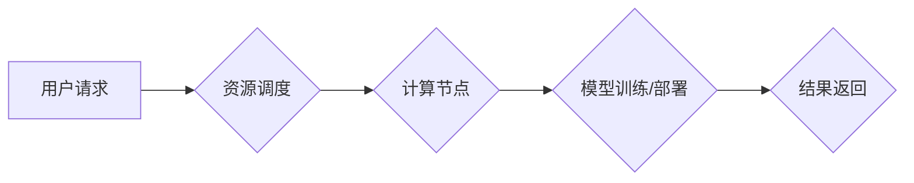

                 

## AI Cloud的未来：贾扬清的愿景，Lepton AI的前景与挑战

> 关键词：AI Cloud, 贾扬清, Lepton AI,  大模型,  算力平台,  开源社区,  AI 伦理,  未来趋势

### 1. 背景介绍

人工智能（AI）正以惊人的速度发展，其影响力正在深刻地改变着我们生活的方方面面。从自动驾驶到医疗诊断，从个性化推荐到科学研究，AI 正在推动着人类社会迈向一个全新的时代。在这个背景下，云计算作为一种强大的计算资源共享模式，与 AI 的发展产生了天然的契合。AI Cloud 应运而生，它将 AI 的强大能力与云计算的灵活性和可扩展性相结合，为开发者和企业提供了更便捷、高效的 AI 应用开发和部署平台。

贾扬清，作为一位享誉全球的 AI 专家，他深刻洞察了 AI Cloud 的未来发展趋势，并提出了其核心愿景：构建一个开放、共享、协同的 AI 计算平台，让 AI 技术真正惠及大众。他创立了 Lepton AI，一个致力于打造下一代 AI Cloud 平台的开源社区，旨在打破 AI 技术的壁垒，推动 AI 的普惠发展。

### 2. 核心概念与联系

Lepton AI 的核心概念是构建一个基于开源、分布式、弹性计算的 AI Cloud 平台。该平台将提供丰富的 AI 服务，包括模型训练、模型部署、数据处理、算法开发等，并支持多种主流 AI 框架和工具。

Lepton AI 的架构设计遵循以下原则：

* **开源:** 所有平台组件和服务都将开源，鼓励社区参与和贡献。
* **分布式:** 平台将采用分布式架构，利用多台服务器的计算资源，实现高性能和高可用性。
* **弹性:** 平台将支持动态资源分配和调度，根据用户需求灵活调整计算资源。
* **协同:** 平台将提供丰富的 API 和工具，方便开发者和企业进行协同开发和部署。

**Lepton AI 架构流程图**



### 3. 核心算法原理 & 具体操作步骤

Lepton AI 平台的核心算法原理是基于深度学习的模型训练和推理。深度学习是一种机器学习的子领域，它利用多层神经网络来模拟人类大脑的学习过程。

#### 3.1  算法原理概述

深度学习算法的核心是神经网络，它由多个层级的神经元组成。每个神经元接收来自上一层的输入信号，并对其进行处理，然后将处理后的信号传递给下一层的输入。通过调整神经网络的权重和偏置，模型可以学习到输入数据和输出数据的映射关系。

#### 3.2  算法步骤详解

Lepton AI 平台的模型训练和推理过程可以概括为以下步骤：

1. **数据预处理:** 将原始数据转换为模型可以理解的格式，例如数值化、归一化等。
2. **模型构建:** 根据任务需求选择合适的深度学习模型架构，并初始化模型参数。
3. **模型训练:** 使用训练数据训练模型，通过反向传播算法调整模型参数，使模型的预测结果与真实值尽可能接近。
4. **模型评估:** 使用测试数据评估模型的性能，例如准确率、召回率等。
5. **模型部署:** 将训练好的模型部署到平台上，以便用户进行预测或推理。

#### 3.3  算法优缺点

**优点:**

* **高精度:** 深度学习算法能够学习到复杂的非线性关系，从而实现高精度的预测和分类。
* **自动化:** 深度学习算法可以自动学习特征，无需人工特征工程。
* **通用性:** 深度学习模型可以应用于多种不同的任务，例如图像识别、自然语言处理、语音识别等。

**缺点:**

* **数据依赖:** 深度学习算法需要大量的训练数据才能达到较高的精度。
* **计算资源消耗:** 深度学习模型训练需要大量的计算资源，训练时间较长。
* **可解释性差:** 深度学习模型的决策过程较为复杂，难以解释模型的预测结果。

#### 3.4  算法应用领域

深度学习算法在各个领域都有广泛的应用，例如：

* **计算机视觉:** 图像识别、目标检测、图像分割、人脸识别等。
* **自然语言处理:** 文本分类、情感分析、机器翻译、对话系统等。
* **语音识别:** 语音转文本、语音合成等。
* **医疗诊断:** 疾病预测、图像分析、药物研发等。
* **金融分析:** 风险评估、欺诈检测、投资预测等。

### 4. 数学模型和公式 & 详细讲解 & 举例说明

深度学习算法的核心是神经网络，其数学模型可以描述为多层感知机（MLP）。

#### 4.1  数学模型构建

MLP 由多个层级的神经元组成，每个神经元接收来自上一层的输入信号，并对其进行处理，然后将处理后的信号传递给下一层的输入。

**神经元模型:**

$$
y = f(w^T x + b)
$$

其中：

* $x$ 是输入向量
* $w$ 是权重向量
* $b$ 是偏置项
* $f$ 是激活函数

**多层感知机模型:**

$$
y_l = f_l(W_l^T y_{l-1} + b_l)
$$

其中：

* $y_l$ 是第 $l$ 层的输出向量
* $W_l$ 是第 $l$ 层的权重矩阵
* $b_l$ 是第 $l$ 层的偏置向量
* $f_l$ 是第 $l$ 层的激活函数

#### 4.2  公式推导过程

模型训练的目标是找到最优的权重和偏置，使模型的预测结果与真实值尽可能接近。

**损失函数:**

$$
L = \frac{1}{N} \sum_{i=1}^{N} (y_i - \hat{y}_i)^2
$$

其中：

* $N$ 是样本数量
* $y_i$ 是第 $i$ 个样本的真实值
* $\hat{y}_i$ 是第 $i$ 个样本的预测值

**梯度下降算法:**

$$
\theta = \theta - \alpha \nabla L(\theta)
$$

其中：

* $\theta$ 是权重和偏置的集合
* $\alpha$ 是学习率
* $\nabla L(\theta)$ 是损失函数对 $\theta$ 的梯度

#### 4.3  案例分析与讲解

例如，在图像分类任务中，我们可以使用 LeNet-5 模型进行训练。LeNet-5 是一个经典的卷积神经网络模型，它能够学习到图像的特征，并进行分类。

在训练过程中，我们会使用大量的图像数据，并通过梯度下降算法调整模型的权重和偏置，使模型的分类精度不断提高。

### 5. 项目实践：代码实例和详细解释说明

Lepton AI 平台提供了丰富的 API 和工具，方便开发者进行模型训练和部署。以下是一个简单的代码实例，演示了如何使用 Lepton AI 平台训练一个简单的线性回归模型。

#### 5.1  开发环境搭建

Lepton AI 平台支持多种开发环境，例如 Python、Java 等。

#### 5.2  源代码详细实现

```python
from lepton_ai import Model, Dataset, Trainer

# 加载数据
dataset = Dataset.load_csv("data.csv")

# 创建模型
model = Model.linear_regression()

# 创建训练器
trainer = Trainer(model=model, dataset=dataset)

# 训练模型
trainer.train(epochs=10)

# 保存模型
model.save("model.pkl")
```

#### 5.3  代码解读与分析

这段代码首先加载了数据，然后创建了一个线性回归模型。接着，创建了一个训练器，并使用训练器训练模型。最后，将训练好的模型保存到本地文件。

#### 5.4  运行结果展示

训练完成后，我们可以使用训练好的模型进行预测。

### 6. 实际应用场景

Lepton AI 平台可以应用于各种实际场景，例如：

* **金融风险评估:** 利用深度学习模型分析用户数据，预测用户的信用风险。
* **医疗诊断辅助:** 利用深度学习模型分析医学图像，辅助医生进行疾病诊断。
* **智能客服:** 利用深度学习模型构建智能聊天机器人，为用户提供24小时在线服务。
* **个性化推荐:** 利用深度学习模型分析用户行为数据，推荐个性化的商品或服务。

### 6.4  未来应用展望

Lepton AI 平台的未来应用前景十分广阔，随着 AI 技术的不断发展，Lepton AI 平台将能够应用于更多更复杂的场景，例如：

* **自动驾驶:** 利用深度学习模型实现自动驾驶汽车的感知、决策和控制。
* **药物研发:** 利用深度学习模型加速药物研发过程，发现新的药物靶点和候选药物。
* **科学研究:** 利用深度学习模型分析海量科学数据，发现新的科学规律。

### 7. 工具和资源推荐

#### 7.1  学习资源推荐

* **Lepton AI 官方文档:** https://lepton.ai/docs
* **深度学习入门书籍:**
    * 《深度学习》
    * 《动手学深度学习》
* **在线课程:**
    * Coursera 深度学习课程
    * Udacity 深度学习工程师 Nanodegree

#### 7.2  开发工具推荐

* **Python:** 作为深度学习开发的主要语言，Python 提供了丰富的深度学习库，例如 TensorFlow、PyTorch 等。
* **Jupyter Notebook:** 用于编写和执行 Python 代码的交互式笔记本环境。
* **Git:** 用于版本控制和代码协作的工具。

#### 7.3  相关论文推荐

* **《ImageNet Classification with Deep Convolutional Neural Networks》:** https://arxiv.org/abs/1202.1938
* **《Attention Is All You Need》:** https://arxiv.org/abs/1706.03762
* **《BERT: Pre-training of Deep Bidirectional Transformers for Language Understanding》:** https://arxiv.org/abs/1810.04805

### 8. 总结：未来发展趋势与挑战

Lepton AI 平台作为下一代 AI Cloud 平台，其发展前景十分光明。随着 AI 技术的不断发展，Lepton AI 平台将能够提供更强大的功能和服务，推动 AI 技术的普惠发展。

#### 8.1  研究成果总结

Lepton AI 平台已经取得了一定的研究成果，例如：

* 开发了高效的分布式训练框架，能够支持大规模模型的训练。
* 提供了丰富的 AI 服务，包括模型训练、模型部署、数据处理等。
* 建立了活跃的开源社区，吸引了众多开发者和研究者的参与。

#### 8.2  未来发展趋势

Lepton AI 平台未来的发展趋势包括：

* **模型规模和性能的提升:** 探索更深、更广的模型架构，提高模型的精度和泛化能力。
* **算力平台的扩展:** 建设更强大的算力平台，支持更大规模的模型训练和推理。
* **应用场景的拓展:** 将 AI 技术应用于更多更复杂的场景，例如自动驾驶、药物研发等。
* **开源社区的建设:** 鼓励更多开发者和研究者参与到 Lepton AI 平台的建设中，共同推动 AI 技术的发展。

#### 8.3  面临的挑战

Lepton AI 平台也面临着一些挑战，例如：

* **数据安全和隐私保护:** 如何保证用户数据的安全和隐私，是 AI 平台面临的重要挑战。
* **算法可解释性和公平性:** 深度学习模型的决策过程较为复杂，难以解释，如何保证模型的公平性和可解释性，也是一个重要的研究方向。
* **算力资源的获取和分配:** 大规模模型的训练需要大量的算力资源，如何高效地获取和分配算力资源，也是一个重要的挑战。

#### 8.4  研究展望

Lepton AI 平台将继续致力于解决这些挑战，并推动 AI 技术的普惠发展。未来，Lepton AI 平台将成为一个开放、共享、协同的 AI 计算平台，为开发者和企业提供更便捷、高效的 AI 应用开发和部署平台。

### 9. 附录：常见问题与解答

**Q1: Lepton AI 平台是否免费使用？**

A1: Lepton AI 平台提供免费的社区版，以及付费的企业版。

**Q2: Lepton AI 平台支持哪些编程语言？**

A2: Lepton AI 平台支持 Python、Java 等多种编程语言。

**Q3: Lepton AI 平台如何保证数据安全和隐私保护？**

A3: Lepton AI 平台采用多种安全措施，例如数据加密、访问控制等，保障用户数据的安全和隐私。

**Q4: Lepton AI 平台如何解决算法可解释性和公平性问题？**

A4: Lepton AI 平台正在积极探索算法可解释性和公平性解决方案，例如使用可解释的机器学习模型、开发公平性评估工具等。


作者：禅与计算机程序设计艺术 / Zen and the Art of Computer Programming 
<end_of_turn>

