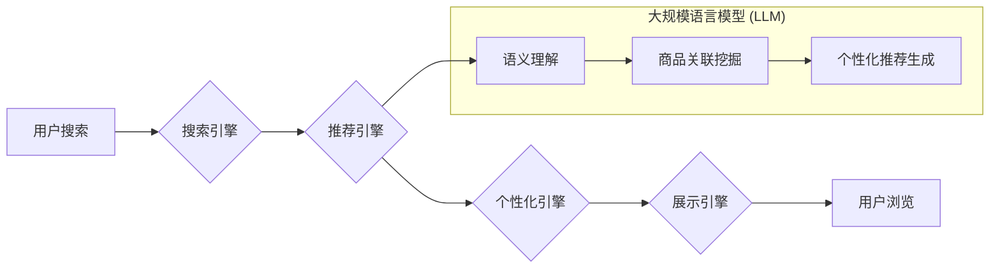

                 

## AI 大模型在电商搜索推荐中的实时处理技术：应对大规模数据与复杂计算

> 关键词：AI大模型、电商搜索推荐、实时处理、大规模数据、复杂计算、高效算法、模型压缩、分布式计算、云计算

## 1. 背景介绍

随着电商行业的蓬勃发展，用户对商品搜索和推荐的需求日益增长。传统的基于关键词匹配和协同过滤的搜索推荐算法已难以满足用户个性化、精准化和实时化的需求。近年来，大规模语言模型（LLM）的快速发展为电商搜索推荐领域带来了新的机遇。

LLM 拥有强大的语义理解和文本生成能力，能够理解用户搜索意图，挖掘商品之间的潜在关联，并生成更精准、更个性化的推荐结果。然而，将 LLM 应用于电商搜索推荐面临着诸多挑战，例如：

* **大规模数据处理:** 电商平台每天产生海量用户行为数据、商品信息数据等，需要高效地处理和分析这些数据才能训练出高质量的 LLM 模型。
* **复杂计算:** LLM 的训练和推理过程都非常复杂，需要强大的计算资源和高效的算法优化。
* **实时响应:** 用户对搜索推荐结果的期望是即时响应，需要实时处理用户请求并生成推荐结果。

## 2. 核心概念与联系

### 2.1  电商搜索推荐系统

电商搜索推荐系统旨在帮助用户快速找到所需商品，并提供个性化的商品推荐。系统通常由以下几个模块组成：

* **搜索引擎:** 处理用户搜索请求，并返回相关商品列表。
* **推荐引擎:** 基于用户行为数据、商品信息数据等，推荐用户可能感兴趣的商品。
* **个性化引擎:** 根据用户的历史行为、偏好等信息，对搜索结果和推荐结果进行个性化定制。
* **展示引擎:** 将搜索结果和推荐结果以用户友好的方式展示给用户。

### 2.2  大规模语言模型 (LLM)

LLM 是近年来深度学习领域取得的重要突破，它是一种能够理解和生成人类语言的强大人工智能模型。LLM 通常基于 Transformer 架构，通过训练海量文本数据，学习到语言的语法、语义和上下文关系。

### 2.3  实时处理技术

实时处理技术是指能够快速响应用户请求，并及时生成结果的技术。在电商搜索推荐系统中，实时处理技术对于保证用户体验至关重要。

**Mermaid 流程图**



## 3. 核心算法原理 & 具体操作步骤

### 3.1  算法原理概述

在电商搜索推荐系统中，LLM 可以用于多个环节，例如：

* **搜索结果排序:** LLM 可以理解用户搜索意图，并根据商品的语义信息对搜索结果进行排序，提高搜索结果的准确性和相关性。
* **商品推荐:** LLM 可以挖掘商品之间的潜在关联，并根据用户的历史行为和偏好，推荐用户可能感兴趣的商品。
* **个性化描述生成:** LLM 可以根据商品信息和用户的偏好，生成个性化的商品描述，提高商品的吸引力。

### 3.2  算法步骤详解

以商品推荐为例，LLM 在电商搜索推荐中的具体操作步骤如下：

1. **数据预处理:** 收集用户行为数据、商品信息数据等，并进行清洗、转换和特征提取。
2. **LLM 模型训练:** 使用预处理后的数据训练 LLM 模型，例如 BERT、GPT 等。
3. **商品嵌入:** 将商品信息转换为向量表示，以便 LLMs 进行语义理解和关联挖掘。
4. **用户兴趣建模:** 根据用户的历史行为数据，构建用户的兴趣模型，例如用户偏好、购买历史等。
5. **推荐结果生成:** 利用训练好的 LLM 模型和用户的兴趣模型，预测用户可能感兴趣的商品，并生成推荐结果。
6. **结果排序和展示:** 对推荐结果进行排序和展示，以用户友好的方式呈现给用户。

### 3.3  算法优缺点

**优点:**

* **语义理解能力强:** LLM 可以理解用户搜索意图和商品语义信息，提高推荐结果的准确性和相关性。
* **个性化推荐:** LLM 可以根据用户的历史行为和偏好，生成个性化的推荐结果。
* **跨模态学习:** LLM 可以学习多种数据类型，例如文本、图像、音频等，为商品推荐提供更丰富的语义信息。

**缺点:**

* **计算资源需求高:** LLM 的训练和推理过程都非常耗费计算资源。
* **数据依赖性强:** LLM 的性能取决于训练数据的质量和数量。
* **可解释性差:** LLM 的决策过程比较复杂，难以解释其推荐结果背后的逻辑。

### 3.4  算法应用领域

LLM 在电商搜索推荐领域之外，还广泛应用于其他领域，例如：

* **自然语言处理:** 文本分类、情感分析、机器翻译等。
* **计算机视觉:** 图像识别、物体检测、图像生成等。
* **语音识别:** 语音转文本、语音合成等。

## 4. 数学模型和公式 & 详细讲解 & 举例说明

### 4.1  数学模型构建

在电商搜索推荐系统中，LLM 可以用作一个复杂的函数映射，将用户输入和商品信息映射到推荐结果。

假设用户输入为 $u$, 商品信息为 $i$, 推荐结果为 $r$. 则可以表示为：

$$r = f(u, i, \theta)$$

其中，$\theta$ 为模型参数。

### 4.2  公式推导过程

LLM 的训练过程本质上是一个参数优化过程，目标是找到最优的模型参数 $\theta$，使得推荐结果 $r$ 与实际用户行为尽可能一致。

常用的损失函数包括交叉熵损失函数、均方误差损失函数等。

例如，使用交叉熵损失函数，目标函数可以表示为：

$$L(\theta) = -\sum_{u, i} y_{u, i} \log(p_{u, i}(\theta)) + (1 - y_{u, i}) \log(1 - p_{u, i}(\theta))$$

其中，$y_{u, i}$ 为用户 $u$ 对商品 $i$ 的点击行为，$p_{u, i}(\theta)$ 为模型预测用户 $u$ 点击商品 $i$ 的概率。

通过梯度下降算法等优化方法，不断更新模型参数 $\theta$，使得损失函数 $L(\theta)$ 最小化。

### 4.3  案例分析与讲解

假设我们有一个电商平台，用户搜索“智能手机”，系统需要推荐相关商品。

LLM 可以通过分析用户搜索词“智能手机”的语义信息，以及商品信息中的关键词、描述等，预测用户可能感兴趣的智能手机型号。

例如，LLM 可以识别出用户搜索“智能手机”的意图是寻找性能强劲、屏幕大、拍照好的智能手机。

然后，LLM 可以根据商品信息，筛选出符合用户需求的智能手机型号，并生成推荐结果。

## 5. 项目实践：代码实例和详细解释说明

### 5.1  开发环境搭建

为了实现电商搜索推荐系统，需要搭建一个合适的开发环境。

常用的开发环境包括：

* **Python:** Python 是一个流行的编程语言，拥有丰富的机器学习和深度学习库，例如 TensorFlow、PyTorch 等。
* **云计算平台:** 云计算平台，例如 AWS、Azure、GCP 等，可以提供强大的计算资源和存储空间，支持大规模数据处理和模型训练。
* **数据库:** 数据库，例如 MySQL、MongoDB 等，可以存储用户行为数据、商品信息数据等。

### 5.2  源代码详细实现

以下是一个使用 Python 和 TensorFlow 实现电商搜索推荐系统的简单代码示例：

```python
import tensorflow as tf

# 定义模型结构
model = tf.keras.Sequential([
    tf.keras.layers.Embedding(input_dim=vocab_size, output_dim=embedding_dim),
    tf.keras.layers.LSTM(units=128),
    tf.keras.layers.Dense(units=num_classes, activation='softmax')
])

# 编译模型
model.compile(optimizer='adam',
              loss='categorical_crossentropy',
              metrics=['accuracy'])

# 训练模型
model.fit(x_train, y_train, epochs=10)

# 预测结果
predictions = model.predict(x_test)
```

### 5.3  代码解读与分析

* **Embedding 层:** 将用户输入和商品信息转换为向量表示。
* **LSTM 层:** 学习用户行为和商品信息之间的时序关系。
* **Dense 层:** 将 LSTM 输出映射到推荐结果。
* **编译模型:** 选择优化器、损失函数和评价指标。
* **训练模型:** 使用训练数据训练模型参数。
* **预测结果:** 使用训练好的模型预测用户可能感兴趣的商品。

### 5.4  运行结果展示

训练完成后，可以评估模型的性能，例如准确率、召回率等。

也可以将模型部署到线上环境，实时处理用户请求并生成推荐结果。

## 6. 实际应用场景

### 6.1  电商平台商品推荐

电商平台可以利用 LLM 进行商品推荐，例如：

* **个性化推荐:** 根据用户的历史购买记录、浏览记录等，推荐用户可能感兴趣的商品。
* **关联推荐:** 根据用户浏览或购买的商品，推荐与之相关的商品。
* **新品推荐:** 推荐平台上最新的商品。

### 6.2  搜索引擎结果排序

搜索引擎可以利用 LLM 对搜索结果进行排序，提高搜索结果的准确性和相关性。

例如，当用户搜索“智能手机”时，LLM 可以理解用户搜索的意图，并根据商品的语义信息对搜索结果进行排序，优先展示符合用户需求的商品。

### 6.3  内容生成

LLM 可以用于生成电商平台上的商品描述、促销文案等内容。

例如，LLM 可以根据商品信息，生成个性化的商品描述，提高商品的吸引力。

### 6.4  未来应用展望

随着 LLM 技术的不断发展，其在电商搜索推荐领域的应用场景将更加广泛，例如：

* **多模态推荐:** 利用图像、视频等多模态数据进行商品推荐。
* **对话式推荐:** 通过对话方式与用户交互，更精准地理解用户的需求，并提供个性化的推荐结果。
* **实时个性化推荐:** 基于用户的实时行为，动态调整推荐结果，提供更精准的个性化体验。

## 7. 工具和资源推荐

### 7.1  学习资源推荐

* **书籍:**

    * 《深度学习》 by Ian Goodfellow, Yoshua Bengio, Aaron Courville
    * 《自然语言处理》 by Dan Jurafsky, James H. Martin

* **在线课程:**

    * Coursera: 深度学习 Specialization
    * Udacity: 自然语言处理 Nanodegree

### 7.2  开发工具推荐

* **TensorFlow:** 开源深度学习框架，支持多种模型类型和硬件平台。
* **PyTorch:** 开源深度学习框架，以其灵活性和易用性而闻名。
* **Hugging Face Transformers:** 提供预训练的 LLM 模型和工具，方便开发者快速构建和部署 LLM 应用。

### 7.3  相关论文推荐

* **BERT: Pre-training of Deep Bidirectional Transformers for Language Understanding**
* **GPT-3: Language Models are Few-Shot Learners**
* **T5: Text-to-Text Transfer Transformer**

## 8. 总结：未来发展趋势与挑战

### 8.1  研究成果总结

近年来，LLM 在电商搜索推荐领域取得了显著的成果，例如：

* **提高推荐准确率:** LLM 可以理解用户搜索意图和商品语义信息，提高推荐结果的准确性和相关性。
* **个性化推荐:** LLM 可以根据用户的历史行为和偏好，生成个性化的推荐结果。
* **跨模态学习:** LLM 可以学习多种数据类型，为商品推荐提供更丰富的语义信息。

### 8.2  未来发展趋势

未来，LLM 在电商搜索推荐领域的应用将朝着以下几个方向发展：

* **更强大的模型:** 研究更强大的 LLM 模型，例如参数规模更大、性能更优的模型。
* **更精准的推荐:** 利用更丰富的用户数据和商品信息，提高推荐结果的精准度。
* **更个性化的体验:** 基于用户的实时行为，动态调整推荐结果，提供更个性化的体验。
* **更安全的推荐:** 确保推荐结果的安全性和可靠性，避免推荐有害或不合适的商品。

### 8.3  面临的挑战

LLM 在电商搜索推荐领域也面临着一些挑战：

* **计算资源需求高:** 训练和推理大型 LLM 模型需要大量的计算资源。
* **数据依赖性强:** LLM 的性能取决于训练数据的质量和数量。
* **可解释性差:** LLM 的决策过程比较复杂，难以解释其推荐结果背后的逻辑。
* **公平性问题:** LLM 可能存在偏见，导致推荐结果不公平。

### 8.4  研究展望

未来，需要进一步研究如何解决 LLM 在电商搜索推荐领域的挑战，例如：

* **模型压缩:** 研究更有效的模型压缩技术，降低 LLM 的计算资源需求。
* **数据增强:** 研究数据增强技术，提高训练数据的质量和数量。
* **可解释性研究:** 研究 LLM 的可解释性，使其决策过程更加透明。
* **公平性研究:** 研究如何避免 LLM 的偏见，确保推荐结果公平。


## 9. 附录：常见问题与解答

### 9.1  Q1: 如何选择合适的 LLM 模型？

**A1:** 选择合适的 LLM 模型需要根据具体应用场景和需求进行选择。

例如，对于电商搜索推荐场景，可以选择预训练的文本分类模型，例如 BERT、RoBERTa 等。

### 9.2  Q2: 如何处理大规模数据？

**A2:** 处理大规模数据可以使用分布式计算框架，例如 TensorFlow Distributed、PyTorch Distributed 等。

也可以使用云计算平台提供的服务，例如 AWS EMR、Azure HDInsight 等。

### 9.3  Q3: 如何评估 LLM 模型的性能？

**A3:** 可以使用多种指标评估 LLM 模型的性能，例如准确率、召回率、F1-score 等。

也可以使用用户反馈和点击率等指标进行评估。

### 9.4  Q4: 如何部署 LLM 模型？

**A4:** 可以将训练好的 LLM 模型部署到云端服务器、边缘设备等。

可以使用容器化技术，例如 Docker、Kubernetes 等，方便模型部署和管理。


作者：禅与计算机程序设计艺术 / Zen and the Art of Computer Programming<end_of_turn>

