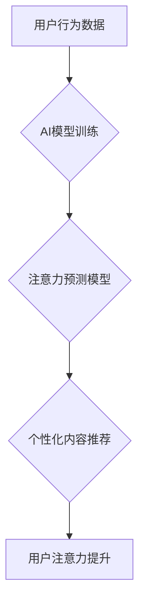

                 

## AI与人类注意力流：未来的工作场所与注意力经济

> 关键词：人工智能、注意力经济、人类注意力流、工作场所、深度学习、认知科学、用户体验、未来趋势

## 1. 背景介绍

在信息爆炸的时代，人类的注意力成为稀缺资源。我们每天被来自各种渠道的信息轰炸，从社交媒体的通知到电子邮件的提醒，从新闻网站的滚动条到广告的推送，无处不在的干扰让我们难以集中精力完成任务。

与此同时，人工智能（AI）技术飞速发展，深度学习算法的突破使得机器能够模拟人类的认知能力，包括理解语言、识别图像、做出决策等。AI技术的应用正在各个领域迅速普及，从自动驾驶到医疗诊断，从个性化推荐到智能客服，AI正在改变着我们的生活方式。

然而，AI技术的快速发展也带来了新的挑战。一方面，AI算法的训练需要海量数据，而这些数据往往来自用户的个人信息，引发了数据隐私和安全问题。另一方面，AI技术的应用可能会导致失业和社会不平等问题，因为AI能够自动化完成许多人类的工作。

在这样的背景下，如何更好地利用AI技术，同时保护人类的注意力和隐私，成为一个重要的议题。

## 2. 核心概念与联系

### 2.1 人类注意力流

人类注意力流是指人类对信息的感知、选择和处理过程。它是一个复杂的心理过程，受多种因素影响，包括个体差异、环境刺激、任务要求等。

注意力流可以分为以下几个阶段：

* **感知阶段:** 接收来自外部环境的信息。
* **选择阶段:** 从众多信息中选择关注的信息。
* **处理阶段:** 对选中的信息进行理解、记忆和决策。

### 2.2 注意力经济

注意力经济是指在信息爆炸的时代，注意力成为一种稀缺资源，而能够有效获取和利用用户注意力的产品和服务具有更高的价值。

注意力经济的核心概念是：

* **注意力是有限的:** 人类只能同时关注有限的信息量。
* **注意力是可衡量的:** 可以通过各种指标来衡量用户的注意力，例如停留时间、点击率、阅读量等。
* **注意力是可交易的:** 可以通过付费、广告等方式来获取用户的注意力。

### 2.3 AI与注意力流的联系

AI技术可以帮助我们更好地理解和预测人类注意力流，从而开发出更有效的注意力管理工具和服务。

例如：

* **个性化推荐:** AI算法可以根据用户的历史行为和偏好，推荐他们感兴趣的内容，从而提高用户的注意力集中度。
* **干扰过滤:** AI算法可以识别和过滤掉无关的信息，帮助用户集中精力完成任务。
* **注意力训练:** AI算法可以设计个性化的注意力训练游戏，帮助用户提高注意力控制能力。

**Mermaid 流程图**



## 3. 核心算法原理 & 具体操作步骤

### 3.1 算法原理概述

在AI与人类注意力流的结合中，深度学习算法扮演着核心角色。其中，循环神经网络（RNN）和变分自编码器（VAE）是常用的算法模型。

* **循环神经网络（RNN）:** RNN是一种能够处理序列数据的深度学习模型，其内部结构包含循环单元，能够记忆之前的信息，从而更好地理解时间序列数据，例如用户的浏览历史、点击记录等。

* **变分自编码器（VAE）:** VAE是一种生成式模型，能够学习数据的潜在表示，并生成新的数据样本。在注意力流分析中，VAE可以用来学习用户的注意力模式，并生成模拟用户的注意力流的轨迹。

### 3.2 算法步骤详解

**使用RNN分析用户注意力流的步骤:**

1. **数据收集:** 收集用户的行为数据，例如浏览历史、点击记录、停留时间等。
2. **数据预处理:** 对收集到的数据进行清洗、转换和编码，使其适合RNN模型的输入。
3. **模型训练:** 使用RNN模型训练，学习用户的注意力模式。
4. **注意力预测:** 将用户的最新行为数据输入到训练好的RNN模型中，预测用户的下一个注意力目标。

**使用VAE生成模拟用户注意力流的步骤:**

1. **数据收集:** 收集用户的行为数据，例如浏览历史、点击记录、停留时间等。
2. **数据预处理:** 对收集到的数据进行清洗、转换和编码，使其适合VAE模型的输入。
3. **模型训练:** 使用VAE模型训练，学习用户的注意力模式。
4. **注意力生成:** 使用训练好的VAE模型，生成模拟用户的注意力流的轨迹。

### 3.3 算法优缺点

**RNN算法的优点:**

* 能够处理序列数据，理解时间依赖关系。
* 在文本分析、语音识别等领域表现出色。

**RNN算法的缺点:**

* 训练过程复杂，容易出现梯度消失问题。
* 对长序列数据的处理能力有限。

**VAE算法的优点:**

* 能够学习数据的潜在表示，生成新的数据样本。
* 在图像生成、文本生成等领域表现出色。

**VAE算法的缺点:**

* 训练过程复杂，需要调优多个参数。
* 生成的数据样本可能缺乏多样性。

### 3.4 算法应用领域

* **个性化推荐:** 根据用户的注意力流，推荐他们感兴趣的内容。
* **内容优化:** 分析用户的注意力流，优化内容的结构和布局，提高用户阅读体验。
* **广告投放:** 根据用户的注意力流，精准投放广告，提高广告转化率。
* **教育培训:** 根据学生的注意力流，个性化定制学习内容和节奏。

## 4. 数学模型和公式 & 详细讲解 & 举例说明

### 4.1 数学模型构建

在分析用户注意力流时，可以使用马尔可夫模型来描述用户的注意力转移过程。马尔可夫模型假设用户在当前时刻的注意力状态只依赖于前一个时刻的注意力状态，与更早之前的状态无关。

**状态转移概率矩阵:**

$$
P = \begin{bmatrix}
p_{11} & p_{12} & \dots & p_{1N} \\
p_{21} & p_{22} & \dots & p_{2N} \\
\vdots & \vdots & \ddots & \vdots \\
p_{N1} & p_{N2} & \dots & p_{NN}
\end{bmatrix}
$$

其中，$p_{ij}$ 表示用户从状态 $i$ 转移到状态 $j$ 的概率。

**状态分布向量:**

$$
\pi = \begin{bmatrix}
\pi_1 & \pi_2 & \dots & \pi_N
\end{bmatrix}
$$

其中，$\pi_i$ 表示用户处于状态 $i$ 的概率。

### 4.2 公式推导过程

根据马尔可夫模型的假设，用户在时间步 $t$ 的注意力状态 $s_t$ 可以通过以下公式计算:

$$
s_t = \sum_{i=1}^{N} p_{s_{t-1}i} \cdot s_i
$$

其中，$s_{t-1}$ 表示用户在时间步 $t-1$ 的注意力状态。

### 4.3 案例分析与讲解

假设用户有三个可能的注意力状态:

* $s_1$: 阅读新闻
* $s_2$: 浏览社交媒体
* $s_3$: 工作

我们可以根据用户的历史行为数据，估计状态转移概率矩阵 $P$ 和状态分布向量 $\pi$。

例如，如果用户的历史行为数据显示，用户从阅读新闻状态转移到浏览社交媒体状态的概率为 0.6，那么 $p_{12} = 0.6$。

然后，我们可以使用上述公式来预测用户的下一个注意力状态。

## 5. 项目实践：代码实例和详细解释说明

### 5.1 开发环境搭建

* **操作系统:** Ubuntu 20.04 LTS
* **编程语言:** Python 3.8
* **深度学习框架:** TensorFlow 2.0
* **其他工具:** Jupyter Notebook

### 5.2 源代码详细实现

```python
import tensorflow as tf

# 定义RNN模型
model = tf.keras.Sequential([
    tf.keras.layers.Embedding(input_dim=vocab_size, output_dim=embedding_dim),
    tf.keras.layers.LSTM(units=128),
    tf.keras.layers.Dense(units=num_classes, activation='softmax')
])

# 编译模型
model.compile(optimizer='adam',
              loss='sparse_categorical_crossentropy',
              metrics=['accuracy'])

# 训练模型
model.fit(x_train, y_train, epochs=10)

# 预测用户下一个注意力状态
predictions = model.predict(x_test)
```

### 5.3 代码解读与分析

* **Embedding层:** 将用户的行为数据转换为稠密的向量表示。
* **LSTM层:** 处理用户的行为序列数据，学习用户的注意力模式。
* **Dense层:** 将LSTM层的输出转换为用户下一个注意力状态的概率分布。
* **编译模型:** 使用Adam优化器、交叉熵损失函数和准确率作为评估指标。
* **训练模型:** 使用训练数据训练模型。
* **预测用户下一个注意力状态:** 将测试数据输入到训练好的模型中，预测用户的下一个注意力状态。

### 5.4 运行结果展示

训练完成后，我们可以使用测试数据评估模型的性能，例如计算准确率、召回率等指标。

## 6. 实际应用场景

### 6.1 个性化推荐系统

AI可以分析用户的注意力流，推荐他们感兴趣的内容，例如新闻、视频、商品等。

### 6.2 内容优化

AI可以分析用户的注意力流，优化内容的结构和布局，提高用户阅读体验。例如，可以根据用户的注意力流，调整文章的标题、段落长度、图片位置等。

### 6.3 广告投放

AI可以根据用户的注意力流，精准投放广告，提高广告转化率。例如，可以根据用户的注意力流，选择他们感兴趣的广告内容和投放时间。

### 6.4 未来应用展望

* **沉浸式体验:** AI可以根据用户的注意力流，定制沉浸式体验，例如虚拟现实游戏、增强现实应用等。
* **教育培训:** AI可以根据学生的注意力流，个性化定制学习内容和节奏，提高学习效率。
* **医疗诊断:** AI可以分析患者的注意力流，辅助医生进行诊断和治疗。

## 7. 工具和资源推荐

### 7.1 学习资源推荐

* **书籍:**
    * 《深度学习》 by Ian Goodfellow, Yoshua Bengio, and Aaron Courville
    * 《自然语言处理》 by Dan Jurafsky and James H. Martin
* **在线课程:**
    * Coursera: Deep Learning Specialization
    * Udacity: Machine Learning Engineer Nanodegree
* **博客和网站:**
    * Towards Data Science
    * Machine Learning Mastery

### 7.2 开发工具推荐

* **深度学习框架:** TensorFlow, PyTorch, Keras
* **数据处理工具:** Pandas, NumPy
* **可视化工具:** Matplotlib, Seaborn

### 7.3 相关论文推荐

* **Attention Is All You Need:** https://arxiv.org/abs/1706.03762
* **BERT: Pre-training of Deep Bidirectional Transformers for Language Understanding:** https://arxiv.org/abs/1810.04805
* **Generative Adversarial Networks:** https://arxiv.org/abs/1406.2661

## 8. 总结：未来发展趋势与挑战

### 8.1 研究成果总结

AI与人类注意力流的结合取得了显著的成果，例如：

* 能够更好地理解和预测用户的注意力模式。
* 开发出更有效的注意力管理工具和服务。
* 在个性化推荐、内容优化、广告投放等领域取得了应用成功。

### 8.2 未来发展趋势

* **更精准的注意力预测:** 利用更先进的深度学习算法和数据分析技术，更精准地预测用户的注意力流。
* **更个性化的注意力管理:** 根据用户的注意力模式，定制个性化的注意力管理方案，帮助用户提高注意力集中度和效率。
* **更广泛的应用场景:** 将AI与人类注意力流的结合应用到更多领域，例如教育培训、医疗诊断、沉浸式体验等。

### 8.3 面临的挑战

* **数据隐私和安全:** AI算法的训练需要海量数据，如何保护用户的隐私和安全是一个重要的挑战。
* **算法解释性和可信度:** 深度学习算法的决策过程往往难以解释，如何提高算法的解释性和可信度是一个重要的研究方向。
* **伦理问题:** AI与人类注意力流的结合可能会引发一些伦理问题，例如注意力操控、信息茧房等，需要引起重视和讨论。

### 8.4 研究展望

未来，AI与人类注意力流的研究将继续深入，探索更精准的注意力预测模型、更个性化的注意力管理方案和更广泛的应用场景。同时，也需要关注数据隐私和安全、算法解释性和可信度、伦理问题等挑战，确保AI技术能够安全、有效地服务于人类。

## 9. 附录：常见问题与解答

**Q1: 如何收集用户的注意力流数据？**

**A1:** 可以通过以下方式收集用户的注意力流数据:

* **网页浏览记录:** 记录用户在网页上的点击、停留时间、滚动条位置等信息。
* **应用程序使用记录:** 记录用户在应用程序中的操作、停留时间、交互事件等信息。
* **眼动追踪:** 使用眼动追踪设备记录用户的视线轨迹。

**Q2: 如何评估AI模型的注意力预测性能？**

**A2:** 可以使用以下指标评估AI模型的注意力预测性能:

* **准确率:** 预测正确的注意力状态的比例。
* **召回率:** 预测出所有真实注意力状态的比例。
* **F1-score:** 准确率和召回率的调和平均值。

**Q3: AI技术可能会导致失业吗？**

**A3:** AI技术可能会导致一些工作岗位消失，但也将会创造新的工作岗位。重要的是，我们需要积极适应AI技术的发展，提升自身的技能和竞争力。


作者：禅与计算机程序设计艺术 / Zen and the Art of Computer Programming 
<end_of_turn>

