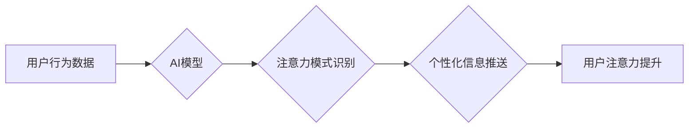

                 

## AI与人类注意力流：未来的工作场所与注意力经济的融合

> 关键词：人工智能、注意力经济、注意力流、工作场所、深度学习、认知科学、用户体验、未来趋势

## 1. 背景介绍

在信息爆炸的时代，人类的注意力成为稀缺资源。我们每天被来自各种渠道的信息轰炸，从电子邮件、社交媒体到新闻推送，无处不在的通知和提醒不断抢夺着我们的注意力。这种注意力竞争日益激烈，对个人和组织都带来了挑战。

与此同时，人工智能（AI）技术飞速发展，深度学习算法取得了突破性进展，赋予机器学习识别、理解和预测人类行为的能力。其中，AI在分析和预测人类注意力流方面展现出巨大潜力。

## 2. 核心概念与联系

### 2.1 注意力经济

注意力经济是指在信息过载的时代，注意力成为一种重要的经济资源。人们愿意为获得优质信息、提升注意力效率而付费。

### 2.2 人类注意力流

人类注意力流是指人们在一段时间内对特定信息的关注程度和持续时间。它是一个动态变化的过程，受多种因素影响，例如个人兴趣、任务重要性、环境刺激等。

### 2.3 AI与注意力流

AI技术可以帮助我们更好地理解和预测人类注意力流。通过分析用户的行为数据、眼动追踪、脑电波等信息，AI算法可以识别用户的注意力模式，并根据这些模式提供个性化的信息推送、内容推荐和用户体验优化。

**Mermaid 流程图**



## 3. 核心算法原理 & 具体操作步骤

### 3.1 算法原理概述

预测人类注意力流的算法通常基于深度学习技术，例如循环神经网络（RNN）和长短期记忆网络（LSTM）。这些算法可以学习用户历史行为数据中的模式，并根据这些模式预测用户对未来信息的注意力程度。

### 3.2 算法步骤详解

1. **数据收集:** 收集用户行为数据，例如浏览记录、点击记录、停留时间等。
2. **数据预处理:** 对收集到的数据进行清洗、转换和特征提取。
3. **模型训练:** 使用深度学习算法训练模型，学习用户注意力模式。
4. **模型评估:** 使用测试数据评估模型的预测准确率。
5. **模型部署:** 将训练好的模型部署到实际应用场景中，用于预测用户注意力流。

### 3.3 算法优缺点

**优点:**

* 能够学习复杂的用户注意力模式。
* 预测精度较高。
* 可根据用户行为动态调整预测结果。

**缺点:**

* 需要大量的数据进行训练。
* 训练过程复杂，需要专业的技术人员。
* 模型解释性较差，难以理解模型的决策过程。

### 3.4 算法应用领域

* **个性化内容推荐:** 根据用户的注意力模式，推荐更符合用户兴趣的内容。
* **信息过滤:** 过滤掉用户不感兴趣的信息，提高信息利用效率。
* **用户体验优化:** 根据用户的注意力流，优化网站布局、内容格式和交互设计。
* **教育领域:** 根据学生的注意力模式，个性化教学内容和学习节奏。

## 4. 数学模型和公式 & 详细讲解 & 举例说明

### 4.1 数学模型构建

假设用户对某一信息 $i$ 的注意力分数为 $a_i$, 则可以构建一个注意力得分函数 $f(x)$ 来预测用户对信息 $i$ 的注意力分数，其中 $x$ 为用户历史行为数据。

$$
f(x) = \sum_{j=1}^{n} w_j * h_j(x)
$$

其中:

* $w_j$ 为每个特征 $h_j(x)$ 的权重。
* $h_j(x)$ 为第 $j$ 个特征对信息 $i$ 的注意力贡献。

### 4.2 公式推导过程

可以通过训练深度学习模型来学习每个特征的权重 $w_j$ 和注意力贡献函数 $h_j(x)$。常用的深度学习模型包括循环神经网络（RNN）和长短期记忆网络（LSTM）。

### 4.3 案例分析与讲解

例如，在推荐系统中，我们可以使用用户的浏览历史、点击记录、停留时间等数据作为特征 $x$，训练一个注意力得分函数来预测用户对某一商品的注意力分数。

## 5. 项目实践：代码实例和详细解释说明

### 5.1 开发环境搭建

* Python 3.x
* TensorFlow 或 PyTorch 深度学习框架
* Jupyter Notebook 或 VS Code 代码编辑器

### 5.2 源代码详细实现

```python
import tensorflow as tf

# 定义注意力得分函数
def attention_score_function(user_history, item_features):
    # 使用 RNN 或 LSTM 模型学习用户注意力模式
    # ...
    return attention_scores

# 训练模型
model = tf.keras.Sequential([
    # ... 模型结构定义 ...
])
model.compile(optimizer='adam', loss='mse')
model.fit(user_history, attention_scores, epochs=10)

# 使用训练好的模型预测用户注意力
predicted_attention_scores = model.predict(new_user_history)
```

### 5.3 代码解读与分析

* 代码首先定义了一个注意力得分函数 `attention_score_function`，该函数接收用户的历史行为数据和商品特征作为输入，并输出用户对商品的注意力分数。
* 然后，代码使用 TensorFlow 或 PyTorch 框架构建了一个深度学习模型，并使用用户的历史行为数据和注意力分数进行训练。
* 最后，代码使用训练好的模型预测用户对新商品的注意力分数。

### 5.4 运行结果展示

运行结果将显示用户对不同商品的注意力分数，可以根据这些分数进行个性化商品推荐。

## 6. 实际应用场景

### 6.1 内容推荐系统

AI可以分析用户的阅读习惯、浏览历史和点赞记录，预测用户对哪些内容感兴趣，并推荐更符合用户口味的内容。

### 6.2 广告投放

AI可以根据用户的注意力流，精准投放广告，提高广告点击率和转化率。

### 6.3 教育领域

AI可以根据学生的注意力模式，个性化教学内容和学习节奏，提高学生的学习效率。

### 6.4 未来应用展望

随着AI技术的不断发展，未来将有更多应用场景出现，例如：

* **虚拟现实和增强现实:** AI可以根据用户的注意力流，提供更沉浸式的虚拟现实和增强现实体验。
* **自动驾驶:** AI可以根据驾驶员的注意力流，调整驾驶辅助系统的工作模式，提高驾驶安全。
* **医疗诊断:** AI可以分析患者的注意力流，辅助医生进行疾病诊断。

## 7. 工具和资源推荐

### 7.1 学习资源推荐

* **书籍:**
    * 《深度学习》
    * 《机器学习》
* **在线课程:**
    * Coursera
    * edX
* **开源项目:**
    * TensorFlow
    * PyTorch

### 7.2 开发工具推荐

* **Python:** 
* **Jupyter Notebook:** 
* **VS Code:** 

### 7.3 相关论文推荐

* **Attention Is All You Need:** https://arxiv.org/abs/1706.03762
* **BERT: Pre-training of Deep Bidirectional Transformers for Language Understanding:** https://arxiv.org/abs/1810.04805

## 8. 总结：未来发展趋势与挑战

### 8.1 研究成果总结

AI技术在预测人类注意力流方面取得了显著进展，为个性化内容推荐、广告投放、教育领域等多个领域提供了新的应用场景。

### 8.2 未来发展趋势

* **更精准的注意力预测:** 随着深度学习算法的不断发展，未来将能够更精准地预测用户的注意力流。
* **更个性化的用户体验:** AI可以根据用户的注意力模式，提供更个性化的用户体验，例如个性化内容推荐、个性化学习计划等。
* **跨模态注意力预测:** 未来将能够预测用户对不同模态信息（例如文本、图像、音频）的注意力流，提供更丰富的用户体验。

### 8.3 面临的挑战

* **数据隐私:** 收集和使用用户行为数据需要考虑数据隐私问题。
* **算法解释性:** 深度学习模型的决策过程难以解释，这可能会导致用户对AI技术的信任度下降。
* **伦理问题:** AI技术可能会被用于操纵用户的注意力，因此需要考虑AI技术的伦理问题。

### 8.4 研究展望

未来研究方向包括：

* 开发更隐私保护的注意力预测算法。
* 提高深度学习模型的解释性。
* 研究AI技术在注意力经济中的伦理问题。

## 9. 附录：常见问题与解答

**Q1: 如何收集用户行为数据？**

**A1:** 可以通过网站分析工具、App内数据收集、用户调查等方式收集用户行为数据。

**Q2: 如何保证数据隐私？**

**A2:** 可以采用数据匿名化、加密等技术保护用户数据隐私。

**Q3: 如何评估注意力预测模型的准确性？**

**A3:** 可以使用准确率、召回率、F1-score等指标评估模型的准确性。

作者：禅与计算机程序设计艺术 / Zen and the Art of Computer Programming 


<end_of_turn>

