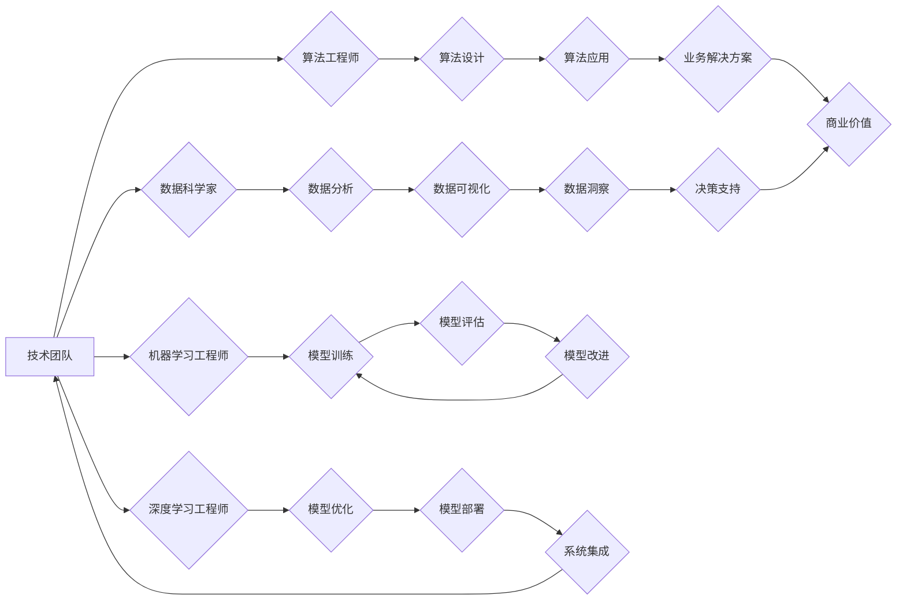

                 

## AI人才荒中的突围：Lepton AI的团队建设

> 关键词：人工智能、人才荒、团队建设、Lepton AI、技术架构、机器学习、深度学习、数据科学

### 1. 背景介绍

近年来，人工智能（AI）技术蓬勃发展，已渗透到各个领域，成为推动社会进步的重要力量。然而，随着AI应用的日益广泛，也暴露出AI人才严重短缺的现状，这被称为“AI人才荒”。 

**1.1 AI人才荒的现状**

* **需求量大，供给不足:**  全球范围内，对AI人才的需求量呈指数级增长，而现有的人才储备远远无法满足市场需求。
* **人才结构不合理:**  AI人才结构不均衡，高层次人才稀缺，而低层次人才相对过剩。
* **人才培养周期长:**  培养一名合格的AI人才需要较长的学习和实践时间，难以快速满足市场需求。

**1.2 AI人才荒对企业的影响**

* **项目进度受阻:**  缺乏AI人才会导致项目进度延迟，甚至无法按计划实施。
* **技术创新受限:**  缺乏AI人才会限制企业的技术创新能力，难以在AI领域保持竞争优势。
* **企业发展受阻:**  长期缺乏AI人才，将严重阻碍企业的可持续发展。

### 2. 核心概念与联系

Lepton AI 作为一家致力于突破AI人才荒困境的科技公司，我们深知人才的重要性，并构建了一套独特的团队建设体系，旨在培养和吸引顶尖AI人才。

**2.1 核心概念**

* **多元化团队:**  Lepton AI 倡导多元化团队建设，汇聚来自不同背景、不同专业领域的优秀人才，形成多学科交叉融合的创新氛围。
* **开放合作:**  Lepton AI 鼓励团队成员之间开放合作，打破部门壁垒，共同解决问题，促进知识共享和协同创新。
* **持续学习:**  Lepton AI 强调持续学习的重要性，为团队成员提供丰富的学习资源和培训机会，帮助他们不断提升专业技能和知识水平。

**2.2 团队架构**



### 3. 核心算法原理 & 具体操作步骤

Lepton AI 致力于研发和应用最先进的AI算法，为客户提供最优的解决方案。

**3.1 算法原理概述**

Lepton AI 主要采用以下核心算法：

* **深度学习:**  深度学习是机器学习的一种重要分支，利用多层神经网络模拟人类大脑的学习过程，能够处理复杂的数据模式，并实现高精度的人工智能应用。
* **强化学习:**  强化学习是一种基于奖励机制的机器学习算法，通过不断与环境交互，学习最优的策略，能够解决复杂决策问题。
* **自然语言处理:**  自然语言处理是人工智能领域的重要研究方向，旨在使计算机能够理解和处理人类语言，应用于文本分类、机器翻译、对话系统等领域。

**3.2 算法步骤详解**

以深度学习为例，其基本步骤包括：

1. **数据收集和预处理:**  收集并清洗训练数据，将其转换为模型可理解的格式。
2. **模型构建:**  根据任务需求选择合适的深度学习模型架构，并设置模型参数。
3. **模型训练:**  利用训练数据训练模型，调整模型参数，使其能够准确预测目标输出。
4. **模型评估:**  使用测试数据评估模型的性能，并进行必要的调整。
5. **模型部署:**  将训练好的模型部署到实际应用场景中，实现人工智能功能。

**3.3 算法优缺点**

* **深度学习:**  优点：高精度、可处理复杂数据模式；缺点：训练数据量大、计算资源消耗高、解释性差。
* **强化学习:**  优点：能够解决复杂决策问题、适应性强；缺点：训练过程复杂、需要大量的试错次数。
* **自然语言处理:**  优点：能够理解和处理人类语言；缺点：语义理解复杂、需要大量的语料库训练。

**3.4 算法应用领域**

Lepton AI 的核心算法应用于以下领域：

* **计算机视觉:**  图像识别、目标检测、图像分割等。
* **语音识别:**  语音转文本、语音助手等。
* **自然语言理解:**  文本分类、情感分析、机器翻译等。
* **推荐系统:**  个性化推荐、内容推荐等。
* **医疗诊断:**  疾病诊断、影像分析等。

### 4. 数学模型和公式 & 详细讲解 & 举例说明

**4.1 数学模型构建**

深度学习模型通常采用神经网络结构，其数学模型可以表示为：

$$
y = f(W x + b)
$$

其中：

* $y$ 是模型输出
* $x$ 是输入数据
* $W$ 是权重矩阵
* $b$ 是偏置向量
* $f$ 是激活函数

**4.2 公式推导过程**

模型训练过程是通过优化权重矩阵 $W$ 和偏置向量 $b$ 来实现的，常用的优化算法包括梯度下降法和Adam算法。

梯度下降法的核心思想是通过不断迭代更新权重和偏置，使模型输出与真实值之间的误差最小化。

**4.3 案例分析与讲解**

以图像分类为例，假设我们有一个包含猫和狗的图像数据集，目标是训练一个模型能够区分猫和狗。

1. **数据预处理:** 将图像数据转换为模型可理解的格式，例如将图像尺寸调整为固定大小，并将其像素值转换为浮点数。
2. **模型构建:** 选择一个合适的深度学习模型架构，例如卷积神经网络（CNN）。
3. **模型训练:** 利用训练数据训练模型，并使用交叉熵损失函数来衡量模型的性能。
4. **模型评估:** 使用测试数据评估模型的准确率，并进行必要的调整。

### 5. 项目实践：代码实例和详细解释说明

**5.1 开发环境搭建**

Lepton AI 的开发环境基于Python语言，并使用以下开源框架和工具：

* **TensorFlow:**  深度学习框架
* **PyTorch:**  深度学习框架
* **Keras:**  深度学习框架
* **NumPy:**  数值计算库
* **Pandas:**  数据分析库
* **Scikit-learn:**  机器学习库

**5.2 源代码详细实现**

以下是一个简单的图像分类代码示例，使用TensorFlow框架实现：

```python
import tensorflow as tf

# 定义模型架构
model = tf.keras.models.Sequential([
  tf.keras.layers.Conv2D(32, (3, 3), activation='relu', input_shape=(28, 28, 1)),
  tf.keras.layers.MaxPooling2D((2, 2)),
  tf.keras.layers.Conv2D(64, (3, 3), activation='relu'),
  tf.keras.layers.MaxPooling2D((2, 2)),
  tf.keras.layers.Flatten(),
  tf.keras.layers.Dense(10, activation='softmax')
])

# 编译模型
model.compile(optimizer='adam',
              loss='sparse_categorical_crossentropy',
              metrics=['accuracy'])

# 训练模型
model.fit(x_train, y_train, epochs=5)

# 评估模型
loss, accuracy = model.evaluate(x_test, y_test)
print('Test loss:', loss)
print('Test accuracy:', accuracy)
```

**5.3 代码解读与分析**

* 代码首先定义了一个简单的卷积神经网络模型架构，包含卷积层、池化层和全连接层。
* 然后，使用Adam优化器、交叉熵损失函数和准确率指标编译模型。
* 最后，使用训练数据训练模型，并使用测试数据评估模型的性能。

**5.4 运行结果展示**

训练完成后，模型的准确率会随着训练轮数的增加而提高。

### 6. 实际应用场景

Lepton AI 的AI技术应用于以下实际场景：

* **智能客服:**  利用自然语言处理技术，构建智能客服系统，自动回复客户常见问题，提高客户服务效率。
* **精准营销:**  利用机器学习算法，分析用户行为数据，进行精准营销，提高营销效果。
* **风险控制:**  利用机器学习算法，分析金融数据，识别风险，降低金融风险。
* **医疗辅助诊断:**  利用深度学习算法，辅助医生进行疾病诊断，提高诊断准确率。

**6.4 未来应用展望**

Lepton AI 将继续探索AI技术的应用，为更多领域提供智能解决方案，例如：

* **自动驾驶:**  利用深度学习算法，实现自动驾驶功能。
* **个性化教育:**  利用机器学习算法，提供个性化教育方案。
* **智能制造:**  利用AI技术，提高制造效率和产品质量。

### 7. 工具和资源推荐

**7.1 学习资源推荐**

* **在线课程:**  Coursera、edX、Udacity 等平台提供丰富的AI课程。
* **书籍:**  《深度学习》、《机器学习实战》等经典书籍。
* **开源社区:**  GitHub、Stack Overflow 等开源社区提供丰富的AI资源和技术支持。

**7.2 开发工具推荐**

* **深度学习框架:**  TensorFlow、PyTorch、Keras 等。
* **数据分析工具:**  NumPy、Pandas、Scikit-learn 等。
* **云计算平台:**  AWS、Azure、GCP 等。

**7.3 相关论文推荐**

* **《ImageNet Classification with Deep Convolutional Neural Networks》**
* **《Attention Is All You Need》**
* **《Generative Adversarial Networks》**

### 8. 总结：未来发展趋势与挑战

**8.1 研究成果总结**

Lepton AI 在AI人才培养和技术研发方面取得了显著成果，构建了一支高素质的AI人才团队，并研发了一系列领先的AI算法和解决方案。

**8.2 未来发展趋势**

* **AI技术更加普惠:**  AI技术将更加普及，应用于更多领域和场景。
* **AI模型更加智能:**  AI模型将更加智能，能够解决更复杂的问题。
* **AI伦理更加重要:**  随着AI技术的进步，AI伦理问题将更加重要。

**8.3 面临的挑战**

* **人才短缺:**  AI人才仍然短缺，需要持续加大人才培养力度。
* **技术瓶颈:**  AI技术发展还面临一些瓶颈，需要不断突破。
* **伦理风险:**  AI技术发展需要关注伦理风险，确保其安全可控。

**8.4 研究展望**

Lepton AI 将继续致力于突破AI技术瓶颈，培养更多AI人才，推动AI技术向更广阔的领域发展，为人类社会创造更多价值。

### 9. 附录：常见问题与解答

**9.1 如何加入Lepton AI团队？**

Lepton AI 欢迎所有对AI技术充满热情和潜力的优秀人才加入我们的团队。您可以通过我们的官网或招聘平台提交简历。

**9.2 Lepton AI 的AI技术有哪些优势？**

Lepton AI 的AI技术优势在于：

* **核心算法先进:**  Lepton AI 拥有领先的AI算法，能够解决复杂问题。
* **团队实力雄厚:**  Lepton AI 汇聚了一支高素质的AI人才团队。
* **实践经验丰富:**  Lepton AI 在多个领域积累了丰富的AI应用经验。


作者：禅与计算机程序设计艺术 / Zen and the Art of Computer Programming 
<end_of_turn>

