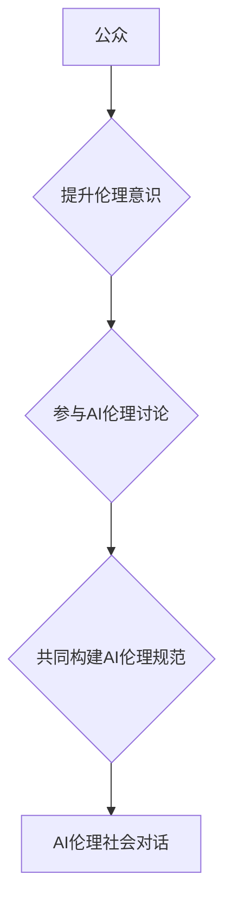

                 

## AI伦理的社会对话:伦理意识提升和公众参与

> 关键词：人工智能伦理、社会对话、伦理意识、公众参与、算法透明度、数据隐私、公平性、可解释性、责任

### 1. 背景介绍

人工智能（AI）技术飞速发展，已渗透到生活的方方面面，从医疗保健到金融服务，从交通运输到娱乐休闲，AI正在改变着我们的世界。然而，随着AI技术的进步，其带来的伦理挑战也日益凸显。

AI算法的决策过程往往是复杂的，难以被人类理解，这引发了关于算法透明度、数据隐私、公平性、可解释性等伦理问题的担忧。此外，AI技术的应用可能导致失业、偏见加剧、社会分化等社会问题。

因此，探讨AI伦理问题，提升公众伦理意识，促进公众参与AI发展，成为当今社会不可回避的课题。

### 2. 核心概念与联系

**2.1 核心概念**

* **人工智能伦理:** 指在人工智能技术研发、应用和监管过程中，遵循道德规范、法律法规，保障人类利益和社会福祉的原则和准则。
* **伦理意识:** 指对道德规范、价值观念和社会责任的理解和认同，以及在行为和决策中将其付诸实践的能力。
* **公众参与:** 指社会公众在AI技术发展和应用过程中，积极表达意见、参与决策和监督，共同构建AI伦理规范和治理体系的过程。

**2.2 核心概念联系**

AI伦理的社会对话需要建立在伦理意识的提升和公众参与的基础上。

* 提升伦理意识：公众需要对AI技术及其潜在影响有深入的理解，认识到AI伦理的重要性，并积极参与到伦理讨论和决策中。
* 公众参与：公众可以通过各种渠道，例如公众论坛、在线平台、意见调查等方式，表达对AI伦理的看法和建议，参与到AI伦理规范的制定和监管的监督中。

**2.3 Mermaid 流程图**



### 3. 核心算法原理 & 具体操作步骤

**3.1 算法原理概述**

在AI伦理的社会对话中，算法可以帮助我们分析公众意见，识别潜在的伦理风险，并提供可行的解决方案。例如，我们可以使用自然语言处理（NLP）算法分析公众对AI技术的评论和反馈，识别出人们对AI伦理的担忧和期待。

**3.2 算法步骤详解**

1. **数据收集:** 收集公众对AI技术的评论、反馈、问卷调查等数据。
2. **数据预处理:** 清洗和处理数据，去除噪声和重复信息，并进行文本分类和标注。
3. **模型训练:** 使用NLP算法，例如BERT、GPT-3等，训练一个能够理解和分析公众意见的模型。
4. **意见分析:** 将公众意见输入到训练好的模型中，分析其情感倾向、主题和关键议题。
5. **风险识别:** 基于分析结果，识别出公众对AI伦理的潜在担忧和风险。
6. **解决方案建议:** 根据风险识别结果，提供可行的解决方案和建议，帮助决策者制定相应的政策和措施。

**3.3 算法优缺点**

* **优点:** 能够快速、高效地分析大量公众意见，识别出潜在的伦理风险，为决策提供数据支持。
* **缺点:** 算法的训练数据和模型本身可能存在偏差，导致分析结果不准确或不全面。

**3.4 算法应用领域**

* **AI伦理政策制定:** 为政府和监管机构提供公众意见分析，帮助制定更符合公众利益的AI伦理政策。
* **企业AI伦理管理:** 为企业提供公众意见分析，帮助企业识别和应对AI伦理风险，提升企业形象和社会责任感。
* **学术研究:** 为AI伦理研究提供数据支持，帮助学者深入了解公众对AI伦理的认知和态度。

### 4. 数学模型和公式 & 详细讲解 & 举例说明

**4.1 数学模型构建**

我们可以使用概率论和统计学模型来分析公众对AI伦理的观点和态度。例如，我们可以使用贝叶斯网络模型来表示公众对AI伦理不同方面的认知和态度之间的关系。

**4.2 公式推导过程**

贝叶斯网络模型的推导过程涉及到概率论和统计学的知识，例如条件概率、贝叶斯定理等。

**4.3 案例分析与讲解**

假设我们想分析公众对AI算法透明度的态度。我们可以构建一个贝叶斯网络模型，其中节点代表公众对AI算法透明度不同方面的认知和态度，例如：

* 节点A：公众对AI算法透明度的理解
* 节点B：公众对AI算法透明度的重要性
* 节点C：公众对AI算法透明度的信任

我们可以使用贝叶斯定理来计算节点A、B、C之间的概率关系，例如：

* P(A|B) = P(A和B) / P(B)

其中：

* P(A|B) 表示公众对AI算法透明度的理解，条件是公众认为AI算法透明度很重要。
* P(A和B) 表示公众同时认为AI算法透明度重要且理解AI算法透明度的概率。
* P(B) 表示公众认为AI算法透明度重要的概率。

通过分析这些概率关系，我们可以了解公众对AI算法透明度的态度，以及不同因素对公众态度的影响。

### 5. 项目实践：代码实例和详细解释说明

**5.1 开发环境搭建**

* Python 3.x
* TensorFlow 或 PyTorch 等深度学习框架
* NLTK 或 spaCy 等自然语言处理库

**5.2 源代码详细实现**

```python
import nltk
from nltk.sentiment import SentimentIntensityAnalyzer

# 下载情感分析模型
nltk.download('vader_lexicon')

# 初始化情感分析器
analyzer = SentimentIntensityAnalyzer()

# 读取公众评论数据
with open('public_comments.txt', 'r') as f:
    comments = f.readlines()

# 分析评论情感倾向
for comment in comments:
    scores = analyzer.polarity_scores(comment)
    print(f"评论: {comment}")
    print(f"情感倾向: {scores['compound']}")
```

**5.3 代码解读与分析**

* 该代码使用NLTK库中的SentimentIntensityAnalyzer类进行情感分析。
* 首先，下载情感分析模型`vader_lexicon`。
* 然后，初始化情感分析器。
* 读取公众评论数据，并使用`polarity_scores()`方法分析每个评论的情感倾向。
* 输出评论内容和情感倾向分数。

**5.4 运行结果展示**

运行代码后，会输出每个评论的内容和情感倾向分数。分数范围为-1到1，其中负值表示负面情感，正值表示正面情感，0表示中性情感。

### 6. 实际应用场景

**6.1 AI伦理政策制定**

政府和监管机构可以利用AI伦理社会对话平台，收集公众对AI伦理政策的意见和建议，并将其纳入政策制定过程中。

**6.2 企业AI伦理管理**

企业可以利用AI伦理社会对话平台，与公众互动，了解公众对企业AI技术的担忧和期待，并制定相应的伦理管理制度和措施。

**6.3 学术研究**

学者可以利用AI伦理社会对话平台，收集公众对AI伦理的认知和态度数据，进行深入研究，并为AI伦理规范的制定提供数据支持。

**6.4 未来应用展望**

随着AI技术的不断发展，AI伦理社会对话将变得更加重要。未来，我们可以期待看到更多创新性的AI伦理社会对话平台和工具的出现，帮助我们更好地理解和应对AI伦理挑战。

### 7. 工具和资源推荐

**7.1 学习资源推荐**

* **书籍:**

    * 《AI伦理: 人工智能的道德挑战》
    * 《算法的隐形世界》
    * 《生命3.0》

* **在线课程:**

    * Coursera: AI伦理
    * edX: 人工智能与社会

**7.2 开发工具推荐**

* **自然语言处理库:** NLTK, spaCy, Gensim
* **深度学习框架:** TensorFlow, PyTorch
* **数据可视化工具:** Tableau, Power BI

**7.3 相关论文推荐**

* **《On the Dangers of Stochastic Parrots: Can Language Models Be Too Big?》**
* **《AI Ethics: A Guide for Developers》**
* **《The Alignment Problem: Machine Learning and Human Values》**

### 8. 总结：未来发展趋势与挑战

**8.1 研究成果总结**

AI伦理社会对话是一个重要的研究领域，已经取得了一些成果。例如，我们已经开发了一些AI伦理社会对话平台和工具，并对公众对AI伦理的认知和态度进行了深入研究。

**8.2 未来发展趋势**

未来，AI伦理社会对话将朝着以下几个方向发展：

* **更加智能化:** 利用人工智能技术，开发更加智能化的AI伦理社会对话平台，能够更好地理解和回应公众的意见和需求。
* **更加多元化:** 鼓励不同利益相关者参与到AI伦理社会对话中，例如政府、企业、学者、公众等，形成更加多元化的对话格局。
* **更加国际化:** 推动全球范围内AI伦理社会对话的开展，形成更加完善的国际AI伦理规范和治理体系。

**8.3 面临的挑战**

AI伦理社会对话也面临着一些挑战：

* **数据获取和隐私保护:** 收集公众对AI伦理的意见和数据，需要考虑数据隐私保护问题。
* **算法偏见:** AI算法本身可能存在偏见，导致AI伦理社会对话结果不准确或不公平。
* **公众参与度:** 提高公众对AI伦理的关注度和参与度，是一个长期而艰巨的任务。

**8.4 研究展望**

未来，我们需要继续加强对AI伦理社会对话的研究，探索更加有效的对话机制和方法，并积极应对挑战，推动AI伦理社会对话朝着更加健康、可持续的方向发展。

### 9. 附录：常见问题与解答

**9.1 如何参与AI伦理社会对话？**

公众可以通过以下方式参与AI伦理社会对话：

* 参加AI伦理论坛和研讨会
* 在线发表观点和建议
* 参与AI伦理政策的公众咨询

**9.2 AI伦理社会对话的意义是什么？**

AI伦理社会对话的意义在于：

* 促进公众对AI伦理的理解和认识
* 帮助决策者制定更加符合公众利益的AI伦理政策
* 促进AI技术与社会和谐发展

**9.3 AI伦理社会对话面临哪些挑战？**

AI伦理社会对话面临的挑战包括：

* 数据获取和隐私保护
* 算法偏见
* 公众参与度

作者：禅与计算机程序设计艺术 / Zen and the Art of Computer Programming


<end_of_turn>

