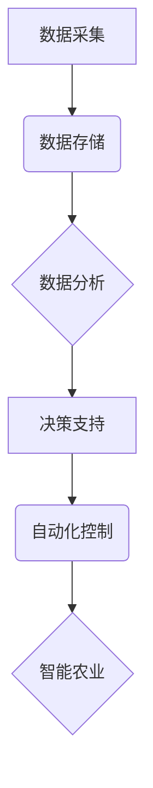

                 

## AI在智能农业中的角色：精准种植与收获

> 关键词：人工智能、智能农业、精准种植、机器学习、计算机视觉、传感器、数据分析、农业优化

## 1. 背景介绍

农业，作为人类文明的基石，一直以来都面临着产量提升、资源利用效率和环境可持续性等挑战。随着人口增长和资源短缺的加剧，传统农业模式已难以满足日益增长的粮食需求。而人工智能（AI）技术的快速发展为农业带来了前所未有的机遇，为构建智能农业、实现精准种植和收获提供了强大的技术支撑。

智能农业是指利用人工智能、物联网、大数据等先进技术，对农业生产进行智能化管理和控制，提高农业生产效率、降低生产成本、促进农业可持续发展的一种新型农业模式。AI在智能农业中的应用涵盖了从田间管理到收获加工的全流程，包括：

* **精准种植：** 利用AI技术分析土壤、气候、作物等数据，制定精准的种植方案，优化播种时间、密度、施肥量等，提高作物产量和品质。
* **智能灌溉：** 通过传感器监测土壤湿度、气象条件等数据，结合AI算法，实现精准灌溉，节约用水资源，提高灌溉效率。
* **病虫害监测与防治：** 利用计算机视觉技术识别病虫害，结合AI算法进行预测和预警，实现精准防治，减少农药使用，保护环境。
* **精准收获：** 利用机器视觉和机器人技术，实现对成熟作物的精准识别和采摘，提高收获效率，减少损失。

## 2. 核心概念与联系

智能农业的核心概念包括：

* **数据采集：** 通过传感器、卫星遥感等方式，收集农业生产过程中的各种数据，如土壤湿度、温度、光照、作物生长状况等。
* **数据分析：** 利用机器学习、深度学习等AI算法，对采集到的数据进行分析和挖掘，发现其中的规律和模式。
* **决策支持：** 基于数据分析结果，为农业生产提供决策支持，例如优化种植方案、制定灌溉计划、预测病虫害发生等。
* **自动化控制：** 利用机器人、无人机等智能设备，对农业生产过程进行自动化控制，提高生产效率和精度。

**核心概念架构图：**



## 3. 核心算法原理 & 具体操作步骤

### 3.1  算法原理概述

在智能农业中，常用的AI算法包括：

* **机器学习：** 利用算法从数据中学习，发现模式和规律，用于预测作物产量、病虫害发生等。
* **深度学习：** 基于神经网络，能够处理复杂的数据，用于图像识别、语音识别等任务，例如识别病虫害、自动驾驶等。
* **强化学习：** 通过试错学习，优化决策，用于控制农业生产过程，例如智能灌溉、精准施肥等。

### 3.2  算法步骤详解

以机器学习为例，其基本步骤如下：

1. **数据收集和预处理：** 收集相关数据，并进行清洗、转换、特征提取等预处理工作。
2. **模型选择：** 根据具体任务选择合适的机器学习模型，例如线性回归、决策树、支持向量机等。
3. **模型训练：** 利用训练数据训练模型，调整模型参数，使模型能够准确预测目标变量。
4. **模型评估：** 利用测试数据评估模型的性能，例如准确率、召回率、F1-score等。
5. **模型部署：** 将训练好的模型部署到实际应用场景中，用于预测和决策。

### 3.3  算法优缺点

**机器学习算法的优缺点：**

* **优点：** 能够从数据中学习，发现隐藏的模式和规律，无需人工编程，具有较强的泛化能力。
* **缺点：** 需要大量的训练数据，对数据质量要求较高，解释性较差，难以解释模型的决策过程。

### 3.4  算法应用领域

机器学习算法在智能农业中的应用领域广泛，例如：

* **作物产量预测：** 利用历史数据和当前环境条件，预测作物产量。
* **病虫害识别：** 利用图像识别技术，识别病虫害种类和发生程度。
* **精准施肥：** 根据土壤肥力、作物需求等信息，制定精准施肥方案。
* **智能灌溉：** 根据土壤湿度、气象条件等信息，实现精准灌溉。

## 4. 数学模型和公式 & 详细讲解 & 举例说明

### 4.1  数学模型构建

在智能农业中，常用的数学模型包括：

* **线性回归模型：** 用于预测连续变量，例如作物产量。
* **逻辑回归模型：** 用于预测分类变量，例如病虫害发生。
* **时间序列模型：** 用于预测时间序列数据，例如作物生长趋势。

### 4.2  公式推导过程

以线性回归模型为例，其目标是找到一条直线，使得预测值与实际值之间的误差最小。

**线性回归模型公式：**

$$y = \beta_0 + \beta_1x + \epsilon$$

其中：

* $y$ 是预测值
* $x$ 是输入变量
* $\beta_0$ 是截距
* $\beta_1$ 是斜率
* $\epsilon$ 是误差项

**最小二乘法：**

最小二乘法是一种常用的模型参数估计方法，其目标是找到使得误差平方和最小的参数值。

$$SSE = \sum_{i=1}^{n}(y_i - \hat{y}_i)^2$$

其中：

* $SSE$ 是误差平方和
* $y_i$ 是实际值
* $\hat{y}_i$ 是预测值

**参数估计：**

通过求解最小二乘法问题，可以得到参数 $\beta_0$ 和 $\beta_1$ 的估计值。

### 4.3  案例分析与讲解

假设我们想要预测小麦产量，输入变量为土壤湿度，可以使用线性回归模型进行预测。

**数据：**

| 土壤湿度 (%) | 麦产量 (kg/亩) |
|---|---|
| 20 | 500 |
| 30 | 600 |
| 40 | 700 |
| 50 | 800 |

**模型训练：**

使用最小二乘法，可以得到线性回归模型的方程：

$$y = 500 + 10x$$

其中：

* $y$ 是小麦产量
* $x$ 是土壤湿度

**预测：**

如果土壤湿度为 35%，则小麦产量可以预测为：

$$y = 500 + 10 * 35 = 850$$

## 5. 项目实践：代码实例和详细解释说明

### 5.1  开发环境搭建

* **操作系统：** Ubuntu 20.04 LTS
* **编程语言：** Python 3.8
* **库依赖：** pandas, numpy, scikit-learn, matplotlib

### 5.2  源代码详细实现

```python
import pandas as pd
from sklearn.linear_model import LinearRegression
import matplotlib.pyplot as plt

# 数据加载
data = pd.read_csv('wheat_yield.csv')

# 数据预处理
X = data[['soil_humidity']]
y = data['wheat_yield']

# 模型训练
model = LinearRegression()
model.fit(X, y)

# 模型评估
# ...

# 预测
new_data = pd.DataFrame({'soil_humidity': [35]})
prediction = model.predict(new_data)

# 结果展示
print(f'预测小麦产量: {prediction[0]} kg/亩')
plt.scatter(X, y)
plt.plot(X, model.predict(X), color='red')
plt.xlabel('土壤湿度 (%)')
plt.ylabel('小麦产量 (kg/亩)')
plt.title('小麦产量预测模型')
plt.show()
```

### 5.3  代码解读与分析

* 数据加载：使用pandas库读取数据文件。
* 数据预处理：将数据分离为输入变量和目标变量。
* 模型训练：使用scikit-learn库的LinearRegression模型进行训练。
* 模型评估：使用相关指标评估模型性能，例如R-squared、均方误差等。
* 预测：使用训练好的模型预测新的数据。
* 结果展示：使用matplotlib库绘制图表，展示预测结果。

### 5.4  运行结果展示

运行代码后，会生成一个图表，展示小麦产量与土壤湿度的关系，以及模型预测的趋势线。同时，也会输出预测小麦产量的结果。

## 6. 实际应用场景

### 6.1  精准种植

* **播种密度优化：** 利用AI算法分析土壤肥力、气候条件等数据，优化播种密度，提高作物产量和品质。
* **施肥精准化：** 根据土壤肥力、作物需求等信息，制定精准施肥方案，减少化肥使用，保护环境。
* **病虫害防控：** 利用计算机视觉技术识别病虫害，结合AI算法进行预测和预警，实现精准防治，减少农药使用。

### 6.2  智能灌溉

* **精准灌溉：** 通过传感器监测土壤湿度、气象条件等数据，结合AI算法，实现精准灌溉，节约用水资源，提高灌溉效率。
* **自动灌溉系统：** 利用智能传感器和控制系统，实现自动灌溉，减少人工干预，提高灌溉效率。

### 6.3  精准收获

* **成熟度识别：** 利用计算机视觉技术识别作物的成熟度，提高收获效率，减少损失。
* **自动采摘：** 利用机器人技术实现对成熟作物的自动采摘，提高收获效率，减少人工成本。

### 6.4  未来应用展望

随着AI技术的不断发展，其在智能农业中的应用将更加广泛和深入，例如：

* **无人驾驶农业机械：** 利用AI技术实现无人驾驶的农业机械，提高生产效率和安全性。
* **农业大数据分析：** 利用大数据分析技术，挖掘农业生产中的潜在规律和模式，为决策提供更精准的依据。
* **个性化农业服务：** 利用AI技术，为不同农户提供个性化的农业服务，例如精准种植方案、智能灌溉方案等。

## 7. 工具和资源推荐

### 7.1  学习资源推荐

* **在线课程：** Coursera, edX, Udacity 等平台提供人工智能、机器学习等相关课程。
* **书籍：** 《深度学习》、《机器学习实战》等书籍。
* **博客和论坛：** 机器学习社区、AI技术博客等。

### 7.2  开发工具推荐

* **Python：** 广泛应用于人工智能开发，拥有丰富的库和工具。
* **TensorFlow：** 开源深度学习框架，用于构建和训练神经网络模型。
* **PyTorch：** 开源深度学习框架，灵活易用，适合研究和开发。

### 7.3  相关论文推荐

* **《Deep Learning for Agriculture》**
* **《Machine Learning in Precision Agriculture》**
* **《Artificial Intelligence in Agriculture: A Review》**

## 8. 总结：未来发展趋势与挑战

### 8.1  研究成果总结

AI在智能农业领域的应用取得了显著成果，例如：

* **提高了作物产量和品质：** 通过精准种植、智能灌溉等技术，提高了作物产量和品质。
* **降低了农业生产成本：** 通过自动化控制、数据分析等技术，降低了农业生产成本。
* **保护了环境：** 通过精准施肥、精准灌溉等技术，减少了化肥和水的浪费，保护了环境。

### 8.2  未来发展趋势

* **更强大的AI算法：** 随着AI技术的不断发展，将会有更强大的AI算法应用于智能农业，例如强化学习、迁移学习等。
* **更广泛的数据应用：** 将会有更多类型的农业数据被收集和应用，例如遥感数据、传感器数据等。
* **更智能的农业设备：** 将会有更多智能化的农业设备，例如无人驾驶农业机械、智能温室等。

### 8.3  面临的挑战

* **数据质量问题：** 农业数据的质量参差不齐，需要进行有效的数据清洗和预处理。
* **模型解释性问题：** 一些AI算法的决策过程难以解释，需要进行更深入的研究，提高模型的透明度和可信度。
* **技术普及问题：** AI技术在农业领域的应用还处于初期阶段，需要进一步推广和普及，让更多农民能够受益。

### 8.4  研究展望

未来，AI在智能农业领域的应用将更加深入和广泛，为构建更加高效、可持续的农业生产模式做出更大的贡献。


## 9. 附录：常见问题与解答

**Q1：AI在智能农业中的应用有哪些？**

**A1：** AI在智能农业中的应用非常广泛，包括精准种植、智能灌溉、精准收获、病虫害防控、农业大数据分析等。

**Q2：AI技术在农业生产中有哪些优势？**

**A2：** AI技术可以提高作物产量和品质、降低农业生产成本、保护环境、提高农业生产效率和安全性。

**Q3：AI技术在农业生产中有哪些挑战？**

**A3：** AI技术在农业生产中的应用还面临一些挑战，例如数据质量问题、模型解释性问题、技术普及问题等。


作者：禅与计算机程序设计艺术 / Zen and the Art of Computer Programming 
<end_of_turn>

