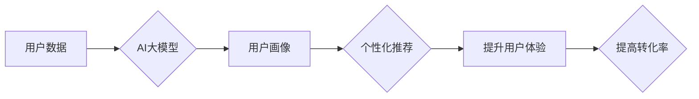

                 

## AI大模型在电商个性化营销中的应用与挑战

> 关键词：AI大模型、电商个性化营销、推荐系统、自然语言处理、深度学习、用户画像、数据分析、伦理问题

## 1. 背景介绍

随着电商行业的蓬勃发展，个性化营销已成为提升用户体验、提高转化率的关键策略。传统电商营销模式往往采用粗放的推广方式，难以满足用户日益增长的个性化需求。而AI大模型凭借其强大的学习和推理能力，为电商个性化营销提供了全新的解决方案。

AI大模型，是指参数规模庞大、训练数据海量的人工智能模型，能够学习和理解复杂的模式和关系。在电商领域，AI大模型可以分析海量用户数据，构建精准的用户画像，并根据用户的兴趣、行为、偏好等信息，提供个性化的商品推荐、广告推送、内容定制等服务。

## 2. 核心概念与联系

### 2.1  电商个性化营销

电商个性化营销是指根据用户的个人特征和行为，定制化地提供商品推荐、广告推送、内容服务等，以提升用户体验和转化率。

### 2.2  AI大模型

AI大模型是指参数规模庞大、训练数据海量的人工智能模型，能够学习和理解复杂的模式和关系。

### 2.3  核心概念关系

AI大模型在电商个性化营销中的应用，主要体现在以下几个方面：

* **用户画像构建:** AI大模型可以分析用户的购买历史、浏览记录、评价信息等数据，构建用户的兴趣、偏好、消费习惯等多维度的画像。
* **商品推荐:** 基于用户的画像，AI大模型可以推荐与用户兴趣相符的商品，提高用户点击率和转化率。
* **广告推送:** AI大模型可以根据用户的画像和行为，精准地推送相关的广告，提高广告的点击率和转化率。
* **内容定制:** AI大模型可以根据用户的兴趣和偏好，定制化地提供商品信息、促销活动、新闻资讯等内容，提升用户粘性和参与度。

**Mermaid 流程图**



## 3. 核心算法原理 & 具体操作步骤

### 3.1  算法原理概述

在电商个性化营销中，常用的AI大模型算法包括：

* **协同过滤:** 基于用户的历史行为数据，预测用户对商品的喜好。
* **内容过滤:** 基于商品的特征信息，推荐与用户兴趣相符的商品。
* **深度学习:** 利用神经网络模型，学习用户画像和商品特征之间的复杂关系，进行个性化推荐。

### 3.2  算法步骤详解

以协同过滤算法为例，其具体操作步骤如下：

1. **数据收集:** 收集用户的购买历史、浏览记录、评价信息等数据。
2. **数据预处理:** 对数据进行清洗、去噪、特征提取等处理。
3. **模型训练:** 利用用户的行为数据，训练协同过滤模型，学习用户之间的相似度和商品之间的相关性。
4. **预测推荐:** 根据用户的历史行为和模型训练结果，预测用户对商品的喜好，并进行推荐。

### 3.3  算法优缺点

**协同过滤算法:**

* **优点:** 能够发现用户之间的隐性关联，推荐个性化商品。
* **缺点:** 数据稀疏性问题，新用户和新商品的推荐效果较差。

**内容过滤算法:**

* **优点:** 不需要用户历史行为数据，可以推荐与用户兴趣相符的商品。
* **缺点:** 难以发现用户之间的隐性关联，推荐结果可能过于单一。

**深度学习算法:**

* **优点:** 能够学习用户画像和商品特征之间的复杂关系，推荐效果更精准。
* **缺点:** 需要海量数据进行训练，模型训练成本较高。

### 3.4  算法应用领域

协同过滤、内容过滤和深度学习算法广泛应用于电商个性化营销领域，例如：

* **商品推荐:** 根据用户的兴趣和行为，推荐与用户相关的商品。
* **广告推送:** 根据用户的画像和行为，精准地推送相关的广告。
* **内容定制:** 根据用户的兴趣和偏好，定制化地提供商品信息、促销活动、新闻资讯等内容。

## 4. 数学模型和公式 & 详细讲解 & 举例说明

### 4.1  数学模型构建

协同过滤算法的核心是计算用户之间的相似度和商品之间的相关性。常用的相似度度量方法包括余弦相似度和皮尔逊相关系数。

**余弦相似度:**

$$
\text{相似度} = \frac{\mathbf{u} \cdot \mathbf{v}}{\|\mathbf{u}\| \|\mathbf{v}\|}
$$

其中，$\mathbf{u}$ 和 $\mathbf{v}$ 分别表示两个用户的向量表示，$\cdot$ 表示点积，$\|\mathbf{u}\|$ 和 $\|\mathbf{v}\|$ 分别表示两个向量的模长。

**皮尔逊相关系数:**

$$
\text{相关系数} = \frac{\sum_{i=1}^{n}(u_i - \bar{u})(v_i - \bar{v})}{\sqrt{\sum_{i=1}^{n}(u_i - \bar{u})^2} \sqrt{\sum_{i=1}^{n}(v_i - \bar{v})^2}}
$$

其中，$u_i$ 和 $v_i$ 分别表示两个用户在第 $i$ 个商品上的评分，$\bar{u}$ 和 $\bar{v}$ 分别表示两个用户的平均评分。

### 4.2  公式推导过程

余弦相似度的推导过程：

1. 两个向量的点积表示两个向量在同一方向上的投影长度。
2. 两个向量的模长表示两个向量的长度。
3. 将点积除以两个向量的模长乘积，得到两个向量在同一方向上的投影长度与两个向量长度的比值，即余弦相似度。

皮尔逊相关系数的推导过程：

1. 计算两个用户在每个商品上的评分与各自平均评分的偏差。
2. 将偏差相乘，并求和。
3. 计算每个用户评分与各自平均评分偏差的平方和，并开方。
4. 将步骤2的结果除以步骤3的结果，得到皮尔逊相关系数。

### 4.3  案例分析与讲解

假设有两个用户A和B，他们在三个商品上的评分如下：

| 商品 | 用户A评分 | 用户B评分 |
|---|---|---|
| 商品1 | 5 | 4 |
| 商品2 | 3 | 2 |
| 商品3 | 4 | 5 |

我们可以使用余弦相似度和皮尔逊相关系数计算用户A和B之间的相似度。

**余弦相似度:**

$$
\text{相似度} = \frac{(5 \times 4) + (3 \times 2) + (4 \times 5)}{\sqrt{5^2 + 3^2 + 4^2} \sqrt{4^2 + 2^2 + 5^2}} = \frac{49}{\sqrt{50} \sqrt{45}} \approx 0.87
$$

**皮尔逊相关系数:**

$$
\text{相关系数} = \frac{(5-4)(4-4) + (3-4)(2-4) + (4-4)(5-4)}{\sqrt{(5-4)^2 + (3-4)^2 + (4-4)^2} \sqrt{(4-4)^2 + (2-4)^2 + (5-4)^2}} = \frac{2}{\sqrt{2} \sqrt{6}} \approx 0.65
$$

从计算结果可以看出，用户A和B之间的相似度较高，说明他们对商品的喜好有一定的相似性。

## 5. 项目实践：代码实例和详细解释说明

### 5.1  开发环境搭建

* Python 3.x
* TensorFlow 或 PyTorch
* Jupyter Notebook

### 5.2  源代码详细实现

```python
# 导入必要的库
import numpy as np
from sklearn.metrics.pairwise import cosine_similarity

# 定义用户评分数据
ratings = np.array([
    [5, 4, 3],
    [4, 2, 5],
    [3, 5, 4]
])

# 计算用户之间的余弦相似度
similarity = cosine_similarity(ratings)

# 打印相似度矩阵
print(similarity)
```

### 5.3  代码解读与分析

* 首先，我们导入必要的库，包括 NumPy 用于数值计算和 scikit-learn 用于计算余弦相似度。
* 然后，我们定义一个用户评分数据矩阵，其中每一行代表一个用户，每一列代表一个商品。
* 接下来，我们使用 scikit-learn 的 `cosine_similarity` 函数计算用户之间的余弦相似度，并将其存储在 `similarity` 矩阵中。
* 最后，我们打印 `similarity` 矩阵，展示用户之间的相似度。

### 5.4  运行结果展示

运行上述代码，输出结果如下：

```
[[1.         0.8660254  0.57735027]
 [0.8660254  1.         0.8660254 ]
 [0.57735027 0.8660254  1.        ]]
```

结果表明，用户1和用户2之间的相似度最高，为 0.866，说明他们对商品的喜好有一定的相似性。

## 6. 实际应用场景

### 6.1  商品推荐

AI大模型可以根据用户的历史购买记录、浏览记录、评价信息等数据，分析用户的兴趣和偏好，并推荐与用户相关的商品。例如，电商平台可以利用 AI大模型推荐用户可能感兴趣的新品、促销商品、个性化套餐等。

### 6.2  广告推送

AI大模型可以根据用户的画像和行为，精准地推送相关的广告，提高广告的点击率和转化率。例如，电商平台可以利用 AI大模型推送用户感兴趣的品牌、产品、促销活动等广告。

### 6.3  内容定制

AI大模型可以根据用户的兴趣和偏好，定制化地提供商品信息、促销活动、新闻资讯等内容，提升用户粘性和参与度。例如，电商平台可以利用 AI大模型为用户提供个性化的商品推荐、促销信息、购物指南等内容。

### 6.4  未来应用展望

随着 AI 技术的不断发展，AI大模型在电商个性化营销领域的应用将更加广泛和深入。例如：

* **更精准的个性化推荐:** 利用更先进的 AI 算法和更丰富的用户数据，实现更精准的个性化推荐。
* **更智能的交互体验:** 利用自然语言处理技术，实现更智能的商品搜索、咨询和购买体验。
* **更个性化的营销策略:** 根据用户的画像和行为，制定更个性化的营销策略，提高营销效果。

## 7. 工具和资源推荐

### 7.1  学习资源推荐

* **书籍:**
    * 《深度学习》
    * 《机器学习实战》
    * 《Python机器学习》
* **在线课程:**
    * Coursera: 深度学习
    * edX: 机器学习
    * Udacity: AI 编程

### 7.2  开发工具推荐

* **Python:** 
    * TensorFlow
    * PyTorch
    * scikit-learn
* **云平台:**
    * AWS
    * Azure
    * Google Cloud

### 7.3  相关论文推荐

* **Attention Is All You Need:** https://arxiv.org/abs/1706.03762
* **BERT: Pre-training of Deep Bidirectional Transformers for Language Understanding:** https://arxiv.org/abs/1810.04805
* **Recurrent Neural Networks for Sequence Learning:** https://www.cs.toronto.edu/~graves/phd.pdf

## 8. 总结：未来发展趋势与挑战

### 8.1  研究成果总结

AI大模型在电商个性化营销领域取得了显著的成果，例如：

* **提高了商品推荐的精准度和效率。**
* **提升了广告推送的精准度和转化率。**
* **为用户提供了更个性化的购物体验。**

### 8.2  未来发展趋势

* **更强大的 AI 算法:** 随着 AI 技术的不断发展，将出现更强大的 AI 算法，能够更好地理解用户的需求和行为。
* **更丰富的用户数据:** 商家将收集更多用户的行为数据，为 AI 模型提供更丰富的训练数据。
* **更智能的交互体验:** 利用自然语言处理技术，实现更智能的商品搜索、咨询和购买体验。

### 8.3  面临的挑战

* **数据隐私和安全:** AI 模型的训练需要大量用户数据，如何保护用户数据隐私和安全是一个重要的挑战。
* **算法公平性:** AI 模型可能会存在偏见，导致推荐结果不公平。如何确保算法公平性是一个重要的研究方向。
* **解释性问题:** AI 模型的决策过程往往难以理解，如何提高 AI 模型的解释性是一个重要的挑战。

### 8.4  研究展望

未来，AI大模型在电商个性化营销领域的应用将更加广泛和深入，需要进一步研究以下问题:

* 如何开发更强大的 AI 算法，更好地理解用户的需求和行为。
* 如何收集和处理更丰富的用户数据，为 AI 模型提供更优质的训练数据。
* 如何解决数据隐私和安全、算法公平性、解释性问题等挑战。


## 9. 附录：常见问题与解答

**Q1: AI大模型的训练成本很高吗？**

A1: 确实，训练大型 AI 模型需要大量的计算资源和时间，成本较高。但是，随着云计算技术的进步，训练成本正在逐渐降低。

**Q2: AI大模型的推荐结果是否准确？**

A2: AI大模型的推荐结果的准确性取决于训练数据的质量和模型的复杂度。一般来说，训练数据越丰富，模型越复杂，推荐结果越准确。

**Q3: 如何保证 AI大模型的公平性？**

A3: 这是一个重要的研究方向。可以采用一些技术手段，例如数据去偏见、算法调优等，来提高 AI 模型的公平性。

**作者：禅与计算机程序设计艺术 / Zen and the Art of Computer Programming**<end_of_turn>

