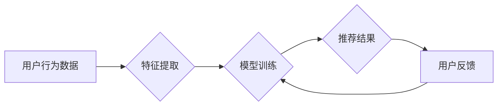

                 

## AI大模型在长尾商品推荐中的应用

> 关键词：长尾商品、推荐系统、AI大模型、Transformer、BERT、深度学习、个性化推荐

## 1. 背景介绍

随着电商平台的蓬勃发展，商品种类日益丰富，用户需求也更加多元化。传统的推荐系统主要依赖于协同过滤和内容过滤等方法，在推荐热门商品方面表现良好，但对于长尾商品的推荐却显得力不从心。长尾商品是指销售量较少的商品，它们往往具有独特的功能或个性化需求，但由于缺乏用户数据和曝光机会，难以被推荐系统识别和推荐。

长尾商品的推荐对于电商平台来说具有重要意义。一方面，长尾商品往往具有更高的利润率，可以提升平台的整体收益。另一方面，推荐长尾商品可以满足用户个性化需求，提升用户体验，从而提高用户粘性和复购率。

近年来，随着深度学习技术的快速发展，特别是Transformer模型的出现，AI大模型在推荐系统领域展现出巨大的潜力。AI大模型能够学习用户行为、商品特征以及其他相关信息之间的复杂关系，从而实现更精准、更个性化的商品推荐。

## 2. 核心概念与联系

### 2.1  长尾商品

长尾商品是指在商品销售量分布中，数量较少但总和不小的商品。它们通常具有以下特点：

* 销售量低
* 需求细分
* 价值独特

### 2.2  AI大模型

AI大模型是指在海量数据上训练的深度学习模型，具有强大的学习能力和泛化能力。常见的AI大模型包括：

* **Transformer模型**:  Transformer模型是一种基于注意力机制的深度学习模型，能够有效地处理序列数据，例如文本和商品描述。
* **BERT模型**: BERT模型是一种基于Transformer模型的预训练语言模型，能够理解文本的语义和上下文关系。

### 2.3  推荐系统

推荐系统是指根据用户的历史行为、偏好和上下文信息，预测用户可能感兴趣的商品，并将其推荐给用户的系统。

**核心架构：**



## 3. 核心算法原理 & 具体操作步骤

### 3.1  算法原理概述

AI大模型在长尾商品推荐中的应用主要基于以下核心算法原理：

* **深度学习**: 利用深度神经网络学习用户行为、商品特征以及其他相关信息之间的复杂关系。
* **注意力机制**:  通过注意力机制，模型能够重点关注用户和商品之间相关的信息，提高推荐的精准度。
* **预训练语言模型**:  利用预训练语言模型，例如BERT，能够更好地理解商品描述和用户评论中的语义信息。

### 3.2  算法步骤详解

1. **数据收集和预处理**: 收集用户行为数据、商品信息、商品描述等数据，并进行清洗、转换和特征提取。
2. **模型训练**: 利用深度学习框架，例如TensorFlow或PyTorch，训练AI大模型。训练过程中，模型会学习用户行为、商品特征以及其他相关信息之间的关系。
3. **推荐结果生成**:  根据用户的历史行为和当前上下文信息，模型会预测用户可能感兴趣的商品，并生成推荐结果。
4. **结果评估**:  通过评估指标，例如点击率、转化率等，评估推荐系统的性能。
5. **模型优化**:  根据评估结果，对模型进行优化，例如调整模型参数、增加训练数据等。

### 3.3  算法优缺点

**优点**:

* **精准度高**: AI大模型能够学习用户行为和商品特征之间的复杂关系，从而实现更精准的商品推荐。
* **个性化强**:  AI大模型能够根据用户的历史行为和偏好，提供个性化的商品推荐。
* **可扩展性强**:  AI大模型能够处理海量数据，并随着数据量的增加而提升推荐效果。

**缺点**:

* **训练成本高**:  训练AI大模型需要大量的计算资源和时间。
* **数据依赖性强**:  AI大模型的性能取决于训练数据的质量和数量。
* **解释性差**:  AI大模型的决策过程较为复杂，难以解释其推荐结果背后的原因。

### 3.4  算法应用领域

AI大模型在长尾商品推荐之外，还广泛应用于其他领域，例如：

* **搜索引擎**:  提高搜索结果的精准度和相关性。
* **内容推荐**:  推荐用户可能感兴趣的新闻、视频、音乐等内容。
* **广告推荐**:  推荐用户可能感兴趣的广告。

## 4. 数学模型和公式 & 详细讲解 & 举例说明

### 4.1  数学模型构建

在长尾商品推荐中，常用的数学模型包括协同过滤模型、内容过滤模型和混合模型。

* **协同过滤模型**:  基于用户的历史行为数据，预测用户可能对某个商品的兴趣。
* **内容过滤模型**:  基于商品的特征信息，预测用户可能对某个商品的兴趣。
* **混合模型**:  结合协同过滤模型和内容过滤模型，提高推荐的精准度。

### 4.2  公式推导过程

协同过滤模型中常用的公式包括：

* **用户-商品评分预测**:  

$$
\hat{r}_{u,i} = \mu + b_u + b_i + \epsilon_{u,i}
$$

其中：

* $\hat{r}_{u,i}$ 是模型预测用户 $u$ 对商品 $i$ 的评分。
* $\mu$ 是全局平均评分。
* $b_u$ 是用户 $u$ 的偏差。
* $b_i$ 是商品 $i$ 的偏差。
* $\epsilon_{u,i}$ 是预测误差。

### 4.3  案例分析与讲解

假设有一个电商平台，用户 $A$ 对电影 $X$ 评分为 5，用户 $B$ 对电影 $Y$ 评分为 4。如果模型预测用户 $A$ 和用户 $B$ 的兴趣相似度较高，那么模型可能会推荐电影 $Y$ 给用户 $A$。

## 5. 项目实践：代码实例和详细解释说明

### 5.1  开发环境搭建

* Python 3.6+
* TensorFlow 或 PyTorch
* Jupyter Notebook

### 5.2  源代码详细实现

```python
# 使用 TensorFlow 框架实现一个简单的协同过滤模型

import tensorflow as tf

# 定义模型参数
num_users = 1000
num_items = 1000
embedding_dim = 64

# 创建用户和商品 embedding 层
user_embedding = tf.keras.layers.Embedding(num_users, embedding_dim)
item_embedding = tf.keras.layers.Embedding(num_items, embedding_dim)

# 定义模型
model = tf.keras.Sequential([
    user_embedding,
    item_embedding,
    tf.keras.layers.Dot(axes=1),
    tf.keras.layers.Dense(1, activation='sigmoid')
])

# 编译模型
model.compile(optimizer='adam', loss='binary_crossentropy', metrics=['accuracy'])

# 训练模型
model.fit(x_train, y_train, epochs=10)

# 预测用户对商品的评分
predictions = model.predict(x_test)
```

### 5.3  代码解读与分析

* 代码首先定义了模型参数，例如用户数量、商品数量和 embedding 维度。
* 然后创建了用户和商品 embedding 层，用于将用户和商品 ID 映射到低维向量空间。
* 接着定义了模型结构，包括用户 embedding 层、商品 embedding 层、点积层和输出层。
* 点积层计算用户和商品 embedding 向量的点积，得到用户对商品的评分预测。
* 最后编译和训练模型，并使用训练好的模型预测用户对商品的评分。

### 5.4  运行结果展示

训练完成后，可以使用测试数据评估模型的性能。常见的评估指标包括准确率、召回率和 F1-score。

## 6. 实际应用场景

AI大模型在长尾商品推荐中的应用场景广泛，例如：

* **个性化商品推荐**:  根据用户的兴趣和偏好，推荐个性化的长尾商品。
* **新品推荐**:  推荐新上市的长尾商品，帮助用户发现新产品。
* **关联商品推荐**:  根据用户购买的商品，推荐相关的长尾商品。

### 6.4  未来应用展望

未来，AI大模型在长尾商品推荐领域将有更广泛的应用，例如：

* **多模态推荐**:  结合文本、图像、视频等多模态数据，实现更精准的商品推荐。
* **实时推荐**:  根据用户的实时行为，提供更及时和个性化的商品推荐。
* **解释性推荐**:  提高 AI 模型的解释性，帮助用户理解推荐结果背后的原因。

## 7. 工具和资源推荐

### 7.1  学习资源推荐

* **书籍**:

    * Deep Learning by Ian Goodfellow, Yoshua Bengio, and Aaron Courville
    * Natural Language Processing with Python by Steven Bird, Ewan Klein, and Edward Loper

* **在线课程**:

    * TensorFlow Tutorials: https://www.tensorflow.org/tutorials
    * PyTorch Tutorials: https://pytorch.org/tutorials/

### 7.2  开发工具推荐

* **TensorFlow**: https://www.tensorflow.org/
* **PyTorch**: https://pytorch.org/
* **Jupyter Notebook**: https://jupyter.org/

### 7.3  相关论文推荐

* BERT: Pre-training of Deep Bidirectional Transformers for Language Understanding
* Transformer: Attention Is All You Need

## 8. 总结：未来发展趋势与挑战

### 8.1  研究成果总结

AI大模型在长尾商品推荐领域取得了显著的成果，能够提高推荐的精准度和个性化程度。

### 8.2  未来发展趋势

* **多模态推荐**:  结合文本、图像、视频等多模态数据，实现更精准的商品推荐。
* **实时推荐**:  根据用户的实时行为，提供更及时和个性化的商品推荐。
* **解释性推荐**:  提高 AI 模型的解释性，帮助用户理解推荐结果背后的原因。

### 8.3  面临的挑战

* **数据稀疏性**:  长尾商品的数据往往稀疏，难以训练有效的 AI 模型。
* **模型解释性**:  AI 模型的决策过程较为复杂，难以解释其推荐结果背后的原因。
* **公平性与偏见**:  AI 模型可能存在公平性问题和偏见，需要进行相应的调优和改进。

### 8.4  研究展望

未来，研究者将继续探索 AI 大模型在长尾商品推荐领域的应用，并致力于解决上述挑战，推动该领域的发展。


## 9. 附录：常见问题与解答

* **Q1: AI大模型的训练成本很高，如何降低成本？**

    A1: 可以采用模型压缩、知识蒸馏等技术来降低模型的训练成本。

* **Q2: 如何评估 AI大模型的推荐效果？**

    A2: 可以使用点击率、转化率、用户满意度等指标来评估 AI大模型的推荐效果。

* **Q3: 如何解决 AI大模型的解释性问题？**

    A3: 可以使用可解释 AI 技术，例如 LIME、SHAP 等，来解释 AI 模型的决策过程。


作者：禅与计算机程序设计艺术 / Zen and the Art of Computer Programming 
<end_of_turn>

