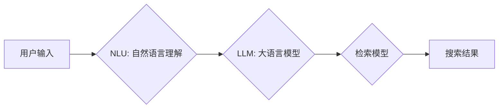

                 

## AI大模型如何处理电商搜索中的歧义查询

> 关键词：电商搜索、歧义查询、自然语言理解、大语言模型、BERT、检索模型、推荐系统

## 1. 背景介绍

电商搜索是电商平台的核心功能之一，用户通过输入关键词来查找心仪商品。然而，现实世界中的语言往往是复杂的，一个关键词或短语可能有多种含义，这导致了电商搜索中的**歧义查询**问题。 

歧义查询是指用户输入的搜索词语有多种可能的理解，导致搜索引擎无法准确理解用户意图，从而返回不相关的搜索结果。例如，用户搜索“苹果”，可能指的是苹果手机、苹果水果或苹果公司。 

传统电商搜索系统主要依靠关键词匹配和规则匹配来处理搜索查询，但这些方法难以有效解决歧义查询问题。随着大语言模型（Large Language Model，LLM）的快速发展，LLM为处理电商搜索中的歧义查询提供了新的思路和方法。

## 2. 核心概念与联系

### 2.1 自然语言理解 (NLU)

自然语言理解是指计算机理解人类语言的能力，它涉及到词义消歧、句义理解、语义角色标注等多个子任务。在电商搜索中，NLU是处理歧义查询的关键技术，它可以帮助搜索引擎理解用户真实意图。

### 2.2 大语言模型 (LLM)

大语言模型是近年来人工智能领域取得突破性进展的代表性成果之一。LLM通过学习海量文本数据，掌握了丰富的语言知识和理解能力，能够进行文本生成、翻译、摘要、问答等多种任务。

### 2.3 检索模型

检索模型是用于从海量数据中检索相关信息的模型。在电商搜索中，检索模型通常用于根据用户查询返回相关的商品信息。

**核心概念与架构流程图**



## 3. 核心算法原理 & 具体操作步骤

### 3.1 算法原理概述

处理电商搜索中的歧义查询，主要依赖于大语言模型的强大的语义理解能力。 

1. **词义消歧:** LLM可以根据上下文信息，识别用户输入的关键词可能存在的多个含义，并选择最符合语境的词义。
2. **句义理解:** LLM可以理解用户输入的整个句子或短语的含义，识别出用户想要表达的意图。
3. **意图识别:** LLM可以识别出用户的搜索意图，例如是想要购买商品、获取商品信息、比较商品价格等。

### 3.2 算法步骤详解

1. **预处理:** 对用户输入的查询进行预处理，例如去除停用词、进行词形还原等。
2. **词义消歧:** 利用LLM的词义消歧能力，识别出关键词可能存在的多个含义，并根据上下文信息选择最合适的词义。
3. **句义理解:** 利用LLM的句义理解能力，理解用户输入的整个查询的含义，识别出用户的搜索意图。
4. **检索:** 根据用户的搜索意图，利用检索模型从商品数据库中检索出相关的商品信息。
5. **排序:** 对检索到的商品信息进行排序，并将最相关的商品信息展示给用户。

### 3.3 算法优缺点

**优点:**

* 能够有效解决传统方法难以处理的歧义查询问题。
* 能够理解用户的真实意图，提高搜索结果的准确率。
* 可以根据用户的搜索历史和偏好进行个性化推荐。

**缺点:**

* 需要大量的训练数据和计算资源。
* 对于一些非常特殊的查询，仍然可能无法准确理解用户的意图。

### 3.4 算法应用领域

* 电商搜索
* 问答系统
* 语音助手
* 机器翻译
* 文本摘要

## 4. 数学模型和公式 & 详细讲解 & 举例说明

### 4.1 数学模型构建

在处理电商搜索中的歧义查询时，可以使用**概率模型**来表示用户输入的词语可能存在的多个含义，以及每个含义出现的概率。

例如，对于用户输入的关键词“苹果”，我们可以构建一个概率模型，表示“苹果”可能指的是“苹果手机”、“苹果水果”或“苹果公司”，以及每个含义出现的概率。

```
P(苹果 = 苹果手机) = 0.3
P(苹果 = 苹果水果) = 0.5
P(苹果 = 苹果公司) = 0.2
```

### 4.2 公式推导过程

可以使用**贝叶斯定理**来计算用户输入的词语属于某个含义的概率。

$$
P(C|D) = \frac{P(D|C)P(C)}{P(D)}
$$

其中：

* $P(C|D)$ 是用户输入的词语属于某个含义 $C$ 的概率，给定上下文 $D$。
* $P(D|C)$ 是给定词语属于某个含义 $C$ 的情况下，观察到上下文 $D$ 的概率。
* $P(C)$ 是词语属于某个含义 $C$ 的先验概率。
* $P(D)$ 是观察到上下文 $D$ 的概率。

### 4.3 案例分析与讲解

假设用户输入的查询是“买苹果”，上下文信息是“用户正在浏览手机页面”。

根据上述概率模型和贝叶斯定理，我们可以计算出用户输入的“苹果”属于“苹果手机”的概率。

$$
P(苹果手机|买苹果, 手机页面) = \frac{P(买苹果|苹果手机)P(苹果手机)}{P(买苹果, 手机页面)}
$$

由于用户正在浏览手机页面，因此 $P(买苹果|苹果手机)$ 较高。

同时，根据概率模型，$P(苹果手机)$ 也较高。

因此，根据贝叶斯定理，我们可以得出用户输入的“苹果”属于“苹果手机”的概率较高。

## 5. 项目实践：代码实例和详细解释说明

### 5.1 开发环境搭建

* Python 3.7+
* TensorFlow 2.0+
* PyTorch 1.0+
* CUDA Toolkit 10.2+

### 5.2 源代码详细实现

```python
import tensorflow as tf

# 定义BERT模型
bert_model = tf.keras.applications.BERT_EN_uncased(
    num_labels=3,  # 3个可能的含义
    include_output=True
)

# 定义输入层
input_ids = tf.keras.Input(shape=(None,), dtype=tf.int32)
input_mask = tf.keras.Input(shape=(None,), dtype=tf.int32)
segment_ids = tf.keras.Input(shape=(None,), dtype=tf.int32)

# 将输入数据传递给BERT模型
outputs = bert_model(
    input_ids=input_ids,
    input_mask=input_mask,
    segment_ids=segment_ids
)

# 获取BERT模型的输出
pooled_output = outputs[1]

# 使用全连接层进行分类
output = tf.keras.layers.Dense(3, activation='softmax')(pooled_output)

# 定义模型
model = tf.keras.Model(
    inputs=[input_ids, input_mask, segment_ids],
    outputs=output
)

# 编译模型
model.compile(
    optimizer='adam',
    loss='sparse_categorical_crossentropy',
    metrics=['accuracy']
)

# 训练模型
model.fit(
    x_train,
    y_train,
    epochs=10
)
```

### 5.3 代码解读与分析

* 代码首先定义了BERT模型，并指定了输出类别数为3。
* 然后定义了输入层，用于接收用户输入的词语ID、掩码和分段ID。
* 将输入数据传递给BERT模型，获取BERT模型的输出。
* 使用全连接层对BERT模型的输出进行分类，得到每个含义的概率。
* 最后定义了模型，并使用Adam优化器和交叉熵损失函数进行训练。

### 5.4 运行结果展示

训练完成后，可以使用模型对新的查询进行预测，并得到每个含义的概率。

## 6. 实际应用场景

### 6.1 电商搜索

* 理解用户搜索意图，提高搜索结果的准确率。
* 个性化推荐商品，提升用户体验。

### 6.2 智能客服

* 理解用户的自然语言问题，提供准确的答案。
* 自动化客服流程，提高效率。

### 6.3 内容推荐

* 理解用户的阅读偏好，推荐相关内容。
* 个性化内容推送，提升用户粘性。

### 6.4 未来应用展望

* 更深入的语义理解，能够处理更复杂的查询。
* 多模态理解，结合图像、音频等信息进行理解。
* 个性化推荐，根据用户的历史行为和偏好进行更精准的推荐。

## 7. 工具和资源推荐

### 7.1 学习资源推荐

* **书籍:**
    * 《深度学习》
    * 《自然语言处理》
* **在线课程:**
    * Coursera: 自然语言处理
    * edX: 深度学习
* **博客:**
    * The Gradient
    * Towards Data Science

### 7.2 开发工具推荐

* **TensorFlow:** 开源深度学习框架
* **PyTorch:** 开源深度学习框架
* **Hugging Face Transformers:** 预训练语言模型库

### 7.3 相关论文推荐

* BERT: Pre-training of Deep Bidirectional Transformers for Language Understanding
* GPT-3: Language Models are Few-Shot Learners
* XLNet: Generalized Autoregressive Pretraining for Language Understanding

## 8. 总结：未来发展趋势与挑战

### 8.1 研究成果总结

近年来，大语言模型在处理电商搜索中的歧义查询方面取得了显著进展。

* 能够理解用户的真实意图，提高搜索结果的准确率。
* 个性化推荐商品，提升用户体验。

### 8.2 未来发展趋势

* 更深入的语义理解，能够处理更复杂的查询。
* 多模态理解，结合图像、音频等信息进行理解。
* 个性化推荐，根据用户的历史行为和偏好进行更精准的推荐。

### 8.3 面临的挑战

* 训练大语言模型需要大量的计算资源和数据。
* 对于一些非常特殊的查询，仍然可能无法准确理解用户的意图。
* 如何保证大语言模型的公平性和可解释性。

### 8.4 研究展望

未来，大语言模型在电商搜索领域的应用将更加广泛和深入。

* 研究更有效的训练方法，降低训练成本。
* 研究更强大的语义理解模型，能够处理更复杂的查询。
* 研究大语言模型的公平性和可解释性，使其更加安全可靠。

## 9. 附录：常见问题与解答

**Q1: 如何评估大语言模型在处理电商搜索中的歧义查询的性能？**

**A1:** 可以使用以下指标来评估大语言模型的性能：

* **准确率:** 预测正确的查询意图的比例。
* **召回率:** 预测出所有正确查询意图的比例。
* **F1-score:** 准确率和召回率的调和平均值。

**Q2: 如何解决大语言模型训练数据不足的问题？**

**A2:** 可以使用以下方法解决训练数据不足的问题：

* **数据增强:** 对现有数据进行各种操作，例如 synonym replacement、back translation 等，生成更多的数据。
* **迁移学习:** 使用预训练的语言模型作为基础模型，在电商搜索领域进行微调。
* **主动学习:** 选择最难分类的样本进行人工标注，并将其添加到训练数据中。


作者：禅与计算机程序设计艺术 / Zen and the Art of Computer Programming 
<end_of_turn>

