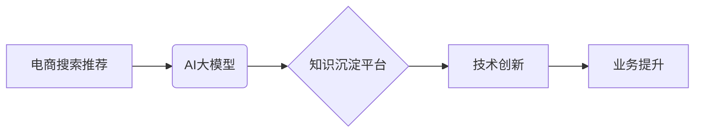

                 

## AI大模型视角下电商搜索推荐的技术创新知识沉淀平台功能优化

> 关键词：电商搜索推荐、AI大模型、知识沉淀平台、技术创新、推荐算法、个性化推荐、用户行为分析、数据挖掘、机器学习

## 1. 背景介绍

随着电商行业的蓬勃发展，搜索推荐系统已成为电商平台的核心竞争力之一。传统的搜索推荐系统主要依赖于基于规则和基于内容的算法，但随着用户行为数据的爆炸式增长和搜索需求的多样化，这些传统方法逐渐难以满足用户个性化需求和平台业务发展。

近年来，深度学习和自然语言处理技术的快速发展为电商搜索推荐带来了新的机遇。基于Transformer架构的AI大模型，例如BERT、GPT等，能够更好地理解用户搜索意图和商品语义，从而实现更精准、更个性化的推荐。

然而，AI大模型的训练和部署需要大量的计算资源和专业技术，对于中小电商平台来说，难以独自承担。因此，构建一个基于AI大模型的电商搜索推荐技术创新知识沉淀平台，可以帮助电商平台共享资源、协同创新，加速AI技术的应用落地。

## 2. 核心概念与联系

### 2.1  电商搜索推荐

电商搜索推荐是指根据用户的搜索行为、浏览历史、购买记录等数据，为用户推荐相关商品的过程。其目标是提高用户搜索体验，提升商品曝光率和转化率。

### 2.2  AI大模型

AI大模型是指在海量数据上训练的深度学习模型，具有强大的泛化能力和学习能力。它能够理解和生成自然语言、图像、音频等多种数据类型，并应用于各种场景，例如文本分类、机器翻译、图像识别等。

### 2.3  知识沉淀平台

知识沉淀平台是指用于收集、整理、存储、共享和利用组织内部知识的系统。它可以帮助企业积累和沉淀知识资产，提高知识利用效率，促进创新发展。

**核心概念关系图**



## 3. 核心算法原理 & 具体操作步骤

### 3.1  算法原理概述

基于AI大模型的电商搜索推荐算法通常采用以下核心原理：

* **用户行为分析:** 通过分析用户的搜索历史、浏览记录、购买记录等行为数据，构建用户画像，理解用户的兴趣偏好和需求。
* **商品语义理解:** 利用自然语言处理技术，对商品标题、描述、评论等文本数据进行分析，提取商品的语义特征，构建商品语义向量。
* **推荐模型训练:** 基于用户行为数据和商品语义特征，训练推荐模型，例如协同过滤、深度学习推荐模型等，预测用户对商品的兴趣和点击概率。
* **个性化推荐:** 根据用户的个性化特征和实时行为，为用户推荐个性化的商品列表。

### 3.2  算法步骤详解

1. **数据收集与预处理:** 收集用户行为数据、商品信息数据等，并进行清洗、格式化、特征提取等预处理操作。
2. **用户画像构建:** 利用机器学习算法，对用户行为数据进行聚类分析，构建用户画像，例如用户兴趣标签、购买偏好、消费水平等。
3. **商品语义向量化:** 利用自然语言处理技术，对商品信息数据进行文本分析，提取商品的关键词、主题、属性等语义特征，构建商品语义向量。
4. **推荐模型训练:** 选择合适的推荐算法，例如协同过滤、深度学习推荐模型等，利用用户画像和商品语义向量进行模型训练。
5. **推荐结果生成:** 根据用户的个性化特征和实时行为，利用训练好的推荐模型，预测用户对商品的兴趣和点击概率，生成个性化的商品推荐列表。
6. **结果评估与优化:** 对推荐结果进行评估，例如点击率、转化率等指标，并根据评估结果对推荐模型进行优化调整。

### 3.3  算法优缺点

**优点:**

* **精准度高:** 基于AI大模型的推荐算法能够更好地理解用户需求和商品语义，从而实现更精准的推荐。
* **个性化强:** 可以根据用户的个性化特征和实时行为，提供个性化的推荐，提升用户体验。
* **可扩展性强:** AI大模型具有强大的泛化能力，可以应用于各种电商场景，并随着数据量的增加不断提升推荐效果。

**缺点:**

* **训练成本高:** AI大模型的训练需要大量的计算资源和专业技术，对于中小电商平台来说，成本较高。
* **数据依赖性强:** AI大模型的性能取决于训练数据的质量和数量，数据不足或数据质量低会影响推荐效果。
* **解释性弱:** AI大模型的决策过程较为复杂，难以解释推荐结果背后的逻辑，这可能会导致用户对推荐结果的信任度降低。

### 3.4  算法应用领域

基于AI大模型的电商搜索推荐算法广泛应用于以下领域:

* **商品推荐:** 为用户推荐相关商品，例如基于兴趣、历史购买、浏览记录等推荐。
* **搜索结果排序:** 根据用户的搜索意图和商品相关性，对搜索结果进行排序，提升用户搜索体验。
* **个性化营销:** 根据用户的兴趣偏好和购买行为，进行个性化营销推广，提高营销效果。
* **新品推荐:** 为用户推荐新上市的商品，提高新品曝光率和销量。

## 4. 数学模型和公式 & 详细讲解 & 举例说明

### 4.1  数学模型构建

基于协同过滤的推荐算法，可以构建用户-商品交互矩阵，其中每个元素表示用户对商品的评分或购买行为。

**用户-商品交互矩阵:**

```
| 用户 | 商品1 | 商品2 | 商品3 |
|---|---|---|---|
| 用户1 | 5 | 3 | 4 |
| 用户2 | 4 | 5 | 2 |
| 用户3 | 3 | 4 | 5 |
```

### 4.2  公式推导过程

协同过滤算法的核心是寻找用户之间和商品之间相似性的关系。

**用户相似度计算:**

$$
Sim(u_i, u_j) = \frac{\sum_{k=1}^{N} r_{i,k} * r_{j,k}}{\sqrt{\sum_{k=1}^{N} r_{i,k}^2} * \sqrt{\sum_{k=1}^{N} r_{j,k}^2}}
$$

其中:

* $Sim(u_i, u_j)$ 表示用户 $u_i$ 和 $u_j$ 的相似度
* $r_{i,k}$ 表示用户 $u_i$ 对商品 $k$ 的评分或购买行为
* $N$ 表示商品总数

**商品相似度计算:**

$$
Sim(i, j) = \frac{\sum_{u=1}^{M} r_{u,i} * r_{u,j}}{\sqrt{\sum_{u=1}^{M} r_{u,i}^2} * \sqrt{\sum_{u=1}^{M} r_{u,j}^2}}
$$

其中:

* $Sim(i, j)$ 表示商品 $i$ 和 $j$ 的相似度
* $r_{u,i}$ 表示用户 $u$ 对商品 $i$ 的评分或购买行为
* $M$ 表示用户总数

### 4.3  案例分析与讲解

假设用户 $u_1$ 和 $u_2$ 都对商品 $1$ 和 $2$ 进行了评分，并且评分较高。根据用户相似度计算公式，我们可以计算出 $u_1$ 和 $u_2$ 的相似度较高。

如果 $u_1$ 对商品 $3$ 进行了评分，而 $u_2$ 没有对商品 $3$ 进行评分，那么我们可以利用 $u_1$ 和 $u_2$ 的相似度，预测 $u_2$ 对商品 $3$ 的评分。

## 5. 项目实践：代码实例和详细解释说明

### 5.1  开发环境搭建

* Python 3.7+
* TensorFlow 2.0+
* PyTorch 1.0+
* Jupyter Notebook

### 5.2  源代码详细实现

```python
# 导入必要的库
import tensorflow as tf
from tensorflow.keras.layers import Embedding, Dense

# 定义用户-商品交互矩阵
user_item_matrix = tf.constant([
    [5, 3, 4],
    [4, 5, 2],
    [3, 4, 5]
])

# 定义用户和商品的embedding维度
embedding_dim = 10

# 创建用户和商品的embedding层
user_embedding = Embedding(input_dim=user_item_matrix.shape[0], output_dim=embedding_dim)
item_embedding = Embedding(input_dim=user_item_matrix.shape[1], output_dim=embedding_dim)

# 将用户和商品的embedding向量进行点积
user_embeddings = user_embedding(tf.range(user_item_matrix.shape[0]))
item_embeddings = item_embedding(tf.range(user_item_matrix.shape[1]))
predictions = tf.reduce_sum(user_embeddings * item_embeddings, axis=1)

# 打印预测结果
print(predictions)
```

### 5.3  代码解读与分析

* 首先，我们定义了用户-商品交互矩阵，其中每个元素表示用户对商品的评分或购买行为。
* 然后，我们创建了用户和商品的embedding层，并将用户和商品的ID转换为embedding向量。
* 接着，我们利用用户和商品的embedding向量进行点积运算，得到预测结果。

### 5.4  运行结果展示

运行上述代码，可以得到用户对商品的预测评分。

## 6. 实际应用场景

### 6.1  电商平台推荐系统

基于AI大模型的电商搜索推荐系统可以为用户提供更精准、更个性化的商品推荐，提升用户体验和转化率。

### 6.2  搜索引擎结果排序

AI大模型可以理解用户的搜索意图，并根据商品的相关性对搜索结果进行排序，提升用户搜索体验。

### 6.3  个性化营销推广

AI大模型可以根据用户的兴趣偏好和购买行为，进行个性化营销推广，提高营销效果。

### 6.4  未来应用展望

随着AI技术的不断发展，基于AI大模型的电商搜索推荐技术将应用于更多场景，例如：

* **跨境电商推荐:** 为跨境用户提供更精准的商品推荐，帮助他们找到心仪的商品。
* **虚拟试衣间:** 利用AI大模型，实现虚拟试衣间功能，帮助用户在线试穿商品，提升购物体验。
* **智能客服:** 利用AI大模型，构建智能客服系统，为用户提供更便捷的购物服务。

## 7. 工具和资源推荐

### 7.1  学习资源推荐

* **书籍:**
    * 《深度学习》
    * 《自然语言处理》
    * 《推荐系统》
* **在线课程:**
    * Coursera: 深度学习
    * Udacity: 自然语言处理
    * edX: 推荐系统

### 7.2  开发工具推荐

* **TensorFlow:** 开源深度学习框架
* **PyTorch:** 开源深度学习框架
* **Scikit-learn:** 机器学习库
* **Jupyter Notebook:** 交互式编程环境

### 7.3  相关论文推荐

* **BERT: Pre-training of Deep Bidirectional Transformers for Language Understanding**
* **GPT: Generative Pre-trained Transformer**
* **Collaborative Filtering for Recommender Systems**

## 8. 总结：未来发展趋势与挑战

### 8.1  研究成果总结

基于AI大模型的电商搜索推荐技术取得了显著成果，能够提供更精准、更个性化的推荐，提升用户体验和业务效益。

### 8.2  未来发展趋势

* **模型更加复杂:** 未来，AI大模型将更加复杂，能够更好地理解用户需求和商品语义。
* **数据更加丰富:** 未来，电商平台将收集更多用户行为数据和商品信息数据，为AI大模型提供更丰富的训练数据。
* **应用场景更加广泛:** 未来，AI大模型将应用于更多电商场景，例如跨境电商、虚拟试衣间等。

### 8.3  面临的挑战

* **数据安全和隐私保护:** AI大模型的训练需要大量用户数据，如何保障数据安全和隐私保护是一个重要挑战。
* **模型解释性和可信度:** AI大模型的决策过程较为复杂，难以解释推荐结果背后的逻辑，如何提升模型的解释性和可信度是一个重要挑战。
* **计算资源和成本:** AI大模型的训练和部署需要大量的计算资源和成本，如何降低成本是一个重要挑战。

### 8.4  研究展望

未来，我们将继续研究基于AI大模型的电商搜索推荐技术，探索更精准、更个性化的推荐方法，并解决数据安全、模型解释性和成本等挑战。


## 9. 附录：常见问题与解答

**Q1: 如何选择合适的AI大模型？**

**A1:** 选择合适的AI大模型需要根据具体应用场景和数据特点进行选择。例如，对于文本数据，BERT模型效果较好；对于图像数据，CNN模型效果较好。

**Q2: 如何评估AI大模型的推荐效果？**

**A2:** 可以使用点击率、转化率、用户满意度等指标来评估AI大模型的推荐效果。

**Q3: 如何解决数据安全和隐私保护问题？**

**A3:** 可以采用数据脱敏、加密等技术来保护用户数据安全和隐私。

**作者：禅与计算机程序设计艺术 / Zen and the Art of Computer Programming**<end_of_turn>

