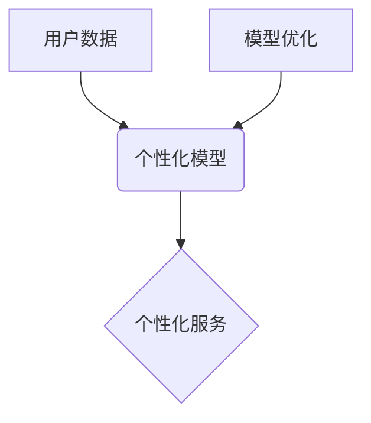

                 

## AI应用的个性化和优化

> 关键词：人工智能、个性化推荐、模型优化、深度学习、机器学习、算法效率、数据分析、云计算

## 1. 背景介绍

人工智能（AI）技术近年来发展迅速，已渗透到生活的方方面面。从智能语音助手到个性化推荐系统，AI正在改变着我们的生活方式和工作模式。然而，现有的AI应用往往缺乏个性化，无法充分满足用户多样化的需求。同时，模型训练和部署的效率也面临着挑战。

个性化AI应用是指能够根据用户的个人特征、偏好和行为模式，提供定制化的服务和体验。例如，个性化推荐系统可以根据用户的浏览历史、购买记录和评分等信息，推荐更符合用户兴趣的商品或内容。个性化医疗诊断系统可以根据用户的病史、基因信息和生活习惯，提供更精准的诊断和治疗方案。

模型优化是指提高AI模型的性能和效率，使其能够更快、更准确地完成任务。这包括模型结构优化、参数调优、训练数据增强等方面。

## 2. 核心概念与联系

**2.1 个性化与优化之间的关系**

个性化和优化是AI应用的两大关键要素，它们相互关联、相互促进。个性化应用需要基于用户的特定需求进行模型定制，而模型优化则可以提高个性化应用的效率和准确性。

**2.2 核心概念架构**



**2.3 核心概念原理**

* **用户数据:**  个性化AI应用的核心是用户数据。通过收集和分析用户的行为模式、偏好和需求，可以构建个性化的模型。
* **个性化模型:** 个性化模型根据用户的特征和数据进行训练，能够预测用户的行为和偏好，从而提供定制化的服务。
* **模型优化:** 模型优化通过调整模型结构、参数和训练数据，提高模型的性能和效率。
* **个性化服务:** 个性化服务是基于个性化模型提供的定制化的产品、内容或体验。

## 3. 核心算法原理 & 具体操作步骤

**3.1 算法原理概述**

个性化AI应用中常用的算法包括：

* **协同过滤:** 基于用户的相似性或物品的相似性进行推荐。
* **内容过滤:** 根据用户的兴趣和物品的特征进行推荐。
* **深度学习:** 使用神经网络进行特征提取和预测，实现更精准的个性化推荐。

**3.2 算法步骤详解**

以协同过滤算法为例，其具体步骤如下：

1. **数据收集:** 收集用户的行为数据，例如评分、购买记录、浏览历史等。
2. **用户相似度计算:** 计算用户之间的相似度，可以使用余弦相似度、皮尔逊相关系数等方法。
3. **物品相似度计算:** 计算物品之间的相似度，可以使用余弦相似度、Jaccard系数等方法。
4. **推荐生成:** 根据用户的相似用户或物品的相似物品，生成个性化的推荐列表。

**3.3 算法优缺点**

* **优点:** 能够提供个性化的推荐，提升用户体验。
* **缺点:** 数据稀疏性问题、冷启动问题、数据偏差问题等。

**3.4 算法应用领域**

* **电子商务:** 商品推荐、用户画像
* **内容推荐:** 视频推荐、新闻推荐、音乐推荐
* **社交网络:** 朋友推荐、兴趣小组推荐

## 4. 数学模型和公式 & 详细讲解 & 举例说明

**4.1 数学模型构建**

协同过滤算法的数学模型可以表示为：

$$
r_{ui} = \sum_{j=1}^{N} w_{ij} r_{uj}
$$

其中：

* $r_{ui}$ 表示用户 $u$ 对物品 $i$ 的评分。
* $r_{uj}$ 表示用户 $u$ 对物品 $j$ 的评分。
* $w_{ij}$ 表示物品 $i$ 和物品 $j$ 之间的相似度。
* $N$ 表示所有物品的数量。

**4.2 公式推导过程**

该公式基于用户的评分历史数据，通过计算用户与其他用户的相似度以及物品与其他物品的相似度，预测用户对特定物品的评分。

**4.3 案例分析与讲解**

假设用户 $A$ 对电影 $A$ 和电影 $B$ 分别评分为 5 和 4，用户 $B$ 对电影 $A$ 和电影 $C$ 分别评分为 4 和 3。如果我们想要预测用户 $A$ 对电影 $C$ 的评分，可以使用协同过滤算法。

首先，我们需要计算用户 $A$ 和用户 $B$ 之间的相似度，以及电影 $A$ 和电影 $C$ 之间的相似度。然后，我们可以使用公式计算用户 $A$ 对电影 $C$ 的预测评分。

## 5. 项目实践：代码实例和详细解释说明

**5.1 开发环境搭建**

* Python 3.x
* TensorFlow 或 PyTorch
* Jupyter Notebook

**5.2 源代码详细实现**

```python
import numpy as np
from sklearn.metrics.pairwise import cosine_similarity

# 用户评分数据
ratings = np.array([
    [5, 4, 0],  # 用户 A
    [4, 3, 2],  # 用户 B
    [0, 0, 5]   # 用户 C
])

# 计算用户相似度
user_similarity = cosine_similarity(ratings)

# 计算物品相似度
item_similarity = cosine_similarity(ratings.T)

# 预测用户 A 对电影 C 的评分
user_A_index = 0
item_C_index = 2
predicted_rating = np.sum(user_similarity[user_A_index] * ratings[:, item_C_index]) / np.sum(user_similarity[user_A_index])
```

**5.3 代码解读与分析**

* 该代码首先定义了用户评分数据，然后使用 `cosine_similarity` 函数计算用户和物品之间的相似度。
* 接着，使用用户相似度和物品相似度，预测用户 A 对电影 C 的评分。

**5.4 运行结果展示**

运行该代码后，可以得到用户 A 对电影 C 的预测评分。

## 6. 实际应用场景

**6.1 电子商务**

个性化推荐系统可以根据用户的购买历史、浏览记录和评分等信息，推荐更符合用户兴趣的商品。

**6.2 内容推荐**

个性化推荐系统可以根据用户的阅读习惯、观看历史和点赞记录等信息，推荐更符合用户兴趣的新闻、视频、音乐等内容。

**6.3 教育**

个性化学习系统可以根据学生的学习进度、知识掌握情况和学习风格等信息，提供个性化的学习内容和学习路径。

**6.4 未来应用展望**

随着人工智能技术的不断发展，个性化AI应用将更加广泛地应用于各个领域，例如医疗、金融、交通等。

## 7. 工具和资源推荐

**7.1 学习资源推荐**

* **书籍:**
    * 《深度学习》
    * 《机器学习实战》
* **在线课程:**
    * Coursera
    * edX
    * Udacity

**7.2 开发工具推荐**

* **Python:** TensorFlow, PyTorch, scikit-learn
* **云平台:** AWS, Azure, Google Cloud

**7.3 相关论文推荐**

* **协同过滤:**
    * "Collaborative Filtering: A User-Based Approach"
    * "Memory-Based Collaborative Filtering"
* **深度学习:**
    * "Deep Learning"
    * "Recurrent Neural Networks for Sequence Learning"

## 8. 总结：未来发展趋势与挑战

**8.1 研究成果总结**

近年来，个性化AI应用取得了显著进展，例如推荐系统、个性化医疗诊断等领域取得了突破。

**8.2 未来发展趋势**

* **模型更加精准:** 利用更先进的深度学习算法和更丰富的用户数据，构建更加精准的个性化模型。
* **应用场景更加广泛:** 个性化AI应用将更加广泛地应用于各个领域，例如教育、金融、交通等。
* **解释性更强:** 研究更可解释的个性化AI模型，提高用户对模型决策的理解和信任。

**8.3 面临的挑战**

* **数据隐私:** 个性化AI应用需要收集和分析大量的用户数据，如何保护用户隐私是一个重要的挑战。
* **算法公平性:** 个性化AI模型可能存在偏差，导致不公平的结果，需要研究算法公平性问题。
* **模型可解释性:** 许多深度学习模型是黑箱模型，难以解释其决策过程，需要研究更可解释的模型。

**8.4 研究展望**

未来，个性化AI应用将继续朝着更加精准、广泛、可解释的方向发展。


## 9. 附录：常见问题与解答

**9.1 如何解决数据稀疏性问题？**

数据稀疏性问题是协同过滤算法面临的常见挑战。可以采用以下方法解决：

* **使用混合推荐算法:** 将协同过滤算法与内容过滤算法相结合。
* **使用矩阵分解技术:** 将用户评分矩阵分解成低维矩阵，降低数据稀疏性。
* **使用知识图谱:** 利用知识图谱中的结构化知识，补充用户评分数据。

**9.2 如何解决冷启动问题？**

冷启动问题是指新用户或新物品缺乏评分数据，难以进行推荐。可以采用以下方法解决：

* **使用用户画像:** 根据用户的其他信息，例如年龄、性别、兴趣爱好等，进行初始推荐。
* **使用物品特征:** 根据物品的属性、描述等信息，进行初始推荐。
* **使用多模态数据:** 利用用户的其他数据，例如文本、图像、音频等，进行推荐。


作者：禅与计算机程序设计艺术 / Zen and the Art of Computer Programming 
<end_of_turn>

