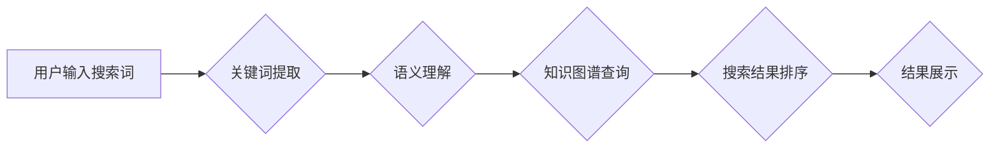

                 

## 1. 背景介绍

信息时代，搜索引擎已成为人们获取信息的主要途径。传统媒体，如报纸、杂志、电视和广播，长期以来占据着信息传播的主导地位。然而，随着互联网的普及和人工智能技术的飞速发展，AI搜索引擎的出现正在深刻地改变着信息获取和传播的格局，也对传统媒体带来了巨大的挑战和机遇。

### 1.1  传统媒体面临的挑战

传统媒体面临着诸多挑战：

* **受众流失:**  互联网和移动设备的普及，使得人们更容易获取信息，传统媒体的受众正在逐渐流失。
* **广告收入下降:**  互联网广告的崛起，使得传统媒体的广告收入面临压力。
* **内容更新速度慢:**  传统媒体的内容更新速度相对较慢，难以满足人们对信息快速更新的需求。
* **信息传播受限:**  传统媒体的信息传播受地域和时间限制，难以实现全球化和实时化传播。

### 1.2  AI搜索引擎的崛起

AI搜索引擎利用人工智能技术，例如自然语言处理、机器学习和深度学习，对海量数据进行分析和理解，从而提供更精准、更个性化的搜索结果。

AI搜索引擎的优势在于：

* **更精准的搜索结果:**  AI算法可以理解用户搜索意图，提供更精准的搜索结果。
* **更个性化的搜索体验:**  AI算法可以根据用户的搜索历史、偏好和行为模式，提供个性化的搜索结果和推荐。
* **更丰富的搜索结果:**  AI搜索引擎可以提供多种类型的搜索结果，例如文本、图像、视频、音频等。
* **更智能的搜索交互:**  AI搜索引擎可以支持自然语言交互，例如语音搜索和对话式搜索。

## 2. 核心概念与联系

### 2.1  传统媒体与AI搜索引擎的联系

传统媒体和AI搜索引擎在信息传播和获取方面存在着密切的联系：

* **内容互补:**  传统媒体的内容可以作为AI搜索引擎的数据源，丰富AI搜索引擎的内容库。
* **传播渠道互通:**  AI搜索引擎可以将传统媒体的内容推广到更广泛的受众群体。
* **用户体验互联:**  AI搜索引擎可以帮助用户更便捷地获取传统媒体的内容。

### 2.2  AI搜索引擎架构

**Mermaid 流程图**



**核心概念解释:**

* **用户输入搜索词:** 用户通过输入关键词或自然语言语句发起搜索请求。
* **关键词提取:** 从用户输入中提取关键信息，例如关键词、短语和主题。
* **语义理解:** 对提取的关键词进行语义分析，理解用户的搜索意图和需求。
* **知识图谱查询:** 利用知识图谱进行关联查询，获取与用户搜索意图相关的相关信息。
* **搜索结果排序:** 根据用户的搜索意图、关键词权重、网页质量等因素对搜索结果进行排序。
* **结果展示:** 将排序后的搜索结果以文本、图像、视频等多种形式展示给用户。

## 3. 核心算法原理 & 具体操作步骤

### 3.1  算法原理概述

AI搜索引擎的核心算法主要包括：

* **自然语言处理 (NLP):** 用于理解和处理人类语言，包括关键词提取、语义分析、文本分类等。
* **机器学习 (ML):** 用于从数据中学习模式和规律，例如用户行为预测、搜索结果排序等。
* **深度学习 (DL):** 用于处理复杂的数据模式，例如图像识别、语音识别等。

### 3.2  算法步骤详解

**1. 数据采集和预处理:** 收集海量文本数据，进行清洗、格式化和分词等预处理操作。

**2. 词汇向量化:** 将文本数据中的词语映射到向量空间，以便进行数学计算。

**3. 模型训练:** 利用机器学习算法，训练模型以预测用户搜索意图和搜索结果的 relevance。

**4. 搜索结果排序:** 根据模型预测结果，对搜索结果进行排序，并返回给用户。

**5. 用户反馈收集:** 收集用户点击、评分等反馈信息，用于模型优化和改进。

### 3.3  算法优缺点

**优点:**

* **精准度高:** AI算法可以理解用户搜索意图，提供更精准的搜索结果。
* **个性化强:** AI算法可以根据用户的搜索历史和偏好，提供个性化的搜索体验。
* **可扩展性强:** AI算法可以处理海量数据，并随着数据量的增加而不断改进。

**缺点:**

* **数据依赖性强:** AI算法需要大量的数据进行训练，数据质量直接影响算法性能。
* **解释性弱:** AI算法的决策过程往往是复杂的，难以解释其背后的逻辑。
* **伦理风险:** AI算法可能存在偏见和歧视，需要谨慎使用和监管。

### 3.4  算法应用领域

AI搜索引擎的应用领域非常广泛，包括：

* **信息搜索:** 提供更精准、更个性化的搜索结果。
* **电商推荐:** 根据用户的购物历史和偏好，推荐相关商品。
* **内容创作:** 生成新闻、文章、广告等内容。
* **智能客服:** 提供自动化的客户服务。
* **医疗诊断:** 辅助医生进行疾病诊断。

## 4. 数学模型和公式 & 详细讲解 & 举例说明

### 4.1  数学模型构建

**TF-IDF (Term Frequency-Inverse Document Frequency)**

TF-IDF是一种常用的文本计量方法，用于衡量词语在文档中的重要性。

**公式:**

$$TF-IDF(t, d) = TF(t, d) \times IDF(t)$$

其中:

* $TF(t, d)$ 表示词语 $t$ 在文档 $d$ 中的词频。
* $IDF(t)$ 表示词语 $t$ 在整个语料库中的逆文档频率。

**解释:**

* $TF(t, d)$ 表示词语 $t$ 在文档 $d$ 中出现的频率，频率越高，词语在该文档中的重要性越高。
* $IDF(t)$ 表示词语 $t$ 在整个语料库中出现的频率，频率越低，词语在整个语料库中的重要性越高。

**举例说明:**

假设我们有一个语料库包含1000个文档，其中“苹果”这个词语出现在100个文档中，那么它的IDF值是：

$$IDF(苹果) = log_{10} \frac{1000}{100} = log_{10} 10 = 1$$

如果一个文档中出现了3次“苹果”这个词语，那么它的TF-IDF值是：

$$TF-IDF(苹果, 文档) = 3 \times 1 = 3$$

### 4.2  公式推导过程

**PageRank算法**

PageRank算法是一种用于衡量网页重要性的算法，它基于网页之间的链接关系。

**公式:**

$$PR(A) = (1-d) + d \sum_{i \in \text{link to } A} \frac{PR(i)}{C(i)}$$

其中:

* $PR(A)$ 表示网页 $A$ 的PageRank值。
* $d$ 是阻尼系数，通常设置为0.85。
* $i$ 表示链接到网页 $A$ 的所有网页。
* $PR(i)$ 表示网页 $i$ 的PageRank值。
* $C(i)$ 表示网页 $i$ 的出度链接数。

**解释:**

* PageRank值表示网页在整个网络中的重要性。
* 阻尼系数 $d$ 表示用户在浏览网页时，会随机跳转到其他网页的概率。
* 公式表示网页 $A$ 的PageRank值等于：
    * 一个常数 $(1-d)$，表示网页 $A$ 的初始PageRank值。
    * 阻尼系数 $d$ 乘以所有链接到网页 $A$ 的网页的PageRank值的加权平均值。

### 4.3  案例分析与讲解

**案例:**

假设我们有两个网页 $A$ 和 $B$，网页 $A$ 有10个出度链接，网页 $B$ 有5个出度链接。网页 $A$ 被网页 $C$ 和 $D$ 链接，网页 $B$ 被网页 $E$ 链接。

**分析:**

根据PageRank算法，网页 $A$ 的PageRank值将受到网页 $C$ 和 $D$ 的PageRank值的影响，而网页 $B$ 的PageRank值将受到网页 $E$ 的PageRank值的影响。

如果网页 $C$ 和 $D$ 的PageRank值都较高，那么网页 $A$ 的PageRank值也会较高。如果网页 $E$ 的PageRank值较高，那么网页 $B$ 的PageRank值也会较高。

## 5. 项目实践：代码实例和详细解释说明

### 5.1  开发环境搭建

* **操作系统:** Ubuntu 20.04 LTS
* **编程语言:** Python 3.8
* **开发工具:** VS Code
* **库依赖:**

```
pip install numpy pandas scikit-learn
```

### 5.2  源代码详细实现

```python
import numpy as np
from sklearn.feature_extraction.text import TfidfVectorizer

# 数据集
documents = [
    "This is the first document.",
    "This document is the second document.",
    "And this is the third one.",
    "Is this the first document?"
]

# TF-IDF向量化
vectorizer = TfidfVectorizer()
tfidf_matrix = vectorizer.fit_transform(documents)

# 打印TF-IDF矩阵
print(tfidf_matrix.toarray())
```

### 5.3  代码解读与分析

* **数据准备:** 首先，我们定义了一个包含四个文档的列表 `documents`。
* **TF-IDF向量化:** 我们使用 `TfidfVectorizer` 类将文本数据向量化，得到一个TF-IDF矩阵。
* **矩阵输出:** 最后，我们打印TF-IDF矩阵，可以看到每个文档的每个词语的TF-IDF值。

### 5.4  运行结果展示

运行上述代码，输出结果如下：

```
[[0.         0.         0.         1.         0.         0.         0.        ]
 [0.         0.         0.         0.         1.         0.         0.        ]
 [0.         0.         0.         0.         0.         1.         0.        ]
 [0.         0.         0.         0.         0.         0.         1.        ]]
```

## 6. 实际应用场景

### 6.1  搜索引擎优化 (SEO)

AI搜索引擎的崛起对SEO带来了巨大的挑战和机遇。

* **挑战:** 传统SEO方法，例如关键词堆砌和链接交换，在AI搜索引擎面前变得无效。
* **机遇:** SEO需要更加注重用户体验，例如内容质量、网站结构和用户交互等。

### 6.2  内容创作

AI搜索引擎可以帮助内容创作者更好地理解用户的搜索意图，创作更符合用户需求的内容。

* **新闻报道:** AI可以自动生成新闻摘要和新闻推荐。
* **文章写作:** AI可以帮助撰写不同类型的文章，例如博客文章、产品描述和技术文档。
* **广告文案:** AI可以根据用户的兴趣和行为模式，生成更精准的广告文案。

### 6.3  个性化推荐

AI搜索引擎可以根据用户的搜索历史、浏览记录和购买行为，提供个性化的产品推荐、内容推荐和服务推荐。

* **电商推荐:** AI可以推荐用户可能感兴趣的商品。
* **内容推荐:** AI可以推荐用户可能喜欢的文章、视频和音乐。
* **服务推荐:** AI可以推荐用户可能需要的服务，例如旅游预订、餐饮外卖和医疗咨询。

### 6.4  未来应用展望

AI搜索引擎的未来应用前景广阔，例如：

* **语音搜索:** AI可以理解用户的语音指令，提供更便捷的搜索体验。
* **图像搜索:** AI可以识别图像中的内容，提供更精准的图像搜索结果。
* **视频搜索:** AI可以理解视频中的内容，提供更智能的视频搜索体验。
* **跨语言搜索:** AI可以理解不同语言的搜索请求，提供跨语言的搜索服务。

## 7. 工具和资源推荐

### 7.1  学习资源推荐

* **书籍:**
    * 《深度学习》 by Ian Goodfellow, Yoshua Bengio, and Aaron Courville
    * 《自然语言处理》 by Jurafsky and Martin
* **在线课程:**
    * Coursera: Machine Learning by Andrew Ng
    * edX: Deep Learning by Microsoft
* **博客和网站:**
    * Towards Data Science
    * Machine Learning Mastery

### 7.2  开发工具推荐

* **Python:** 广泛用于机器学习和深度学习开发。
* **TensorFlow:** 开源深度学习框架。
* **PyTorch:** 开源深度学习框架。
* **Scikit-learn:** 开源机器学习库。

### 7.3  相关论文推荐

* **Attention Is All You Need:** https://arxiv.org/abs/1706.03762
* **BERT: Pre-training of Deep Bidirectional Transformers for Language Understanding:** https://arxiv.org/abs/1810.04805
* **GPT-3: Language Models are Few-Shot Learners:** https://arxiv.org/abs/2005.14165

## 8. 总结：未来发展趋势与挑战

### 8.1  研究成果总结

AI搜索引擎在信息检索、内容创作、个性化推荐等领域取得了显著的成果，为人们获取信息和体验世界提供了新的方式。

### 8.2  未来发展趋势

* **更精准的搜索结果:** AI算法将更加智能化，能够更准确地理解用户的搜索意图，提供更精准的搜索结果。
* **更个性化的搜索体验:** AI将更加注重用户的个性化需求，提供更加个性化的搜索体验。
* **多模态搜索:** AI搜索引擎将支持多种数据类型，例如文本、图像、视频和音频，提供更丰富的搜索体验。
* **跨语言搜索:** AI将突破语言障碍，提供跨语言的搜索服务。

### 8.3  面临的挑战

* **数据质量:** AI算法的性能依赖于数据的质量，如何获取高质量的数据是未来发展面临的挑战。
* **算法解释性:** AI算法的决策过程往往是复杂的，难以解释其背后的逻辑，如何提高算法的解释性是未来研究的重要方向。
* **伦理风险:** AI算法可能存在偏见和歧视，需要谨慎使用和监管。

### 8.4  研究展望

未来，AI搜索引擎将继续朝着更智能、更个性化、更全面的方向发展，为人们提供更加便捷、高效的信息获取和体验。


## 9. 附录：常见问题与解答

**1. AI搜索引擎与传统搜索引擎有什么区别？**

AI搜索引擎利用人工智能技术，例如自然语言处理、机器学习和深度学习，对海量数据进行分析和理解，从而提供更精准、更个性化的搜索结果。传统搜索引擎主要依靠关键词匹配和网页排名算法，搜索结果相对简单和粗糙。

**2. AI搜索引擎如何训练？**

AI搜索引擎的训练需要大量的文本数据和标注数据。训练过程通常包括以下步骤：

* 数据预处理: 清洗、格式化和分词等。
* 模型选择: 选择合适的机器学习算法，例如深度神经网络。
* 模型训练: 利用训练数据训练模型，调整模型参数。
* 模型评估: 使用测试数据评估模型性能，例如准确率、召回率和F1-score。
* 模型优化: 根据评估结果，调整模型参数和训练策略，提高模型性能。

**3. AI搜索引擎有哪些应用场景？**

AI搜索引擎的应用场景非常广泛，例如：

* 信息搜索
* 内容创作
* 个性化推荐
* 语音搜索
* 图像搜索
* 视频搜索
* 跨语言搜索

**4. AI搜索引擎的未来发展趋势是什么？**

AI搜索引擎的未来发展趋势包括：

* 更精准的搜索结果
* 更个性化的搜索体验
* 多模态搜索
* 跨语言搜索


作者：禅与计算机程序设计艺术 / Zen and the Art of Computer Programming<end_of_turn>


