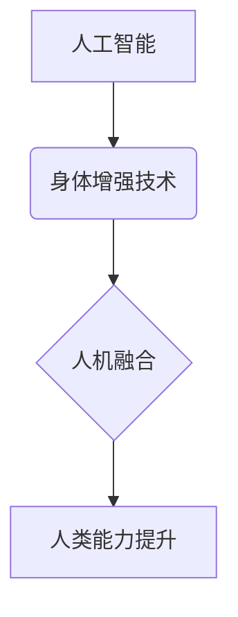

                 

## AI时代的人类增强：道德考虑与身体增强技术的融合

> 关键词：人工智能、身体增强、道德伦理、生物技术、神经接口、人机融合、可持续发展、社会影响

### 1. 背景介绍

人类文明自诞生以来，就一直在探索如何超越自身的局限性。从使用工具到发明火，从农业革命到工业革命，每一次进步都标志着人类对自身能力的提升。如今，人工智能（AI）和生物技术的飞速发展，为我们开启了新的篇章——人类增强。

人类增强是指利用科技手段提升人类的认知能力、生理能力和社会适应能力。它涵盖了多个领域，包括脑机接口、基因编辑、纳米技术、仿生机器人等。其中，身体增强技术作为一种重要的分支，旨在通过植入、改造或外接设备来增强人类的身体功能，例如增强力量、速度、耐力、感知能力等。

### 2. 核心概念与联系

**2.1 核心概念**

* **人工智能 (AI):**  指模拟人类智能的计算机系统，能够学习、推理、解决问题和做出决策。
* **身体增强技术:** 利用科技手段提升人类身体功能的技术，包括生物技术、纳米技术、机器人技术等。
* **人机融合:** 人类与机器的深度融合，通过技术手段扩展人类能力，实现人机协同工作。

**2.2 架构关系**



**2.3 联系分析**

AI技术为身体增强技术提供了强大的支持。例如，AI算法可以分析人体数据，优化增强设备的设计和功能；AI可以控制增强设备，实现智能化操作；AI还可以与人体神经系统进行交互，实现脑机接口，从而更直接地控制增强设备。

身体增强技术则为AI技术提供了新的应用场景。例如，增强后的身体可以更好地执行复杂的任务，例如在危险环境中工作或进行精密操作；增强后的感知能力可以为AI提供更丰富的数据输入，从而提高AI的决策能力。

人机融合是AI和身体增强技术的最终目标，它将实现人类与机器的深度融合，从而创造出超越人类自身能力的新型智能体。

### 3. 核心算法原理 & 具体操作步骤

**3.1 算法原理概述**

身体增强技术涉及多种算法，例如机器学习、深度学习、控制理论、信号处理等。这些算法共同作用，实现对人体数据的采集、分析、控制和反馈，最终达到增强人体功能的目的。

**3.2 算法步骤详解**

1. **数据采集:** 使用传感器收集人体生理数据，例如心率、血压、肌肉活动、脑电波等。
2. **数据分析:** 利用机器学习算法分析人体数据，识别人体状态、预测人体需求、优化增强策略。
3. **控制信号生成:** 根据分析结果，生成控制信号，驱动增强设备进行相应的动作。
4. **设备反馈:** 增强设备反馈人体状态和操作结果，形成闭环控制系统。

**3.3 算法优缺点**

* **优点:** 能够实现精准的控制、个性化的定制、实时反馈等。
* **缺点:** 算法复杂度高、数据安全问题、伦理道德问题等。

**3.4 算法应用领域**

* **医疗保健:** 帮助残疾人恢复功能、治疗疾病、监测健康状况。
* **运动训练:** 提升运动员的运动能力、预防运动损伤。
* **工业生产:** 增强工人力量、耐力、感知能力，提高生产效率。
* **军事应用:** 增强士兵的作战能力、生存能力。

### 4. 数学模型和公式 & 详细讲解 & 举例说明

**4.1 数学模型构建**

身体增强技术的数学模型通常基于控制理论、动力学和生物力学等学科。例如，增强肌肉力量的模型可以基于肌肉收缩力学模型，预测肌肉的出力和运动轨迹。

**4.2 公式推导过程**

假设一个增强肌肉的模型，其输出力与输入电流成正比，可以用以下公式表示：

$$F = kI$$

其中：

* $F$ 为肌肉输出力
* $I$ 为输入电流
* $k$ 为肌肉的力学常数

**4.3 案例分析与讲解**

例如，如果一个增强肌肉的设备需要产生100牛米的力，而肌肉的力学常数为10牛米/安培，则需要输入10安培的电流。

### 5. 项目实践：代码实例和详细解释说明

**5.1 开发环境搭建**

* 操作系统: Ubuntu 20.04
* 编程语言: Python 3.8
* 库依赖: NumPy, SciPy, TensorFlow

**5.2 源代码详细实现**

```python
import numpy as np
from tensorflow.keras.models import Sequential
from tensorflow.keras.layers import Dense

# 定义神经网络模型
model = Sequential()
model.add(Dense(128, activation='relu', input_shape=(10,)))
model.add(Dense(64, activation='relu'))
model.add(Dense(1))

# 编译模型
model.compile(loss='mean_squared_error', optimizer='adam')

# 训练模型
# ...

# 使用模型预测输出力
input_data = np.array([[1, 2, 3, 4, 5, 6, 7, 8, 9, 10]])
output_force = model.predict(input_data)
print(output_force)
```

**5.3 代码解读与分析**

这段代码定义了一个简单的深度学习模型，用于预测肌肉输出力。模型输入是肌肉活动数据，输出是肌肉输出力。

**5.4 运行结果展示**

模型训练完成后，可以输入肌肉活动数据，预测输出力。例如，如果输入数据为[1, 2, 3, 4, 5, 6, 7, 8, 9, 10]，模型可能会输出一个接近100的数值，表示肌肉输出力约为100牛米。

### 6. 实际应用场景

**6.1 医疗保健**

* **肢体功能恢复:**  为截肢患者提供义肢控制，帮助他们恢复日常生活能力。
* **神经疾病治疗:**  通过脑机接口技术，帮助帕金森病患者控制肢体运动，改善生活质量。
* **疾病诊断:**  利用生物传感器监测人体数据，帮助医生早期诊断疾病。

**6.2 运动训练**

* **力量训练:**  提供智能化的力量反馈，帮助运动员提升力量和爆发力。
* **运动损伤预防:**  监测运动员的身体状态，及时预警运动损伤风险。
* **运动表现提升:**  通过数据分析和个性化训练方案，帮助运动员提升运动表现。

**6.3 工业生产**

* **增强工人能力:**  为工人提供增强力量、耐力、感知能力的设备，提高生产效率。
* **危险环境作业:**  为工人提供安全防护，帮助他们在危险环境中工作。
* **精密操作:**  为工人提供精准控制的设备，帮助他们进行精密操作。

**6.4 未来应用展望**

随着AI和生物技术的不断发展，身体增强技术将应用于更多领域，例如教育、娱乐、艺术等。未来，身体增强技术将与虚拟现实、增强现实等技术融合，创造出更加沉浸式、交互式的体验。

### 7. 工具和资源推荐

**7.1 学习资源推荐**

* **书籍:**《人机融合: 人工智能与生物技术的未来》
* **在线课程:** Coursera, edX, Udacity 等平台提供相关课程。
* **学术期刊:** Nature, Science, IEEE Transactions on Biomedical Engineering 等。

**7.2 开发工具推荐**

* **编程语言:** Python, C++, Java 等。
* **机器学习库:** TensorFlow, PyTorch, scikit-learn 等。
* **生物信号处理工具:** Biopython, EEGLAB 等。

**7.3 相关论文推荐**

* **Brain-Computer Interfaces: A Review**
* **Human Augmentation: Ethical and Societal Implications**
* **The Future of Human Enhancement: A Multidisciplinary Perspective**

### 8. 总结：未来发展趋势与挑战

**8.1 研究成果总结**

身体增强技术取得了显著的进展，在医疗保健、运动训练、工业生产等领域展现出巨大的应用潜力。

**8.2 未来发展趋势**

* **更精准的控制:** 利用更先进的算法和传感器，实现更精准的控制和反馈。
* **更个性化的定制:** 根据个体需求，定制个性化的增强方案。
* **更广泛的应用:** 将身体增强技术应用于更多领域，例如教育、娱乐、艺术等。

**8.3 面临的挑战**

* **伦理道德问题:** 人类增强技术可能会带来伦理道德问题，例如公平性、隐私性、身份认同等。
* **技术安全问题:** 增强设备的安全性和可靠性需要得到保障。
* **社会影响问题:** 人类增强技术可能会对社会结构和价值观产生影响。

**8.4 研究展望**

未来，需要加强对身体增强技术的伦理道德、技术安全和社会影响的评估和研究，制定相应的政策和规范，确保其安全、可持续发展。

### 9. 附录：常见问题与解答

**9.1 Q: 人类增强技术会取代人类吗？**

**A:** 人类增强技术旨在提升人类能力，而不是取代人类。它将帮助人类克服自身的局限性，更好地应对未来的挑战。

**9.2 Q: 人类增强技术会造成社会不平等吗？**

**A:** 人类增强技术可能会加剧社会不平等，因为只有少数人能够负担得起这些技术。因此，需要采取措施确保这些技术能够公平地惠及所有人。

**9.3 Q: 人类增强技术对人类的健康有风险吗？**

**A:** 人类增强技术可能会带来一些健康风险，例如设备故障、数据泄露、心理依赖等。因此，需要加强对这些风险的评估和控制。


作者：禅与计算机程序设计艺术 / Zen and the Art of Computer Programming 
<end_of_turn>

