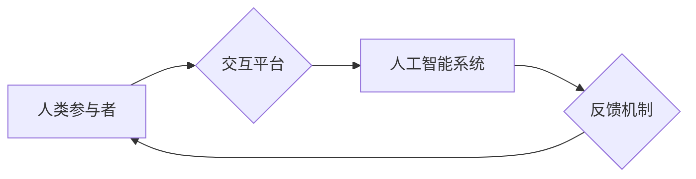

                 

## AI时代的人类计算：未来的道德边界

> 关键词：人工智能、人类计算、道德边界、算法伦理、可解释性、公平性、透明度、责任

### 1. 背景介绍

人工智能（AI）正以惊人的速度发展，其影响力渗透到我们生活的方方面面。从自动驾驶汽车到医疗诊断，从个性化教育到金融交易，AI正在改变着世界。然而，随着AI技术的进步，也引发了关于其伦理和社会影响的广泛讨论。

人类计算是指人类与人工智能协同工作，共同完成复杂任务的过程。在AI时代，人类计算将成为一种新的计算模式，其核心是将人类的智慧、创造力和情感与AI的计算能力相结合。然而，这种新的计算模式也带来了新的挑战和机遇。

### 2. 核心概念与联系

**2.1 人类计算的本质**

人类计算的核心在于将人类的认知能力、创造力、情感理解和道德判断与AI的计算能力相结合。它强调的是人机协作，而非简单的机器替代人类。

**2.2 人类计算的架构**

人类计算的架构通常包括以下几个关键要素：

* **人类参与者:** 包括专家、决策者、创意人员等，他们提供人类的智慧、经验和判断力。
* **人工智能系统:** 包括机器学习、深度学习、自然语言处理等技术，它们提供数据分析、模式识别、自动化执行等能力。
* **交互平台:** 提供人类和AI系统之间进行沟通和协作的平台，例如图形界面、语音交互、虚拟现实等。
* **反馈机制:**  允许人类对AI系统的输出进行反馈，从而不断优化和改进AI系统的性能。

**Mermaid 流程图**



**2.3 人类计算的优势**

* **提高决策质量:** 人类和AI系统可以共同分析数据，并结合各自的优势，做出更准确、更全面的决策。
* **增强创新能力:** 人类和AI系统可以相互激发，促进创意和创新。
* **提升工作效率:** AI系统可以自动化执行重复性任务，释放人类的精力，专注于更具创造性和战略性的工作。

### 3. 核心算法原理 & 具体操作步骤

**3.1 算法原理概述**

人类计算的核心算法通常基于机器学习和深度学习技术。这些算法能够从海量数据中学习模式和规律，并根据学习到的知识进行预测、分类和决策。

**3.2 算法步骤详解**

1. **数据收集和预处理:** 收集相关数据，并进行清洗、转换和格式化等预处理工作。
2. **特征提取:** 从原始数据中提取有用的特征，这些特征可以是数值型、文本型、图像型等。
3. **模型训练:** 使用机器学习算法对数据进行训练，学习数据中的模式和规律。
4. **模型评估:** 使用测试数据评估模型的性能，并根据评估结果进行模型调优。
5. **模型部署:** 将训练好的模型部署到实际应用场景中，用于进行预测、分类和决策。

**3.3 算法优缺点**

**优点:**

* **自动化能力强:** 可以自动学习和处理大量数据。
* **适应性强:** 可以根据数据变化进行调整和优化。
* **准确性高:** 在特定领域可以达到很高的预测和分类准确率。

**缺点:**

* **数据依赖性强:** 需要大量高质量的数据进行训练。
* **可解释性差:** 难以理解模型的决策过程。
* **存在偏见:** 模型可能继承训练数据中的偏见，导致不公平的结果。

**3.4 算法应用领域**

* **医疗诊断:** 利用机器学习算法分析患者的病历、影像数据等，辅助医生进行诊断。
* **金融风险评估:** 利用机器学习算法分析客户的信用记录、交易行为等，评估客户的风险等级。
* **个性化推荐:** 利用机器学习算法分析用户的行为数据，推荐个性化的商品、服务和内容。
* **自动驾驶:** 利用机器学习算法分析道路环境、车辆状态等，实现自动驾驶功能。

### 4. 数学模型和公式 & 详细讲解 & 举例说明

**4.1 数学模型构建**

在人类计算中，常用的数学模型包括线性回归、逻辑回归、支持向量机、决策树等。这些模型可以用来描述数据之间的关系，并进行预测和分类。

**4.2 公式推导过程**

例如，线性回归模型的目标是找到一条直线，能够最佳地拟合数据点。其数学公式如下：

$$y = mx + c$$

其中，$y$ 是预测值，$x$ 是输入特征，$m$ 是斜率，$c$ 是截距。

通过最小二乘法，可以求解出$m$和$c$的值，使得预测值与实际值之间的误差最小。

**4.3 案例分析与讲解**

假设我们有一个数据集，包含学生的学习时间和考试成绩。我们可以使用线性回归模型来预测学生的考试成绩。

通过训练模型，我们发现学习时间和考试成绩之间存在正相关关系，即学习时间增加，考试成绩也相应增加。

**5. 项目实践：代码实例和详细解释说明**

**5.1 开发环境搭建**

* Python 3.x
* TensorFlow 或 PyTorch 等深度学习框架
* Jupyter Notebook 或 VS Code 等代码编辑器

**5.2 源代码详细实现**

```python
import tensorflow as tf

# 定义模型结构
model = tf.keras.models.Sequential([
    tf.keras.layers.Dense(64, activation='relu', input_shape=(1,)),
    tf.keras.layers.Dense(1)
])

# 编译模型
model.compile(optimizer='adam', loss='mse')

# 训练模型
model.fit(x_train, y_train, epochs=100)

# 评估模型
loss = model.evaluate(x_test, y_test)
print('Loss:', loss)

# 预测
predictions = model.predict(x_new)
print('Predictions:', predictions)
```

**5.3 代码解读与分析**

这段代码定义了一个简单的线性回归模型，并使用TensorFlow框架进行训练和评估。

* `tf.keras.models.Sequential` 创建一个顺序模型，即层级结构的模型。
* `tf.keras.layers.Dense` 定义一个全连接层，每个神经元都连接到上一层的每个神经元。
* `activation='relu'` 使用ReLU激活函数，可以提高模型的表达能力。
* `optimizer='adam'` 使用Adam优化器，可以加速模型训练。
* `loss='mse'` 使用均方误差作为损失函数，衡量模型预测值与实际值之间的误差。
* `epochs=100` 设置训练轮数为100。

**5.4 运行结果展示**

训练完成后，我们可以使用模型对新的数据进行预测。

### 6. 实际应用场景

**6.1 医疗诊断辅助**

AI可以帮助医生分析患者的病历、影像数据等，辅助诊断疾病。例如，AI可以帮助医生识别肺癌、乳腺癌等疾病。

**6.2 金融风险评估**

AI可以分析客户的信用记录、交易行为等，评估客户的风险等级，帮助金融机构进行风险管理。

**6.3 个性化教育**

AI可以根据学生的学习进度和能力，提供个性化的学习内容和辅导，提高学生的学习效率。

**6.4 自动驾驶**

AI可以帮助车辆感知周围环境、做出决策，实现自动驾驶功能。

**6.5 未来应用展望**

随着AI技术的不断发展，人类计算将在更多领域得到应用，例如：

* **科学研究:** AI可以帮助科学家分析大规模数据，加速科学发现。
* **艺术创作:** AI可以辅助艺术家创作新的艺术作品。
* **社会治理:** AI可以帮助政府部门提高效率，更好地服务于人民。

### 7. 工具和资源推荐

**7.1 学习资源推荐**

* **在线课程:** Coursera、edX、Udacity 等平台提供丰富的AI课程。
* **书籍:** 《深度学习》、《人工智能：一种现代方法》等书籍。
* **开源项目:** TensorFlow、PyTorch 等开源项目可以帮助你学习和实践AI技术。

**7.2 开发工具推荐**

* **Python:** 广泛应用于AI开发的编程语言。
* **Jupyter Notebook:** 用于编写和运行Python代码的交互式环境。
* **VS Code:** 功能强大的代码编辑器，支持Python开发。

**7.3 相关论文推荐**

* **《ImageNet Classification with Deep Convolutional Neural Networks》**
* **《Attention Is All You Need》**
* **《BERT: Pre-training of Deep Bidirectional Transformers for Language Understanding》**

### 8. 总结：未来发展趋势与挑战

**8.1 研究成果总结**

近年来，AI技术取得了长足的进步，在各个领域都取得了显著的应用成果。

**8.2 未来发展趋势**

* **模型更加强大:** AI模型将更加强大，能够处理更复杂的任务。
* **应用更加广泛:** AI将应用于更多领域，改变我们的生活方式。
* **伦理问题更加突出:** 随着AI技术的进步，其伦理问题将更加突出，需要更加重视AI的伦理规范和监管。

**8.3 面临的挑战**

* **数据安全:** AI模型依赖于大量数据，数据安全问题需要得到重视。
* **算法可解释性:** AI模型的决策过程难以理解，需要提高算法的可解释性。
* **公平性与偏见:** AI模型可能继承训练数据中的偏见，导致不公平的结果，需要解决算法公平性问题。

**8.4 研究展望**

未来，我们需要更加注重AI技术的伦理规范和社会影响，确保AI技术能够真正造福人类。

### 9. 附录：常见问题与解答

**9.1 如何保证AI模型的公平性？**

* 使用多样化的训练数据，减少数据中的偏见。
* 开发公平性评估指标，监测模型的公平性。
* 采用公平性约束，在模型训练过程中限制模型的偏见。

**9.2 如何提高AI模型的可解释性？**

* 使用可解释的机器学习算法，例如决策树。
* 开发可视化工具，帮助人类理解模型的决策过程。
* 使用人工解释，结合专家知识解释模型的决策结果。


作者：禅与计算机程序设计艺术 / Zen and the Art of Computer Programming 
<end_of_turn>

