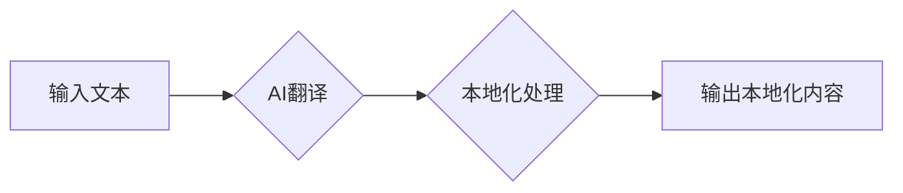

                 

## AI翻译与本地化：打破语言障碍的新方法

> 关键词：人工智能、机器翻译、自然语言处理、本地化、跨文化沟通、深度学习、Transformer模型

## 1. 背景介绍

在全球化日益加深的今天，语言障碍已成为阻碍人们交流、合作和理解的重要壁垒。传统的人工翻译方法成本高、效率低，难以满足日益增长的翻译需求。而人工智能技术的快速发展为打破语言障碍提供了新的希望。

近年来，基于深度学习的机器翻译技术取得了显著进步，能够实现更高质量、更快速、更经济的翻译。同时，本地化技术也得到了进一步发展，能够将翻译后的内容更好地适应目标语言和文化的语境。

本文将深入探讨AI翻译与本地化技术，分析其核心概念、算法原理、实践应用以及未来发展趋势，旨在为读者提供一个全面的理解。

## 2. 核心概念与联系

### 2.1  机器翻译

机器翻译是指利用计算机程序自动将一种语言文本翻译成另一种语言文本的过程。它可以分为统计机器翻译（SMT）和神经机器翻译（NMT）两种主要类型。

* **统计机器翻译（SMT）**：基于统计语言模型和翻译规则，通过统计分析大量平行语料库来学习翻译规则，并根据这些规则进行翻译。
* **神经机器翻译（NMT）**：基于深度学习神经网络，能够学习语言的语义和语法结构，并生成更流畅、更自然的翻译结果。

### 2.2  本地化

本地化是指将产品、服务或内容根据目标市场的语言、文化和习惯进行调整的过程。它不仅包括语言翻译，还涉及文化适应、用户界面调整、时间格式转换等多个方面。

### 2.3  AI翻译与本地化的联系

AI翻译与本地化技术相互补充，共同构成了跨文化沟通的解决方案。AI翻译提供高质量的语言翻译，而本地化则将翻译后的内容更好地融入目标文化语境，确保其能够被目标用户理解和接受。

**Mermaid 流程图**



## 3. 核心算法原理 & 具体操作步骤

### 3.1  算法原理概述

神经机器翻译（NMT）是目前机器翻译领域最先进的算法，其核心原理是利用深度学习神经网络学习语言的语义和语法结构，并根据学习到的知识进行翻译。

NMT模型通常由编码器和解码器两部分组成。编码器负责将源语言文本编码成一个语义向量，解码器则根据编码后的语义向量生成目标语言文本。

### 3.2  算法步骤详解

1. **数据预处理**: 将源语言和目标语言文本进行清洗、分词、标记等预处理操作，以便于模型训练。
2. **模型训练**: 利用大量的平行语料库训练NMT模型，通过反向传播算法不断调整模型参数，使其能够准确地学习语言的语义和语法结构。
3. **翻译**: 将需要翻译的源语言文本输入到训练好的NMT模型中，模型会根据学习到的知识生成目标语言文本。

### 3.3  算法优缺点

**优点**:

* 翻译质量高：NMT模型能够学习语言的语义和语法结构，生成更流畅、更自然的翻译结果。
* 适应性强：NMT模型能够适应不同的语言对和领域。
* 自动化程度高：NMT模型可以自动化地进行翻译，无需人工干预。

**缺点**:

* 数据依赖性强：NMT模型需要大量的平行语料库进行训练，否则翻译质量会下降。
* 计算资源消耗大：训练NMT模型需要大量的计算资源。
* 难以解释：NMT模型的决策过程比较复杂，难以解释其翻译结果。

### 3.4  算法应用领域

NMT算法广泛应用于以下领域：

* **机器翻译**: 将文本从一种语言翻译成另一种语言。
* **语音识别**: 将语音信号转换为文本。
* **文本摘要**: 将长文本压缩成短文本。
* **问答系统**: 回答用户的自然语言问题。

## 4. 数学模型和公式 & 详细讲解 & 举例说明

### 4.1  数学模型构建

NMT模型通常采用Transformer架构，其核心思想是利用注意力机制来捕捉文本序列中的长距离依赖关系。

Transformer模型由编码器和解码器两部分组成。编码器由多个编码器层堆叠而成，每个编码器层包含多头注意力机制和前馈神经网络。解码器也由多个解码器层堆叠而成，每个解码器层包含多头注意力机制、前馈神经网络和掩码机制。

### 4.2  公式推导过程

Transformer模型的注意力机制的核心公式如下：

$$
Attention(Q, K, V) = softmax(\frac{QK^T}{\sqrt{d_k}})V
$$

其中：

* $Q$：查询矩阵
* $K$：键矩阵
* $V$：值矩阵
* $d_k$：键向量的维度
* $softmax$：softmax函数

该公式计算了查询向量与键向量的相似度，并根据相似度对值向量进行加权求和，从而得到注意力权重。

### 4.3  案例分析与讲解

假设我们有一段源语言文本“The cat sat on the mat”，需要将其翻译成目标语言“猫坐在垫子上”。

在Transformer模型中，编码器会将源语言文本编码成一个语义向量，解码器会根据编码后的语义向量生成目标语言文本。

注意力机制在解码器中起着至关重要的作用。它能够捕捉到源语言文本中不同词语之间的关系，例如“cat”和“sat”之间的动宾关系，“mat”和“on”之间的位置关系等。

通过注意力机制，解码器能够更好地理解源语言文本的语义，并生成更准确、更自然的翻译结果。

## 5. 项目实践：代码实例和详细解释说明

### 5.1  开发环境搭建

为了实现AI翻译与本地化项目，我们需要搭建一个开发环境。

* **操作系统**: Linux、macOS或Windows
* **编程语言**: Python
* **深度学习框架**: TensorFlow或PyTorch
* **本地化工具**: Gettext、Crowdin等

### 5.2  源代码详细实现

以下是一个使用TensorFlow实现简单NMT模型的代码示例：

```python
import tensorflow as tf

# 定义编码器层
encoder_layer = tf.keras.layers.LSTM(units=128, return_sequences=True)

# 定义解码器层
decoder_layer = tf.keras.layers.LSTM(units=128)

# 定义模型
model = tf.keras.Sequential([
    encoder_layer,
    decoder_layer
])

# 编译模型
model.compile(optimizer='adam', loss='sparse_categorical_crossentropy', metrics=['accuracy'])

# 训练模型
model.fit(train_data, train_labels, epochs=10)
```

### 5.3  代码解读与分析

* **编码器层**: 使用LSTM层对源语言文本进行编码，并返回一个语义向量。
* **解码器层**: 使用LSTM层对编码后的语义向量进行解码，并生成目标语言文本。
* **模型**: 将编码器层和解码器层连接起来，构成一个完整的NMT模型。
* **编译模型**: 使用Adam优化器、稀疏类别交叉熵损失函数和准确率作为评估指标，编译模型。
* **训练模型**: 使用训练数据训练模型，训练完成后模型能够将源语言文本翻译成目标语言文本。

### 5.4  运行结果展示

训练完成后，我们可以使用模型对新的文本进行翻译。

```python
# 使用模型翻译文本
translated_text = model.predict(test_data)
```

## 6. 实际应用场景

AI翻译与本地化技术在各个领域都有广泛的应用场景：

### 6.1  电商

* **商品翻译**: 将商品信息翻译成目标语言，方便海外用户了解商品详情。
* **网站本地化**: 将电商网站翻译成目标语言，并根据目标市场的文化习惯进行调整，提高用户体验。

### 6.2  旅游

* **旅游指南翻译**: 将旅游指南翻译成目标语言，方便游客了解目的地信息。
* **酒店预订**: 将酒店预订网站翻译成目标语言，方便游客在线预订酒店。

### 6.3  教育

* **教材翻译**: 将教材翻译成目标语言，方便海外学生学习。
* **在线教育平台**: 将在线教育平台翻译成目标语言，并根据目标市场的文化习惯进行调整，提高用户体验。

### 6.4  未来应用展望

随着人工智能技术的不断发展，AI翻译与本地化技术将有更广泛的应用场景：

* **实时翻译**: 实现实时语音和文本翻译，打破语言障碍，促进跨文化交流。
* **个性化本地化**: 根据用户的语言偏好、文化背景等信息进行个性化本地化，提供更贴心的用户体验。
* **跨模态本地化**: 将图像、视频等多模态内容进行本地化，提供更丰富的跨文化体验。

## 7. 工具和资源推荐

### 7.1  学习资源推荐

* **书籍**:
    * 《深度学习》
    * 《自然语言处理》
* **在线课程**:
    * Coursera
    * edX
* **博客**:
    * TensorFlow Blog
    * PyTorch Blog

### 7.2  开发工具推荐

* **深度学习框架**: TensorFlow、PyTorch
* **本地化工具**: Gettext、Crowdin
* **云平台**: AWS、Google Cloud、Azure

### 7.3  相关论文推荐

* 《Attention Is All You Need》
* 《BERT: Pre-training of Deep Bidirectional Transformers for Language Understanding》
* 《T5: Text-to-Text Transfer Transformer》

## 8. 总结：未来发展趋势与挑战

### 8.1  研究成果总结

AI翻译与本地化技术取得了显著进步，能够实现更高质量、更快速、更经济的翻译和本地化。

### 8.2  未来发展趋势

* **更准确的翻译**: 利用更先进的深度学习算法和更大的语料库，提高翻译的准确性和自然度。
* **更个性化的本地化**: 根据用户的语言偏好、文化背景等信息进行个性化本地化，提供更贴心的用户体验。
* **跨模态本地化**: 将图像、视频等多模态内容进行本地化，提供更丰富的跨文化体验。

### 8.3  面临的挑战

* **数据稀缺**: 许多语言缺乏足够的平行语料库，难以训练高质量的翻译模型。
* **文化差异**: 语言和文化是密不可分的，需要考虑文化背景才能进行准确的本地化。
* **伦理问题**: AI翻译与本地化技术可能存在伦理问题，例如数据隐私、信息操控等，需要谨慎对待。

### 8.4  研究展望

未来，AI翻译与本地化技术将继续朝着更准确、更个性化、更跨模态的方向发展。

## 9. 附录：常见问题与解答

### 9.1  Q: 如何选择合适的AI翻译工具？

A: 选择合适的AI翻译工具需要考虑以下因素：

* **语言对**: 工具是否支持目标语言对。
* **翻译质量**: 工具的翻译质量如何。
* **功能**: 工具是否提供其他功能，例如本地化、语音识别等。
* **价格**: 工具的价格是否合理。

### 9.2  Q: 如何进行本地化测试？

A: 本地化测试需要考虑以下方面：

* **语言准确性**: 翻译是否准确无误。
* **文化适应性**: 内容是否符合目标文化的习惯和价值观。
* **用户体验**: 用户是否能够轻松理解和使用本地化后的内容。

### 9.3  Q: AI翻译与本地化技术会取代人工翻译吗？

A: AI翻译与本地化技术可以提高翻译效率和降低成本，但它并不会完全取代人工翻译。

人工翻译仍然在一些需要高精度、高灵活性的领域发挥着重要作用，例如法律文件、医学文件等。


作者：禅与计算机程序设计艺术 / Zen and the Art of Computer Programming 
<end_of_turn>

