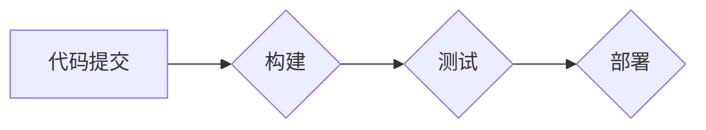

                 

## CI/CD管道：自动化软件交付流程

> 关键词：持续集成 (CI)，持续交付 (CD)，自动化构建，自动化测试，软件交付流程，DevOps，软件开发

## 1. 背景介绍

在当今快速迭代的软件开发环境中，高效、可靠的软件交付流程至关重要。传统的软件交付流程往往冗长、繁琐，容易出现错误，难以满足快速响应市场需求的需要。为了解决这些问题，持续集成 (CI) 和持续交付 (CD) 应运而生，它们构成了现代软件开发的基石，极大地提高了软件开发效率和质量。

CI/CD 管道是一种自动化软件构建、测试和部署的流程，它将开发、测试和运营团队紧密地整合在一起，实现了代码变更从提交到生产环境部署的自动化和加速。

## 2. 核心概念与联系

### 2.1 持续集成 (CI)

持续集成是指将开发人员频繁地将代码提交到一个共享代码库中，并自动触发构建和测试过程。通过这种方式，可以及时发现代码错误，并及时进行修复，从而提高代码质量和开发效率。

### 2.2 持续交付 (CD)

持续交付是指将构建好的软件应用程序自动部署到测试环境、预生产环境和最终生产环境。通过这种方式，可以快速地将新功能和修复部署到用户手中，并及时获得用户反馈。

### 2.3 CI/CD 管道

CI/CD 管线将 CI 和 CD 结合起来，形成了一个完整的自动化软件交付流程。

**Mermaid 流程图**



## 3. 核心算法原理 & 具体操作步骤

### 3.1 算法原理概述

CI/CD 管道的核心算法原理是基于自动化构建、测试和部署的流程。通过使用工具和脚本，可以自动执行这些步骤，从而实现软件交付的自动化和加速。

### 3.2 算法步骤详解

1. **代码提交:** 开发人员将代码提交到共享代码库中。
2. **构建:** 构建系统会自动检测到代码提交，并触发构建过程。构建过程会编译代码、打包应用程序和生成部署文件。
3. **测试:** 构建完成后，会自动执行单元测试、集成测试和验收测试等各种测试用例。
4. **部署:** 如果测试通过，则会自动部署应用程序到测试环境、预生产环境和最终生产环境。

### 3.3 算法优缺点

**优点:**

* 自动化流程，提高效率和速度。
* 减少人为错误，提高软件质量。
* 促进团队协作，提高开发效率。

**缺点:**

* 需要一定的技术门槛，需要学习和掌握相关工具和技术。
* 需要投入一定的成本，购买和维护相关工具和服务器。
* 需要对软件开发流程进行重构，适应 CI/CD 的工作方式。

### 3.4 算法应用领域

CI/CD 管道广泛应用于各种软件开发领域，例如：

* Web 应用开发
* 移动应用开发
* 云计算平台开发
* 大数据平台开发

## 4. 数学模型和公式 & 详细讲解 & 举例说明

在 CI/CD 管道中，可以使用数学模型来分析和优化软件交付流程。例如，可以使用 **蒙特卡罗模拟** 来预测软件交付时间，并根据预测结果调整部署策略。

**4.1 数学模型构建**

假设软件交付时间是一个随机变量，服从指数分布。我们可以使用以下公式来表示软件交付时间的概率密度函数：

$$f(t) = \lambda e^{-\lambda t}$$

其中：

* $t$ 是软件交付时间
* $\lambda$ 是平均交付时间倒数

**4.2 公式推导过程**

指数分布的期望值为 $1/\lambda$，方差为 $1/\lambda^2$。我们可以使用这些参数来构建蒙特卡罗模拟模型，模拟软件交付时间。

**4.3 案例分析与讲解**

假设一个软件项目的平均交付时间为 2 周，我们可以使用上述公式来构建蒙特卡罗模拟模型，模拟 1000 次软件交付时间。通过分析模拟结果，我们可以得到软件交付时间的概率分布，并根据概率分布来预测软件交付时间。

## 5. 项目实践：代码实例和详细解释说明

### 5.1 开发环境搭建

为了实现 CI/CD 管道，需要搭建相应的开发环境。常见的开发环境包括：

* **版本控制系统:** Git
* **构建工具:** Jenkins, Travis CI, CircleCI
* **测试工具:** JUnit, pytest
* **部署工具:** Ansible, Puppet, Chef

### 5.2 源代码详细实现

以下是一个简单的 CI/CD 管道示例代码，使用 Jenkins 构建和部署一个 Java 项目。

```yaml
pipeline {
    agent any

    stages {
        stage('Build') {
            steps {
                sh 'mvn clean package'
            }
        }
        stage('Test') {
            steps {
                sh 'mvn test'
            }
        }
        stage('Deploy') {
            steps {
                sh 'scp target/*.war user@server:/var/www/html'
                sh 'ssh user@server "sudo systemctl restart tomcat"'
            }
        }
    }
}
```

### 5.3 代码解读与分析

* **pipeline:** 定义了流水线的结构。
* **agent any:** 指定流水线可以使用任何代理节点。
* **stages:** 定义了流水线的各个阶段。
* **Build:** 构建阶段，执行 Maven 命令编译和打包项目。
* **Test:** 测试阶段，执行 Maven 命令运行测试用例。
* **Deploy:** 部署阶段，使用 SCP 命令将 WAR 文件上传到服务器，并使用 SSH 命令重启 Tomcat 服务器。

### 5.4 运行结果展示

当流水线运行成功时，项目将被自动构建、测试和部署到服务器。

## 6. 实际应用场景

CI/CD 管道在各种软件开发场景中都有广泛的应用，例如：

* **快速迭代开发:** CI/CD 可以帮助开发团队快速迭代开发，并及时将新功能部署到用户手中。
* **持续交付:** CI/CD 可以帮助开发团队实现持续交付，将软件应用程序不断地更新和改进。
* **自动化测试:** CI/CD 可以帮助开发团队自动化测试，提高软件质量。
* **减少人为错误:** CI/CD 可以帮助减少人为错误，提高软件交付的可靠性。

### 6.4 未来应用展望

随着云计算、容器化和微服务架构的兴起，CI/CD 将会更加智能化、自动化和敏捷化。未来，CI/CD 将会更加深入地融入软件开发流程，成为软件开发不可或缺的一部分。

## 7. 工具和资源推荐

### 7.1 学习资源推荐

* **书籍:**
    * "Continuous Delivery: Reliable Software Releases through Build, Test, and Deployment Automation" by Jez Humble and David Farley
    * "The Phoenix Project: A Novel About IT, DevOps, and Helping Your Business Win" by Gene Kim, Kevin Behr, and George Spafford
* **网站:**
    * https://www.jenkins.io/
    * https://circleci.com/
    * https://www.travis-ci.com/

### 7.2 开发工具推荐

* **版本控制系统:** Git
* **构建工具:** Jenkins, Travis CI, CircleCI
* **测试工具:** JUnit, pytest
* **部署工具:** Ansible, Puppet, Chef

### 7.3 相关论文推荐

* "Continuous Integration and Continuous Delivery: A Practical Guide" by Martin Fowler
* "DevOps: A Software Development Methodology" by Gene Kim

## 8. 总结：未来发展趋势与挑战

### 8.1 研究成果总结

CI/CD 管道已经成为现代软件开发的基石，它极大地提高了软件开发效率和质量。

### 8.2 未来发展趋势

* **更智能化:** CI/CD 将会更加智能化，能够自动识别和解决问题。
* **更自动化:** CI/CD 将会更加自动化，减少人为干预。
* **更敏捷化:** CI/CD 将会更加敏捷化，能够快速响应市场需求。

### 8.3 面临的挑战

* **技术复杂性:** CI/CD 的技术复杂性较高，需要开发人员具备一定的技能和经验。
* **文化转变:** CI/CD 需要改变软件开发团队的文化和工作方式。
* **安全风险:** CI/CD 需要考虑安全风险，确保软件交付过程的安全可靠。

### 8.4 研究展望

未来，CI/CD 研究将继续深入，探索更智能化、自动化和敏捷化的软件交付流程。


## 9. 附录：常见问题与解答

**常见问题:**

* **什么是 CI/CD？**
* **CI/CD 的优势是什么？**
* **如何搭建 CI/CD 管道？**
* **CI/CD 的常见工具有哪些？**

**解答:**

* **什么是 CI/CD？** CI/CD 是持续集成和持续交付的简称，是一种自动化软件构建、测试和部署的流程。
* **CI/CD 的优势是什么？** CI/CD 可以提高软件开发效率和质量，减少人为错误，促进团队协作。
* **如何搭建 CI/CD 管道？** 需要选择合适的工具和平台，并根据项目需求配置流水线。
* **CI/CD 的常见工具有哪些？** 常见的 CI/CD 工具包括 Jenkins, Travis CI, CircleCI, Git, Maven, JUnit 等。


作者：禅与计算机程序设计艺术 / Zen and the Art of Computer Programming 
<end_of_turn>

