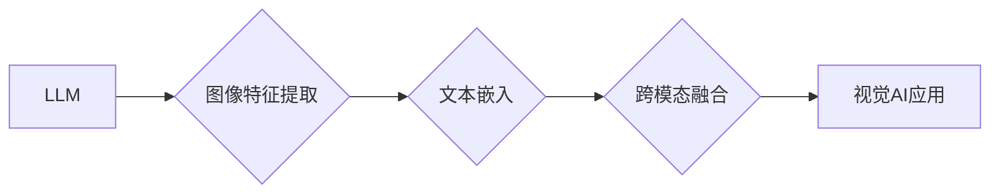

                 

## LLM与传统图像识别技术的结合：视觉AI新境界

> 关键词：大型语言模型（LLM）、图像识别、视觉AI、多模态学习、跨模态理解、文本描述、图像生成

## 1. 背景介绍

近年来，人工智能（AI）领域取得了令人瞩目的进展，其中大型语言模型（LLM）和传统图像识别技术分别在自然语言处理和计算机视觉领域展现出强大的能力。LLM能够理解和生成人类语言，而传统图像识别技术则擅长识别和分类图像内容。然而，这两个领域长期以来相对独立，缺乏有效的融合。

随着多模态学习技术的不断发展，将LLM与传统图像识别技术相结合，构建跨模态理解和交互的视觉AI系统成为一个新的研究热点。这种融合能够突破单一模态的局限性，赋予AI更丰富的感知和理解能力，从而推动视觉AI技术的创新发展。

## 2. 核心概念与联系

### 2.1  核心概念

* **大型语言模型（LLM）：** 训练于海量文本数据，能够理解和生成人类语言的深度学习模型。例如GPT-3、BERT、LaMDA等。
* **传统图像识别技术：** 基于深度学习或传统机器学习算法，能够识别和分类图像内容的技术。例如卷积神经网络（CNN）、支持向量机（SVM）等。
* **多模态学习：** 训练模型能够理解和处理多种模态数据（如文本、图像、音频、视频等）的技术。
* **跨模态理解：** 能够理解不同模态数据之间的关系和关联，从而获得更深层的语义理解的技术。

### 2.2  架构



**架构说明：**

1. **图像特征提取：** 使用传统图像识别技术提取图像的特征信息，例如颜色、纹理、形状等。
2. **文本嵌入：** 将LLM生成的文本表示为向量形式，用于与图像特征进行融合。
3. **跨模态融合：** 将图像特征和文本嵌入进行融合，学习不同模态之间的关系和关联。
4. **视觉AI应用：** 基于融合后的多模态表示，实现各种视觉AI应用，例如图像描述、图像生成、视觉问答等。

## 3. 核心算法原理 & 具体操作步骤

### 3.1  算法原理概述

将LLM与传统图像识别技术相结合，主要采用以下两种核心算法：

* **端到端训练：** 将LLM和图像识别模型联合训练，学习跨模态的表示和映射关系。
* **联合学习：** 将LLM和图像识别模型分别训练，然后通过共享的特征空间或知识蒸馏等方式进行联合学习，提升模型性能。

### 3.2  算法步骤详解

**端到端训练步骤：**

1. **数据准备：** 收集包含图像和文本描述的标注数据。
2. **模型构建：** 设计包含LLM和图像识别模型的联合架构。
3. **模型训练：** 使用交叉熵损失函数，联合训练LLM和图像识别模型。
4. **模型评估：** 使用测试集评估模型性能，例如图像描述准确率、图像生成质量等。

**联合学习步骤：**

1. **预训练：** 分别预训练LLM和图像识别模型。
2. **特征提取：** 使用预训练好的图像识别模型提取图像特征。
3. **文本嵌入：** 使用预训练好的LLM将文本描述嵌入到向量空间。
4. **联合学习：** 使用共享的特征空间或知识蒸馏等方式，联合学习LLM和图像识别模型。
5. **模型评估：** 使用测试集评估模型性能。

### 3.3  算法优缺点

**端到端训练：**

* **优点：** 可以学习更复杂的跨模态关系，提升模型性能。
* **缺点：** 需要大量的标注数据，训练过程复杂，计算资源消耗大。

**联合学习：**

* **优点：** 可以利用预训练模型的知识，降低训练成本和数据需求。
* **缺点：** 无法学习到端到端的跨模态关系，性能可能不如端到端训练。

### 3.4  算法应用领域

* **图像描述：** 使用LLM生成图像的文本描述，例如自动生成图片字幕、产品描述等。
* **图像生成：** 根据文本描述生成图像，例如根据文字描述生成艺术作品、产品设计等。
* **视觉问答：** 理解图像内容并回答关于图像的问题，例如识别图像中的物体、场景、人物等。
* **多模态检索：** 基于图像和文本进行联合检索，例如根据图像搜索相关文本信息，根据文本搜索相关图像信息。

## 4. 数学模型和公式 & 详细讲解 & 举例说明

### 4.1  数学模型构建

假设我们有一个图像 $I$ 和一个文本描述 $T$，我们需要学习一个跨模态表示 $Z$，该表示能够捕捉图像和文本之间的关系。

我们可以使用以下数学模型构建跨模态表示：

$$Z = f(I, T)$$

其中，$f$ 是一个跨模态融合函数，它将图像特征 $I$ 和文本嵌入 $T$ 融合在一起。

### 4.2  公式推导过程

跨模态融合函数 $f$ 可以采用多种方式实现，例如：

* **加法融合：** 将图像特征和文本嵌入直接相加。

$$Z = I + T$$

* **点积融合：** 计算图像特征和文本嵌入之间的点积。

$$Z = I \cdot T$$

* **注意力机制融合：** 使用注意力机制学习图像特征和文本嵌入之间的重要关系。

$$Z = \sum_{i=1}^{n} \alpha_i I_i T_i$$

其中，$\alpha_i$ 是注意力权重，$I_i$ 和 $T_i$ 分别是图像特征和文本嵌入的第 $i$ 个元素。

### 4.3  案例分析与讲解

**图像描述案例：**

假设我们有一个图像 $I$ 展示了一只小狗在公园里玩耍，文本描述 $T$ 是“一只可爱的小狗在草地上奔跑”。

使用加法融合，我们可以将图像特征和文本嵌入相加，得到一个跨模态表示 $Z$，该表示包含了图像和文本的信息。

使用注意力机制融合，我们可以学习到图像特征中哪些部分与文本描述相关，例如小狗的头部、身体、尾巴等。

## 5. 项目实践：代码实例和详细解释说明

### 5.1  开发环境搭建

* **操作系统：** Ubuntu 20.04
* **编程语言：** Python 3.8
* **深度学习框架：** PyTorch 1.8
* **其他依赖库：** torchvision, transformers, numpy, matplotlib

### 5.2  源代码详细实现

```python
import torch
import torchvision
import transformers

# 加载预训练模型
image_model = torchvision.models.resnet18(pretrained=True)
text_model = transformers.AutoModelForSequenceClassification.from_pretrained("bert-base-uncased")

# 定义跨模态融合函数
def fusion_function(image_features, text_embeddings):
    # 使用加法融合
    fused_features = image_features + text_embeddings
    return fused_features

# 定义损失函数和优化器
criterion = torch.nn.CrossEntropyLoss()
optimizer = torch.optim.Adam(model.parameters(), lr=0.001)

# 训练模型
for epoch in range(num_epochs):
    for images, texts, labels in train_dataloader:
        # 前向传播
        image_features = image_model(images)
        text_embeddings = text_model(texts)
        fused_features = fusion_function(image_features, text_embeddings)
        outputs = model(fused_features)

        # 计算损失
        loss = criterion(outputs, labels)

        # 反向传播
        optimizer.zero_grad()
        loss.backward()

        # 更新参数
        optimizer.step()

# 保存模型
torch.save(model.state_dict(), "trained_model.pth")
```

### 5.3  代码解读与分析

* 代码首先加载预训练的图像识别模型和文本嵌入模型。
* 然后定义一个跨模态融合函数，将图像特征和文本嵌入融合在一起。
* 接着定义损失函数和优化器，并开始训练模型。
* 训练过程中，将图像和文本数据输入模型，计算损失，并使用优化器更新模型参数。
* 最后，保存训练好的模型。

### 5.4  运行结果展示

训练完成后，可以使用测试集评估模型性能，例如图像描述准确率、图像生成质量等。

## 6. 实际应用场景

### 6.1  图像描述

* **电商平台：** 自动生成商品图片的描述，方便用户搜索和浏览。
* **社交媒体：** 自动生成图片的字幕，方便用户分享和理解图片内容。
* **医疗诊断：** 自动生成病历图片的描述，辅助医生进行诊断。

### 6.2  图像生成

* **艺术创作：** 根据文字描述生成艺术作品，例如绘画、雕塑等。
* **产品设计：** 根据文字描述生成产品设计草图，辅助设计师进行设计。
* **游戏开发：** 根据文字描述生成游戏场景和角色，丰富游戏内容。

### 6.3  视觉问答

* **智能客服：** 理解用户对图片的问题，并提供准确的答案。
* **教育领域：** 帮助学生理解图片内容，回答关于图片的问题。
* **旅游领域：** 帮助用户理解旅游景点图片，提供相关信息。

### 6.4  未来应用展望

随着LLM和图像识别技术的不断发展，其结合将带来更多创新应用，例如：

* **多模态搜索：** 基于图像和文本联合检索，实现更精准的搜索结果。
* **跨语言理解：** 理解不同语言的图像和文本，实现跨语言的视觉AI应用。
* **个性化视觉体验：** 根据用户的喜好和需求，生成个性化的图像和视频内容。

## 7. 工具和资源推荐

### 7.1  学习资源推荐

* **书籍：**
    * Deep Learning by Ian Goodfellow, Yoshua Bengio, and Aaron Courville
    * Natural Language Processing with Python by Steven Bird, Ewan Klein, and Edward Loper
* **在线课程：**
    * Stanford CS231n: Convolutional Neural Networks for Visual Recognition
    * DeepLearning.AI: Natural Language Processing Specialization

### 7.2  开发工具推荐

* **深度学习框架：** PyTorch, TensorFlow
* **图像处理库：** OpenCV, Pillow
* **自然语言处理库：** NLTK, spaCy

### 7.3  相关论文推荐

* **Attention Is All You Need:** https://arxiv.org/abs/1706.03762
* **BERT: Pre-training of Deep Bidirectional Transformers for Language Understanding:** https://arxiv.org/abs/1810.04805
* **CLIP: Contrastive Language-Image Pre-training:** https://arxiv.org/abs/2103.00020

## 8. 总结：未来发展趋势与挑战

### 8.1  研究成果总结

将LLM与传统图像识别技术相结合，取得了显著的成果，例如在图像描述、图像生成、视觉问答等领域取得了突破性的进展。

### 8.2  未来发展趋势

* **更强大的LLM：** 随着LLM模型规模和能力的不断提升，其在跨模态理解和交互方面的表现将更加出色。
* **更有效的跨模态融合方法：** 研究更有效的跨模态融合方法，例如基于图神经网络的融合、基于自注意力机制的融合等。
* **更广泛的应用场景：** 将LLM与图像识别技术应用于更多领域，例如医疗、教育、金融等。

### 8.3  面临的挑战

* **数据标注成本高：** 跨模态学习需要大量的标注数据，数据标注成本高昂。
* **模型训练复杂度高：** 跨模态模型训练复杂度高，需要大量的计算资源。
* **模型解释性差：** 跨模态模型的决策过程难以解释，缺乏透明度。

### 8.4  研究展望

未来，将继续探索LLM与图像识别技术的融合，研究更有效的跨模态学习方法，并将其应用于更多领域，推动视觉AI技术的创新发展。

## 9. 附录：常见问题与解答

* **Q：如何选择合适的跨模态融合方法？**

A：选择合适的跨模态融合方法取决于具体的应用场景和数据特点。例如，对于图像描述任务，加法融合或注意力机制融合效果较好。

* **Q：如何解决数据标注成本高的问题？**

A：可以采用数据增强技术，例如图像旋转、裁剪、翻转等，生成更多训练数据。也可以探索无监督或半监督学习方法，减少对标注数据的依赖。

* **Q：如何提高模型的解释性？**

A：可以采用可解释机器学习方法，例如LIME、SHAP等，解释模型的决策过程。


作者：禅与计算机程序设计艺术 / Zen and the Art of Computer Programming 
<end_of_turn>

