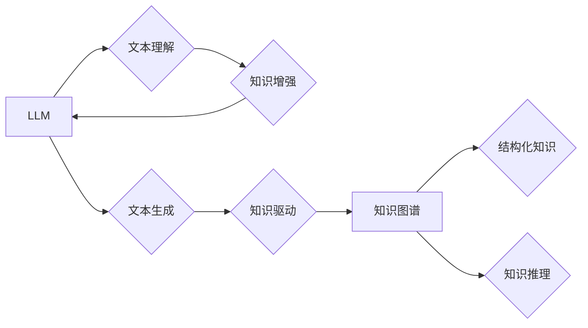

                 

## LLM与知识图谱：增强模型的结构化知识

> 关键词：LLM, 知识图谱, 结构化知识, 嵌入式表示, 知识推理, 跨模态理解, 应用场景

## 1. 背景介绍

近年来，大型语言模型（LLM）在自然语言处理领域取得了显著进展，展现出强大的文本生成、翻译、问答等能力。然而，LLM 的知识储备主要依赖于训练数据中的统计模式，缺乏对知识的结构化理解和推理能力。知识图谱（KG）作为一种结构化知识表示形式，能够有效地捕捉实体、关系和属性之间的连接，为 LLMs 提供更丰富的语义信息和知识推理能力。

结合 LLM 和 KG 的优势，可以构建更智能、更可靠的 AI 系统。例如，在问答系统中，KG 可以提供事实性知识，帮助 LLM 准确回答问题；在文本摘要中，KG 可以帮助 LLM 识别关键实体和关系，生成更准确、更连贯的摘要；在对话系统中，KG 可以帮助 LLM 理解用户意图，提供更精准的回复。

## 2. 核心概念与联系

### 2.1 知识图谱 (KG)

知识图谱是一种基于知识表示的数据库，它以实体和关系为基本单元，将知识表示为图结构。

* **实体 (Entity):**  知识图谱中的基本单元，代表现实世界中的事物，例如人、地点、事件等。
* **关系 (Relation):**  实体之间的连接，描述实体之间的属性或联系，例如“出生于”、“工作于”、“拥有”等。
* **属性 (Property):**  实体的特征描述，例如“姓名”、“年龄”、“职位”等。

知识图谱的优势在于：

* **结构化表示:**  知识以图结构表示，方便知识的组织、存储和检索。
* **语义丰富:**  知识图谱不仅包含实体和关系，还包含属性和描述，能够表达更丰富的语义信息。
* **可扩展性强:**  知识图谱可以不断扩展和更新，以适应不断变化的知识世界。

### 2.2 大型语言模型 (LLM)

大型语言模型是一种基于深度学习的统计模型，能够理解和生成人类语言。

* **Transformer 架构:**  大多数 LLM 基于 Transformer 架构，能够有效地捕捉文本中的长距离依赖关系。
* **海量数据训练:**  LLM 通常在海量文本数据上进行训练，学习语言的语法、语义和知识。
* **强大的文本处理能力:**  LLM 能够执行各种文本处理任务，例如文本生成、翻译、问答、摘要等。

LLM 的优势在于：

* **强大的文本理解能力:**  LLM 可以理解复杂的文本结构和语义关系。
* **灵活的文本生成能力:**  LLM 可以生成流畅、自然的文本。
* **可迁移性强:**  LLM 可以应用于各种文本处理任务。

### 2.3 LLM与KG的结合

将 LLM 与 KG 相结合，可以弥补各自的不足，构建更智能的 AI 系统。

* **LLM 提供文本理解和生成能力，KG 提供结构化知识和推理能力。**
* **LLM 可以利用 KG 的知识进行文本理解和生成，KG 可以利用 LLM 的文本处理能力进行知识更新和扩展。**

**Mermaid 流程图**



## 3. 核心算法原理 & 具体操作步骤

### 3.1 算法原理概述

将 LLM 与 KG 相结合的算法主要包括以下几种：

* **嵌入式表示:** 将实体和关系映射到低维向量空间，使得 LLM 可以理解和处理 KG 的结构化知识。
* **知识增强:** 利用 KG 的知识丰富 LLM 的文本理解和生成能力。
* **知识推理:** 利用 KG 的推理能力，帮助 LLM 进行知识问答、文本蕴含等任务。

### 3.2 算法步骤详解

**1. 实体和关系嵌入:**

* 使用预训练的词嵌入模型（例如 Word2Vec 或 GloVe）将实体和关系映射到低维向量空间。
* 训练 KG 特征嵌入模型（例如 TransE 或 RotatE），学习更准确的实体和关系嵌入。

**2. LLM 知识增强:**

* 在 LLM 的输入文本中添加 KG 中相关实体和关系的嵌入向量。
* 使用注意力机制，让 LLM 关注 KG 中与文本相关的知识。

**3. 知识推理:**

* 利用 KG 的推理规则，例如规则引擎或图神经网络，进行知识推理。
* 将推理结果与 LLM 的文本生成结果结合，生成更准确、更连贯的文本。

### 3.3 算法优缺点

**优点:**

* 能够有效地融合 LLM 的文本处理能力和 KG 的结构化知识。
* 能够提升 LLM 的知识理解和推理能力。
* 能够应用于各种自然语言处理任务，例如问答、文本摘要、对话系统等。

**缺点:**

* 知识图谱的构建和维护需要大量的人工标注和维护工作。
* 实体和关系的嵌入需要大量的计算资源和训练数据。
* 知识推理的准确性仍然是一个挑战。

### 3.4 算法应用领域

* **问答系统:** 利用 KG 提供事实性知识，帮助 LLM 回答更准确的问题。
* **文本摘要:** 利用 KG 识别关键实体和关系，生成更准确、更连贯的摘要。
* **对话系统:** 利用 KG 理解用户意图，提供更精准的回复。
* **搜索引擎:** 利用 KG 理解用户查询意图，提供更相关的搜索结果。
* **推荐系统:** 利用 KG 挖掘用户兴趣，提供更精准的推荐。

## 4. 数学模型和公式 & 详细讲解 & 举例说明

### 4.1 数学模型构建

**嵌入式表示模型:**

* **TransE:**  假设实体和关系可以表示为向量，关系向量可以表示为实体对之间的向量差。

$$h + r \approx t$$

其中，h、r、t 分别表示实体 h、关系 r 和实体 t 的向量表示。

* **RotatE:**  假设关系可以表示为旋转操作，实体向量在关系向量作用下旋转到目标实体的位置。

$$h' = Rot(h, r) = t$$

其中，h' 表示旋转后的实体向量。

**知识增强模型:**

* **注意力机制:**  利用注意力机制，让 LLM 关注 KG 中与文本相关的知识。

$$Attention(Q, K, V) = \frac{exp(Q \cdot K^T / \sqrt{d_k})}{sum(exp(Q \cdot K^T / \sqrt{d_k}))}$$

其中，Q、K、V 分别表示查询向量、键向量和值向量。

### 4.2 公式推导过程

**TransE 模型的损失函数:**

$$L = \sum_{h, r, t \in D} \max(0, \gamma + ||h + r - t||_2)$$

其中，D 表示训练数据，γ 是一个阈值。

**RotatE 模型的损失函数:**

$$L = \sum_{h, r, t \in D} \max(0, \gamma + ||Rot(h, r) - t||_2)$$

### 4.3 案例分析与讲解

**案例:**

假设 KG 中包含以下知识：

* 实体：张三、李四、北京
* 关系：居住于

**问题:** 张三居住在哪里？

**TransE 模型:**

* 将实体张三、李四、北京 和关系居住于映射到向量空间。
* 计算张三 + 居住于 - 北京 的向量距离。
* 如果距离小于阈值，则认为张三居住于北京。

**RotatE 模型:**

* 将实体张三 和关系居住于 映射到向量空间。
* 计算张三 在关系居住于 作用下旋转后的向量，并与北京 的向量比较。
* 如果旋转后的向量与北京 的向量距离小于阈值，则认为张三居住于北京。

## 5. 项目实践：代码实例和详细解释说明

### 5.1 开发环境搭建

* Python 3.7+
* PyTorch 或 TensorFlow
* KG 库：DGL、Neo4j 等
* LLM 库：HuggingFace Transformers

### 5.2 源代码详细实现

```python
# 使用 HuggingFace Transformers 库加载预训练的 LLM 模型
from transformers import AutoModelForSequenceClassification

model = AutoModelForSequenceClassification.from_pretrained("bert-base-uncased")

# 使用 DGL 库加载 KG 数据
import dgl

graph = dgl.load_graph("knowledge_graph.graphml")

# 定义实体和关系嵌入模型
class EntityEmbedding(nn.Module):
    # ...

# 定义知识增强模型
class KnowledgeAugmentation(nn.Module):
    # ...

# 定义知识推理模型
class KnowledgeInference(nn.Module):
    # ...

# 训练模型
# ...

# 使用模型进行预测
# ...
```

### 5.3 代码解读与分析

* 代码首先加载预训练的 LLM 模型和 KG 数据。
* 然后定义实体和关系嵌入模型、知识增强模型和知识推理模型。
* 最后训练模型并使用模型进行预测。

### 5.4 运行结果展示

* 运行结果可以包括模型的准确率、召回率、F1 值等指标。
* 还可以展示模型在不同任务上的性能，例如问答、文本摘要、对话系统等。

## 6. 实际应用场景

### 6.1 问答系统

* 利用 KG 提供事实性知识，帮助 LLM 回答更准确的问题。
* 例如，在医疗问答系统中，KG 可以提供疾病、药物和症状的知识，帮助 LLM 回答用户的医疗问题。

### 6.2 文本摘要

* 利用 KG 识别关键实体和关系，生成更准确、更连贯的摘要。
* 例如，在新闻摘要系统中，KG 可以识别新闻中的关键人物、事件和地点，帮助 LLM 生成更准确的新闻摘要。

### 6.3 对话系统

* 利用 KG 理解用户意图，提供更精准的回复。
* 例如，在客服对话系统中，KG 可以提供产品和服务的知识，帮助 LLM 理解用户的咨询需求并提供更精准的回复。

### 6.4 未来应用展望

* **跨模态理解:** 将 LLM 与 KG 结合，实现跨模态的知识理解和推理，例如将文本和图像结合起来进行理解。
* **个性化推荐:** 利用 KG 挖掘用户的兴趣和偏好，提供更个性化的推荐。
* **自动知识图谱构建:** 利用 LLM 的文本处理能力，自动从文本数据中构建知识图谱。

## 7. 工具和资源推荐

### 7.1 学习资源推荐

* **书籍:**
    * 《深度学习》 - Ian Goodfellow, Yoshua Bengio, Aaron Courville
    * 《自然语言处理》 - Jurafsky, Martin
* **在线课程:**
    * Coursera: Natural Language Processing Specialization
    * Stanford CS224N: Natural Language Processing with Deep Learning

### 7.2 开发工具推荐

* **Python:**  Python 是深度学习和自然语言处理领域最常用的编程语言。
* **PyTorch:**  PyTorch 是一个开源的深度学习框架，支持 GPU 加速。
* **TensorFlow:**  TensorFlow 是另一个开源的深度学习框架，拥有丰富的生态系统。
* **HuggingFace Transformers:**  HuggingFace Transformers 是一个开源的 LLM 库，提供预训练的 LLM 模型和工具。
* **DGL:**  DGL 是一个开源的图神经网络库，支持 KG 的处理和推理。

### 7.3 相关论文推荐

* **Knowledge Graph Embedding: A Survey** -  Wang, Z., &  Wang, Y.
* **BERT: Pre-training of Deep Bidirectional Transformers for Language Understanding** - Devlin, J., Chang, M. W., Lee, K., & Toutanova, K.
* **Graph Convolutional Networks** - Kipf, T. N., & Welling, M.

## 8. 总结：未来发展趋势与挑战

### 8.1 研究成果总结

将 LLM 与 KG 相结合，能够有效地提升 LLM 的知识理解和推理能力，并应用于各种自然语言处理任务。

### 8.2 未来发展趋势

* **更强大的 LLM 模型:**  未来将出现更强大的 LLM 模型，能够更好地理解和生成人类语言。
* **更丰富的 KG 数据:**  未来 KG 数据将更加丰富和全面，包含更多领域的知识。
* **更有效的融合方法:**  未来将开发更有效的 LLM 与 KG 的融合方法，更好地利用两者的优势。

### 8.3 面临的挑战

* **知识图谱的构建和维护:**  KG 的构建和维护需要大量的人工标注和维护工作，成本较高。
* **知识推理的准确性:**  知识推理的准确性仍然是一个挑战，需要进一步的研究和改进。
* **数据安全和隐私:**  LLM 与 KG 的结合可能涉及到敏感数据，需要考虑数据安全和隐私问题。

### 8.4 研究展望

未来将继续研究 LLM 与 KG 的结合，探索更有效的融合方法，提升模型的性能，并应用于更多领域。

## 9. 附录：常见问题与解答

* **Q: LLM 与 KG 的结合有什么优势？**

* **A:** LLM 与 KG 的结合能够融合 LLM 的文本处理能力和 KG 的结构化知识，提升模型的知识理解和推理能力。

* **Q: 如何选择合适的 LLM 和 KG 模型？**

* **A:** 选择合适的 LLM 和 KG 模型需要根据具体的应用场景和需求进行选择。

* **Q: LLM 与 KG 的结合有哪些应用场景？**

* **A:** LLM 与 KG 的结合可以应用于问答系统、文本摘要、对话系统、搜索引擎、推荐系统等多个领域。


作者：禅与计算机程序设计艺术 / Zen and the Art of Computer Programming<end_of_turn>

