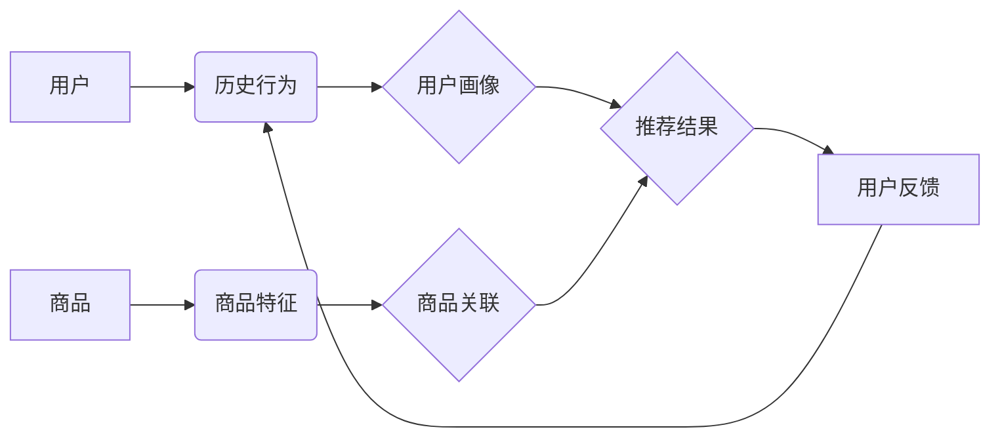

                 

## LLM在推荐系统中的图神经网络应用

> 关键词：大型语言模型 (LLM)、图神经网络 (GNN)、推荐系统、用户画像、商品关联、知识图谱、个性化推荐

## 1. 背景介绍

推荐系统是互联网时代的重要组成部分，旨在根据用户的历史行为、偏好和上下文信息，推荐用户可能感兴趣的内容或商品。传统的推荐系统主要依赖于协同过滤和内容过滤等方法，但这些方法存在一些局限性，例如数据稀疏性、冷启动问题和推荐结果缺乏个性化。

近年来，大型语言模型 (LLM) 和图神经网络 (GNN) 的快速发展为推荐系统带来了新的机遇。LLM 能够理解和生成自然语言，并从海量文本数据中学习用户兴趣和商品特征；GNN 能够捕捉用户和商品之间的复杂关系，构建用户-商品交互的知识图谱。将 LLM 和 GNN 相结合，可以构建更智能、更个性化的推荐系统。

## 2. 核心概念与联系

### 2.1  大型语言模型 (LLM)

LLM 是近年来深度学习领域取得的重大突破之一，它是一种能够理解和生成人类语言的强大人工智能模型。通过训练海量文本数据，LLM 能够学习语言的语法、语义和上下文关系，并应用于各种自然语言处理任务，例如文本分类、机器翻译、问答系统等。

### 2.2  图神经网络 (GNN)

GNN 是一种专门用于处理图结构数据的深度学习模型。图结构数据可以表示用户、商品、评论等实体之间的关系，例如用户购买商品、商品属于某个类别、用户对商品评价等。GNN 可以通过学习图结构中的节点特征和边关系，捕捉用户和商品之间的复杂交互模式。

### 2.3  推荐系统

推荐系统旨在根据用户的历史行为、偏好和上下文信息，预测用户对特定内容或商品的兴趣，并推荐用户可能感兴趣的内容或商品。

**核心概念与联系流程图**



## 3. 核心算法原理 & 具体操作步骤

### 3.1  算法原理概述

将 LLM 和 GNN 相结合的推荐系统，通常采用以下核心算法原理：

1. **用户画像构建:** 利用 LLM 对用户的历史行为数据进行分析，例如浏览记录、购买记录、评论等，构建用户的兴趣偏好和行为特征向量。

2. **商品关联挖掘:** 利用 LLM 对商品描述、评论等文本数据进行分析，挖掘商品之间的语义关联和类别关系，构建商品关联图谱。

3. **图神经网络推荐:** 利用 GNN 对用户画像和商品关联图谱进行融合，学习用户和商品之间的复杂交互模式，预测用户对特定商品的兴趣评分或点击概率。

### 3.2  算法步骤详解

1. **数据预处理:** 收集用户行为数据、商品信息数据和文本数据，进行清洗、格式化和特征提取。

2. **用户画像构建:** 利用 LLM 对用户历史行为数据进行文本编码，提取用户兴趣偏好和行为特征，构建用户画像向量。

3. **商品关联挖掘:** 利用 LLM 对商品描述、评论等文本数据进行文本编码，挖掘商品之间的语义关联和类别关系，构建商品关联图谱。

4. **图神经网络训练:** 将用户画像向量和商品关联图谱作为输入，训练 GNN 模型，学习用户和商品之间的交互模式，预测用户对特定商品的兴趣评分或点击概率。

5. **推荐结果生成:** 根据训练好的 GNN 模型，对用户进行个性化推荐，推荐用户可能感兴趣的商品。

6. **用户反馈收集:** 收集用户对推荐结果的反馈信息，例如点击、购买、评价等，用于模型评估和优化。

### 3.3  算法优缺点

**优点:**

* **个性化推荐:** 能够根据用户的兴趣偏好和行为特征，提供更个性化的推荐结果。
* **冷启动问题缓解:** 可以利用商品关联图谱和文本数据，缓解冷启动问题，为新用户和新商品提供推荐。
* **推荐结果多样性:** 可以通过 GNN 学习用户和商品之间的复杂关系，提供更丰富的推荐结果。

**缺点:**

* **数据依赖性:** 需要大量用户行为数据和商品信息数据进行训练。
* **计算复杂度:** GNN 模型的训练过程计算复杂度较高，需要强大的计算资源。
* **可解释性:** GNN 模型的决策过程相对复杂，难以解释推荐结果背后的逻辑。

### 3.4  算法应用领域

LLM 和 GNN 结合的推荐系统，在以下领域具有广泛的应用前景:

* **电商推荐:** 为用户推荐个性化的商品，提高转化率。
* **内容推荐:** 为用户推荐个性化的新闻、视频、音乐等内容。
* **社交推荐:** 为用户推荐新的朋友、兴趣小组等。
* **医疗推荐:** 为患者推荐个性化的医疗方案和健康信息。

## 4. 数学模型和公式 & 详细讲解 & 举例说明

### 4.1  数学模型构建

LLM 和 GNN 结合的推荐系统，通常采用以下数学模型构建:

1. **用户画像向量:** 利用 LLM 对用户的历史行为数据进行文本编码，得到用户画像向量 $u_i$，其中 $i$ 表示用户 ID。

2. **商品关联矩阵:** 利用 LLM 对商品描述、评论等文本数据进行文本编码，构建商品关联矩阵 $A$，其中 $A_{ij}$ 表示商品 $i$ 和商品 $j$ 之间的语义相似度或类别关联度。

3. **图神经网络模型:** 利用 GNN 模型学习用户画像向量 $u_i$ 和商品关联矩阵 $A$，得到用户对商品 $j$ 的兴趣评分或点击概率 $p_{ij}$。

### 4.2  公式推导过程

GNN 模型的学习过程通常采用图卷积操作，通过迭代更新节点特征，学习用户和商品之间的交互模式。

假设 GNN 模型有 $L$ 层，第 $l$ 层的节点特征为 $h_l^{(i)}$，则图卷积操作可以表示为:

$$h_l^{(i)} = \sigma(W_l \cdot \text{aggregate}(h_{l-1}^{(i)}, A))$$

其中:

* $W_l$ 是第 $l$ 层的权重矩阵。
* $\text{aggregate}$ 是聚合函数，例如求和、平均值等。
* $\sigma$ 是激活函数，例如ReLU、Sigmoid等。

### 4.3  案例分析与讲解

假设我们有一个电商平台，用户购买商品的历史数据和商品描述数据。我们可以利用 LLM 对用户历史行为数据进行文本编码，构建用户画像向量。

然后，利用 LLM 对商品描述数据进行文本编码，构建商品关联矩阵。

最后，利用 GNN 模型学习用户画像向量和商品关联矩阵，预测用户对特定商品的兴趣评分。

例如，用户 $A$ 购买了手机、耳机和充电宝，用户 $B$ 购买了笔记本电脑、鼠标和键盘。

根据用户的购买历史，我们可以构建用户画像向量 $u_A$ 和 $u_B$。

根据商品描述，我们可以构建商品关联矩阵 $A$，其中手机和耳机之间的关联度较高，笔记本电脑和鼠标之间的关联度较高。

利用 GNN 模型学习用户画像向量和商品关联矩阵，我们可以预测用户 $A$ 对手机和耳机的兴趣评分较高，用户 $B$ 对笔记本电脑和鼠标的兴趣评分较高。

## 5. 项目实践：代码实例和详细解释说明

### 5.1  开发环境搭建

推荐系统开发环境通常需要以下软件和工具:

* Python 编程语言
* 深度学习框架，例如 TensorFlow 或 PyTorch
* 图数据库，例如 Neo4j 或 JanusGraph
* 数据处理工具，例如 Pandas 或 Spark

### 5.2  源代码详细实现

以下是一个使用 PyTorch 和 Neo4j 实现 LLM 和 GNN 结合的推荐系统的代码示例:

```python
# 导入必要的库
import torch
import torch.nn as nn
from neo4j import GraphDatabase

# 定义图神经网络模型
class GNNRecommender(nn.Module):
    def __init__(self, embedding_dim, num_layers):
        super(GNNRecommender, self).__init__()
        self.embedding_dim = embedding_dim
        self.num_layers = num_layers
        self.embedding = nn.Embedding(num_users, embedding_dim)
        self.gcn_layers = nn.ModuleList([nn.Linear(embedding_dim, embedding_dim) for _ in range(num_layers)])

    def forward(self, user_ids, adj_matrix):
        user_embeddings = self.embedding(user_ids)
        for layer in self.gcn_layers:
            user_embeddings = layer(user_embeddings)
        return user_embeddings

# 连接 Neo4j 数据库
driver = GraphDatabase.driver("bolt://localhost:7687", auth=("neo4j", "password"))

# 查询用户和商品信息
with driver.session() as session:
    result = session.run("MATCH (u:User)<-[:INTERACTED_WITH]-(i:Item) RETURN u.user_id, i.item_id")
    user_item_pairs = [(row['u.user_id'], row['i.item_id']) for row in result]

# 构建用户-商品交互图谱
adj_matrix = build_adj_matrix(user_item_pairs)

# 实例化图神经网络模型
model = GNNRecommender(embedding_dim=64, num_layers=2)

# 训练模型
# ...

# 生成推荐结果
user_id = 1
user_embedding = model(torch.tensor([user_id]))
# ...
```

### 5.3  代码解读与分析

* 代码首先导入必要的库，包括 PyTorch、Neo4j 和数据处理工具。
* 然后定义一个图神经网络模型 `GNNRecommender`，该模型包含用户嵌入层和图卷积层。
* 连接 Neo4j 数据库，查询用户和商品信息，构建用户-商品交互图谱。
* 实例化图神经网络模型，并进行训练。
* 最后，根据用户的用户 ID，获取用户的嵌入向量，并根据嵌入向量生成推荐结果。

### 5.4  运行结果展示

运行代码后，可以得到用户对特定商品的兴趣评分或点击概率，并根据这些评分或概率生成推荐结果。

## 6. 实际应用场景

### 6.1  电商推荐

LLM 和 GNN 结合的推荐系统可以为电商平台提供更个性化的商品推荐，例如根据用户的浏览历史、购买记录和兴趣偏好，推荐用户可能感兴趣的商品。

### 6.2  内容推荐

LLM 和 GNN 可以用于推荐新闻、视频、音乐等内容，例如根据用户的阅读习惯、观看记录和音乐偏好，推荐用户可能感兴趣的内容。

### 6.3  社交推荐

LLM 和 GNN 可以用于推荐新的朋友、兴趣小组等，例如根据用户的社交关系、兴趣爱好和行为特征，推荐用户可能感兴趣的人或群组。

### 6.4  未来应用展望

LLM 和 GNN 结合的推荐系统在未来将有更广泛的应用前景，例如:

* **医疗推荐:** 为患者推荐个性化的医疗方案和健康信息。
* **教育推荐:** 为学生推荐个性化的学习资源和课程。
* **金融推荐:** 为用户推荐个性化的理财产品和投资建议。

## 7. 工具和资源推荐

### 7.1  学习资源推荐

* **书籍:**
    * Deep Learning with Python by Francois Chollet
    * Graph Neural Networks by William L. Hamilton
* **在线课程:**
    * Deep Learning Specialization by Andrew Ng (Coursera)
    * Graph Neural Networks Specialization by University of California, San Diego (Coursera)

### 7.2  开发工具推荐

* **深度学习框架:** TensorFlow, PyTorch
* **图数据库:** Neo4j, JanusGraph
* **数据处理工具:** Pandas, Spark

### 7.3  相关论文推荐

* Graph Convolutional Networks by Thomas N. Kipf and Max Welling
* Graph Attention Networks by Petar Veličković et al.
* Neural Recommendation Systems by Xiangnan He et al.

## 8. 总结：未来发展趋势与挑战

### 8.1  研究成果总结

LLM 和 GNN 结合的推荐系统取得了显著的成果，能够提供更个性化、更精准的推荐结果。

### 8.2  未来发展趋势

* **模型复杂度提升:** 研究更复杂的 GNN 模型，例如 Transformer-based GNN，提高推荐系统的性能。
* **多模态融合:** 将文本、图像、音频等多模态数据融合到推荐系统中，提供更丰富的推荐结果。
* **联邦学习:** 利用联邦学习技术，在保护用户隐私的前提下，训练更强大的推荐模型。

### 8.3  面临的挑战

* **数据稀疏性:** 许多推荐场景存在数据稀疏性问题，需要开发新的方法来缓解这个问题。
* **可解释性:** GNN 模型的决策过程相对复杂，难以解释推荐结果背后的逻辑，需要提高模型的可解释性。
* **计算复杂度:** 训练复杂的 GNN 模型需要大量的计算资源，需要开发更有效的训练算法。

### 8.4  研究展望

未来，LLM 和 GNN 结合的推荐系统将继续朝着更智能、更个性化、更可解释的方向发展，为用户提供更优质的推荐体验。

## 9. 附录：常见问题与解答

### 9.1  Q1: LLM 和 GNN 的结合有什么优势？

**A1:** LLM 可以理解和生成自然语言，从文本数据中学习用户兴趣和商品特征；GNN 可以捕捉用户和商品之间的复杂关系，构建用户-商品交互的知识图谱。将两者结合，可以构建更智能、更个性化的推荐系统。

### 9.2  Q2: 如何构建用户-商品交互图谱？

**A2:** 可以从用户行为数据中提取用户-商品交互关系，例如用户购买商品、浏览商品、评价商品等，构建用户-商品交互图谱。

### 9.3  Q3: 如何评估推荐系统的性能？

**A3:** 可以使用各种指标来评估推荐系统的性能，例如准确率、召回率、NDCG 等。


作者：禅与计算机程序设计艺术 / Zen and the Art of Computer Programming 
<end_of_turn>

