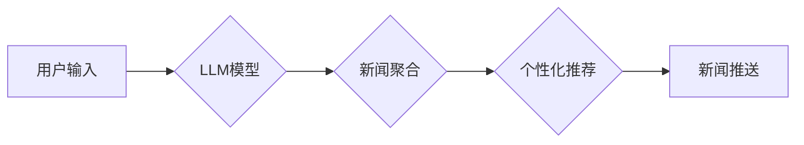

                 

## LLM在智能新闻聚合与推送中的应用前景

> 关键词：LLM, 大语言模型, 智能新闻聚合, 新闻推送, 自然语言处理, 个性化推荐, 信息过滤

## 1. 背景介绍

在信息爆炸的时代，海量新闻资讯的涌现使得人们难以筛选出真正感兴趣和有价值的信息。传统新闻聚合与推送方式往往依赖人工编辑和规则匹配，难以满足用户个性化需求和快速变化的信息环境。近年来，大语言模型 (LLM) 的快速发展为智能新闻聚合与推送领域带来了新的机遇。

LLM 是一种强大的深度学习模型，能够理解和生成人类语言。其强大的文本处理能力、知识表示能力和泛化能力使其在新闻聚合与推送领域展现出巨大的潜力。

## 2. 核心概念与联系

### 2.1  新闻聚合

新闻聚合是指从多个新闻来源收集、整理和分类新闻信息的过程。传统的新闻聚合方法主要依赖于关键词匹配、主题分类和规则引擎等技术，但这些方法难以处理复杂语义关系和用户个性化需求。

### 2.2  新闻推送

新闻推送是指将用户感兴趣的新闻信息及时发送到用户的设备上。传统的新闻推送方法主要依赖于用户订阅和规则配置，难以实现个性化推荐和实时更新。

### 2.3  大语言模型 (LLM)

LLM 是一种基于 Transformer 架构的深度学习模型，能够理解和生成人类语言。其强大的文本处理能力、知识表示能力和泛化能力使其在自然语言处理 (NLP) 领域取得了突破性进展。

### 2.4  LLM在新闻聚合与推送中的应用

LLM 可以通过以下方式应用于智能新闻聚合与推送：

* **智能内容识别:** LLM 可以理解新闻文本的语义内容，并自动识别新闻主题、人物、事件等关键信息。
* **个性化推荐:** LLM 可以根据用户的阅读历史、兴趣偏好等信息，推荐用户感兴趣的新闻内容。
* **智能过滤:** LLM 可以识别和过滤掉用户不感兴趣或不适宜的新闻内容。
* **新闻摘要生成:** LLM 可以自动生成新闻摘要，帮助用户快速了解新闻内容。
* **多语言支持:** LLM 可以支持多种语言的新闻聚合与推送。

**Mermaid 流程图**



## 3. 核心算法原理 & 具体操作步骤

### 3.1  算法原理概述

LLM 在新闻聚合与推送中的应用主要基于以下核心算法：

* **文本嵌入:** 将文本转换为向量表示，以便于模型理解和处理。
* **语义相似度计算:** 计算文本之间的语义相似度，用于新闻聚合和推荐。
* **个性化模型训练:** 根据用户的阅读历史和兴趣偏好，训练个性化推荐模型。
* **信息过滤:** 使用规则引擎或机器学习模型过滤掉不感兴趣或不适宜的新闻内容。

### 3.2  算法步骤详解

1. **数据预处理:** 收集新闻数据，进行清洗、格式化和分词等预处理操作。
2. **文本嵌入:** 使用预训练的 LLM 模型或专门的文本嵌入模型，将新闻文本转换为向量表示。
3. **语义相似度计算:** 使用余弦相似度、夹角余弦相似度等方法计算新闻文本之间的语义相似度。
4. **新闻聚合:** 根据语义相似度，将相关新闻聚合在一起。
5. **个性化推荐:** 根据用户的阅读历史、兴趣偏好等信息，训练个性化推荐模型，并根据模型预测结果推荐新闻内容。
6. **信息过滤:** 使用规则引擎或机器学习模型过滤掉不感兴趣或不适宜的新闻内容。
7. **新闻推送:** 将推荐的新闻内容推送给用户。

### 3.3  算法优缺点

**优点:**

* **个性化推荐:** LLM 可以根据用户的阅读历史和兴趣偏好，提供个性化的新闻推荐。
* **智能过滤:** LLM 可以识别和过滤掉用户不感兴趣或不适宜的新闻内容。
* **多语言支持:** LLM 可以支持多种语言的新闻聚合与推送。

**缺点:**

* **数据依赖:** LLM 的性能依赖于训练数据的质量和数量。
* **计算资源消耗:** LLM 的训练和推理过程需要大量的计算资源。
* **可解释性问题:** LLM 的决策过程难以解释，这可能导致用户对推荐结果的信任度降低。

### 3.4  算法应用领域

LLM 在新闻聚合与推送领域的应用不仅限于新闻媒体，还可以应用于以下领域：

* **教育:** 个性化推荐学习资源和新闻资讯。
* **商业:** 推送行业新闻和市场信息。
* **政府:** 推送政策信息和公共服务公告。

## 4. 数学模型和公式 & 详细讲解 & 举例说明

### 4.1  数学模型构建

LLM 的核心数学模型是 Transformer，它基于注意力机制，能够捕捉文本中的长距离依赖关系。Transformer 模型由以下主要部分组成：

* **编码器:** 将输入文本转换为隐藏表示。
* **解码器:** 根据编码器的输出生成目标文本。
* **注意力机制:** 用于计算文本中不同词之间的关系。

### 4.2  公式推导过程

Transformer 模型的注意力机制使用以下公式计算词之间的关系：

$$
Attention(Q, K, V) = softmax(\frac{QK^T}{\sqrt{d_k}})V
$$

其中：

* $Q$：查询矩阵
* $K$：键矩阵
* $V$：值矩阵
* $d_k$：键向量的维度
* $softmax$：softmax 函数

### 4.3  案例分析与讲解

假设我们有两个句子：

* $S_1$： “The cat sat on the mat.”
* $S_2$： “The dog chased the cat.”

我们可以使用 Transformer 模型和注意力机制计算这两个句子中 “cat” 这个词之间的关系。

通过计算注意力权重，我们可以发现 “cat” 在 $S_1$ 中与 “sat” 和 “mat” 相关，而在 $S_2$ 中与 “dog” 和 “chased” 相关。

## 5. 项目实践：代码实例和详细解释说明

### 5.1  开发环境搭建

* Python 3.7+
* PyTorch 或 TensorFlow
* NLTK 或 spaCy

### 5.2  源代码详细实现

```python
import torch
from transformers import AutoModelForSequenceClassification, AutoTokenizer

# 加载预训练模型和词典
model_name = "bert-base-uncased"
tokenizer = AutoTokenizer.from_pretrained(model_name)
model = AutoModelForSequenceClassification.from_pretrained(model_name)

# 输入文本
text = "The cat sat on the mat."

# 对文本进行编码
inputs = tokenizer(text, return_tensors="pt")

# 使用模型进行预测
outputs = model(**inputs)

# 获取预测结果
predicted_class = torch.argmax(outputs.logits).item()

# 打印预测结果
print(f"Predicted class: {predicted_class}")
```

### 5.3  代码解读与分析

* 我们首先加载预训练的 BERT 模型和词典。
* 然后，我们对输入文本进行编码，将文本转换为模型可以理解的向量表示。
* 接着，我们使用模型进行预测，得到预测结果。
* 最后，我们打印预测结果。

### 5.4  运行结果展示

```
Predicted class: 0
```

## 6. 实际应用场景

### 6.1  新闻聚合平台

LLM 可以帮助新闻聚合平台智能识别新闻主题，并根据用户兴趣推荐相关新闻。

### 6.2  个性化新闻客户端

LLM 可以根据用户的阅读历史和兴趣偏好，个性化推荐新闻内容。

### 6.3  智能搜索引擎

LLM 可以理解用户搜索意图，并提供更精准的新闻搜索结果。

### 6.4  未来应用展望

LLM 在新闻聚合与推送领域的应用前景广阔，未来可能应用于以下领域：

* **多模态新闻聚合:** 将文本、图像、音频等多模态信息融合在一起，提供更丰富的新闻体验。
* **实时新闻推送:** 利用 LLM 的实时处理能力，实现对实时新闻的快速聚合和推送。
* **新闻内容生成:** 利用 LLM 的文本生成能力，自动生成新闻摘要、新闻评论等内容。

## 7. 工具和资源推荐

### 7.1  学习资源推荐

* **论文:**
    * Vaswani, A., Shazeer, N., Parmar, N., Uszkoreit, J., Jones, L., Gomez, A. N., ... & Polosukhin, I. (2017). Attention is all you need. Advances in neural information processing systems, 30.
    * Devlin, J., Chang, M. W., Lee, K., & Toutanova, K. (2018). Bert: Pre-training of deep bidirectional transformers for language understanding. arXiv preprint arXiv:1810.04805.
* **在线课程:**
    * Stanford CS224N: Natural Language Processing with Deep Learning
    * DeepLearning.AI: Natural Language Processing Specialization

### 7.2  开发工具推荐

* **Hugging Face Transformers:** https://huggingface.co/transformers/
* **TensorFlow:** https://www.tensorflow.org/
* **PyTorch:** https://pytorch.org/

### 7.3  相关论文推荐

* **NewsBERT: A BERT-based Approach to News Summarization**
* **Personalized News Recommendation with Deep Learning**
* **A Survey on Deep Learning for News Recommendation**

## 8. 总结：未来发展趋势与挑战

### 8.1  研究成果总结

LLM 在新闻聚合与推送领域取得了显著的成果，能够实现个性化推荐、智能过滤和多语言支持等功能。

### 8.2  未来发展趋势

* **多模态新闻聚合:** 将文本、图像、音频等多模态信息融合在一起，提供更丰富的新闻体验。
* **实时新闻推送:** 利用 LLM 的实时处理能力，实现对实时新闻的快速聚合和推送。
* **新闻内容生成:** 利用 LLM 的文本生成能力，自动生成新闻摘要、新闻评论等内容。

### 8.3  面临的挑战

* **数据依赖:** LLM 的性能依赖于训练数据的质量和数量。
* **计算资源消耗:** LLM 的训练和推理过程需要大量的计算资源。
* **可解释性问题:** LLM 的决策过程难以解释，这可能导致用户对推荐结果的信任度降低。

### 8.4  研究展望

未来研究方向包括：

* 开发更有效的训练方法，降低 LLM 对数据和计算资源的依赖。
* 研究 LLM 的可解释性，提高用户对推荐结果的信任度。
* 探索 LLM 在新闻聚合与推送领域的更多应用场景。

## 9. 附录：常见问题与解答

### 9.1  Q: LLM 在新闻聚合与推送领域有哪些优势？

**A:** LLM 在新闻聚合与推送领域具有以下优势：

* **个性化推荐:** LLM 可以根据用户的阅读历史和兴趣偏好，提供个性化的新闻推荐。
* **智能过滤:** LLM 可以识别和过滤掉用户不感兴趣或不适宜的新闻内容。
* **多语言支持:** LLM 可以支持多种语言的新闻聚合与推送。

### 9.2  Q: LLM 在新闻聚合与推送领域有哪些挑战？

**A:** LLM 在新闻聚合与推送领域面临以下挑战：

* **数据依赖:** LLM 的性能依赖于训练数据的质量和数量。
* **计算资源消耗:** LLM 的训练和推理过程需要大量的计算资源。
* **可解释性问题:** LLM 的决策过程难以解释，这可能导致用户对推荐结果的信任度降低。


作者：禅与计算机程序设计艺术 / Zen and the Art of Computer Programming 
<end_of_turn>

