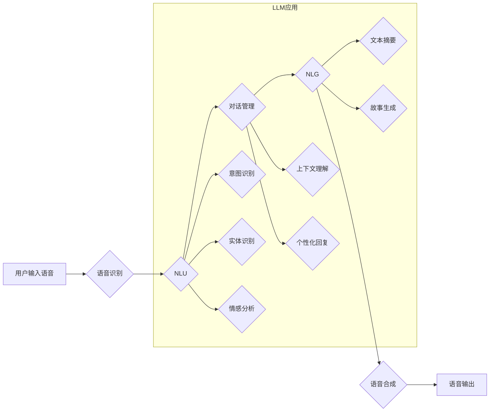

                 

## LLM在智能语音交互中的角色定位

> 关键词：LLM, 智能语音交互, 自然语言理解, 自然语言生成, 语音识别, 语音合成, 聊天机器人

## 1. 背景介绍

智能语音交互技术近年来发展迅速，已成为人机交互的重要方式之一。从早期的基于规则的语音助手到如今的基于深度学习的智能语音交互系统，技术的进步推动了语音助手在智能家居、车联网、移动设备等领域的广泛应用。

大型语言模型（LLM）作为一种强大的深度学习模型，在自然语言理解（NLU）和自然语言生成（NLG）方面展现出令人瞩目的能力。其强大的文本处理能力和知识表示能力使其成为智能语音交互系统的重要组成部分。

## 2. 核心概念与联系

**2.1 智能语音交互系统架构**

智能语音交互系统通常由以下几个模块组成：

* **语音识别（ASR）:** 将语音信号转换为文本。
* **自然语言理解（NLU）:** 对文本进行理解，提取语义信息，识别用户意图。
* **对话管理（DM）:** 根据用户意图，选择合适的回复，并管理对话流程。
* **自然语言生成（NLG）:** 将文本转换为语音信号。
* **语音合成（TTS）:** 将文本转换为自然流畅的语音。

**2.2 LLM在智能语音交互中的角色**

LLM可以应用于智能语音交互系统的多个模块，发挥其强大的文本处理能力和知识表示能力。

* **NLU模块:** LLM可以用于构建更强大的NLU模型，例如：
    * **意图识别:** LLM可以学习用户表达意图的各种方式，提高意图识别的准确率。
    * **实体识别:** LLM可以识别文本中的关键实体，例如人名、地名、时间等。
    * **情感分析:** LLM可以分析用户表达的情感，提供更个性化的服务。
* **DM模块:** LLM可以用于构建更智能的对话管理系统，例如：
    * **对话上下文理解:** LLM可以记住对话历史，理解对话上下文，提供更自然流畅的对话体验。
    * **个性化对话:** LLM可以根据用户的历史对话记录和偏好，提供个性化的对话内容。
* **NLG模块:** LLM可以用于生成更自然、更流畅的文本回复，例如：
    * **文本摘要:** LLM可以对长文本进行摘要，生成简洁明了的回复。
    * **故事生成:** LLM可以根据用户需求生成故事、诗歌等创意文本。

**2.3 LLM与传统语音交互技术的对比**

传统语音交互技术主要依赖于规则和模板，难以处理复杂的用户请求和开放域对话。而LLM基于深度学习，能够学习语言的复杂模式和语义关系，从而实现更灵活、更智能的语音交互。

**Mermaid 流程图**



## 3. 核心算法原理 & 具体操作步骤

**3.1 算法原理概述**

LLM的核心算法是基于Transformer架构的深度神经网络。Transformer模型通过自注意力机制（Self-Attention）和多头注意力机制（Multi-Head Attention）学习文本序列之间的依赖关系，从而实现更准确的文本理解和生成。

**3.2 算法步骤详解**

1. **词嵌入:** 将输入的文本序列转换为向量表示。
2. **编码器:** 利用多层Transformer编码器，对文本序列进行编码，提取文本的语义信息。
3. **解码器:** 利用多层Transformer解码器，根据编码后的文本信息生成目标文本序列。
4. **输出层:** 将解码器的输出转换为最终的文本回复。

**3.3 算法优缺点**

**优点:**

* 强大的文本理解和生成能力。
* 可以处理长文本序列。
* 可以学习复杂的语言模式和语义关系。

**缺点:**

* 训练成本高，需要大量的计算资源和训练数据。
* 容易受到训练数据偏差的影响。
* 对硬件资源要求较高。

**3.4 算法应用领域**

LLM在智能语音交互领域之外，还广泛应用于其他领域，例如：

* 机器翻译
* 文本摘要
* 问答系统
* 代码生成
* 创意写作

## 4. 数学模型和公式 & 详细讲解 & 举例说明

**4.1 数学模型构建**

LLM的数学模型主要基于Transformer架构，其核心是自注意力机制和多头注意力机制。

**4.2 公式推导过程**

* **自注意力机制:**

$$
Attention(Q, K, V) = \frac{exp(Q \cdot K^T / \sqrt{d_k})}{exp(Q \cdot K^T / \sqrt{d_k})} \cdot V
$$

其中：

* $Q$：查询矩阵
* $K$：键矩阵
* $V$：值矩阵
* $d_k$：键向量的维度

* **多头注意力机制:**

$$
MultiHead(Q, K, V) = Concat(head_1, head_2, ..., head_h) \cdot W_o
$$

其中：

* $head_i$：第 $i$ 个注意力头的输出
* $h$：注意力头的数量
* $W_o$：最终输出层的权重矩阵

**4.3 案例分析与讲解**

假设我们有一个句子“我爱吃苹果”，我们要使用自注意力机制计算每个词与其他词之间的注意力权重。

* 首先，将句子中的每个词转换为向量表示，即词嵌入。
* 然后，将词嵌入矩阵分别转换为查询矩阵 $Q$、键矩阵 $K$ 和值矩阵 $V$。
* 最后，使用公式计算每个词与其他词之间的注意力权重，并根据权重加权求和得到最终的输出向量。

## 5. 项目实践：代码实例和详细解释说明

**5.1 开发环境搭建**

* Python 3.7+
* PyTorch 或 TensorFlow
* CUDA 和 cuDNN

**5.2 源代码详细实现**

```python
import torch
import torch.nn as nn

class Transformer(nn.Module):
    def __init__(self, vocab_size, embedding_dim, num_heads, num_layers):
        super(Transformer, self).__init__()
        self.embedding = nn.Embedding(vocab_size, embedding_dim)
        self.encoder = nn.TransformerEncoder(nn.TransformerEncoderLayer(embedding_dim, num_heads), num_layers)
        self.decoder = nn.TransformerDecoder(nn.TransformerDecoderLayer(embedding_dim, num_heads), num_layers)
        self.linear = nn.Linear(embedding_dim, vocab_size)

    def forward(self, src, tgt):
        src = self.embedding(src)
        tgt = self.embedding(tgt)
        src = self.encoder(src)
        tgt = self.decoder(tgt, src)
        output = self.linear(tgt)
        return output
```

**5.3 代码解读与分析**

* `Transformer` 类定义了Transformer模型的结构。
* `embedding` 层将输入的词索引转换为词向量。
* `encoder` 和 `decoder` 层分别负责编码和解码文本序列。
* `linear` 层将解码器的输出转换为最终的文本回复。

**5.4 运行结果展示**

训练好的LLM模型可以用于各种智能语音交互任务，例如：

* 回答用户问题
* 生成对话回复
* 翻译语言
* 总结文本

## 6. 实际应用场景

**6.1 智能客服机器人**

LLM可以用于构建更智能的智能客服机器人，能够理解用户的自然语言请求，并提供更准确、更人性化的回复。

**6.2 语音助手**

LLM可以增强语音助手的功能，使其能够理解更复杂的指令，并提供更个性化的服务。

**6.3 教育领域**

LLM可以用于开发个性化的教育软件，例如：

* 智能辅导系统
* 语音朗读软件
* 语言学习软件

**6.4 未来应用展望**

LLM在智能语音交互领域的应用前景广阔，未来可能在以下方面取得突破：

* 更准确的语音识别和理解
* 更自然流畅的语音合成
* 更智能的对话管理
* 更个性化的用户体验

## 7. 工具和资源推荐

**7.1 学习资源推荐**

* **论文:**

    * Attention Is All You Need (Vaswani et al., 2017)
    * BERT: Pre-training of Deep Bidirectional Transformers for Language Understanding (Devlin et al., 2018)
    * GPT-3: Language Models are Few-Shot Learners (Brown et al., 2020)

* **在线课程:**

    * Stanford CS224N: Natural Language Processing with Deep Learning
    * DeepLearning.AI: Natural Language Processing Specialization

**7.2 开发工具推荐**

* **PyTorch:** https://pytorch.org/
* **TensorFlow:** https://www.tensorflow.org/
* **Hugging Face Transformers:** https://huggingface.co/transformers/

**7.3 相关论文推荐**

* **GPT-3: Language Models are Few-Shot Learners** (Brown et al., 2020)
* **BERT: Pre-training of Deep Bidirectional Transformers for Language Understanding** (Devlin et al., 2018)
* **T5: Text-to-Text Transfer Transformer** (Raffel et al., 2019)

## 8. 总结：未来发展趋势与挑战

**8.1 研究成果总结**

近年来，LLM在智能语音交互领域取得了显著进展，能够处理更复杂的语言任务，提供更自然流畅的交互体验。

**8.2 未来发展趋势**

* **模型规模和性能的提升:** 未来LLM模型规模将继续扩大，性能将进一步提升。
* **多模态交互:** LLM将与其他模态信息（例如图像、视频）融合，实现更丰富的交互体验。
* **个性化定制:** LLM将根据用户的个性化需求进行定制，提供更个性化的服务。

**8.3 面临的挑战**

* **数据获取和标注:** LLM的训练需要大量的文本数据和标注信息，获取和标注这些数据成本较高。
* **模型解释性和可控性:** LLM模型的决策过程较为复杂，难以解释和控制，这可能导致模型的不可靠性和安全性问题。
* **伦理和社会影响:** LLM的应用可能带来一些伦理和社会问题，例如：

    * 偏见和歧视
    * 隐私泄露
    * 工作岗位替代

**8.4 研究展望**

未来研究将重点关注以下几个方面：

* 开发更有效的训练方法和数据标注技术。
* 提高LLM模型的解释性和可控性。
* 研究LLM的伦理和社会影响，并制定相应的规范和政策。

## 9. 附录：常见问题与解答

**9.1 如何训练一个LLM模型？**

训练一个LLM模型需要大量的计算资源和训练数据。可以使用开源的预训练模型进行微调，也可以从头训练。

**9.2 如何评估LLM模型的性能？**

LLM模型的性能可以评估指标包括：

* perplexity
* BLEU
* ROUGE

**9.3 LLM模型有哪些应用场景？**

LLM模型在智能语音交互、机器翻译、文本摘要、问答系统等领域都有广泛的应用场景。


作者：禅与计算机程序设计艺术 / Zen and the Art of Computer Programming 
<end_of_turn>

