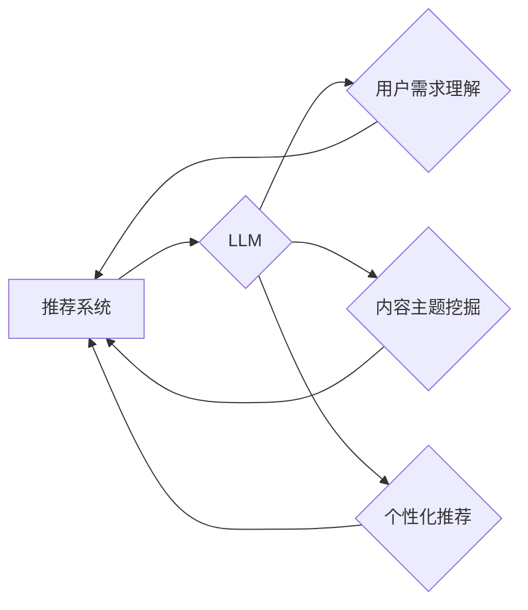

                 

## LLM对推荐系统长尾内容的挖掘策略

> 关键词：LLM, 长尾内容, 推荐系统, 挖掘策略, 自然语言处理, 个性化推荐

## 1. 背景介绍

随着互联网信息爆炸式增长，推荐系统在信息筛选、内容发现和用户体验提升方面发挥着越来越重要的作用。然而，传统推荐系统往往偏向于热门内容，而长尾内容（指访问量较少、用户关注度相对低的细分内容）往往被忽视。长尾内容蕴藏着丰富的个性化需求和潜在价值，挖掘和推荐长尾内容对于提升推荐系统的精准度和用户满意度至关重要。

近年来，大语言模型（LLM）的快速发展为推荐系统挖掘长尾内容提供了新的思路和方法。LLM具备强大的文本理解、生成和推理能力，能够从海量文本数据中学习用户偏好、内容主题和语义关系，从而更有效地识别和推荐长尾内容。

## 2. 核心概念与联系

### 2.1  推荐系统

推荐系统旨在根据用户的历史行为、偏好和上下文信息，预测用户对特定内容的兴趣并提供个性化的推荐。常见的推荐算法包括协同过滤、内容过滤和基于知识图谱的推荐。

### 2.2  长尾内容

长尾内容是指访问量较少、用户关注度相对低的细分内容。长尾内容通常具有以下特点：

* **主题细分:** 内容主题较为细微，受众群体相对较小。
* **用户需求多样:** 满足特定用户群体的个性化需求。
* **价值潜力高:** 蕴藏着丰富的知识和信息，具有潜在的商业价值。

### 2.3  大语言模型 (LLM)

LLM是一种基于深度学习的强大语言模型，能够理解和生成人类语言。LLM通过训练海量文本数据，学习语言的语法、语义和上下文关系，从而具备以下能力：

* **文本理解:** 理解文本的含义、情感和意图。
* **文本生成:** 生成流畅、自然的文本内容。
* **文本推理:** 推理文本中的逻辑关系和隐含信息。

### 2.4  LLM与推荐系统的结合

LLM能够通过以下方式帮助推荐系统挖掘长尾内容：

* **理解用户需求:** LLM可以分析用户的文本输入，例如搜索词、评论和反馈，从而更准确地理解用户的兴趣和需求。
* **挖掘内容主题:** LLM可以分析内容文本，识别其主题、关键词和语义关系，从而发现与用户需求相匹配的长尾内容。
* **生成个性化推荐:** LLM可以根据用户的兴趣和偏好，生成个性化的推荐内容，包括文本描述、图片链接和视频片段。

**核心概念与联系流程图**



## 3. 核心算法原理 & 具体操作步骤

### 3.1  算法原理概述

LLM推荐长尾内容的核心算法原理是基于**语义相似度**和**用户兴趣建模**。

* **语义相似度:** 通过计算内容文本和用户输入文本之间的语义相似度，识别与用户需求相匹配的长尾内容。常用的语义相似度计算方法包括Word2Vec、GloVe和BERT。
* **用户兴趣建模:** 通过分析用户的历史行为、偏好和上下文信息，构建用户兴趣模型，并根据模型预测用户对长尾内容的兴趣。常用的用户兴趣建模方法包括协同过滤、内容过滤和深度学习模型。

### 3.2  算法步骤详解

1. **数据预处理:** 对用户输入文本和内容文本进行预处理，包括分词、词性标注、去除停用词等。
2. **语义向量化:** 使用预训练的LLM模型，将用户输入文本和内容文本映射到语义向量空间。
3. **语义相似度计算:** 计算用户输入文本和内容文本之间的语义相似度，常用的方法包括余弦相似度、Jaccard相似度等。
4. **用户兴趣建模:** 使用历史行为数据、偏好信息和上下文信息，构建用户兴趣模型。
5. **长尾内容推荐:** 根据语义相似度和用户兴趣模型，推荐与用户需求相匹配的长尾内容。

### 3.3  算法优缺点

**优点:**

* **精准度高:** 基于语义相似度和用户兴趣建模，能够更精准地识别和推荐长尾内容。
* **个性化强:** 能够根据用户的个性化需求，提供个性化的推荐内容。
* **可扩展性强:** 可以扩展到多种类型的长尾内容，例如视频、音频和图片。

**缺点:**

* **计算复杂度高:** 语义向量化和相似度计算需要大量的计算资源。
* **数据依赖性强:** 需要大量的用户行为数据和内容文本数据进行训练。
* **冷启动问题:** 对新用户和新内容的推荐效果可能较差。

### 3.4  算法应用领域

LLM推荐长尾内容的算法可以应用于以下领域:

* **电商推荐:** 推荐个性化的商品，例如 niche 产品和定制化服务。
* **内容平台推荐:** 推荐个性化的文章、视频和音频内容，例如学术论文、独立音乐和播客节目。
* **教育推荐:** 推荐个性化的学习资源，例如在线课程、电子书和学习视频。
* **医疗推荐:** 推荐个性化的医疗信息和健康服务，例如疾病知识、医疗机构和专家咨询。

## 4. 数学模型和公式 & 详细讲解 & 举例说明

### 4.1  数学模型构建

**用户兴趣模型:**

假设用户 $u$ 对内容 $i$ 的兴趣可以用一个评分 $r_{ui}$ 表示，我们可以使用以下数学模型来表示用户兴趣:

$$r_{ui} = f(h_u, c_i, \theta)$$

其中:

* $h_u$ 是用户 $u$ 的兴趣特征向量。
* $c_i$ 是内容 $i$ 的特征向量。
* $\theta$ 是模型参数。
* $f$ 是一个非线性函数，例如神经网络。

**语义相似度计算:**

可以使用余弦相似度来计算用户输入文本 $q$ 和内容文本 $d$ 之间的语义相似度:

$$sim(q, d) = \frac{q \cdot d}{||q|| ||d||}$$

其中:

* $q \cdot d$ 是用户输入文本 $q$ 和内容文本 $d$ 的点积。
* $||q||$ 和 $||d||$ 分别是用户输入文本 $q$ 和内容文本 $d$ 的长度。

### 4.2  公式推导过程

**用户兴趣模型推导:**

用户兴趣模型的推导过程通常涉及以下步骤:

1. **特征提取:** 从用户行为数据和内容文本中提取特征向量 $h_u$ 和 $c_i$。
2. **模型训练:** 使用训练数据训练模型参数 $\theta$，使得模型能够准确预测用户对内容的兴趣评分 $r_{ui}$。
3. **模型评估:** 使用测试数据评估模型的性能，例如准确率、召回率和F1-score。

**语义相似度计算推导:**

余弦相似度的计算公式可以推导如下:

1. 将用户输入文本 $q$ 和内容文本 $d$ 分别映射到语义向量空间，得到向量 $q'$ 和 $d'$。
2. 计算向量 $q'$ 和 $d'$ 的点积 $q' \cdot d'$。
3. 计算向量 $q'$ 和 $d'$ 的长度 $||q'||$ 和 $||d'||$。
4. 将点积除以长度的乘积，得到余弦相似度 $sim(q, d)$。

### 4.3  案例分析与讲解

**案例:**

假设用户 $u$ 输入搜索词 "深度学习算法"，而内容 $i$ 是一篇关于 "Transformer" 的博客文章。

* **语义相似度计算:** 可以使用预训练的LLM模型，将用户输入文本 "深度学习算法" 和内容文本 "Transformer" 映射到语义向量空间，计算它们的余弦相似度。如果相似度较高，则表明用户对该内容感兴趣。
* **用户兴趣建模:** 可以根据用户的历史搜索记录、阅读记录和评论记录，构建用户兴趣模型。如果模型预测用户对 "Transformer" 类型的文章感兴趣，则会将其推荐给用户。

## 5. 项目实践：代码实例和详细解释说明

### 5.1  开发环境搭建

* **操作系统:** Linux/macOS/Windows
* **编程语言:** Python
* **深度学习框架:** TensorFlow/PyTorch
* **LLM模型:** OpenAI GPT-3/HuggingFace Transformers

### 5.2  源代码详细实现

```python
# 导入必要的库
import torch
from transformers import AutoModel, AutoTokenizer

# 加载预训练的LLM模型和词典
model_name = "bert-base-uncased"
tokenizer = AutoTokenizer.from_pretrained(model_name)
model = AutoModel.from_pretrained(model_name)

# 定义用户输入文本和内容文本
user_input = "深度学习算法"
content_text = "Transformer是一种新的深度学习模型，用于自然语言处理任务。"

# 将文本转换为模型输入格式
input_ids = tokenizer.encode(user_input, add_special_tokens=True, return_tensors="pt")
content_ids = tokenizer.encode(content_text, add_special_tokens=True, return_tensors="pt")

# 使用LLM模型计算语义相似度
with torch.no_grad():
    user_embedding = model(input_ids).last_hidden_state[:, 0, :]
    content_embedding = model(content_ids).last_hidden_state[:, 0, :]
    similarity = torch.cosine_similarity(user_embedding, content_embedding)

# 打印语义相似度
print(f"语义相似度: {similarity.item()}")
```

### 5.3  代码解读与分析

* **加载预训练模型:** 使用 HuggingFace Transformers 库加载预训练的LLM模型和词典。
* **文本预处理:** 将用户输入文本和内容文本转换为模型输入格式。
* **语义向量化:** 使用LLM模型将文本转换为语义向量。
* **语义相似度计算:** 使用余弦相似度计算用户输入文本和内容文本之间的语义相似度。

### 5.4  运行结果展示

运行上述代码后，会输出用户输入文本和内容文本之间的语义相似度。如果相似度较高，则表明用户对该内容感兴趣。

## 6. 实际应用场景

### 6.1  电商推荐

* **推荐个性化商品:** 针对用户的兴趣爱好和购买历史，推荐 niche 产品和定制化服务。
* **挖掘长尾关键词:** 分析用户搜索词和评论，挖掘长尾关键词，并推荐相关商品。

### 6.2  内容平台推荐

* **推荐个性化文章:** 根据用户的阅读历史和兴趣偏好，推荐个性化的文章，例如学术论文、独立博客和专业技术文章。
* **发现新兴话题:** 分析用户评论和讨论，挖掘新兴话题和长尾内容，并推荐相关内容。

### 6.3  教育推荐

* **推荐个性化学习资源:** 根据学生的学习进度和兴趣，推荐个性化的学习资源，例如在线课程、电子书和学习视频。
* **个性化学习路径:** 建立个性化的学习路径，推荐与学生学习目标相关的长尾内容。

### 6.4  未来应用展望

LLM推荐长尾内容的应用场景未来将更加广泛，例如:

* **医疗健康:** 推荐个性化的医疗信息和健康服务，例如疾病知识、医疗机构和专家咨询。
* **金融投资:** 推荐个性化的理财产品和投资建议，例如 niche 投资机会和风险管理策略。
* **旅游出行:** 推荐个性化的旅游路线和景点，例如特色体验和当地文化活动。

## 7. 工具和资源推荐

### 7.1  学习资源推荐

* **书籍:**
    * 《深度学习》 by Ian Goodfellow, Yoshua Bengio, and Aaron Courville
    * 《自然语言处理》 by Dan Jurafsky and James H. Martin
* **在线课程:**
    * Coursera: Deep Learning Specialization
    * Stanford CS224N: Natural Language Processing with Deep Learning
* **博客和网站:**
    * HuggingFace Blog: https://huggingface.co/blog
    * OpenAI Blog: https://openai.com/blog

### 7.2  开发工具推荐

* **深度学习框架:** TensorFlow, PyTorch
* **LLM模型库:** HuggingFace Transformers
* **数据处理工具:** Pandas, NumPy

### 7.3  相关论文推荐

* **BERT: Pre-training of Deep Bidirectional Transformers for Language Understanding**
* **GPT-3: Language Models are Few-Shot Learners**
* **Transformer-XL: Attentive Language Models Beyond a Fixed-Length Context**

## 8. 总结：未来发展趋势与挑战

### 8.1  研究成果总结

LLM推荐长尾内容的研究取得了显著进展，能够有效地挖掘和推荐个性化的长尾内容，提升推荐系统的精准度和用户满意度。

### 8.2  未来发展趋势

* **模型规模和能力提升:** 随着计算资源的不断发展，LLM模型的规模和能力将进一步提升，能够更好地理解和生成人类语言，从而更精准地推荐长尾内容。
* **多模态融合:** 将文本、图像、音频等多模态信息融合到推荐系统中，能够提供更丰富的用户体验和更精准的推荐结果。
* **个性化推荐增强:** 利用用户行为数据、偏好信息和上下文信息，构建更精准的用户兴趣模型，提供更个性化的长尾内容推荐。

### 8.3  面临的挑战

* **数据稀缺性:** 长尾内容往往数据稀缺，难以训练有效的推荐模型。
* **冷启动问题:** 对新用户和新内容的推荐效果可能较差。
* **计算资源消耗:** LLM模型训练和推理需要大量的计算资源，成本较高。

### 8.4  研究展望

未来研究将重点关注以下方面:

* **解决数据稀缺性问题:** 研究新的数据增强技术和迁移学习方法，提高长尾内容推荐模型的训练效果。
* **改进冷启动机制:** 研究新的冷启动策略，提高对新用户和新内容的推荐效果。
* **降低计算资源消耗:** 研究更轻量级的LLM模型和高效的推理算法，降低推荐系统的计算成本。

## 9. 附录：常见问题与解答

**Q1: LLM推荐长尾内容与传统推荐系统的区别是什么？**

**A1:** 传统推荐系统主要依赖于协同过滤和内容过滤算法，而LLM推荐长尾内容则利用LLM模型的语义理解和生成能力，能够更精准地识别和推荐用户感兴趣的长尾内容。

**Q2: 如何评估LLM推荐长尾内容的性能？**

**A2:** 可以使用以下指标来评估LLM推荐长尾内容的性能:

* **点击率 (CTR):** 用户点击推荐内容的比例。
* **转化率 (CVR):** 用户点击推荐内容后完成目标行为的比例。
* **用户满意度:** 用户对推荐内容的满意度。

**Q3: LLM推荐长尾内容有哪些应用场景？**

**A3:** LLM推荐长尾内容的应用场景广泛，例如电商推荐、内容平台推荐、教育推荐、医疗健康推荐等。

**作者：禅与计算机程序设计艺术 / Zen and the Art of Computer Programming**<end_of_turn>

