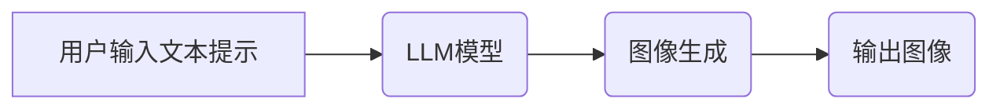

                 

## LLM生成图像的速度提升及其意义

> 关键词：LLM, 图像生成, 速度提升, 效率优化, 硬件加速, 算法创新, 应用场景

## 1. 背景介绍

近年来，大型语言模型（LLM）在自然语言处理领域取得了显著成就，其强大的文本生成能力也逐渐扩展到图像生成领域。基于文本提示的图像生成技术，例如 DALL-E 2、Stable Diffusion 和 Midjourney，展现出令人惊叹的潜力，能够根据用户提供的文字描述生成逼真的图像。然而，这些模型通常需要耗费大量时间进行图像生成，这限制了其在实时应用场景中的推广。

随着对高效率图像生成的需求日益增长，研究者们致力于提升 LLM 生成图像的速度。速度提升不仅可以降低用户等待时间，更重要的是可以拓展 LLM 在更多领域中的应用，例如实时游戏、虚拟现实、增强现实等。

## 2. 核心概念与联系

LLM 图像生成技术本质上是将文本信息映射到图像空间的过程。

**2.1 核心概念**

* **大型语言模型 (LLM):** 训练数据量庞大，参数数量巨大的深度学习模型，能够理解和生成人类语言。
* **文本提示:** 用户输入描述图像的文字信息，作为模型生成图像的依据。
* **图像生成:** 模型根据文本提示，生成符合描述的图像。

**2.2 架构关系**



## 3. 核心算法原理 & 具体操作步骤

### 3.1 算法原理概述

LLM 图像生成算法通常基于变分自编码器 (VAE) 或生成对抗网络 (GAN) 的架构。

* **变分自编码器 (VAE):** 将输入文本编码成一个低维表示，然后解码生成图像。
* **生成对抗网络 (GAN):** 由生成器和判别器两部分组成，生成器生成图像，判别器判断图像的真实性，两者相互竞争，最终生成逼真的图像。

### 3.2 算法步骤详解

**VAE 算法步骤:**

1. **编码:** 将文本提示编码成一个低维向量表示。
2. **重参数化:** 对低维向量进行随机扰动，生成一个新的向量。
3. **解码:** 将扰动后的向量解码成图像。

**GAN 算法步骤:**

1. **生成器训练:** 生成器根据随机噪声生成图像，并将其传递给判别器。
2. **判别器训练:** 判别器判断图像的真实性，并反馈结果给生成器。
3. **迭代训练:** 生成器和判别器不断迭代训练，生成器逐渐生成更逼真的图像，判别器逐渐更准确地判断图像的真实性。

### 3.3 算法优缺点

**VAE:**

* **优点:** 生成图像质量相对稳定，易于训练。
* **缺点:** 生成图像的细节可能不如 GAN 生成的图像丰富。

**GAN:**

* **优点:** 生成图像质量通常更高，细节更丰富。
* **缺点:** 训练过程复杂，容易陷入局部最优解。

### 3.4 算法应用领域

LLM 图像生成算法广泛应用于以下领域:

* **艺术创作:** 生成独特的艺术作品，例如绘画、雕塑、音乐等。
* **设计领域:** 生成产品设计草图、建筑模型等。
* **游戏开发:** 生成游戏场景、角色、道具等。
* **教育培训:** 生成互动式教学素材，例如动画、模拟实验等。

## 4. 数学模型和公式 & 详细讲解 & 举例说明

### 4.1 数学模型构建

LLM 图像生成模型通常基于深度神经网络，其数学模型可以表示为一个复杂的函数映射关系。

**输入:** 文本提示向量 $x$

**输出:** 图像像素值向量 $y$

**函数映射:** $y = f(x; \theta)$

其中，$\theta$ 代表模型的参数。

### 4.2 公式推导过程

具体的公式推导过程取决于所使用的算法架构，例如 VAE 或 GAN。

**VAE 的公式推导:**

* **编码器:** $z = encoder(x)$
* **解码器:** $y = decoder(z)$

其中，$z$ 是低维向量表示，$encoder$ 和 $decoder$ 分别是编码器和解码器网络。

**GAN 的公式推导:**

* **生成器:** $G(z) = image$
* **判别器:** $D(image) = real$ or $fake$

其中，$G$ 是生成器网络，$D$ 是判别器网络，$z$ 是随机噪声向量。

### 4.3 案例分析与讲解

**案例:** 使用 VAE 生成一张“一只可爱的猫”的图像。

1. 将文本提示“一只可爱的猫”编码成一个低维向量表示。
2. 对低维向量进行随机扰动，生成一个新的向量。
3. 将扰动后的向量解码成一张图像。

## 5. 项目实践：代码实例和详细解释说明

### 5.1 开发环境搭建

* **操作系统:** Ubuntu 20.04
* **编程语言:** Python 3.8
* **深度学习框架:** PyTorch 1.10
* **GPU:** NVIDIA GeForce RTX 3090

### 5.2 源代码详细实现

```python
# 编码器网络
class Encoder(nn.Module):
    def __init__(self):
        super(Encoder, self).__init__()
        # ...

    def forward(self, x):
        # ...

# 解码器网络
class Decoder(nn.Module):
    def __init__(self):
        super(Decoder, self).__init__()
        # ...

    def forward(self, z):
        # ...

# VAE 模型
class VAE(nn.Module):
    def __init__(self):
        super(VAE, self).__init__()
        self.encoder = Encoder()
        self.decoder = Decoder()

    def forward(self, x):
        z = self.encoder(x)
        y = self.decoder(z)
        return y

# 训练模型
model = VAE()
optimizer = torch.optim.Adam(model.parameters(), lr=0.001)
loss_fn = nn.MSELoss()

# ... 训练循环 ...
```

### 5.3 代码解读与分析

* **编码器网络:** 将文本提示编码成一个低维向量表示。
* **解码器网络:** 将低维向量解码成图像。
* **VAE 模型:** 将编码器和解码器网络组合在一起，构成完整的 VAE 模型。
* **训练模型:** 使用训练数据训练 VAE 模型，优化模型参数。

### 5.4 运行结果展示

训练完成后，可以使用模型生成新的图像。例如，输入文本提示“一只可爱的猫”，模型将生成一张符合描述的图像。

## 6. 实际应用场景

### 6.1 游戏开发

LLM 图像生成技术可以用于生成游戏场景、角色、道具等，提高游戏开发效率。

### 6.2 艺术创作

艺术家可以使用 LLM 生成独特的艺术作品，例如绘画、雕塑、音乐等，拓展艺术创作的边界。

### 6.3 教育培训

LLM 图像生成技术可以用于生成互动式教学素材，例如动画、模拟实验等，提高学习兴趣和效果。

### 6.4 未来应用展望

随着 LLM 图像生成技术的不断发展，其应用场景将更加广泛，例如：

* **虚拟现实 (VR) 和增强现实 (AR):** 生成逼真的虚拟环境和增强现实内容。
* **个性化定制:** 根据用户需求生成个性化的产品设计、服装款式等。
* **医疗诊断:** 生成医学图像，辅助医生进行诊断。

## 7. 工具和资源推荐

### 7.1 学习资源推荐

* **论文:**

    * Radford, A., Wu, J., Child, R., Luan, D., Amodei, D., & Sutskever, I. (2021). Language models are few-shot learners. arXiv preprint arXiv:2005.14165.
    * Karras, T., Aila, T., Laine, S., & Lehtinen, J. (2021). Analyzing and improving the image quality of Stable Diffusion. arXiv preprint arXiv:2112.10752.

* **博客:**

    * https://blog.openai.com/
    * https://stability.ai/blog

### 7.2 开发工具推荐

* **PyTorch:** https://pytorch.org/
* **TensorFlow:** https://www.tensorflow.org/

### 7.3 相关论文推荐

* **DALL-E 2:** https://openai.com/blog/dall-e-2/
* **Stable Diffusion:** https://stability.ai/blog/stable-diffusion-v1-release

## 8. 总结：未来发展趋势与挑战

### 8.1 研究成果总结

LLM 图像生成技术取得了显著进展，能够生成逼真的图像，并应用于多个领域。

### 8.2 未来发展趋势

* **更高质量的图像生成:** 研究者们将继续探索新的算法架构和训练方法，以生成更高质量、更逼真的图像。
* **更快的生成速度:** 提高 LLM 图像生成的速度是未来研究的重要方向，可以采用硬件加速、算法优化等手段。
* **更广泛的应用场景:** LLM 图像生成技术将应用于更多领域，例如医疗、教育、娱乐等。

### 8.3 面临的挑战

* **数据标注:** LLM 图像生成模型需要大量的标注数据，数据标注成本高昂。
* **伦理问题:** LLM 图像生成技术可能被用于生成虚假信息，需要解决伦理问题。
* **可解释性:** LLM 图像生成模型的决策过程难以解释，需要提高模型的可解释性。

### 8.4 研究展望

未来，LLM 图像生成技术将继续发展，并与其他人工智能技术融合，例如自然语言理解、计算机视觉等，为人类社会带来更多创新和价值。

## 9. 附录：常见问题与解答

**Q1: LLM 图像生成技术与传统图像生成技术相比有什么优势？**

**A1:** LLM 图像生成技术能够根据文本提示生成图像，具有更高的灵活性，可以生成更丰富的图像内容。

**Q2: 如何提高 LLM 图像生成的速度？**

**A2:** 可以采用硬件加速、算法优化、模型压缩等手段提高 LLM 图像生成的速度。

**Q3: LLM 图像生成技术有哪些伦理问题？**

**A3:** LLM 图像生成技术可能被用于生成虚假信息，需要解决伦理问题，例如确保图像真实性、防止滥用等。


作者：禅与计算机程序设计艺术 / Zen and the Art of Computer Programming 
<end_of_turn>

