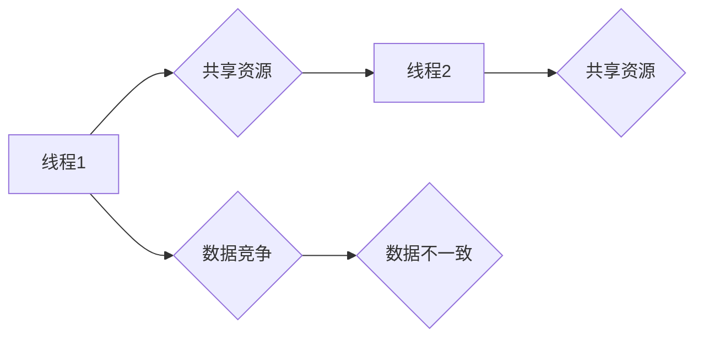

                 

## LLM的线程安全问题：分析与对策

> 关键词：LLM, 线程安全, 并发, 互斥锁, 信号量, 问题分析, 对策建议, 性能优化

## 1. 背景介绍

大型语言模型 (LLM) 近年来取得了令人瞩目的进展，在自然语言处理、文本生成、机器翻译等领域展现出强大的能力。然而，随着模型规模的不断扩大，其训练和推理过程也变得更加复杂和资源密集。为了提高效率，将 LLM 部署到多核处理器或分布式计算环境中进行并行处理成为一种趋势。然而，并行处理也带来了新的挑战，其中之一就是线程安全问题。

线程安全是指在多线程环境下，程序能够正确地共享数据，避免数据竞争和不可预期的结果。对于 LLM 来说，线程安全问题尤为重要，因为模型参数和中间计算结果通常是共享的。如果多个线程同时访问和修改这些共享资源，可能会导致数据不一致、错误的结果甚至程序崩溃。

## 2. 核心概念与联系

### 2.1 线程与并发

线程是程序执行的最小单位，它可以独立执行代码块。并发是指多个线程同时执行，即使它们并非真正同时执行，而是快速轮流执行，给用户的感觉也是同时进行的。

### 2.2 数据竞争

数据竞争是指多个线程同时访问和修改同一个共享数据，导致数据状态不一致的问题。

### 2.3 线程安全问题

线程安全问题是指在多线程环境下，程序由于数据竞争等原因导致的错误或不可预期的结果。

**Mermaid 流程图**



## 3. 核心算法原理 & 具体操作步骤

### 3.1 算法原理概述

解决 LLM 线程安全问题的核心算法主要包括互斥锁和信号量等同步机制。

* **互斥锁:** 互斥锁是一种同步机制，它允许只有一个线程在同一时间访问共享资源。当一个线程获取互斥锁时，其他线程将被阻塞，直到该线程释放锁。

* **信号量:** 信号量是一种计数器，它控制多个线程对共享资源的访问。信号量可以设定一个最大值，表示同时可以访问共享资源的线程数量。当信号量值为 0 时，表示共享资源已被占用，其他线程将被阻塞，直到信号量值大于 0。

### 3.2 算法步骤详解

1. **识别共享资源:** 首先需要识别出哪些数据或资源需要进行线程安全保护。

2. **选择同步机制:** 根据共享资源的访问模式和性能要求，选择合适的同步机制，例如互斥锁或信号量。

3. **实现同步:** 使用所选择的同步机制，在访问共享资源时进行加锁或信号量操作，确保只有一个线程可以同时访问共享资源。

4. **释放锁或信号量:** 在完成对共享资源的访问后，释放锁或信号量，允许其他线程访问共享资源。

### 3.3 算法优缺点

* **互斥锁:**

    * **优点:** 简单易用，能够有效地防止数据竞争。
    * **缺点:** 容易造成死锁，性能开销较大。

* **信号量:**

    * **优点:** 能够控制多个线程对共享资源的访问，性能开销相对较小。
    * **缺点:** 较为复杂，需要仔细设计信号量的初始值和操作规则。

### 3.4 算法应用领域

* **分布式系统:** 在分布式系统中，多个节点需要共享数据，因此需要使用线程安全机制来保证数据一致性。
* **多核处理器:** 在多核处理器环境下，多个线程可以同时执行，需要使用线程安全机制来避免数据竞争。
* **并发编程:** 在并发编程中，多个线程需要同时访问共享资源，需要使用线程安全机制来保证程序的正确性。

## 4. 数学模型和公式 & 详细讲解 & 举例说明

### 4.1 数学模型构建

对于一个包含 $n$ 个共享资源的系统，假设有 $m$ 个线程并发访问这些资源。我们可以用一个状态变量 $S$ 来表示系统当前的状态，其中 $S_i$ 表示第 $i$ 个共享资源的状态。

* $S_i = 0$ 表示第 $i$ 个共享资源可用。
* $S_i = 1$ 表示第 $i$ 个共享资源被占用。

### 4.2 公式推导过程

我们可以用一个状态转移方程来描述系统状态的演变：

$$S_{t+1} = f(S_t, A_t)$$

其中：

* $S_t$ 表示系统在时间 $t$ 的状态。
* $A_t$ 表示在时间 $t$ 所有线程的操作集合。
* $f$ 是一个状态转移函数，描述了系统状态根据当前状态和线程操作如何变化。

### 4.3 案例分析与讲解

假设有两个共享资源，两个线程分别尝试访问这两个资源。

* 线程 1 尝试访问资源 1，资源 1 可用，状态转移为 $S_1 = 1$。
* 线程 2 尝试访问资源 2，资源 2 可用，状态转移为 $S_2 = 1$。

此时，系统状态为 $S = (1, 1)$，表示两个资源都被占用。

## 5. 项目实践：代码实例和详细解释说明

### 5.1 开发环境搭建

* 操作系统: Ubuntu 20.04
* 编程语言: Python 3.8
* 框架: TensorFlow 2.x

### 5.2 源代码详细实现

```python
import threading

# 共享资源
shared_resource = 0

# 互斥锁
lock = threading.Lock()

def increment_resource(thread_id):
    global shared_resource
    for _ in range(100000):
        # 获取互斥锁
        lock.acquire()
        # 访问共享资源
        shared_resource += 1
        # 释放互斥锁
        lock.release()

# 创建多个线程
threads = []
for i in range(10):
    thread = threading.Thread(target=increment_resource, args=(i,))
    threads.append(thread)
    thread.start()

# 等待所有线程完成
for thread in threads:
    thread.join()

# 打印最终结果
print(f"Final shared resource value: {shared_resource}")
```

### 5.3 代码解读与分析

* `shared_resource` 是一个全局变量，表示共享资源的值。
* `lock` 是一个互斥锁对象，用于保护 `shared_resource` 的访问。
* `increment_resource` 函数模拟一个线程对共享资源的访问操作，它会 100,000 次加 1 到 `shared_resource`。
* 在每个线程执行 `increment_resource` 函数之前，它会先获取 `lock` 互斥锁，确保只有一个线程可以访问 `shared_resource`。
* 在访问完 `shared_resource` 后，线程会释放 `lock` 互斥锁，允许其他线程访问共享资源。

### 5.4 运行结果展示

运行上述代码后，最终的 `shared_resource` 值应该为 1,000,000。

## 6. 实际应用场景

### 6.1 模型训练

在训练大型语言模型时，通常需要使用多个 GPU 或 TPU 进行并行计算。为了保证模型参数的正确更新，需要使用线程安全机制来保护参数的访问。

### 6.2 模型推理

在部署 LLM 进行推理时，也可能需要使用多个线程来处理多个请求。为了保证推理结果的正确性，需要使用线程安全机制来保护模型状态和中间计算结果。

### 6.4 未来应用展望

随着 LLM 的不断发展，其规模和复杂度将继续增加，线程安全问题将变得更加重要。未来，我们需要开发更加高效、灵活和安全的线程安全机制，以支持 LLM 在更大规模和更复杂环境下的应用。

## 7. 工具和资源推荐

### 7.1 学习资源推荐

* **《深入理解计算机系统》:** 这本书对计算机系统架构和并发编程进行了深入的讲解。
* **《操作系统导论》:** 这本书介绍了操作系统中的核心概念，包括线程、进程和同步机制。
* **《并发编程艺术》:** 这本书提供了丰富的并发编程技巧和经验，包括线程安全和性能优化。

### 7.2 开发工具推荐

* **Python threading 模块:** Python 提供了内置的 threading 模块，用于实现多线程编程。
* **Lock、Semaphore、Condition:** Python threading 模块提供了多种同步机制，例如 Lock、Semaphore 和 Condition。
* **multiprocessing 模块:** Python 提供了 multiprocessing 模块，用于实现进程间通信和共享资源。

### 7.3 相关论文推荐

* **"The Art of Multiprocessor Programming" by Maurice Herlihy and Nir Shavit:** 这本书介绍了多处理器编程的艺术，包括线程安全和并发算法。
* **"Concurrent Programming in Java: Design Principles and Patterns" by  Brian Goetz:** 这本书介绍了 Java 中的并发编程，包括线程安全和性能优化。

## 8. 总结：未来发展趋势与挑战

### 8.1 研究成果总结

近年来，在 LLM 线程安全问题研究方面取得了显著进展，包括开发了多种高效的同步机制和并发算法。

### 8.2 未来发展趋势

* **更智能的线程安全机制:** 未来，线程安全机制将更加智能化，能够自动检测和解决潜在的线程安全问题。
* **分布式 LLM 线程安全:** 随着 LLM 的规模不断扩大，分布式 LLM 线程安全问题将成为新的研究热点。
* **硬件支持:** 未来硬件将提供更强大的支持，例如硬件级互斥锁和原子操作，以提高 LLM 线程安全性能。

### 8.3 面临的挑战

* **复杂性:** LLM 的架构和训练过程非常复杂，线程安全问题也变得更加复杂。
* **性能:** 线程安全机制可能会带来一定的性能开销，需要不断优化以降低开销。
* **可解释性:** 一些线程安全机制的内部工作原理比较复杂，需要提高其可解释性。

### 8.4 研究展望

未来，LLM 线程安全问题研究将继续深入，探索更智能、更高效、更安全的解决方案，以支持 LLM 在更大规模和更复杂环境下的应用。

## 9. 附录：常见问题与解答

### 9.1 什么是死锁？

死锁是指两个或多个线程互相等待对方释放资源，导致所有线程都无法继续执行的情况。

### 9.2 如何避免死锁？

* 使用互斥锁的优先级机制。
* 使用信号量来控制资源的访问。
* 使用时间限制来避免线程无限等待。

### 9.3 如何检测死锁？

可以使用死锁检测算法来检测系统中是否存在死锁。

### 9.4 如何解决死锁？

* 杀死一个或多个死锁中的线程。
* 释放死锁中的资源。
* 重新安排线程的执行顺序。


作者：禅与计算机程序设计艺术 / Zen and the Art of Computer Programming 
<end_of_turn>

