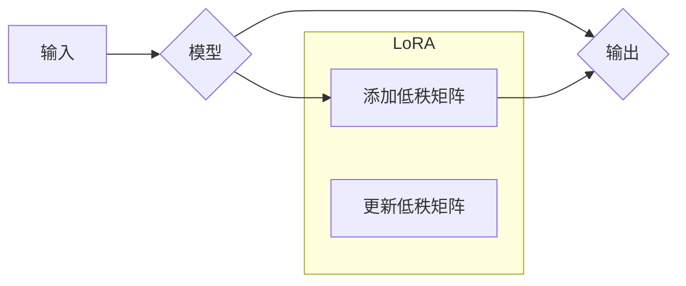

                 

## PEFT和LoRA：高效的参数高效微调方法

> 关键词：高效微调、参数量化、LoRA、PEFT、Transformer、自然语言处理、深度学习

## 1. 背景介绍

近年来，大型语言模型（LLM）在自然语言处理（NLP）领域取得了显著的成就，例如文本生成、机器翻译、问答系统等。然而，这些模型通常拥有数十亿甚至千亿的参数，训练成本高昂，部署也需要大量的计算资源。因此，高效地微调大型语言模型成为一个重要的研究方向。

传统的微调方法是直接对模型所有参数进行更新，这会导致大量的计算开销和内存消耗。为了解决这个问题，出现了许多高效微调方法，其中PEFT（Parameter-Efficient Fine-Tuning）和LoRA（Low-Rank Adaptation）是两种非常流行的方案。

## 2. 核心概念与联系

PEFT是一个通用的框架，旨在通过多种技术手段实现参数高效的微调。它主要通过以下几种策略来实现：

* **参数共享:** 将模型的不同部分共享参数，减少可训练参数的数量。
* **冻结层:** 将模型的部分层冻结，只对特定层进行微调。
* **量化:** 将模型参数量化到更小的数据类型，减少模型大小和内存消耗。

LoRA是一种基于PEFT的具体方法，它通过在模型的每一层之间添加低秩矩阵来实现参数高效的微调。

**Mermaid 流程图:**



**核心概念联系:**

PEFT是一个框架，LoRA是一种具体的微调方法，属于PEFT的一部分。LoRA通过在模型中添加低秩矩阵来实现参数高效的微调，而PEFT则提供了更广泛的微调策略。

## 3. 核心算法原理 & 具体操作步骤

### 3.1  算法原理概述

LoRA的核心思想是将模型的权重分解成两个低秩矩阵，分别表示为A和B。在微调过程中，只更新这两个低秩矩阵，而原始模型的权重保持不变。

### 3.2  算法步骤详解

1. **初始化:** 将模型的权重加载到内存中。
2. **分解权重:** 将模型每一层的权重分解成两个低秩矩阵A和B。
3. **微调:** 只更新A和B矩阵，而原始模型的权重保持不变。
4. **融合权重:** 微调完成后，将更新后的A和B矩阵与原始模型的权重融合，得到最终的微调模型。

### 3.3  算法优缺点

**优点:**

* **参数量少:** 只需要更新两个低秩矩阵，参数量远小于原始模型。
* **训练速度快:** 由于参数量少，训练速度显著加快。
* **内存消耗低:** 只需要存储两个低秩矩阵，内存消耗大幅降低。

**缺点:**

* **性能可能略逊于全量微调:** 由于只更新部分参数，性能可能略逊于全量微调。
* **需要额外的计算:** 分解和融合权重需要额外的计算开销。

### 3.4  算法应用领域

LoRA适用于各种需要微调大型语言模型的场景，例如：

* **文本分类:** 将预训练的语言模型微调到特定文本分类任务。
* **情感分析:** 将预训练的语言模型微调到情感分析任务。
* **机器翻译:** 将预训练的语言模型微调到特定语言对的机器翻译任务。

## 4. 数学模型和公式 & 详细讲解 & 举例说明

### 4.1  数学模型构建

假设模型的原始权重为W，则LoRA将W分解成两个低秩矩阵A和B，其中A和B的维度分别为：

* A: (d_model, r)
* B: (r, d_model)

其中，d_model是模型的维度，r是低秩矩阵的秩。

### 4.2  公式推导过程

LoRA的微调过程可以表示为以下公式：

```latex
\hat{W} = W + A \cdot B
```

其中，$\hat{W}$是微调后的权重，W是原始权重，A和B是低秩矩阵。

在训练过程中，只更新A和B矩阵，而W保持不变。

### 4.3  案例分析与讲解

假设我们有一个文本分类任务，需要微调一个预训练的语言模型。

1. **初始化:** 将预训练的语言模型加载到内存中，获取原始权重W。
2. **分解权重:** 将模型每一层的权重分解成两个低秩矩阵A和B。
3. **微调:** 使用训练数据训练A和B矩阵，更新它们的权重。
4. **融合权重:** 微调完成后，将更新后的A和B矩阵与原始模型的权重W融合，得到最终的微调模型。

## 5. 项目实践：代码实例和详细解释说明

### 5.1  开发环境搭建

* Python 3.7+
* PyTorch 1.7+
* Transformers 4.10+

### 5.2  源代码详细实现

```python
from transformers import AutoModelForSequenceClassification, AutoTokenizer
from peft import LoraConfig, get_peft_model

# 加载预训练模型和词典
model_name = "bert-base-uncased"
tokenizer = AutoTokenizer.from_pretrained(model_name)
model = AutoModelForSequenceClassification.from_pretrained(model_name)

# 配置LoRA参数
lora_config = LoraConfig(
    r=8,  # 低秩矩阵的秩
    lora_alpha=16,  # 缩放因子
    target_modules=["query", "key", "value"],  # 微调的目标模块
)

# 获取LoRA微调模型
model = get_peft_model(model, lora_config)

# 训练模型
# ...

# 保存微调模型
model.save_pretrained("lora_model")
```

### 5.3  代码解读与分析

* 使用`transformers`库加载预训练模型和词典。
* 使用`peft`库配置LoRA参数，包括低秩矩阵的秩、缩放因子和微调的目标模块。
* 使用`get_peft_model`函数获取LoRA微调模型。
* 训练模型并保存微调模型。

### 5.4  运行结果展示

训练完成后，可以将微调模型用于文本分类任务，并与原始模型进行比较，观察性能提升。

## 6. 实际应用场景

LoRA在实际应用中具有广泛的应用场景，例如：

* **个性化推荐:** 将预训练的语言模型微调到用户的个性化推荐任务。
* **对话系统:** 将预训练的语言模型微调到对话系统的特定领域。
* **代码生成:** 将预训练的语言模型微调到代码生成任务。

### 6.4  未来应用展望

随着深度学习技术的不断发展，LoRA等高效微调方法将发挥越来越重要的作用。未来，LoRA可能应用于以下领域：

* **边缘计算:** 在资源受限的边缘设备上部署微调模型。
* **实时推理:** 在需要实时推理的场景中，使用LoRA加速模型推理速度。
* **多模态学习:** 将LoRA应用于多模态学习任务，例如文本-图像、文本-音频等。

## 7. 工具和资源推荐

### 7.1  学习资源推荐

* **PEFT官方文档:** https://huggingface.co/docs/peft/index
* **LoRA论文:** https://arxiv.org/abs/2106.09685

### 7.2  开发工具推荐

* **Transformers:** https://huggingface.co/docs/transformers/index
* **PyTorch:** https://pytorch.org/

### 7.3  相关论文推荐

* **Parameter-Efficient Fine-Tuning for Large Language Models:** https://arxiv.org/abs/2106.09685
* **Adapter Tuning: Efficient Adaptation of Large Language Models:** https://arxiv.org/abs/2006.11287

## 8. 总结：未来发展趋势与挑战

### 8.1  研究成果总结

LoRA和PEFT等高效微调方法为大型语言模型的应用提供了新的思路，降低了训练成本和部署门槛，促进了NLP领域的快速发展。

### 8.2  未来发展趋势

未来，高效微调方法将朝着以下方向发展：

* **更有效的微调策略:** 研究更有效的微调策略，进一步降低参数量和训练成本。
* **自动化微调:** 开发自动化微调工具，方便用户进行微调。
* **跨模态微调:** 将高效微调方法应用于跨模态学习任务。

### 8.3  面临的挑战

高效微调方法也面临一些挑战：

* **性能提升有限:** 虽然高效微调方法可以显著降低训练成本，但性能可能略逊于全量微调。
* **通用性问题:** 不同的任务和模型可能需要不同的微调策略，缺乏通用的微调方法。
* **可解释性问题:** 

高效微调方法的内部机制相对复杂，缺乏可解释性。

### 8.4  研究展望

未来，需要进一步研究高效微调方法的理论基础，开发更有效的微调策略，提高模型性能和可解释性，并将其应用于更广泛的领域。

## 9. 附录：常见问题与解答

**Q1: LoRA和全量微调相比，有什么优势？**

**A1:** LoRA相比全量微调，具有以下优势：

* **参数量少:** 只需要更新两个低秩矩阵，参数量远小于全量微调。
* **训练速度快:** 由于参数量少，训练速度显著加快。
* **内存消耗低:** 只需要存储两个低秩矩阵，内存消耗大幅降低。

**Q2: LoRA的低秩矩阵的秩r应该怎么设置？**

**A2:** 秩r的选择需要根据实际任务和模型进行调整。一般来说，r的值越小，参数量越少，训练速度越快，但性能可能略逊于高秩模型。

**Q3: LoRA是否适用于所有类型的模型？**

**A3:** LoRA主要适用于Transformer模型，对于其他类型的模型，可能需要进行相应的改动。


作者：禅与计算机程序设计艺术 / Zen and the Art of Computer Programming 
<end_of_turn>

