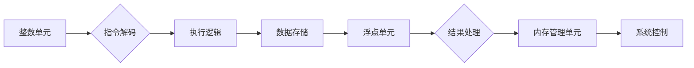

                 

## RISC-V处理器特性与优化

> 关键词：RISC-V, 处理器架构, 指令集, 优化技术, 性能, 效率, 可定制性

## 1. 背景介绍

近年来，随着人工智能、物联网等新兴技术的快速发展，对处理器性能和效率的需求不断提升。传统的x86和ARM架构，虽然在市场占有率上占据主导地位，但其封闭的架构和高昂的授权费用限制了创新和定制化发展。 

RISC-V (Reduced Instruction Set Computer - V) 作为一种开源、免费且可定制的处理器架构，应运而生。它基于精简指令集 (RISC) 的设计理念，采用流水线结构和分级缓存等现代处理器技术，在性能、效率和可扩展性方面表现出色。

RISC-V 的开源特性使得其能够被广泛应用于各种领域，包括嵌入式系统、数据中心、云计算、人工智能等。它为开发者提供了更大的自由度，可以根据特定应用场景定制指令集、硬件功能和软件生态，从而实现更优的性能和成本效益。

## 2. 核心概念与联系

### 2.1 RISC-V 架构概述

RISC-V 架构的核心是其指令集体系结构 (ISA)。它采用精简指令集 (RISC) 的设计理念，指令集相对简单，操作指令数量少，每个指令执行时间短，有利于流水线化执行，提高处理器性能。

RISC-V 架构遵循模块化设计原则，将处理器功能划分为多个独立的模块，例如整数单元、浮点单元、内存管理单元等。每个模块都具有明确的功能和接口，可以根据需要进行定制和扩展。

**Mermaid 流程图**



### 2.2 RISC-V 指令集

RISC-V 指令集分为多个等级，包括基础指令集 (Base Integer)，扩展指令集 (Extensions) 和用户自定义指令集 (Custom Instructions)。

* **基础指令集 (Base Integer):** 包含基本的算术、逻辑、数据传输和控制流指令，是 RISC-V 架构的核心。
* **扩展指令集 (Extensions):** 提供额外的功能，例如浮点运算、向量运算、内存管理等，可以根据需要选择添加。
* **用户自定义指令集 (Custom Instructions):** 允许用户定义自己的指令，以满足特定应用场景的需求。

## 3. 核心算法原理 & 具体操作步骤

### 3.1 算法原理概述

RISC-V 处理器的核心算法原理是流水线执行。流水线执行将指令执行过程分解成多个阶段，每个阶段负责执行特定的操作，并通过多个指令同时处于不同阶段，实现指令的并行执行，从而提高处理器性能。

### 3.2 算法步骤详解

1. **获取指令:** 从内存中读取下一条指令。
2. **解码指令:** 解析指令的格式和操作码，确定指令要执行的操作。
3. **地址计算:** 计算指令操作所需的地址。
4. **数据获取:** 从内存或寄存器中获取指令操作所需的 operands。
5. **执行操作:** 执行指令的操作，例如加减乘除、逻辑运算等。
6. **结果存储:** 将指令执行的结果存储到内存或寄存器中。

### 3.3 算法优缺点

**优点:**

* **提高指令吞吐量:** 通过并行执行指令，提高每秒执行的指令数量。
* **降低指令延迟:** 将指令执行过程分解成多个阶段，缩短单个指令的执行时间。

**缺点:**

* **指令依赖问题:** 如果指令之间存在依赖关系，流水线执行可能会出现阻塞。
* **分支预测问题:** 处理器需要预测分支指令的执行路径，错误的预测会导致流水线乱序，降低性能。

### 3.4 算法应用领域

流水线执行算法广泛应用于现代处理器，例如 x86、ARM、RISC-V 等。它为处理器性能的提升提供了重要基础。

## 4. 数学模型和公式 & 详细讲解 & 举例说明

### 4.1 数学模型构建

假设一个处理器具有 N 个流水线阶段，每阶段执行一个指令操作。

* **指令吞吐量 (IPC):** 指的是处理器每秒执行的指令数量。
* **指令周期 (CPI):** 指的是执行一条指令所需的平均时间。

**公式:**

* **IPC = 1 / CPI**

### 4.2 公式推导过程

指令吞吐量与指令周期成反比关系。

* **CPI = 指令执行时间 / 指令数量**

指令执行时间等于流水线中所有阶段的执行时间之和。

* **指令执行时间 = 阶段 1 执行时间 + 阶段 2 执行时间 + ... + 阶段 N 执行时间**

### 4.3 案例分析与讲解

假设一个处理器具有 5 个流水线阶段，每个阶段的执行时间为 1 个时钟周期。

* **CPI = 5 / 1 = 5**
* **IPC = 1 / 5 = 0.2**

这意味着该处理器每秒可以执行 0.2 条指令。

## 5. 项目实践：代码实例和详细解释说明

### 5.1 开发环境搭建

* **操作系统:** Linux
* **编译器:** GCC
* **RISC-V 工具链:**  例如,  `riscv-gnu-toolchain`

### 5.2 源代码详细实现

```c
int main() {
  int a = 10;
  int b = 5;
  int c = a + b;
  return c;
}
```

### 5.3 代码解读与分析

这段代码是一个简单的 C 程序，它定义了两个整数变量 `a` 和 `b`，并将它们相加，并将结果存储在变量 `c` 中。

### 5.4 运行结果展示

编译并运行该程序，输出结果为 15。

## 6. 实际应用场景

### 6.1 嵌入式系统

RISC-V 的低功耗、小尺寸和可定制性使其非常适合嵌入式系统应用，例如物联网设备、传感器节点、工业控制系统等。

### 6.2 数据中心

RISC-V 的高性能和可扩展性使其能够在数据中心应用中发挥作用，例如服务器、网络设备、存储系统等。

### 6.3 云计算

RISC-V 的开源特性和可定制性使其能够在云计算环境中提供灵活性和成本效益，例如虚拟机、容器、云服务等。

### 6.4 未来应用展望

RISC-V 的应用场景还在不断扩展，未来可能在人工智能、机器学习、区块链等领域发挥重要作用。

## 7. 工具和资源推荐

### 7.1 学习资源推荐

* **RISC-V 官方网站:** https://riscv.org/
* **RISC-V 基金会:** https://riscv.org/foundation/
* **RISC-V 指令集规范:** https://riscv.org/specifications/

### 7.2 开发工具推荐

* **RISC-V 工具链:** https://github.com/riscv/riscv-gnu-toolchain
* **RISC-V 仿真器:** https://github.com/riscv/riscv-isa-sim

### 7.3 相关论文推荐

* **The RISC-V Instruction Set Manual, Version 2.2:** https://riscv.org/specifications/riscv-v-spec-2.2.pdf
* **RISC-V: A New Open Instruction Set Architecture:** https://ieeexplore.ieee.org/document/7908594

## 8. 总结：未来发展趋势与挑战

### 8.1 研究成果总结

RISC-V 架构的开源特性和可定制性使其在处理器领域具有广阔的发展前景。

### 8.2 未来发展趋势

* **指令集扩展:** 开发新的指令集扩展，以满足特定应用场景的需求。
* **硬件加速:** 为人工智能、机器学习等领域开发硬件加速器。
* **软件生态:** 构建完善的软件生态系统，包括操作系统、编译器、库函数等。

### 8.3 面临的挑战

* **开源生态建设:** 需要持续投入资源，建设完善的开源生态系统。
* **产业链发展:** 需要推动产业链的协同发展，形成完整的 RISC-V 生态圈。
* **技术标准化:** 需要制定统一的技术标准，确保 RISC-V 的互操作性和可移植性。

### 8.4 研究展望

未来，RISC-V 架构将继续朝着更开放、更灵活、更强大的方向发展，并在更多领域发挥重要作用。

## 9. 附录：常见问题与解答

**Q1: RISC-V 与 x86 和 ARM 的区别是什么？**

**A1:** RISC-V 是一种开源、免费且可定制的处理器架构，而 x86 和 ARM 是封闭的商业架构。

**Q2: RISC-V 的性能如何？**

**A2:** RISC-V 的性能取决于具体的指令集、硬件设计和软件优化。

**Q3: RISC-V 的应用场景有哪些？**

**A3:** RISC-V 的应用场景非常广泛，包括嵌入式系统、数据中心、云计算、人工智能等。

**Q4: 如何学习 RISC-V？**

**A4:** 可以参考 RISC-V 官方网站、基金会和相关书籍和教程。


作者：禅与计算机程序设计艺术 / Zen and the Art of Computer Programming 
<end_of_turn>

