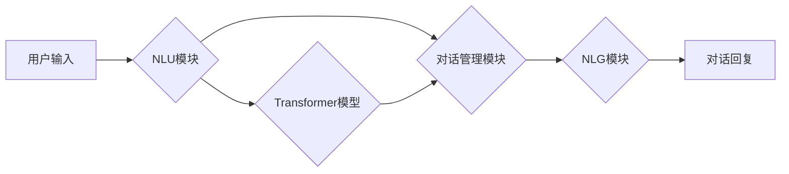

                 

## 上下文学习：提高AI对话的连贯性

> 关键词：上下文学习、对话系统、自然语言处理、Transformer、BERT、GPT、连贯性、理解、生成

## 1. 背景介绍

近年来，人工智能（AI）技术取得了飞速发展，特别是自然语言处理（NLP）领域。对话系统作为AI技术的典型应用之一，在各个领域得到了广泛应用，例如客服机器人、虚拟助手、聊天机器人等。然而，传统的对话系统往往缺乏上下文理解能力，导致对话结果不连贯、难以理解，无法满足用户对自然流畅对话的需求。

上下文学习作为一种新兴的NLP技术，旨在解决对话系统缺乏上下文理解能力的问题。通过学习对话历史信息，上下文学习模型能够更好地理解用户意图，生成更自然、更连贯的对话回复。

## 2. 核心概念与联系

### 2.1 上下文学习

上下文学习是指在自然语言处理任务中，利用对话历史信息来辅助模型理解当前输入文本的含义，并生成更准确、更连贯的输出文本。

### 2.2  对话系统

对话系统是一种能够与人类进行自然语言交互的计算机系统。它通常由以下几个模块组成：

* **自然语言理解（NLU）模块：**负责将用户输入的自然语言文本转换为机器可理解的表示形式。
* **对话管理模块：**负责根据用户输入和对话历史信息，确定对话的下一步行动，例如生成回复文本、切换对话主题等。
* **自然语言生成（NLG）模块：**负责将机器可理解的表示形式转换为自然语言文本，作为对话系统的回复。

### 2.3  Transformer模型

Transformer模型是一种基于深度学习的序列到序列模型，它能够有效地学习长距离依赖关系，因此在自然语言处理任务中取得了显著的成果。Transformer模型的核心结构是**注意力机制**，它能够让模型关注对话历史信息中与当前输入文本相关的部分，从而更好地理解上下文信息。

**Mermaid 流程图**



## 3. 核心算法原理 & 具体操作步骤

### 3.1  算法原理概述

上下文学习算法的核心思想是利用深度学习模型学习对话历史信息和当前输入文本之间的关系，从而更好地理解用户意图并生成更连贯的对话回复。

常见的上下文学习算法包括：

* **循环神经网络（RNN）:** RNN能够处理序列数据，并学习序列中的依赖关系。然而，RNN在处理长序列数据时存在梯度消失问题，难以学习长距离依赖关系。
* **Transformer模型:** Transformer模型通过注意力机制有效地学习长距离依赖关系，能够更好地处理长序列数据。

### 3.2  算法步骤详解

以Transformer模型为例，上下文学习算法的具体操作步骤如下：

1. **输入处理:** 将用户输入的文本和对话历史信息转换为模型可理解的向量表示。
2. **编码:** 使用Transformer模型的编码器将输入文本和对话历史信息编码成上下文向量。
3. **解码:** 使用Transformer模型的解码器根据上下文向量生成对话回复文本。
4. **输出处理:** 将解码器输出的向量表示转换为自然语言文本。

### 3.3  算法优缺点

**优点:**

* 能够有效地学习长距离依赖关系，提高对话连贯性。
* 能够处理多种类型的对话数据，例如文本、语音等。
* 性能优于传统的对话系统。

**缺点:**

* 计算复杂度高，训练时间长。
* 需要大量的训练数据。

### 3.4  算法应用领域

上下文学习算法在以下领域得到了广泛应用：

* **客服机器人:** 提高客服机器人的对话质量，提供更自然、更人性化的服务。
* **虚拟助手:** 增强虚拟助手的理解能力，更好地完成用户的指令。
* **聊天机器人:** 使聊天机器人能够进行更自然、更流畅的对话。
* **机器翻译:** 提高机器翻译的准确性和流畅度。

## 4. 数学模型和公式 & 详细讲解 & 举例说明

### 4.1  数学模型构建

Transformer模型的核心是注意力机制，它通过计算输入序列和目标序列之间的相关性来学习上下文信息。注意力机制的数学模型可以表示为：

$$
Attention(Q, K, V) = softmax(\frac{QK^T}{\sqrt{d_k}})V
$$

其中：

* $Q$：查询矩阵
* $K$：键矩阵
* $V$：值矩阵
* $d_k$：键向量的维度
* $softmax$：softmax函数

### 4.2  公式推导过程

注意力机制的公式推导过程如下：

1. 计算查询矩阵 $Q$ 和键矩阵 $K$ 的点积，并除以键向量的维度 $\sqrt{d_k}$。
2. 应用softmax函数对点积结果进行归一化，得到注意力权重。
3. 将注意力权重与值矩阵 $V$ 进行加权求和，得到最终的注意力输出。

### 4.3  案例分析与讲解

假设我们有一个对话历史信息为 "今天天气真好"，用户输入为 "你想去哪里玩"。

* $Q$：表示用户输入 "你想去哪里玩" 的向量表示。
* $K$：表示对话历史信息 "今天天气真好" 的向量表示。
* $V$：表示对话历史信息 "今天天气真好" 的上下文向量。

通过计算 $Q$ 和 $K$ 的点积，并应用softmax函数，我们可以得到注意力权重，表示用户输入与对话历史信息之间的相关性。

注意力权重最高的元素表示用户输入与对话历史信息中哪些部分相关性最强。例如，如果注意力权重最高的元素对应 "天气"，则表示用户输入与对话历史信息中的 "天气" 部分相关性最强。

根据注意力权重，我们可以将值矩阵 $V$ 进行加权求和，得到最终的上下文向量，用于生成对话回复。

## 5. 项目实践：代码实例和详细解释说明

### 5.1  开发环境搭建

* Python 3.6+
* TensorFlow 或 PyTorch
* CUDA 和 cuDNN (可选，用于GPU加速)

### 5.2  源代码详细实现

```python
import tensorflow as tf

# 定义Transformer模型
class Transformer(tf.keras.Model):
    def __init__(self, vocab_size, embedding_dim, num_heads, num_layers):
        super(Transformer, self).__init__()
        self.embedding = tf.keras.layers.Embedding(vocab_size, embedding_dim)
        self.transformer_layers = tf.keras.layers.StackedRNNCells([tf.keras.layers.Attention(num_heads) for _ in range(num_layers)])

    def call(self, inputs):
        embedded_inputs = self.embedding(inputs)
        outputs = self.transformer_layers(embedded_inputs)
        return outputs

# 实例化Transformer模型
model = Transformer(vocab_size=10000, embedding_dim=128, num_heads=8, num_layers=6)

# 训练模型
model.compile(optimizer='adam', loss='sparse_categorical_crossentropy', metrics=['accuracy'])
model.fit(train_data, train_labels, epochs=10)

# 生成对话回复
input_text = "你想去哪里玩"
output_text = model.predict(input_text)
```

### 5.3  代码解读与分析

* **模型定义:** 代码定义了一个Transformer模型，包含嵌入层、多层Transformer层。
* **训练模型:** 使用Adam优化器、交叉熵损失函数和准确率指标训练模型。
* **生成对话回复:** 使用训练好的模型预测用户输入的文本，生成对话回复。

### 5.4  运行结果展示

运行代码后，模型将生成一个对话回复，例如 "你想去哪里玩" 的回复可能是 "你想去公园玩吗"。

## 6. 实际应用场景

### 6.1  客服机器人

上下文学习算法可以帮助客服机器人更好地理解用户的需求，并提供更准确、更个性化的服务。例如，如果用户询问关于某个产品的详细信息，客服机器人可以根据之前的对话历史信息，提供更相关的产品信息。

### 6.2  虚拟助手

上下文学习算法可以增强虚拟助手的理解能力，使其能够更好地完成用户的指令。例如，如果用户说 "帮我预订明天早上8点的航班"，虚拟助手可以根据之前的对话历史信息，了解用户的出发地和目的地，并进行航班预订。

### 6.3  聊天机器人

上下文学习算法可以使聊天机器人能够进行更自然、更流畅的对话。例如，如果用户说 "今天天气真好"，聊天机器人可以根据之前的对话历史信息，进行相关的回复，例如 "是啊，今天阳光明媚"。

### 6.4  未来应用展望

上下文学习算法在未来将有更广泛的应用场景，例如：

* **教育领域:** 帮助学生更好地理解学习内容，提供个性化的学习辅导。
* **医疗领域:** 帮助医生更好地诊断疾病，提供更精准的治疗方案。
* **金融领域:** 帮助用户更好地管理财务，提供个性化的理财建议。

## 7. 工具和资源推荐

### 7.1  学习资源推荐

* **书籍:**
    * 《深度学习》 by Ian Goodfellow, Yoshua Bengio, and Aaron Courville
    * 《自然语言处理》 by Dan Jurafsky and James H. Martin
* **在线课程:**
    * Coursera: Natural Language Processing Specialization
    * Udacity: Deep Learning Nanodegree

### 7.2  开发工具推荐

* **TensorFlow:** https://www.tensorflow.org/
* **PyTorch:** https://pytorch.org/
* **Hugging Face Transformers:** https://huggingface.co/transformers/

### 7.3  相关论文推荐

* **Attention Is All You Need:** https://arxiv.org/abs/1706.03762
* **BERT: Pre-training of Deep Bidirectional Transformers for Language Understanding:** https://arxiv.org/abs/1810.04805
* **GPT-3: Language Models are Few-Shot Learners:** https://arxiv.org/abs/2005.14165

## 8. 总结：未来发展趋势与挑战

### 8.1  研究成果总结

上下文学习算法取得了显著的成果，在对话系统、机器翻译等领域取得了突破性进展。Transformer模型作为上下文学习算法的核心，其注意力机制有效地学习了长距离依赖关系，提高了模型的性能。

### 8.2  未来发展趋势

* **更强大的模型:** 研究人员将继续探索更强大的Transformer模型架构，例如多模态Transformer模型，能够处理文本、图像、音频等多种数据类型。
* **更有效的训练方法:** 研究人员将继续探索更有效的训练方法，例如自监督学习、迁移学习，以降低模型训练成本，提高模型效率。
* **更广泛的应用场景:** 上下文学习算法将应用于更多领域，例如教育、医疗、金融等，为人们的生活带来更多便利。

### 8.3  面临的挑战

* **数据稀缺性:** 许多领域的数据稀缺，难以训练出高质量的上下文学习模型。
* **计算资源限制:** 训练大型Transformer模型需要大量的计算资源，这对于一些资源有限的机构来说是一个挑战。
* **模型可解释性:** Transformer模型的内部机制复杂，难以解释模型的决策过程，这对于一些需要透明度高的应用场景来说是一个挑战。

### 8.4  研究展望

未来，上下文学习算法将继续朝着更强大、更有效、更可解释的方向发展，为人工智能技术的发展做出更大的贡献。

## 9. 附录：常见问题与解答

* **什么是上下文学习？**

上下文学习是指利用对话历史信息来辅助模型理解当前输入文本的含义，并生成更准确、更连贯的输出文本。

* **Transformer模型的注意力机制是什么？**

注意力机制是一种机制，它能够让模型关注输入序列和目标序列之间的相关部分，从而更好地学习上下文信息。

* **上下文学习算法有哪些应用场景？**

上下文学习算法在对话系统、机器翻译、文本摘要等领域都有广泛的应用。

* **如何训练上下文学习模型？**

训练上下文学习模型需要大量的训练数据和计算资源。常用的训练方法包括监督学习、自监督学习和迁移学习。

* **如何评估上下文学习模型的性能？**

常用的评估指标包括准确率、BLEU分数和ROUGE分数。


作者：禅与计算机程序设计艺术 / Zen and the Art of Computer Programming 
<end_of_turn>

