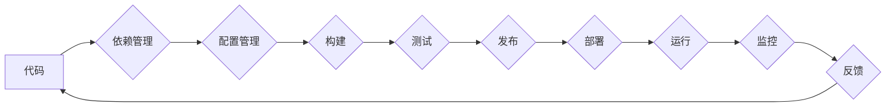

                 

## 云原生应用开发：12因素应用方法论

> 关键词：云原生、12因素、微服务、容器化、DevOps、敏捷开发、可观测性、弹性、可扩展性

### 1. 背景介绍

随着云计算技术的蓬勃发展，传统的应用程序开发模式面临着新的挑战。云原生应用开发应运而生，旨在充分利用云计算平台的优势，构建更加灵活、可扩展、可靠和高效的应用程序。

12因素应用方法论，由Pat Helland提出，为云原生应用开发提供了指导原则。它定义了构建和部署云原生应用的最佳实践，帮助开发人员构建可维护、可扩展和可伸缩的应用程序。

### 2. 核心概念与联系

12因素应用方法论的核心概念包括：

* **单一职责原则：**每个应用程序组件都应该专注于执行单个职责，避免功能过于复杂和耦合。
* **代码为基础：**所有配置和状态都应该以代码的形式存储和管理，以确保可版本化、可重复性和可测试性。
* **依赖管理：**应用程序依赖项应该明确定义并使用版本控制系统管理，以确保应用程序的稳定性和可移植性。
* **配置管理：**应用程序配置应该独立于代码，并使用环境变量或配置文件进行管理，以方便部署和配置不同环境。
* **构建、测试、发布自动化：**构建、测试和发布过程应该自动化，以提高效率和降低人为错误的风险。
* **持续交付：**应用程序应该能够持续地进行开发、测试和部署，以快速响应用户需求和市场变化。
* **部署环境隔离：**每个应用程序实例应该运行在独立的环境中，以避免相互干扰和影响。
* **服务发现和通信：**应用程序组件之间应该使用服务发现机制进行通信，以实现松耦合和可扩展性。
* **故障隔离：**应用程序应该能够隔离故障，避免单个组件的故障影响整个应用程序的运行。
* **可观测性：**应用程序应该具有良好的可观测性，以便开发人员能够监控应用程序的性能、健康状况和错误信息。
* **弹性：**应用程序应该能够根据负载变化自动伸缩，以确保应用程序的可用性和性能。
* **可扩展性：**应用程序应该能够随着业务需求的增长而扩展，以支持更大的用户规模和数据量。

**Mermaid 流程图**



### 3. 核心算法原理 & 具体操作步骤

#### 3.1 算法原理概述

12因素应用方法论本身并非一个具体的算法，而是提供了一套构建云原生应用的最佳实践和原则。这些原则基于微服务架构、容器化技术、DevOps文化等现代软件开发理念，旨在帮助开发人员构建更加灵活、可扩展、可靠和高效的应用程序。

#### 3.2 算法步骤详解

1. **定义应用程序架构：**根据业务需求和系统特性，确定应用程序的整体架构，包括微服务划分、数据存储、消息队列等关键组件。
2. **编写代码：**使用合适的编程语言和框架开发应用程序组件，遵循单一职责原则和代码为基础的原则。
3. **管理依赖项：**使用版本控制系统管理应用程序依赖项，并使用依赖管理工具进行依赖项解析和安装。
4. **配置应用程序：**将应用程序配置信息存储在独立的配置文件或环境变量中，并使用配置管理工具进行配置管理。
5. **构建应用程序镜像：**使用容器化工具（如Docker）构建应用程序镜像，将应用程序代码、依赖项和配置信息打包成一个可移植的单元。
6. **测试应用程序：**编写单元测试、集成测试和系统测试，确保应用程序的稳定性和可靠性。
7. **部署应用程序：**使用容器编排工具（如Kubernetes）部署应用程序镜像到云平台，并配置服务发现和通信机制。
8. **监控应用程序：**使用监控工具监控应用程序的性能、健康状况和错误信息，并及时发现和解决问题。
9. **持续交付：**建立持续集成和持续交付流程，自动化构建、测试和部署过程，提高开发效率和软件质量。

#### 3.3 算法优缺点

**优点：**

* **可扩展性：**微服务架构和容器化技术使得应用程序能够根据负载变化自动伸缩，满足业务需求的增长。
* **可靠性：**故障隔离机制能够确保单个组件的故障不会影响整个应用程序的运行，提高应用程序的可靠性。
* **可维护性：**单一职责原则和代码为基础的原则使得应用程序更加易于维护和更新。
* **敏捷性：**持续交付流程能够快速响应用户需求和市场变化，提高应用程序的敏捷性。

**缺点：**

* **复杂性：**微服务架构和容器化技术增加了应用程序的复杂性，需要开发人员具备更深入的理解和技能。
* **调试难度：**分布式系统调试难度较高，需要使用专门的工具和技术进行故障排查。
* **安全风险：**微服务架构增加了安全攻击面，需要加强安全防护措施。

#### 3.4 算法应用领域

12因素应用方法论适用于各种类型的云原生应用程序，包括：

* **电商平台：**构建可扩展、可靠和高效的电商平台，满足海量用户访问和交易需求。
* **社交媒体：**构建实时更新、高并发和低延迟的社交媒体平台，提供流畅的用户体验。
* **金融服务：**构建安全可靠的金融服务平台，满足金融业务的严格要求。
* **物联网：**构建连接大量设备的物联网平台，处理海量数据和实时信息。

### 4. 数学模型和公式 & 详细讲解 & 举例说明

12因素应用方法论本身并不依赖于特定的数学模型和公式。它更侧重于软件开发实践和架构设计原则。

然而，在实际应用中，我们可以使用一些数学模型和公式来分析和优化应用程序的性能、可靠性和可扩展性。例如：

* **吞吐量模型：**可以使用队列理论和概率论来分析应用程序的吞吐量和延迟，并优化资源配置以提高性能。
* **故障率模型：**可以使用可靠性工程中的故障率模型来评估应用程序的可靠性，并设计故障隔离机制以提高可用性。
* **伸缩模型：**可以使用负载均衡和自动伸缩算法来根据负载变化动态调整应用程序的资源配置，以确保应用程序的可用性和性能。

### 5. 项目实践：代码实例和详细解释说明

#### 5.1 开发环境搭建

* **操作系统：**Linux (Ubuntu, CentOS 等)
* **容器引擎：**Docker
* **容器编排工具：**Kubernetes
* **编程语言：**Go, Java, Python 等

#### 5.2 源代码详细实现

以下是一个简单的微服务示例，使用Go语言开发，部署在Kubernetes集群中：

```go
package main

import (
	"fmt"
	"net/http"
)

func helloHandler(w http.ResponseWriter, r *http.Request) {
	fmt.Fprintf(w, "Hello, world!")
}

func main() {
	http.HandleFunc("/", helloHandler)
	fmt.Println("Server listening on port 8080")
	http.ListenAndServe(":8080", nil)
}
```

#### 5.3 代码解读与分析

* 该代码定义了一个简单的HTTP服务，监听端口8080，并处理根路径的请求。
* `helloHandler`函数处理请求，返回"Hello, world!"字符串。
* `main`函数启动HTTP服务，并打印日志信息。

#### 5.4 运行结果展示

部署该微服务到Kubernetes集群后，可以通过访问服务暴露的域名或IP地址访问该服务，并看到"Hello, world!"的响应。

### 6. 实际应用场景

12因素应用方法论在实际应用中得到了广泛的应用，例如：

* **Netflix：**Netflix使用微服务架构和容器化技术构建其流媒体平台，能够处理海量用户访问和视频流传输需求。
* **Amazon：**Amazon使用12因素应用方法论构建其云计算平台AWS，提供各种云服务，包括计算、存储、数据库等。
* **Uber：**Uber使用微服务架构和容器化技术构建其打车平台，能够处理实时订单处理和司机调度需求。

### 6.4 未来应用展望

随着云计算技术的不断发展，12因素应用方法论将继续发挥重要作用，并推动云原生应用开发的创新和发展。未来，12因素应用方法论可能会与其他新兴技术融合，例如：

* **Serverless：**将应用程序功能分解成更小的函数，并部署到无服务器平台，进一步简化应用程序开发和管理。
* **人工智能：**将人工智能技术应用于应用程序开发和运维，例如自动部署、故障诊断和性能优化。
* **区块链：**将区块链技术应用于应用程序的安全性、透明性和去中心化，构建更加安全可靠的云原生应用。

### 7. 工具和资源推荐

#### 7.1 学习资源推荐

* **《云原生应用开发：12因素应用方法论》**
* **Kubernetes官方文档：**https://kubernetes.io/docs/home/
* **Docker官方文档：**https://docs.docker.com/
* **12因素应用方法论官方网站：**https://12factor.net/

#### 7.2 开发工具推荐

* **Docker Desktop：**https://www.docker.com/products/docker-desktop
* **Kubernetes Dashboard：**https://kubernetes.io/docs/tasks/tools/dashboard/
* **Helm：**https://helm.sh/

#### 7.3 相关论文推荐

* **The Twelve-Factor App** by Pat Helland
* **Microservices Patterns** by Chris Richardson

### 8. 总结：未来发展趋势与挑战

#### 8.1 研究成果总结

12因素应用方法论为云原生应用开发提供了重要的指导原则和最佳实践，推动了微服务架构、容器化技术和DevOps文化的普及。

#### 8.2 未来发展趋势

未来，12因素应用方法论将继续演进，并与其他新兴技术融合，例如：

* **Serverless：**将应用程序功能分解成更小的函数，并部署到无服务器平台，进一步简化应用程序开发和管理。
* **人工智能：**将人工智能技术应用于应用程序开发和运维，例如自动部署、故障诊断和性能优化。
* **区块链：**将区块链技术应用于应用程序的安全性、透明性和去中心化，构建更加安全可靠的云原生应用。

#### 8.3 面临的挑战

* **复杂性：**微服务架构和容器化技术增加了应用程序的复杂性，需要开发人员具备更深入的理解和技能。
* **调试难度：**分布式系统调试难度较高，需要使用专门的工具和技术进行故障排查。
* **安全风险：**微服务架构增加了安全攻击面，需要加强安全防护措施。

#### 8.4 研究展望

未来研究方向包括：

* **自动化运维：**进一步提高应用程序的自动化运维水平，降低运维成本和风险。
* **安全保障：**研究更加有效的微服务架构安全保障机制，提高应用程序的安全性。
* **性能优化：**研究更加有效的微服务架构性能优化方法，提高应用程序的性能和效率。

### 9. 附录：常见问题与解答

**常见问题：**

* **什么是12因素应用？**

12因素应用是一种云原生应用开发的最佳实践和原则，旨在构建更加灵活、可扩展、可靠和高效的应用程序。

* **12因素应用有哪些核心概念？**

12因素应用的核心概念包括：单一职责原则、代码为基础、依赖管理、配置管理、构建、测试、发布自动化、持续交付、部署环境隔离、服务发现和通信、故障隔离、可观测性、弹性和可扩展性。

* **如何学习12因素应用？**

可以阅读《云原生应用开发：12因素应用方法论》一书，并参考Kubernetes和Docker官方文档。

**作者：禅与计算机程序设计艺术 / Zen and the Art of Computer Programming**<end_of_turn>

